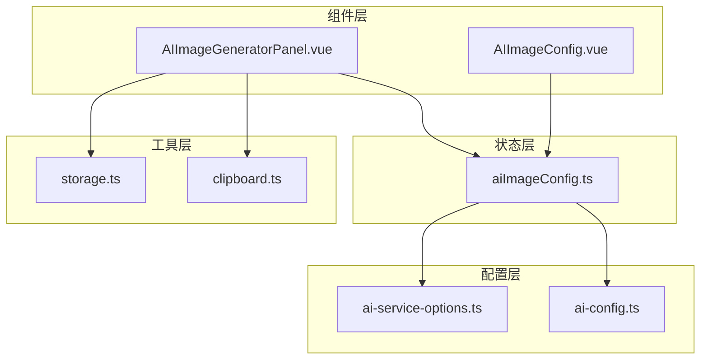
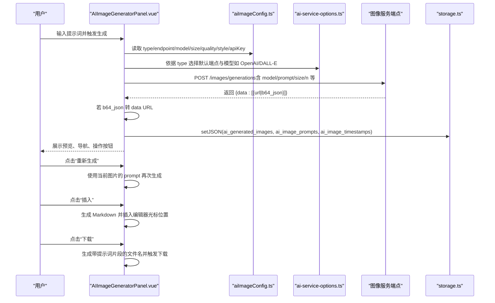
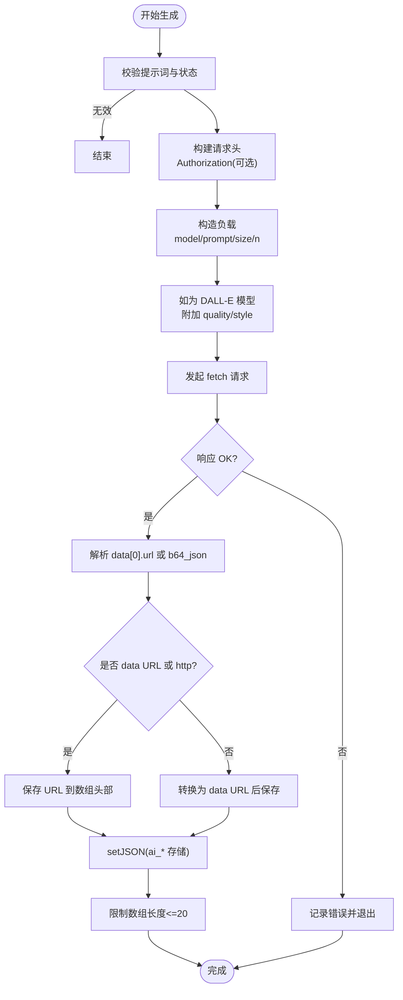
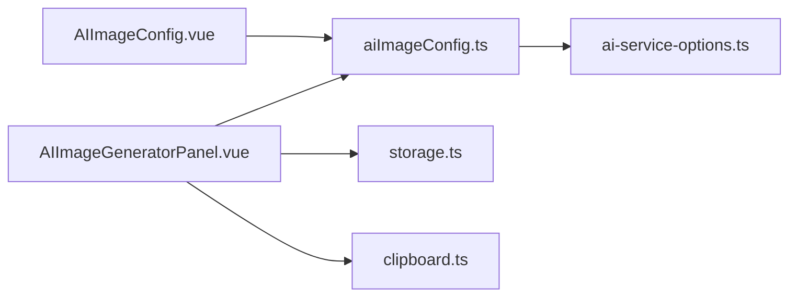

# AI图片生成

<cite>
**本文引用的文件**
- [AIImageGeneratorPanel.vue](file://apps/web/src/components/ai/image-generator/AIImageGeneratorPanel.vue)
- [AIImageConfig.vue](file://apps/web/src/components/ai/image-generator/AIImageConfig.vue)
- [aiImageConfig.ts](file://apps/web/src/stores/aiImageConfig.ts)
- [ai-service-options.ts](file://packages/shared/src/configs/ai-service-options.ts)
- [storage.ts](file://apps/web/src/utils/storage.ts)
- [clipboard.ts](file://apps/web/src/utils/clipboard.ts)
- [ai-config.ts](file://packages/shared/src/constants/ai-config.ts)
</cite>

## 目录
1. [简介](#简介)
2. [项目结构](#项目结构)
3. [核心组件](#核心组件)
4. [架构总览](#架构总览)
5. [详细组件分析](#详细组件分析)
6. [依赖关系分析](#依赖关系分析)
7. [性能考量](#性能考量)
8. [故障排查指南](#故障排查指南)
9. [结论](#结论)

## 简介
本文件系统性记录了“AI图片生成”功能的设计与实现，覆盖以下方面：
- AIImageGeneratorPanel 组件的用户界面与核心功能：图像预览、导航、操作（下载、复制、插入）。
- aiImageConfig store 如何管理图像生成相关配置（模型、尺寸、质量、风格等），并与 ai-service-options.ts 中的 DALL-E 等服务选项集成。
- generateImage 函数如何构造符合 OpenAI 图像 API 规范的请求负载，并处理 base64 或 URL 形式的响应数据。
- 生成图像的本地缓存策略：使用时间戳进行过期检查（1小时有效期）与自动清理机制。
- 重新生成功能如何复用当前图片的提示词（prompt），以及插入图片到编辑器光标位置的具体实现。
- 下载功能中动态生成文件名的逻辑（基于关联的提示词）。

## 项目结构
AI图片生成功能主要分布在以下模块：
- 组件层：AIImageGeneratorPanel.vue（主面板）、AIImageConfig.vue（配置面板）
- 状态层：aiImageConfig.ts（全局配置 store）
- 配置层：ai-service-options.ts（服务选项与默认模型）
- 工具层：storage.ts（统一存储抽象）、clipboard.ts（剪贴板工具）

图表来源
- [AIImageGeneratorPanel.vue](file://apps/web/src/components/ai/image-generator/AIImageGeneratorPanel.vue#L1-L120)
- [AIImageConfig.vue](file://apps/web/src/components/ai/image-generator/AIImageConfig.vue#L1-L120)
- [aiImageConfig.ts](file://apps/web/src/stores/aiImageConfig.ts#L1-L160)
- [ai-service-options.ts](file://packages/shared/src/configs/ai-service-options.ts#L317-L420)
- [ai-config.ts](file://packages/shared/src/constants/ai-config.ts#L1-L5)
- [storage.ts](file://apps/web/src/utils/storage.ts#L1-L120)
- [clipboard.ts](file://apps/web/src/utils/clipboard.ts#L1-L51)

章节来源
- [AIImageGeneratorPanel.vue](file://apps/web/src/components/ai/image-generator/AIImageGeneratorPanel.vue#L1-L120)
- [AIImageConfig.vue](file://apps/web/src/components/ai/image-generator/AIImageConfig.vue#L1-L120)
- [aiImageConfig.ts](file://apps/web/src/stores/aiImageConfig.ts#L1-L160)
- [ai-service-options.ts](file://packages/shared/src/configs/ai-service-options.ts#L317-L420)
- [ai-config.ts](file://packages/shared/src/constants/ai-config.ts#L1-L5)
- [storage.ts](file://apps/web/src/utils/storage.ts#L1-L120)
- [clipboard.ts](file://apps/web/src/utils/clipboard.ts#L1-L51)

## 核心组件
- AIImageGeneratorPanel.vue：提供图像生成的交互界面，包含输入提示词、生成、预览、导航、操作（下载、复制、插入）与过期检查/清理。
- AIImageConfig.vue：提供图像生成配置界面，支持服务类型、端点、API Key、模型、尺寸、质量、风格等参数的设置与测试连接。
- aiImageConfig.ts：全局配置 store，负责持久化与响应式管理上述参数，并根据服务类型自动同步模型与端点。
- ai-service-options.ts：集中定义各服务的可用模型与端点，包含 OpenAI 的 DALL-E 等图像模型。
- storage.ts：统一存储抽象，提供 get/getJSON/set/setJSON/remove 等能力，支持本地存储与 REST 引擎。
- clipboard.ts：跨浏览器安全上下文下的剪贴板写入工具。

章节来源
- [AIImageGeneratorPanel.vue](file://apps/web/src/components/ai/image-generator/AIImageGeneratorPanel.vue#L1-L120)
- [AIImageConfig.vue](file://apps/web/src/components/ai/image-generator/AIImageConfig.vue#L1-L120)
- [aiImageConfig.ts](file://apps/web/src/stores/aiImageConfig.ts#L1-L160)
- [ai-service-options.ts](file://packages/shared/src/configs/ai-service-options.ts#L317-L420)
- [storage.ts](file://apps/web/src/utils/storage.ts#L1-L120)
- [clipboard.ts](file://apps/web/src/utils/clipboard.ts#L1-L51)

## 架构总览
AI图片生成的端到端流程如下：
- 用户在 AIImageGeneratorPanel.vue 的输入框中输入提示词，点击生成或按 Enter 触发 generateImage。
- generateImage 从 aiImageConfig store 读取 type、endpoint、model、size、quality、style、apiKey 等参数，构造 OpenAI 图像 API 请求负载。
- 发起 fetch 请求，接收响应后解析 data[0].url 或 data[0].b64_json，若为 base64 则转为 data URL。
- 将生成的图片 URL、对应提示词与时间戳保存到本地存储，并维护数组索引 currentImageIndex。
- UI 展示图像预览、导航、有效期倒计时与操作按钮（插入、下载、复制、重新生成）。
- 重新生成时复用当前图片的提示词；插入图片时生成 Markdown 语法并插入到编辑器光标位置。
- 后台定时器每 30 秒执行一次过期检查，移除超过 1 小时的图片并更新存储。

图表来源
- [AIImageGeneratorPanel.vue](file://apps/web/src/components/ai/image-generator/AIImageGeneratorPanel.vue#L205-L302)
- [AIImageGeneratorPanel.vue](file://apps/web/src/components/ai/image-generator/AIImageGeneratorPanel.vue#L367-L470)
- [AIImageGeneratorPanel.vue](file://apps/web/src/components/ai/image-generator/AIImageGeneratorPanel.vue#L485-L523)
- [AIImageGeneratorPanel.vue](file://apps/web/src/components/ai/image-generator/AIImageGeneratorPanel.vue#L324-L348)
- [aiImageConfig.ts](file://apps/web/src/stores/aiImageConfig.ts#L1-L160)
- [ai-service-options.ts](file://packages/shared/src/configs/ai-service-options.ts#L317-L420)
- [storage.ts](file://apps/web/src/utils/storage.ts#L170-L240)

## 详细组件分析

### AIImageGeneratorPanel 组件
- 用户界面与交互
  - 输入框：支持 Enter 生成、Shift+Enter 换行。
  - 预览区：展示当前选中的生成图片，支持上一张/下一张切换。
  - 信息区：显示尺寸、提示词、剩余有效期（颜色随剩余时间变化）。
  - 操作区：插入、下载、复制、重新生成、清空、取消生成。
- 核心状态
  - generatedImages：已生成图片的 URL 列表（优先 data URL）。
  - imagePrompts：与每张图片对应的提示词列表。
  - imageTimestamps：生成时间戳列表（用于过期检查）。
  - currentImageIndex：当前选中图片索引。
  - loading：生成中状态。
  - lastUsedPrompt：最近一次使用的提示词，供重新生成使用。
- 关键流程
  - 生成图像：构造请求负载（model、prompt、size、n=1），对 DALL-E 模型附加 quality、style；处理响应，统一转为 data URL 并保存到本地存储。
  - 重新生成：读取当前图片的提示词，直接调用生成逻辑。
  - 插入图片：生成 Markdown 图片语法，插入到编辑器光标位置并聚焦。
  - 下载图片：拉取图片为 Blob，生成带提示词片段的文件名并触发下载。
  - 过期检查与自动清理：启动定时器每 30 秒检查并清理过期图片（1 小时），同时更新 UI 剩余时间显示。
  - 取消生成：使用 AbortController 中断请求。
  - 清空图像：删除本地存储并清空内存数组。

图表来源
- [AIImageGeneratorPanel.vue](file://apps/web/src/components/ai/image-generator/AIImageGeneratorPanel.vue#L205-L302)
- [AIImageGeneratorPanel.vue](file://apps/web/src/components/ai/image-generator/AIImageGeneratorPanel.vue#L324-L348)
- [AIImageGeneratorPanel.vue](file://apps/web/src/components/ai/image-generator/AIImageGeneratorPanel.vue#L367-L470)
- [storage.ts](file://apps/web/src/utils/storage.ts#L170-L240)

章节来源
- [AIImageGeneratorPanel.vue](file://apps/web/src/components/ai/image-generator/AIImageGeneratorPanel.vue#L1-L120)
- [AIImageGeneratorPanel.vue](file://apps/web/src/components/ai/image-generator/AIImageGeneratorPanel.vue#L120-L220)
- [AIImageGeneratorPanel.vue](file://apps/web/src/components/ai/image-generator/AIImageGeneratorPanel.vue#L205-L302)
- [AIImageGeneratorPanel.vue](file://apps/web/src/components/ai/image-generator/AIImageGeneratorPanel.vue#L324-L348)
- [AIImageGeneratorPanel.vue](file://apps/web/src/components/ai/image-generator/AIImageGeneratorPanel.vue#L367-L470)
- [AIImageGeneratorPanel.vue](file://apps/web/src/components/ai/image-generator/AIImageGeneratorPanel.vue#L472-L523)
- [AIImageGeneratorPanel.vue](file://apps/web/src/components/ai/image-generator/AIImageGeneratorPanel.vue#L525-L590)

### AIImageConfig 配置面板
- 功能要点
  - 服务类型选择：内置服务、OpenAI、SiliconFlow、302.AI、自定义等。
  - 端点与 API Key：非默认服务需要配置端点与密钥；默认服务无需密钥。
  - 模型选择：根据服务类型动态展示可用模型；自定义服务允许手动输入模型名。
  - 图像参数：尺寸（1024x1024/1792x1024/1024x1792）、质量（标准/高清，仅 DALL-E）、风格（自然/鲜明，仅 DALL-E）。
  - 测试连接：构造最小负载（prompt=test connection）验证连通性。
  - 保存与清空：保存当前配置并通过事件通知父组件；清空后提示当前配置已清除。
- 与服务选项集成
  - 通过 imageServiceOptions 读取各服务的 endpoint 与 models，自动填充默认端点与模型。
  - 当服务类型切换时，自动同步模型与端点；自定义服务支持独立持久化。

章节来源
- [AIImageConfig.vue](file://apps/web/src/components/ai/image-generator/AIImageConfig.vue#L1-L120)
- [AIImageConfig.vue](file://apps/web/src/components/ai/image-generator/AIImageConfig.vue#L120-L220)
- [AIImageConfig.vue](file://apps/web/src/components/ai/image-generator/AIImageConfig.vue#L220-L344)
- [ai-service-options.ts](file://packages/shared/src/configs/ai-service-options.ts#L317-L420)

### aiImageConfig store（全局配置）
- 状态字段
  - type：服务类型（default/openai/siliconflow/custom 等）。
  - endpoint：服务端点，自定义类型时可单独持久化。
  - model：当前模型，随服务类型变化自动同步。
  - size/quality/style：图像尺寸、质量、风格。
  - apiKey：按服务类型分别持久化。
- 响应式与持久化
  - 使用 store.reactive/store.customReactive 实现响应式读写与自动持久化。
  - 监听 type 变化，自动加载/回退模型与端点；监听 model 变化，写入持久化。
  - reset 方法一键重置并清理所有服务类型的持久化数据。
- 与服务选项集成
  - 通过 imageServiceOptions 获取默认端点与模型列表，确保默认值与可用模型一致。

章节来源
- [aiImageConfig.ts](file://apps/web/src/stores/aiImageConfig.ts#L1-L160)
- [ai-service-options.ts](file://packages/shared/src/configs/ai-service-options.ts#L317-L420)
- [ai-config.ts](file://packages/shared/src/constants/ai-config.ts#L1-L5)

### 本地缓存策略与过期检查
- 存储键
  - ai_generated_images：生成图片 URL 数组。
  - ai_image_prompts：与图片一一对应的提示词数组。
  - ai_image_timestamps：生成时间戳数组。
- 过期规则
  - 1 小时有效期；每 30 秒检查一次并清理过期项。
  - 旧版本数据（缺少时间戳）会被识别并清空。
- 自动清理
  - 过滤有效索引，重建三数组，必要时更新本地存储。
  - 限制数组长度不超过 20，避免占用过多存储空间。

章节来源
- [AIImageGeneratorPanel.vue](file://apps/web/src/components/ai/image-generator/AIImageGeneratorPanel.vue#L60-L130)
- [AIImageGeneratorPanel.vue](file://apps/web/src/components/ai/image-generator/AIImageGeneratorPanel.vue#L130-L171)
- [storage.ts](file://apps/web/src/utils/storage.ts#L170-L240)

### 重新生成与插入编辑器光标位置
- 重新生成
  - 从 imagePrompts[currentImageIndex] 读取当前图片的提示词，直接调用生成逻辑，不修改输入框内容。
- 插入编辑器光标位置
  - 从 imagePrompts[currentImageIndex] 生成简洁 alt 文本。
  - 生成 Markdown 图片语法 ，定位编辑器光标位置并插入。
  - 插入后聚焦编辑器并关闭弹窗。

章节来源
- [AIImageGeneratorPanel.vue](file://apps/web/src/components/ai/image-generator/AIImageGeneratorPanel.vue#L367-L470)
- [AIImageGeneratorPanel.vue](file://apps/web/src/components/ai/image-generator/AIImageGeneratorPanel.vue#L485-L523)

### 下载与文件名生成
- 下载流程
  - 拉取图片 URL 为 Blob，创建临时对象 URL，触发 a.download。
- 文件名规则
  - 基于关联提示词生成文件名片段：截取前 20 个字符，去除特殊字符并将空白替换为短横线；若无提示词则使用 no-prompt。
  - 文件名为 ai-image-{序号}-{提示词片段}.png。

章节来源
- [AIImageGeneratorPanel.vue](file://apps/web/src/components/ai/image-generator/AIImageGeneratorPanel.vue#L324-L348)

## 依赖关系分析
- 组件与 store 的耦合
  - AIImageGeneratorPanel.vue 通过 useAIImageConfigStore 读取配置，双向影响 UI 与请求构造。
- store 与配置层
  - aiImageConfig.ts 依赖 ai-service-options.ts 提供的服务选项与默认端点/模型。
- 工具层
  - storage.ts 提供统一存储抽象，AIImageGeneratorPanel.vue 与 aiImageConfig.ts 均依赖其 setJSON/getJSON 等能力。
  - clipboard.ts 提供跨浏览器安全上下文下的剪贴板写入。

图表来源
- [AIImageGeneratorPanel.vue](file://apps/web/src/components/ai/image-generator/AIImageGeneratorPanel.vue#L1-L120)
- [AIImageConfig.vue](file://apps/web/src/components/ai/image-generator/AIImageConfig.vue#L1-L120)
- [aiImageConfig.ts](file://apps/web/src/stores/aiImageConfig.ts#L1-L160)
- [ai-service-options.ts](file://packages/shared/src/configs/ai-service-options.ts#L317-L420)
- [storage.ts](file://apps/web/src/utils/storage.ts#L1-L120)
- [clipboard.ts](file://apps/web/src/utils/clipboard.ts#L1-L51)

章节来源
- [AIImageGeneratorPanel.vue](file://apps/web/src/components/ai/image-generator/AIImageGeneratorPanel.vue#L1-L120)
- [AIImageConfig.vue](file://apps/web/src/components/ai/image-generator/AIImageConfig.vue#L1-L120)
- [aiImageConfig.ts](file://apps/web/src/stores/aiImageConfig.ts#L1-L160)
- [ai-service-options.ts](file://packages/shared/src/configs/ai-service-options.ts#L317-L420)
- [storage.ts](file://apps/web/src/utils/storage.ts#L1-L120)
- [clipboard.ts](file://apps/web/src/utils/clipboard.ts#L1-L51)

## 性能考量
- 请求并发与中断
  - 使用 AbortController 在用户取消或再次生成时中断上一次请求，避免资源浪费。
- 存储与内存
  - 限制生成图片数组长度为 20，防止无限增长导致内存与存储压力。
  - 采用 setJSON 一次性写入三数组，减少多次 IO。
- UI 响应
  - 定时器每 30 秒检查过期，既保证时效又避免频繁 IO。
  - 剩余时间按秒级更新，提升用户体验。

[本节为通用建议，不直接分析具体文件]

## 故障排查指南
- 生成失败
  - 检查网络与端点是否可达；确认 API Key 是否正确（非默认服务）。
  - 查看控制台错误日志，关注响应状态码与错误文本。
- 剪贴板复制失败
  - 非安全上下文或浏览器不支持时会回退到传统方式；可在受支持环境下重试。
- 下载失败
  - 确认图片 URL 可访问；若为 base64，需确保转换为 data URL 后再下载。
- 过期图片消失
  - 1 小时后自动清理属预期行为；如需保留，请及时下载。

章节来源
- [AIImageGeneratorPanel.vue](file://apps/web/src/components/ai/image-generator/AIImageGeneratorPanel.vue#L289-L301)
- [AIImageGeneratorPanel.vue](file://apps/web/src/components/ai/image-generator/AIImageGeneratorPanel.vue#L350-L365)
- [clipboard.ts](file://apps/web/src/utils/clipboard.ts#L1-L51)

## 结论
本功能以组件化的方式实现了“AI图片生成”的完整闭环：从配置、生成、预览、操作到本地缓存与过期清理。通过 store 与服务选项的解耦设计，支持多服务与多模型（含 DALL-E）。UI 层提供了直观的操作入口与良好的交互反馈，同时兼顾性能与可靠性。建议在生产环境中持续监控网络与存储表现，并根据用户反馈优化提示词与文件命名策略。