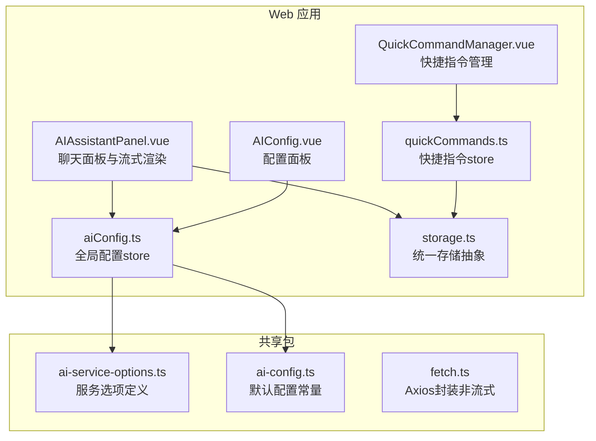
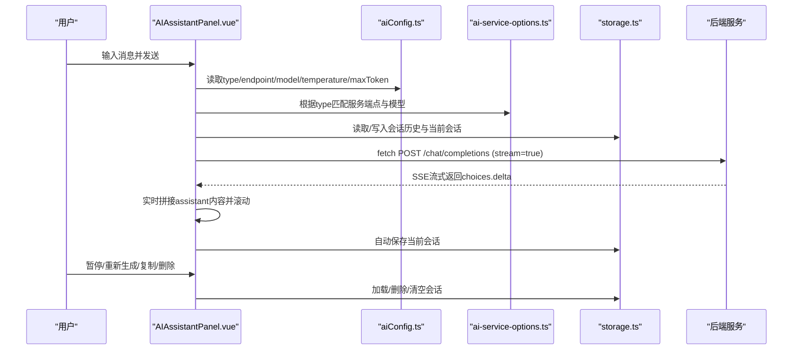
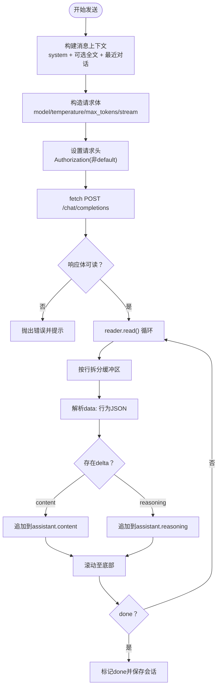
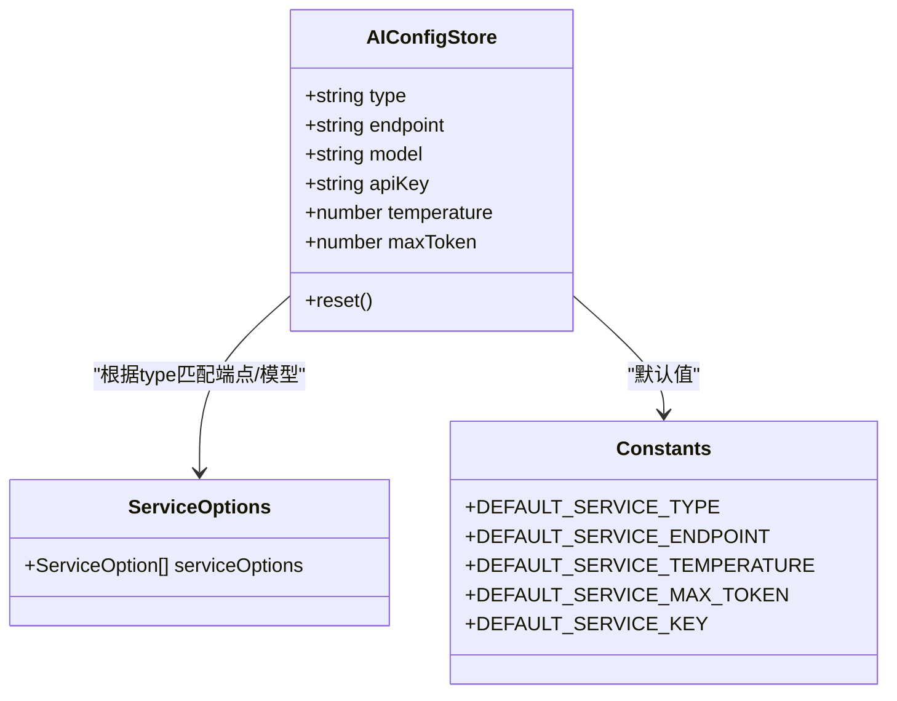
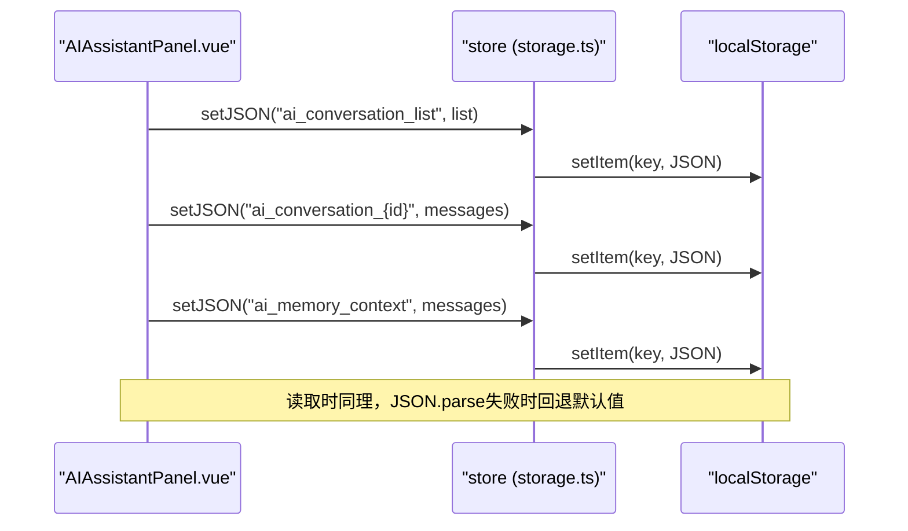
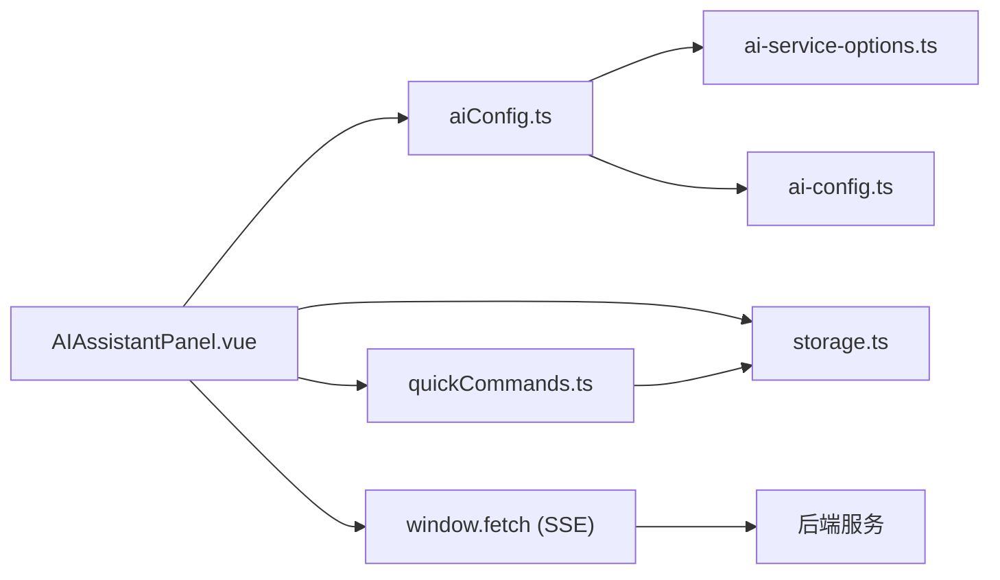

# AI文本生成

<cite>
**本文引用的文件**
- [AIAssistantPanel.vue](file://apps/web/src/components/ai/chat-box/AIAssistantPanel.vue)
- [AIConfig.vue](file://apps/web/src/components/ai/chat-box/AIConfig.vue)
- [aiConfig.ts](file://apps/web/src/stores/aiConfig.ts)
- [ai-service-options.ts](file://packages/shared/src/configs/ai-service-options.ts)
- [storage.ts](file://apps/web/src/utils/storage.ts)
- [ai-config.ts](file://packages/shared/src/constants/ai-config.ts)
- [fetch.ts](file://packages/shared/src/utils/fetch.ts)
- [quickCommands.ts](file://apps/web/src/stores/quickCommands.ts)
- [QuickCommandManager.vue](file://apps/web/src/components/ai/chat-box/QuickCommandManager.vue)
- [index.ts](file://apps/web/src/utils/index.ts)
</cite>

## 目录
1. [简介](#简介)
2. [项目结构](#项目结构)
3. [核心组件](#核心组件)
4. [架构总览](#架构总览)
5. [详细组件分析](#详细组件分析)
6. [依赖关系分析](#依赖关系分析)
7. [性能考量](#性能考量)
8. [故障排查指南](#故障排查指南)
9. [结论](#结论)
10. [附录](#附录)

## 简介
本文件系统性记录了AI文本生成功能的设计与实现，重点覆盖：
- AIAssistantPanel组件的界面布局与交互逻辑（对话历史、消息流式渲染、输入历史导航）
- aiConfig store如何管理API密钥、模型选择、温度参数等核心配置，并与服务选项定义的关联
- 与OpenAI等兼容后端的通信流程（fetch + SSE流式响应）
- 会话持久化机制（localStorage存储对话历史与自动保存）
- 引用全文功能在提示词工程中的应用
- 错误处理策略（网络异常、配额/模型未开通等）

## 项目结构
该功能主要分布在Web应用的AI聊天盒组件、配置store与共享配置常量/服务选项之间，配合统一存储抽象层实现会话持久化。

图表来源
- [AIAssistantPanel.vue](file://apps/web/src/components/ai/chat-box/AIAssistantPanel.vue#L1-L779)
- [AIConfig.vue](file://apps/web/src/components/ai/chat-box/AIConfig.vue#L1-L271)
- [aiConfig.ts](file://apps/web/src/stores/aiConfig.ts#L1-L122)
- [ai-service-options.ts](file://packages/shared/src/configs/ai-service-options.ts#L1-L420)
- [ai-config.ts](file://packages/shared/src/constants/ai-config.ts#L1-L6)
- [storage.ts](file://apps/web/src/utils/storage.ts#L1-L363)
- [quickCommands.ts](file://apps/web/src/stores/quickCommands.ts#L1-L86)
- [QuickCommandManager.vue](file://apps/web/src/components/ai/chat-box/QuickCommandManager.vue#L1-L117)
- [fetch.ts](file://packages/shared/src/utils/fetch.ts#L1-L31)

章节来源
- [AIAssistantPanel.vue](file://apps/web/src/components/ai/chat-box/AIAssistantPanel.vue#L1-L779)
- [aiConfig.ts](file://apps/web/src/stores/aiConfig.ts#L1-L122)
- [ai-service-options.ts](file://packages/shared/src/configs/ai-service-options.ts#L1-L420)
- [storage.ts](file://apps/web/src/utils/storage.ts#L1-L363)

## 核心组件
- AIAssistantPanel.vue：负责聊天界面、消息列表渲染、输入与发送、流式响应接收、暂停/重新生成、会话管理（新建/加载/删除）、引用全文、快捷指令集成等。
- AIConfig.vue：负责展示与编辑AI服务类型、端点、模型、API密钥、温度、最大Token等配置，并提供连接测试。
- aiConfig.ts：全局配置store，响应式地维护type、endpoint、model、apiKey、temperature、maxToken，并与服务选项联动、持久化。
- storage.ts：统一存储抽象，提供LocalStorageEngine与RestfulStorageEngine，支持reactive/customReactive、JSON序列化、键空间管理等。
- quickCommands.ts / QuickCommandManager.vue：快捷指令的CRUD与UI管理，提升提示词工程效率。
- ai-service-options.ts / ai-config.ts：服务选项与默认配置常量，决定可用模型与默认行为。

章节来源
- [AIAssistantPanel.vue](file://apps/web/src/components/ai/chat-box/AIAssistantPanel.vue#L1-L779)
- [AIConfig.vue](file://apps/web/src/components/ai/chat-box/AIConfig.vue#L1-L271)
- [aiConfig.ts](file://apps/web/src/stores/aiConfig.ts#L1-L122)
- [storage.ts](file://apps/web/src/utils/storage.ts#L1-L363)
- [quickCommands.ts](file://apps/web/src/stores/quickCommands.ts#L1-L86)
- [QuickCommandManager.vue](file://apps/web/src/components/ai/chat-box/QuickCommandManager.vue#L1-L117)
- [ai-service-options.ts](file://packages/shared/src/configs/ai-service-options.ts#L1-L420)
- [ai-config.ts](file://packages/shared/src/constants/ai-config.ts#L1-L6)

## 架构总览
AI文本生成功能采用“组件-状态-存储-共享配置”的分层架构：
- 组件层：AIAssistantPanel.vue负责UI与交互；AIConfig.vue负责配置编辑；QuickCommandManager.vue负责快捷指令管理。
- 状态层：aiConfig.ts集中管理API密钥、模型、温度、最大Token、服务端点等；quickCommands.ts管理快捷指令集合。
- 存储层：storage.ts提供统一的异步存储接口，当前默认使用localStorage持久化会话与配置。
- 共享层：ai-service-options.ts定义多服务的端点与模型清单；ai-config.ts提供默认值常量。

图表来源
- [AIAssistantPanel.vue](file://apps/web/src/components/ai/chat-box/AIAssistantPanel.vue#L333-L453)
- [aiConfig.ts](file://apps/web/src/stores/aiConfig.ts#L1-L122)
- [ai-service-options.ts](file://packages/shared/src/configs/ai-service-options.ts#L1-L420)
- [storage.ts](file://apps/web/src/utils/storage.ts#L1-L363)

## 详细组件分析

### AIAssistantPanel 组件
- 用户界面布局与交互
  - 顶部操作区：切换配置/文生图、新建会话、加载/删除会话、清空对话。
  - 快捷指令区：展示与管理快捷指令，一键将模板与当前选中文本组合为提示词。
  - 聊天内容区：按角色渲染消息，支持复制、重新生成、显示推理内容。
  - 输入区：支持Enter发送、Shift+Enter换行、引用全文按钮、暂停/发送按钮。
- 对话历史管理
  - 会话列表：以conversationListKey存储会话元数据（id、名称、时间戳），支持加载/删除。
  - 当前会话：以ai_conversation_{id}存储完整消息数组；另存一份ai_memory_context作为“当前会话”临时快照。
  - 新建/加载/删除：自动保存当前会话，切换后刷新消息列表与滚动位置。
- 消息流式渲染
  - 使用window.fetch + ReadableStream Reader逐行解析SSE数据，提取choices.delta.content与choices.delta.reasoning_content，增量拼接到最后一条assistant消息。
  - 支持暂停（AbortController），并在结束时标记done并滚动到底部。
- 输入历史导航
  - 维护inputHistory与historyIndex，支持上下方向键在历史输入间循环跳转。
- 引用全文功能
  - 开启后在payload中注入system消息，内容为编辑器全文；同时在上下文截取最近的user/assistant消息，形成“全文+上下文”的提示工程策略。
- 与快捷指令集成
  - 通过applyQuickCommand将模板与选中文本组合，自动聚焦输入框并定位光标末尾。

图表来源
- [AIAssistantPanel.vue](file://apps/web/src/components/ai/chat-box/AIAssistantPanel.vue#L333-L453)

章节来源
- [AIAssistantPanel.vue](file://apps/web/src/components/ai/chat-box/AIAssistantPanel.vue#L1-L779)

### aiConfig store（配置中心）
- 状态与默认值
  - type：服务类型（default/openai/qwen等）
  - endpoint：服务端点（随type变化自动初始化）
  - model：模型名称（随type变化自动初始化并持久化）
  - apiKey：API密钥（按服务类型分别持久化，非default时才携带Authorization）
  - temperature、maxToken：温度与最大Token
- 响应式联动
  - 监听type变化：从serviceOptions中匹配对应服务，设置endpoint与model；若已保存的model不在新服务模型列表则回退到首个模型；保存当前model。
  - 监听model变化：持久化当前服务类型的model。
- 行为
  - reset：重置type/temperature/maxToken，并清理各服务类型的key与model持久化数据。

图表来源
- [aiConfig.ts](file://apps/web/src/stores/aiConfig.ts#L1-L122)
- [ai-service-options.ts](file://packages/shared/src/configs/ai-service-options.ts#L1-L420)
- [ai-config.ts](file://packages/shared/src/constants/ai-config.ts#L1-L6)

章节来源
- [aiConfig.ts](file://apps/web/src/stores/aiConfig.ts#L1-L122)
- [ai-service-options.ts](file://packages/shared/src/configs/ai-service-options.ts#L1-L420)
- [ai-config.ts](file://packages/shared/src/constants/ai-config.ts#L1-L6)

### 会话持久化机制
- 存储引擎
  - LocalStorageEngine：基于localStorage的同步读取与异步写入，适合本地会话与配置。
  - RestfulStorageEngine：基于RESTful API的远程存储，便于扩展云端同步。
- 统一存储管理
  - store.reactive：创建响应式引用，支持字符串与JSON两种类型；自动监听变更并异步保存。
  - store.customReactive：支持自定义getter/setter转换逻辑（如API密钥的延迟加载与加密存储）。
  - JSON序列化：getJSON/ setJSON提供安全的序列化/反序列化与默认值处理。
- 会话存储键
  - ai_conversation_list：会话列表（id/name/timestamp）
  - ai_conversation_{id}：具体会话的消息数组
  - ai_memory_context：当前会话临时快照（用于快速恢复）
- 自动保存
  - 发送消息后、暂停/结束流式响应、新建/加载/删除会话时均会自动保存当前状态。

图表来源
- [AIAssistantPanel.vue](file://apps/web/src/components/ai/chat-box/AIAssistantPanel.vue#L147-L171)
- [storage.ts](file://apps/web/src/utils/storage.ts#L1-L363)

章节来源
- [AIAssistantPanel.vue](file://apps/web/src/components/ai/chat-box/AIAssistantPanel.vue#L114-L171)
- [storage.ts](file://apps/web/src/utils/storage.ts#L1-L363)

### 引用全文功能与提示词工程
- 功能说明
  - 当开启“引用全文”时，系统会在payload中注入一条system消息，内容为编辑器全文；同时在上下文截取最近的user/assistant消息，形成“全文+上下文”的提示工程策略。
- 应用场景
  - 适用于需要长文档级上下文的任务（如全文润色、结构化摘要、章节改写等），显著提升生成质量与一致性。
- 注意事项
  - 全文较大时会增加上下文长度与成本，建议结合maxToken合理设置；必要时可仅引用关键段落。

章节来源
- [AIAssistantPanel.vue](file://apps/web/src/components/ai/chat-box/AIAssistantPanel.vue#L310-L363)

### 错误处理策略
- 网络异常
  - fetch响应非ok或响应体为空时抛出错误；SSE读取过程中捕获异常并显示失败提示，同时保留当前assistant消息内容。
- 模型未开通/配额限制
  - 连接测试时若收到404且错误码/消息包含“未开通”，提示模型未开通；其余HTTP错误显示状态码与响应文本。
- 中断与暂停
  - 使用AbortController中断请求，暂停后将loading置false并标记最后一条assistant为done，保证UI一致。

章节来源
- [AIAssistantPanel.vue](file://apps/web/src/components/ai/chat-box/AIAssistantPanel.vue#L391-L453)
- [AIConfig.vue](file://apps/web/src/components/ai/chat-box/AIConfig.vue#L50-L105)

## 依赖关系分析
- 组件与store
  - AIAssistantPanel依赖aiConfig store读取配置；依赖quickCommands store与QuickCommandManager进行提示词模板管理。
- store与共享配置
  - aiConfig.store依赖ai-service-options.ts提供的服务选项与ai-config.ts提供的默认值。
- 存储抽象
  - 统一使用store.reactive/store.customReactive进行持久化，支持localStorage与RESTful引擎切换。
- 通信与工具
  - 流式通信使用window.fetch + ReadableStream Reader；非流式请求可复用packages/shared/src/utils/fetch.ts（Axios封装，主要用于非SSE场景）。

图表来源
- [AIAssistantPanel.vue](file://apps/web/src/components/ai/chat-box/AIAssistantPanel.vue#L1-L779)
- [aiConfig.ts](file://apps/web/src/stores/aiConfig.ts#L1-L122)
- [ai-service-options.ts](file://packages/shared/src/configs/ai-service-options.ts#L1-L420)
- [ai-config.ts](file://packages/shared/src/constants/ai-config.ts#L1-L6)
- [storage.ts](file://apps/web/src/utils/storage.ts#L1-L363)
- [quickCommands.ts](file://apps/web/src/stores/quickCommands.ts#L1-L86)

章节来源
- [AIAssistantPanel.vue](file://apps/web/src/components/ai/chat-box/AIAssistantPanel.vue#L1-L779)
- [aiConfig.ts](file://apps/web/src/stores/aiConfig.ts#L1-L122)
- [ai-service-options.ts](file://packages/shared/src/configs/ai-service-options.ts#L1-L420)
- [storage.ts](file://apps/web/src/utils/storage.ts#L1-L363)

## 性能考量
- 流式渲染
  - 使用TextDecoder与缓冲区增量拼接，避免一次性解析整段数据，降低内存峰值。
  - 每行解析后立即滚动至底部，保证用户感知流畅。
- 上下文截取
  - 仅保留最近若干条消息，减少上下文长度与请求成本；在“引用全文”模式下谨慎使用，避免超出模型上下文限制。
- 存储与IO
  - 使用异步存储避免阻塞主线程；批量保存时尽量合并多次写入。
- 模型选择
  - 根据任务复杂度选择合适模型与温度；maxToken过大会增加成本与延迟。

## 故障排查指南
- 无法连接后端
  - 检查AIConfig面板中的服务类型与端点是否正确；点击“测试连接”查看返回信息。
  - 若提示模型未开通，确认所选模型在该服务上已激活。
- 流式响应不显示
  - 确认后端支持SSE且路径为/chat/completions；检查网络拦截与CORS设置。
  - 若出现“请求失败”，查看控制台错误信息并核对API密钥与权限。
- 会话丢失
  - 确认localStorage可用；若使用RESTful引擎，检查鉴权与网络连通性。
  - 如需迁移，可在storage.ts中切换到RestfulStorageEngine并提供鉴权函数。

章节来源
- [AIConfig.vue](file://apps/web/src/components/ai/chat-box/AIConfig.vue#L50-L105)
- [AIAssistantPanel.vue](file://apps/web/src/components/ai/chat-box/AIAssistantPanel.vue#L391-L453)
- [storage.ts](file://apps/web/src/utils/storage.ts#L1-L363)

## 结论
该AI文本生成功能以组件-状态-存储三层架构实现，具备完善的配置管理、流式渲染、会话持久化与提示词工程能力。通过服务选项与默认配置的解耦，系统可灵活适配多种兼容OpenAI API的后端；通过引用全文与上下文截取，满足长文档级任务需求；通过统一存储抽象与响应式配置，兼顾本地与云端扩展。建议在生产环境中进一步完善错误分级提示、配额监控与上下文成本控制。

## 附录
- 快捷指令模板
  - 支持在模板中使用{{sel}}占位符，自动替换为当前选中文本，便于快速构建提示词。
- Toast通知
  - 使用vue-sonner进行轻量提示，如“已创建新会话”、“会话已加载/删除”、“已清空会话”等。

章节来源
- [quickCommands.ts](file://apps/web/src/stores/quickCommands.ts#L1-L86)
- [QuickCommandManager.vue](file://apps/web/src/components/ai/chat-box/QuickCommandManager.vue#L1-L117)
- [index.ts](file://apps/web/src/utils/index.ts#L1-L354)