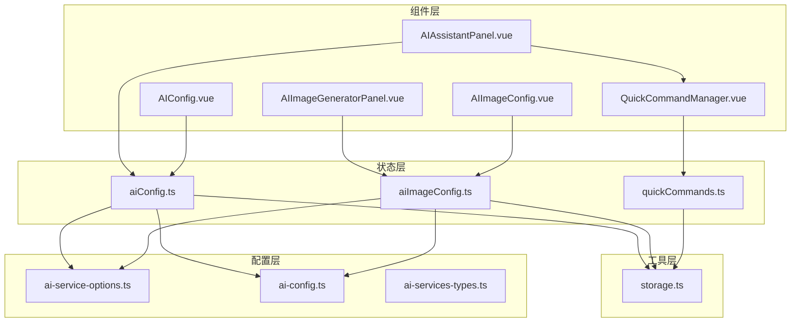
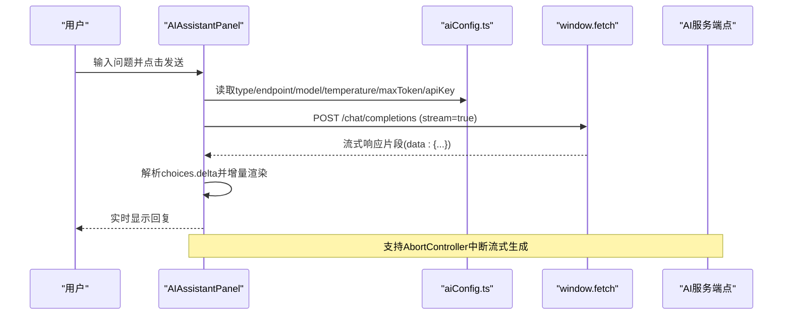
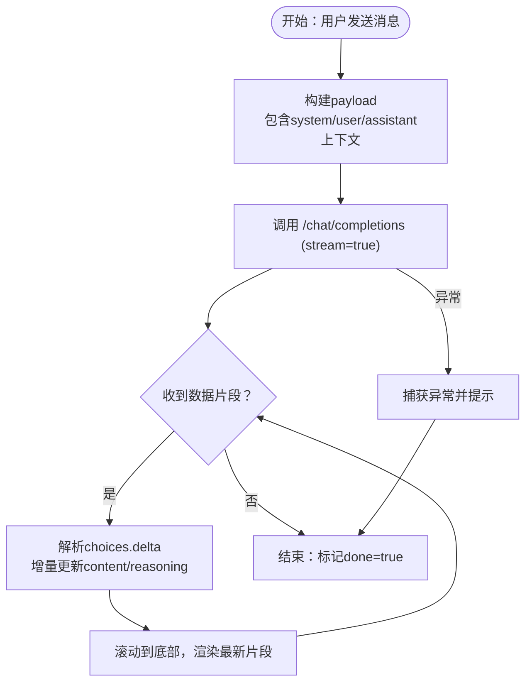
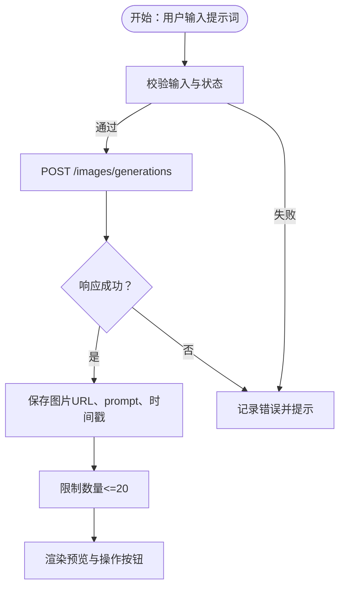
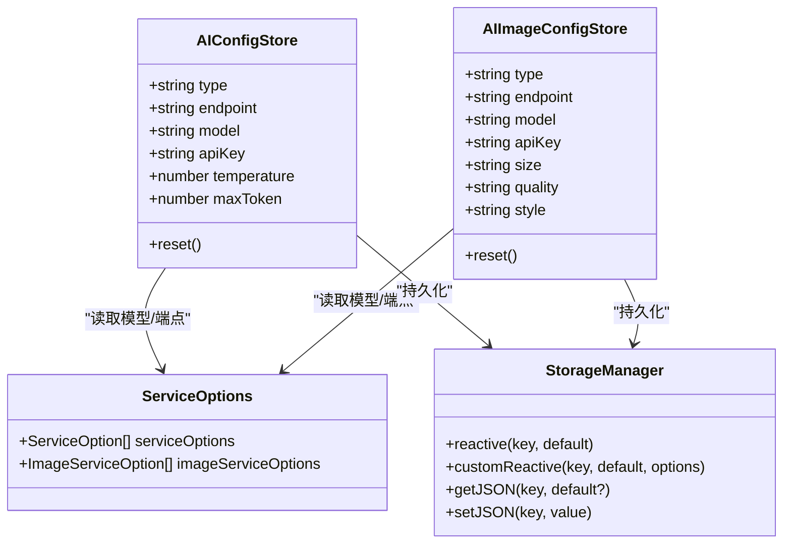
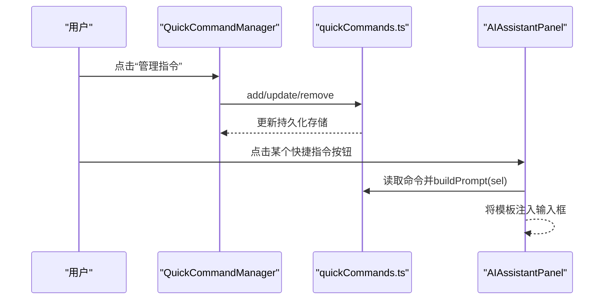
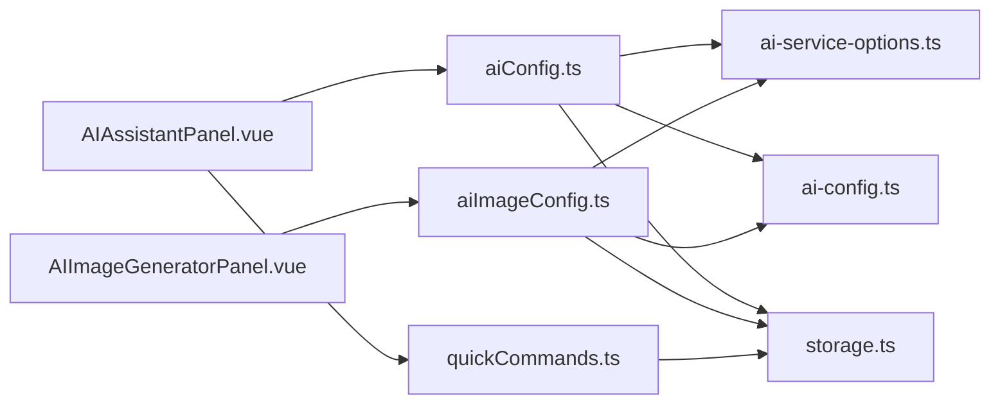

# AI辅助功能

<cite>
**本文档引用的文件**
- [AIAssistantPanel.vue](file://apps/web/src/components/ai/chat-box/AIAssistantPanel.vue)
- [AIImageGeneratorPanel.vue](file://apps/web/src/components/ai/image-generator/AIImageGeneratorPanel.vue)
- [AIConfig.vue](file://apps/web/src/components/ai/chat-box/AIConfig.vue)
- [AIImageConfig.vue](file://apps/web/src/components/ai/image-generator/AIImageConfig.vue)
- [aiConfig.ts](file://apps/web/src/stores/aiConfig.ts)
- [aiImageConfig.ts](file://apps/web/src/stores/aiImageConfig.ts)
- [ai-service-options.ts](file://packages/shared/src/configs/ai-service-options.ts)
- [ai-services-types.ts](file://packages/shared/src/types/ai-services-types.ts)
- [ai-config.ts](file://packages/shared/src/constants/ai-config.ts)
- [storage.ts](file://apps/web/src/utils/storage.ts)
- [QuickCommandManager.vue](file://apps/web/src/components/ai/chat-box/QuickCommandManager.vue)
- [quickCommands.ts](file://apps/web/src/stores/quickCommands.ts)
- [index.ts](file://apps/web/src/components/ai/index.ts)
</cite>

## 目录
1. [简介](#简介)
2. [项目结构](#项目结构)
3. [核心组件](#核心组件)
4. [架构总览](#架构总览)
5. [详细组件分析](#详细组件分析)
6. [依赖关系分析](#依赖关系分析)
7. [性能考量](#性能考量)
8. [故障排查指南](#故障排查指南)
9. [结论](#结论)
10. [附录](#附录)

## 简介
本文件系统性记录了本项目的AI辅助功能设计与实现，重点覆盖：
- AI写作助手（AIAssistantPanel）与AI图片生成器（AIImageGeneratorPanel）两大核心组件的功能边界与用户交互流程
- aiConfig store与aiImageConfig store如何分别管理文本生成与图像生成的服务配置（API端点、模型选择、认证密钥等）
- 系统支持的AI服务类型（如OpenAI、通义千问等）及其配置来源（ai-service-options.ts）
- 前端通过原生window.fetch与后端AI服务通信，处理流式响应并在聊天界面中实时显示
- 快捷指令（QuickCommandManager）的使用与自定义配置
- 隐私保护与错误处理机制（请求超时、配额限制等）

## 项目结构
AI相关功能主要分布在以下模块：
- 组件层：AI写作助手与AI图片生成器的对话面板、配置面板、快捷指令管理器
- 状态层：aiConfig与aiImageConfig两个store，负责服务类型、端点、模型、密钥、参数等的持久化与联动
- 配置层：ai-service-options.ts定义了多服务商与模型清单；ai-config.ts提供默认常量
- 工具层：统一存储抽象store（LocalStorageEngine/RestfulStorageEngine），封装JSON序列化与响应式存储

图表来源
- [AIAssistantPanel.vue](file://apps/web/src/components/ai/chat-box/AIAssistantPanel.vue#L1-L779)
- [AIImageGeneratorPanel.vue](file://apps/web/src/components/ai/image-generator/AIImageGeneratorPanel.vue#L1-L860)
- [AIConfig.vue](file://apps/web/src/components/ai/chat-box/AIConfig.vue#L1-L271)
- [AIImageConfig.vue](file://apps/web/src/components/ai/image-generator/AIImageConfig.vue#L1-L344)
- [aiConfig.ts](file://apps/web/src/stores/aiConfig.ts#L1-L122)
- [aiImageConfig.ts](file://apps/web/src/stores/aiImageConfig.ts#L1-L161)
- [ai-service-options.ts](file://packages/shared/src/configs/ai-service-options.ts#L1-L420)
- [ai-config.ts](file://packages/shared/src/constants/ai-config.ts#L1-L6)
- [storage.ts](file://apps/web/src/utils/storage.ts#L1-L363)
- [QuickCommandManager.vue](file://apps/web/src/components/ai/chat-box/QuickCommandManager.vue#L1-L117)
- [quickCommands.ts](file://apps/web/src/stores/quickCommands.ts#L1-L86)

章节来源
- [AIAssistantPanel.vue](file://apps/web/src/components/ai/chat-box/AIAssistantPanel.vue#L1-L779)
- [AIImageGeneratorPanel.vue](file://apps/web/src/components/ai/image-generator/AIImageGeneratorPanel.vue#L1-L860)
- [aiConfig.ts](file://apps/web/src/stores/aiConfig.ts#L1-L122)
- [aiImageConfig.ts](file://apps/web/src/stores/aiImageConfig.ts#L1-L161)
- [ai-service-options.ts](file://packages/shared/src/configs/ai-service-options.ts#L1-L420)
- [ai-config.ts](file://packages/shared/src/constants/ai-config.ts#L1-L6)
- [storage.ts](file://apps/web/src/utils/storage.ts#L1-L363)
- [QuickCommandManager.vue](file://apps/web/src/components/ai/chat-box/QuickCommandManager.vue#L1-L117)
- [quickCommands.ts](file://apps/web/src/stores/quickCommands.ts#L1-L86)

## 核心组件
- AI写作助手（AIAssistantPanel）
  - 功能：提供对话式AI写作体验，支持上下文历史、引用全文、重新生成、复制、暂停/取消流式生成、会话存取等
  - 交互：顶部切换至图片生成器；快捷指令按钮区；参数配置面板；消息列表；输入框与发送/暂停按钮
  - 流式响应：基于window.fetch的ReadableStream Reader逐行解析，实时追加到消息列表
- AI图片生成器（AIImageGeneratorPanel）
  - 功能：根据提示词生成图像，支持多图浏览、下载、复制链接、重新生成、插入编辑器、过期清理与定时刷新
  - 交互：参数配置面板；生成中指示；图片预览与导航；操作按钮；输入框与生成/取消按钮
  - 错误处理：AbortController取消；异常捕获；过期检查与清理
- 配置面板
  - 文本生成配置（AIConfig）：服务类型、端点、API Key、模型、温度、最大Token、连接测试
  - 图像生成配置（AIImageConfig）：服务类型、端点、API Key、模型、尺寸、质量、风格、连接测试
- 快捷指令（QuickCommandManager）
  - 功能：管理一组“模板命令”，在AI对话中一键应用，自动将编辑器选中文本注入模板占位符

章节来源
- [AIAssistantPanel.vue](file://apps/web/src/components/ai/chat-box/AIAssistantPanel.vue#L1-L779)
- [AIImageGeneratorPanel.vue](file://apps/web/src/components/ai/image-generator/AIImageGeneratorPanel.vue#L1-L860)
- [AIConfig.vue](file://apps/web/src/components/ai/chat-box/AIConfig.vue#L1-L271)
- [AIImageConfig.vue](file://apps/web/src/components/ai/image-generator/AIImageConfig.vue#L1-L344)
- [QuickCommandManager.vue](file://apps/web/src/components/ai/chat-box/QuickCommandManager.vue#L1-L117)

## 架构总览
AI功能采用“组件-状态-配置-工具”分层架构：
- 组件层负责用户交互与视图渲染
- 状态层通过Pinia Store管理配置与运行时状态
- 配置层提供服务选项与默认常量
- 工具层提供统一存储抽象，支持本地与远端存储引擎

图表来源
- [AIAssistantPanel.vue](file://apps/web/src/components/ai/chat-box/AIAssistantPanel.vue#L333-L453)
- [aiConfig.ts](file://apps/web/src/stores/aiConfig.ts#L1-L122)

## 详细组件分析

### AI写作助手（AIAssistantPanel）
- 功能边界
  - 文本对话：构建上下文消息，调用后端模型，接收流式响应并实时渲染
  - 会话管理：本地存储最近对话与历史，支持新建、加载、删除、清空
  - 用户交互：快捷指令、引用全文、复制、重新生成、暂停/取消
- 流式响应处理
  - 使用AbortController中断上一次请求
  - 通过TextDecoder与Reader逐行解析，提取choices.delta并增量拼接到消息
  - 支持reasoning_content（推理内容）与content双通道
- 隐私与安全
  - API Key按服务类型分别持久化，避免泄露到默认服务
  - 仅在非默认类型时附加Authorization头
- 错误处理
  - 捕获AbortError（用户取消）与网络异常，显示友好提示
  - 自动保存当前会话与记忆上下文

图表来源
- [AIAssistantPanel.vue](file://apps/web/src/components/ai/chat-box/AIAssistantPanel.vue#L333-L453)

章节来源
- [AIAssistantPanel.vue](file://apps/web/src/components/ai/chat-box/AIAssistantPanel.vue#L1-L779)

### AI图片生成器（AIImageGeneratorPanel）
- 功能边界
  - 图像生成：根据提示词调用后端图像生成接口，支持DALL-E系列质量与风格参数
  - 多图管理：最多保留20张，自动清理过期图片（1小时）
  - 操作能力：下载、复制链接、重新生成、插入编辑器光标位置
- 过期与清理
  - 启动时与定时器（30秒）检查过期，过滤无效索引，保持数组一致性
  - 旧版数据不一致时清空并重建
- 错误处理
  - 使用AbortController取消生成
  - 捕获并记录错误，必要时提示用户

图表来源
- [AIImageGeneratorPanel.vue](file://apps/web/src/components/ai/image-generator/AIImageGeneratorPanel.vue#L206-L302)
- [AIImageGeneratorPanel.vue](file://apps/web/src/components/ai/image-generator/AIImageGeneratorPanel.vue#L304-L471)

章节来源
- [AIImageGeneratorPanel.vue](file://apps/web/src/components/ai/image-generator/AIImageGeneratorPanel.vue#L1-L860)

### 配置管理（aiConfig 与 aiImageConfig）
- aiConfig（文本生成）
  - 管理字段：type、endpoint、model、apiKey、temperature、maxToken
  - 响应式联动：监听type/model变化，自动同步端点与模型，并持久化
  - API Key按服务类型分别存储，避免默认服务暴露密钥
- aiImageConfig（图像生成）
  - 管理字段：type、endpoint、model、apiKey、size、quality、style
  - 自定义服务：type=custom时，端点与模型从存储读取
  - 响应式联动：监听type/model变化，自动同步模型并持久化
- 配置来源
  - 服务选项来源于ai-service-options.ts，包含多服务商与模型清单
  - 默认常量来源于ai-config.ts（默认端点、默认类型、默认温度、默认最大Token）

图表来源
- [aiConfig.ts](file://apps/web/src/stores/aiConfig.ts#L1-L122)
- [aiImageConfig.ts](file://apps/web/src/stores/aiImageConfig.ts#L1-L161)
- [ai-service-options.ts](file://packages/shared/src/configs/ai-service-options.ts#L1-L420)
- [storage.ts](file://apps/web/src/utils/storage.ts#L1-L363)

章节来源
- [aiConfig.ts](file://apps/web/src/stores/aiConfig.ts#L1-L122)
- [aiImageConfig.ts](file://apps/web/src/stores/aiImageConfig.ts#L1-L161)
- [ai-service-options.ts](file://packages/shared/src/configs/ai-service-options.ts#L1-L420)
- [ai-config.ts](file://packages/shared/src/constants/ai-config.ts#L1-L6)
- [storage.ts](file://apps/web/src/utils/storage.ts#L1-L363)

### 快捷指令（QuickCommandManager）
- 功能
  - 管理一组“模板命令”，每个命令包含label与template（支持{{sel}}占位）
  - 运行时将编辑器选中文本注入模板，生成最终prompt
- 数据持久化
  - 使用storage.ts统一存储，支持JSON序列化与响应式更新
  - 默认包含润色、翻译成英文、翻译成中文、总结四条常用命令
- 使用方式
  - 在AI对话面板顶部快捷指令区点击按钮，即可将模板注入输入框
  - 通过管理器新增、编辑、删除命令

图表来源
- [QuickCommandManager.vue](file://apps/web/src/components/ai/chat-box/QuickCommandManager.vue#L1-L117)
- [quickCommands.ts](file://apps/web/src/stores/quickCommands.ts#L1-L86)
- [AIAssistantPanel.vue](file://apps/web/src/components/ai/chat-box/AIAssistantPanel.vue#L99-L112)

章节来源
- [QuickCommandManager.vue](file://apps/web/src/components/ai/chat-box/QuickCommandManager.vue#L1-L117)
- [quickCommands.ts](file://apps/web/src/stores/quickCommands.ts#L1-L86)
- [AIAssistantPanel.vue](file://apps/web/src/components/ai/chat-box/AIAssistantPanel.vue#L99-L112)

## 依赖关系分析
- 组件依赖
  - AIAssistantPanel依赖aiConfig与quickCommands，负责对话与快捷指令
  - AIImageGeneratorPanel依赖aiImageConfig，负责图像生成与管理
  - 配置面板依赖对应store，负责参数校验与连接测试
- 配置依赖
  - 服务选项（serviceOptions/imageServiceOptions）来自共享包，定义了各服务商端点与模型
  - 默认常量（DEFAULT_SERVICE_*）来自共享包常量
- 存储依赖
  - 统一使用storage.ts提供的StorageManager，支持LocalStorageEngine与RestfulStorageEngine
  - aiConfig与aiImageConfig通过store.reactive/customReactive实现响应式持久化

图表来源
- [AIAssistantPanel.vue](file://apps/web/src/components/ai/chat-box/AIAssistantPanel.vue#L1-L779)
- [AIImageGeneratorPanel.vue](file://apps/web/src/components/ai/image-generator/AIImageGeneratorPanel.vue#L1-L860)
- [aiConfig.ts](file://apps/web/src/stores/aiConfig.ts#L1-L122)
- [aiImageConfig.ts](file://apps/web/src/stores/aiImageConfig.ts#L1-L161)
- [ai-service-options.ts](file://packages/shared/src/configs/ai-service-options.ts#L1-L420)
- [ai-config.ts](file://packages/shared/src/constants/ai-config.ts#L1-L6)
- [storage.ts](file://apps/web/src/utils/storage.ts#L1-L363)
- [quickCommands.ts](file://apps/web/src/stores/quickCommands.ts#L1-L86)

章节来源
- [AIAssistantPanel.vue](file://apps/web/src/components/ai/chat-box/AIAssistantPanel.vue#L1-L779)
- [AIImageGeneratorPanel.vue](file://apps/web/src/components/ai/image-generator/AIImageGeneratorPanel.vue#L1-L860)
- [aiConfig.ts](file://apps/web/src/stores/aiConfig.ts#L1-L122)
- [aiImageConfig.ts](file://apps/web/src/stores/aiImageConfig.ts#L1-L161)
- [ai-service-options.ts](file://packages/shared/src/configs/ai-service-options.ts#L1-L420)
- [ai-config.ts](file://packages/shared/src/constants/ai-config.ts#L1-L6)
- [storage.ts](file://apps/web/src/utils/storage.ts#L1-L363)
- [quickCommands.ts](file://apps/web/src/stores/quickCommands.ts#L1-L86)

## 性能考量
- 流式渲染
  - 仅在收到增量片段时更新DOM，避免全量重绘
  - 滚动到底部策略：仅在靠近底部时滚动，减少不必要的滚动抖动
- 存储与持久化
  - 使用响应式存储，避免频繁IO；批量保存（如会话自动保存）
  - 图像生成器限制最多20张，防止内存与存储膨胀
- 网络与并发
  - 使用AbortController中断上一次请求，避免并发污染
  - 连接测试采用最小负载请求，快速反馈可用性

[本节为通用指导，无需具体文件分析]

## 故障排查指南
- 文本生成
  - 无法连接：检查服务类型与端点；使用“测试连接”验证/聊天端点可用性
  - 模型未开通：当返回404且提示模型未开通时，更换可用模型
  - 请求被取消：点击暂停后会触发AbortController，确认网络状况
- 图像生成
  - 生成失败：检查端点与模型；确认API Key；查看错误提示
  - 过期图片：面板会自动清理过期图片；也可手动清空
  - 重新生成：使用当前图片对应的prompt直接重新生成
- 快捷指令
  - 模板未生效：确认模板中包含{{sel}}占位符；检查编辑器是否有选中文本
  - 指令丢失：确认storage中存在持久化数据；必要时恢复默认命令

章节来源
- [AIConfig.vue](file://apps/web/src/components/ai/chat-box/AIConfig.vue#L50-L105)
- [AIImageConfig.vue](file://apps/web/src/components/ai/image-generator/AIImageConfig.vue#L81-L124)
- [AIImageGeneratorPanel.vue](file://apps/web/src/components/ai/image-generator/AIImageGeneratorPanel.vue#L304-L366)
- [AIAssistantPanel.vue](file://apps/web/src/components/ai/chat-box/AIAssistantPanel.vue#L285-L295)
- [quickCommands.ts](file://apps/web/src/stores/quickCommands.ts#L1-L86)

## 结论
本项目的AI辅助功能通过清晰的分层设计实现了：
- 可扩展的服务配置（多服务商、多模型）
- 安全的密钥管理（按服务类型隔离）
- 流式的实时交互体验（文本与图像）
- 易用的快捷指令体系
- 完善的隐私保护与错误处理机制

建议在生产环境中：
- 为默认服务提供代理端点，避免直接暴露用户密钥
- 为图像生成器增加配额限制与速率限制提示
- 为流式生成增加超时与重试策略

[本节为总结性内容，无需具体文件分析]

## 附录
- 支持的AI服务类型与模型
  - 文本生成：内置服务、DeepSeek、OpenAI、通义千问、腾讯混元、火山方舟、硅基流动、302.AI、智谱AI、百川智能、零一万物、月之暗面、百度千帆、自定义兼容OpenAI API的服务
  - 图像生成：内置服务、OpenAI、硅基流动、302.AI、自定义兼容OpenAI API的服务
- 默认配置
  - 默认端点、默认类型、默认温度、默认最大Token、默认密钥

章节来源
- [ai-service-options.ts](file://packages/shared/src/configs/ai-service-options.ts#L1-L420)
- [ai-config.ts](file://packages/shared/src/constants/ai-config.ts#L1-L6)
- [ai-services-types.ts](file://packages/shared/src/types/ai-services-types.ts#L1-L14)