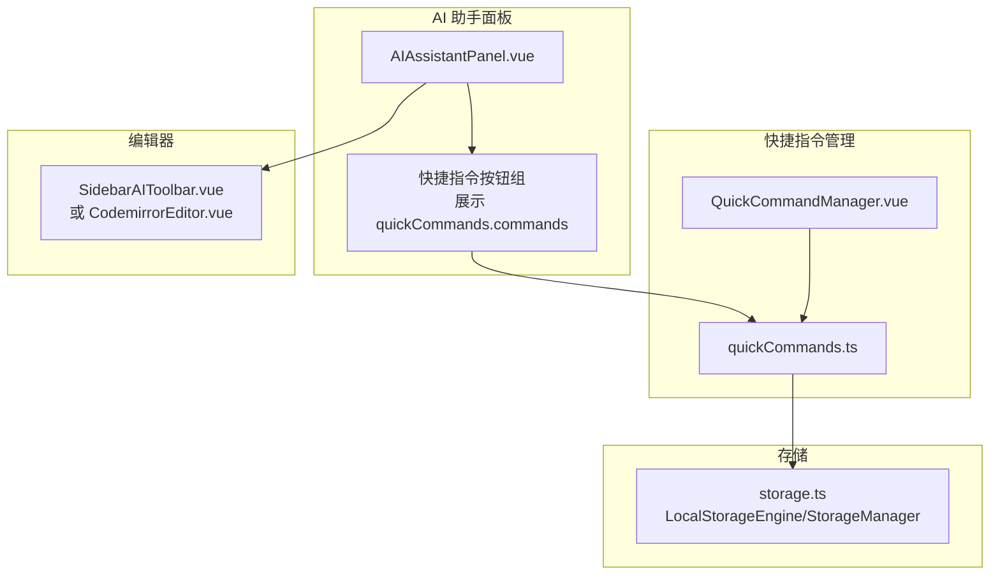
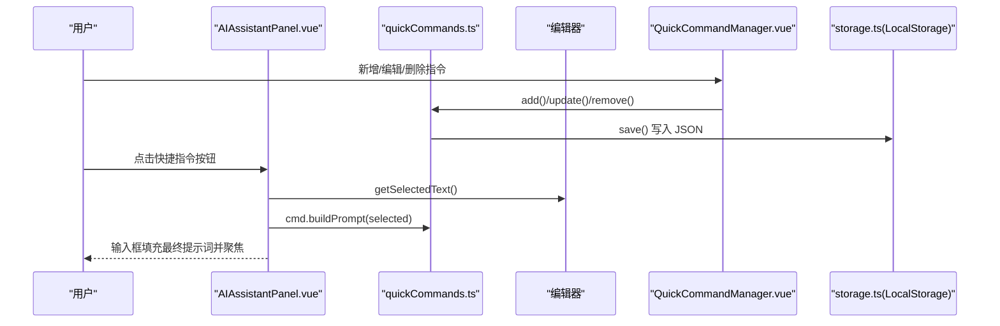
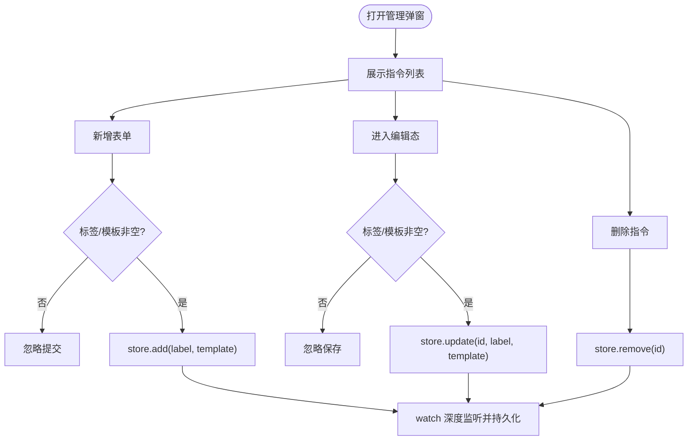
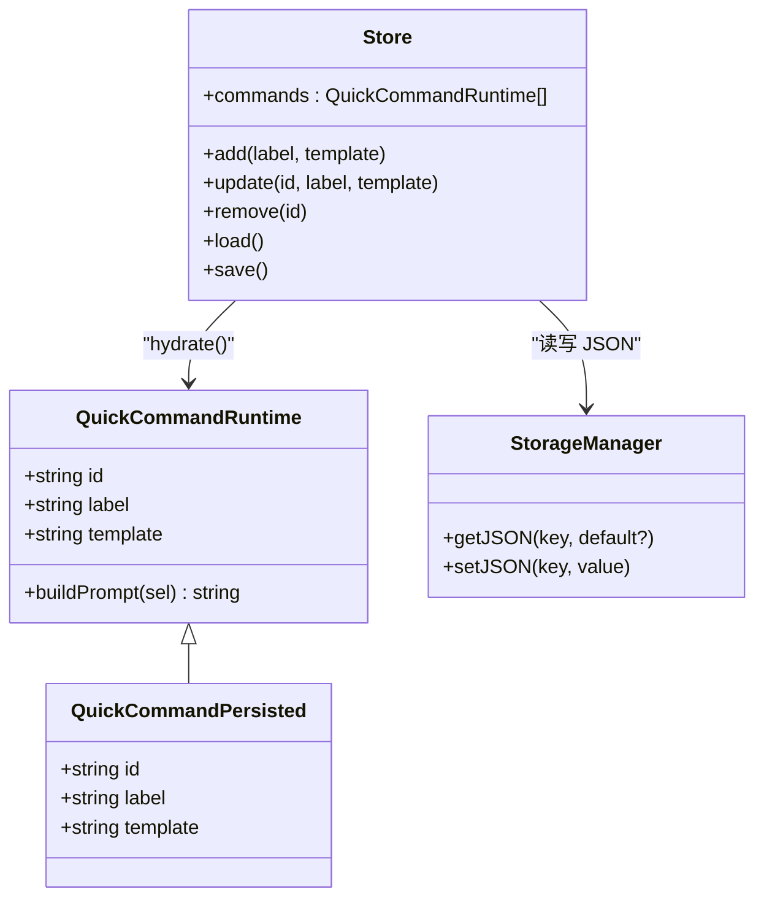
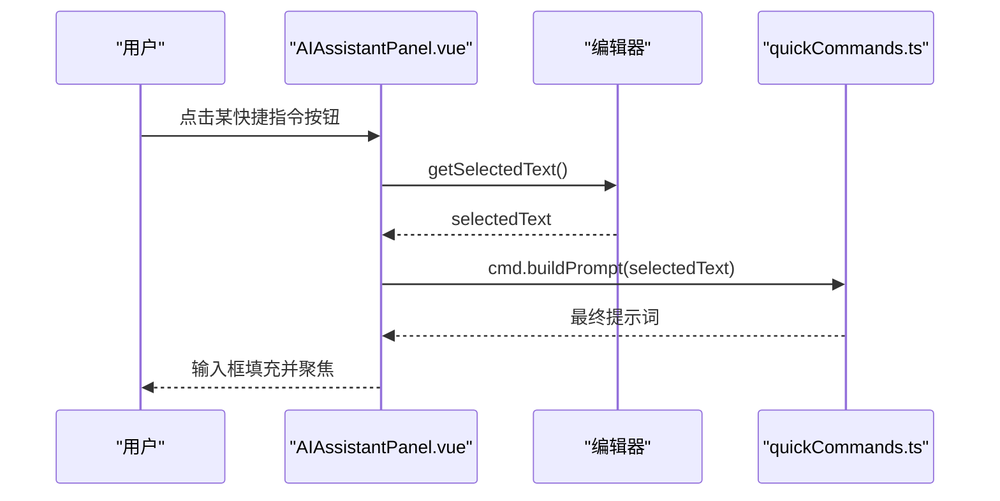
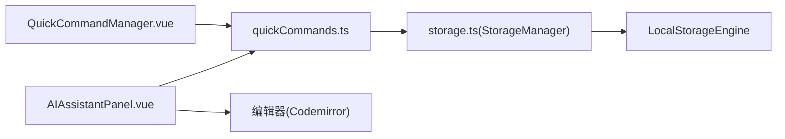

# 快捷指令

<cite>
**本文引用的文件**
- [QuickCommandManager.vue](file://apps/web/src/components/ai/chat-box/QuickCommandManager.vue)
- [quickCommands.ts](file://apps/web/src/stores/quickCommands.ts)
- [AIAssistantPanel.vue](file://apps/web/src/components/ai/chat-box/AIAssistantPanel.vue)
- [storage.ts](file://apps/web/src/utils/storage.ts)
- [SidebarAIToolbar.vue](file://apps/web/src/components/ai/SidebarAIToolbar.vue)
- [CodemirrorEditor.vue](file://apps/web/src/views/CodemirrorEditor.vue)
- [aiConfig.ts](file://apps/web/src/stores/aiConfig.ts)
</cite>

## 目录
1. [简介](#简介)
2. [项目结构](#项目结构)
3. [核心组件](#核心组件)
4. [架构总览](#架构总览)
5. [详细组件分析](#详细组件分析)
6. [依赖关系分析](#依赖关系分析)
7. [性能考量](#性能考量)
8. [故障排查指南](#故障排查指南)
9. [结论](#结论)

## 简介
本文件系统性记录“快捷指令”功能的设计与实现，涵盖：
- QuickCommandManager 组件提供的指令管理界面，包括创建、编辑、删除快捷指令的操作流程
- quickCommands store 如何存储和管理用户自定义的指令集合，每个指令包含 ID、标签、提示词模板等属性
- 在 AIAssistantPanel 中如何展示这些快捷指令，并通过 applyQuickCommand 函数将选中的指令与当前编辑器的选中文本结合，动态生成最终发送给 AI 的提示词
- 指令模板中变量替换的实现机制，例如使用占位符引用用户选中的文本
- 指令数据的持久化方式，确保用户配置在刷新后依然存在

## 项目结构
快捷指令功能涉及三个主要部分：
- 快捷指令管理界面：QuickCommandManager.vue
- 快捷指令存储与持久化：quickCommands.ts
- 快捷指令在 AI 助手面板中的展示与应用：AIAssistantPanel.vue

图表来源
- [AIAssistantPanel.vue](file://apps/web/src/components/ai/chat-box/AIAssistantPanel.vue#L572-L607)
- [QuickCommandManager.vue](file://apps/web/src/components/ai/chat-box/QuickCommandManager.vue#L51-L116)
- [quickCommands.ts](file://apps/web/src/stores/quickCommands.ts#L33-L85)
- [storage.ts](file://apps/web/src/utils/storage.ts#L152-L247)
- [SidebarAIToolbar.vue](file://apps/web/src/components/ai/SidebarAIToolbar.vue#L36-L90)
- [CodemirrorEditor.vue](file://apps/web/src/views/CodemirrorEditor.vue#L127-L172)

章节来源
- [AIAssistantPanel.vue](file://apps/web/src/components/ai/chat-box/AIAssistantPanel.vue#L572-L607)
- [QuickCommandManager.vue](file://apps/web/src/components/ai/chat-box/QuickCommandManager.vue#L51-L116)
- [quickCommands.ts](file://apps/web/src/stores/quickCommands.ts#L33-L85)
- [storage.ts](file://apps/web/src/utils/storage.ts#L152-L247)

## 核心组件
- QuickCommandManager.vue：提供快捷指令的新增、编辑、删除界面；内部调用 quickCommands.store 执行 CRUD 操作
- quickCommands.ts：定义指令的数据结构与运行时方法，负责从存储加载默认/用户指令，提供 add/update/remove，并通过 watch 持久化变更
- AIAssistantPanel.vue：在聊天面板中展示快捷指令按钮，点击后通过 applyQuickCommand 将选中文本注入模板，生成最终提示词

章节来源
- [QuickCommandManager.vue](file://apps/web/src/components/ai/chat-box/QuickCommandManager.vue#L1-L116)
- [quickCommands.ts](file://apps/web/src/stores/quickCommands.ts#L1-L85)
- [AIAssistantPanel.vue](file://apps/web/src/components/ai/chat-box/AIAssistantPanel.vue#L84-L112)

## 架构总览
快捷指令的端到端流程如下：
- 初始化：quickCommands.store 在创建时自动 load，从本地存储读取指令集，若为空则回退到默认指令
- 用户操作：在 QuickCommandManager.vue 中新增/编辑/删除指令，store 内部通过 hydrate 为每条指令生成 buildPrompt 方法
- 展示与应用：AIAssistantPanel.vue 展示快捷指令按钮，点击后调用 applyQuickCommand，从编辑器获取选中文本，调用 cmd.buildPrompt 生成最终提示词，填充到输入框并聚焦
- 持久化：store.watch(commands, save) 深度监听指令集合变化，自动将 JSON 序列化后的数组写入本地存储

图表来源
- [AIAssistantPanel.vue](file://apps/web/src/components/ai/chat-box/AIAssistantPanel.vue#L84-L112)
- [quickCommands.ts](file://apps/web/src/stores/quickCommands.ts#L38-L83)
- [storage.ts](file://apps/web/src/utils/storage.ts#L152-L218)
- [QuickCommandManager.vue](file://apps/web/src/components/ai/chat-box/QuickCommandManager.vue#L22-L48)

## 详细组件分析

### QuickCommandManager 组件
- 界面职责
  - 展示用户已有的快捷指令列表，支持查看态与编辑态切换
  - 提供新增表单，输入标签与模板，提交后调用 store.add
  - 编辑态支持修改标签与模板，保存后调用 store.update
  - 删除按钮调用 store.remove
- 数据绑定
  - 使用 useQuickCommands() 获取 store 实例
  - 列表循环渲染 store.commands，每个元素包含 id、label、template 以及运行时方法 buildPrompt
- 表单交互
  - 新增/编辑均要求标签与模板非空才允许提交
  - 编辑态通过 editingId 控制当前编辑项

图表来源
- [QuickCommandManager.vue](file://apps/web/src/components/ai/chat-box/QuickCommandManager.vue#L1-L116)
- [quickCommands.ts](file://apps/web/src/stores/quickCommands.ts#L65-L83)

章节来源
- [QuickCommandManager.vue](file://apps/web/src/components/ai/chat-box/QuickCommandManager.vue#L1-L116)
- [quickCommands.ts](file://apps/web/src/stores/quickCommands.ts#L33-L85)

### quickCommands store：数据结构与持久化
- 数据结构
  - QuickCommandPersisted：持久化形态，包含 id、label、template
  - QuickCommandRuntime：在持久化基础上增加 buildPrompt 方法，用于将模板与选中文本拼接
- hydrate 机制
  - 将持久化对象转换为运行时对象，buildPrompt 使用正则替换模板中的占位符为实际选中文本
- 默认指令
  - 初始化时提供默认的四条常用指令，作为兜底与示例
- 加载与保存
  - load：从本地存储读取 JSON，若解析失败或格式不正确则回退到默认指令并重新保存
  - save：将运行时对象映射为持久化对象数组，序列化后写入本地存储
- 监听与初始化
  - load() 在 store 创建时立即执行
  - watch(commands, save, { deep: true }) 实现自动持久化

图表来源
- [quickCommands.ts](file://apps/web/src/stores/quickCommands.ts#L1-L85)
- [storage.ts](file://apps/web/src/utils/storage.ts#L152-L218)

章节来源
- [quickCommands.ts](file://apps/web/src/stores/quickCommands.ts#L1-L85)
- [storage.ts](file://apps/web/src/utils/storage.ts#L152-L218)

### AIAssistantPanel：展示与应用快捷指令
- 展示
  - 在聊天面板顶部以按钮组形式展示 quickCommands.commands，按钮文案为指令标签
  - 若没有指令，显示提示并提供“管理指令”入口
- 应用
  - applyQuickCommand(cmd) 会：
    - 从编辑器获取选中文本（优先使用 CodeMirror 的 selection API）
    - 调用 cmd.buildPrompt(selected) 生成最终提示词
    - 将结果填入输入框，清空历史索引，聚焦并将光标置于末尾
- 编辑器选文
  - 通过 getSelectedText() 获取当前选中文本，兼容不同编辑器实现
  - SidebarAIToolbar.vue 与 CodemirrorEditor.vue 中均有选文相关逻辑，确保在不同场景下都能正确获取

图表来源
- [AIAssistantPanel.vue](file://apps/web/src/components/ai/chat-box/AIAssistantPanel.vue#L84-L112)
- [SidebarAIToolbar.vue](file://apps/web/src/components/ai/SidebarAIToolbar.vue#L36-L90)
- [CodemirrorEditor.vue](file://apps/web/src/views/CodemirrorEditor.vue#L127-L172)
- [quickCommands.ts](file://apps/web/src/stores/quickCommands.ts#L17-L23)

章节来源
- [AIAssistantPanel.vue](file://apps/web/src/components/ai/chat-box/AIAssistantPanel.vue#L84-L112)
- [SidebarAIToolbar.vue](file://apps/web/src/components/ai/SidebarAIToolbar.vue#L36-L90)
- [CodemirrorEditor.vue](file://apps/web/src/views/CodemirrorEditor.vue#L127-L172)
- [quickCommands.ts](file://apps/web/src/stores/quickCommands.ts#L17-L23)

## 依赖关系分析
- 组件耦合
  - AIAssistantPanel.vue 依赖 quickCommands.store 与编辑器选文能力
  - QuickCommandManager.vue 仅依赖 quickCommands.store，不直接依赖编辑器
- 存储依赖
  - quickCommands.store 通过 storage.ts 的 StorageManager 与 LocalStorageEngine 进行读写
  - storage.ts 提供统一的 getJSON/setJSON 接口，保证跨浏览器环境的一致行为
- 外部依赖
  - 编辑器选文依赖 CodeMirror 的 selection API，SidebarAIToolbar.vue 与 CodemirrorEditor.vue 提供了相应的实现参考

图表来源
- [AIAssistantPanel.vue](file://apps/web/src/components/ai/chat-box/AIAssistantPanel.vue#L84-L112)
- [QuickCommandManager.vue](file://apps/web/src/components/ai/chat-box/QuickCommandManager.vue#L1-L116)
- [quickCommands.ts](file://apps/web/src/stores/quickCommands.ts#L33-L85)
- [storage.ts](file://apps/web/src/utils/storage.ts#L152-L218)

章节来源
- [AIAssistantPanel.vue](file://apps/web/src/components/ai/chat-box/AIAssistantPanel.vue#L84-L112)
- [QuickCommandManager.vue](file://apps/web/src/components/ai/chat-box/QuickCommandManager.vue#L1-L116)
- [quickCommands.ts](file://apps/web/src/stores/quickCommands.ts#L33-L85)
- [storage.ts](file://apps/web/src/utils/storage.ts#L152-L218)

## 性能考量
- 模板替换复杂度
  - buildPrompt 使用正则替换，时间复杂度近似 O(n)，其中 n 为模板长度；对于短模板影响可忽略
- 持久化策略
  - 通过 watch(commands, save, { deep: true }) 实现深监听，避免频繁写入；建议在批量操作时合并多次变更
- UI 响应
  - applyQuickCommand 在 nextTick 后聚焦输入框，避免阻塞渲染；建议在长文本场景下考虑节流或延迟聚焦

[本节为通用指导，无需列出章节来源]

## 故障排查指南
- 指令无法加载或丢失
  - 检查本地存储中是否存在对应键值；若 JSON 解析失败，store 会回退到默认指令并重新保存
  - 参考路径：[quickCommands.ts](file://apps/web/src/stores/quickCommands.ts#L45-L62)
- 选文中文本为空
  - 确认编辑器是否已正确初始化；SidebarAIToolbar.vue 与 CodemirrorEditor.vue 提供了选文示例
  - 参考路径：[SidebarAIToolbar.vue](file://apps/web/src/components/ai/SidebarAIToolbar.vue#L36-L90)、[CodemirrorEditor.vue](file://apps/web/src/views/CodemirrorEditor.vue#L127-L172)
- 模板变量未替换
  - 确认模板中使用的是占位符；buildPrompt 使用正则替换占位符为选中文本
  - 参考路径：[quickCommands.ts](file://apps/web/src/stores/quickCommands.ts#L17-L23)
- 配置持久化异常
  - storage.ts 提供 getJSON/setJSON 的错误处理与回退逻辑；检查浏览器本地存储权限与容量
  - 参考路径：[storage.ts](file://apps/web/src/utils/storage.ts#L188-L218)

章节来源
- [quickCommands.ts](file://apps/web/src/stores/quickCommands.ts#L45-L62)
- [SidebarAIToolbar.vue](file://apps/web/src/components/ai/SidebarAIToolbar.vue#L36-L90)
- [CodemirrorEditor.vue](file://apps/web/src/views/CodemirrorEditor.vue#L127-L172)
- [storage.ts](file://apps/web/src/utils/storage.ts#L188-L218)

## 结论
快捷指令功能通过“管理界面 + 运行时模板 + 存储持久化”的分层设计，实现了用户自定义指令的完整生命周期管理。其关键特性包括：
- 简洁直观的管理界面，支持新增、编辑、删除
- 基于运行时方法的模板变量替换，灵活组合选中文本
- 自动化的本地存储持久化，保障配置跨会话一致性
- 与 AI 助手面板无缝集成，提升提示词生成效率

[本节为总结性内容，无需列出章节来源]