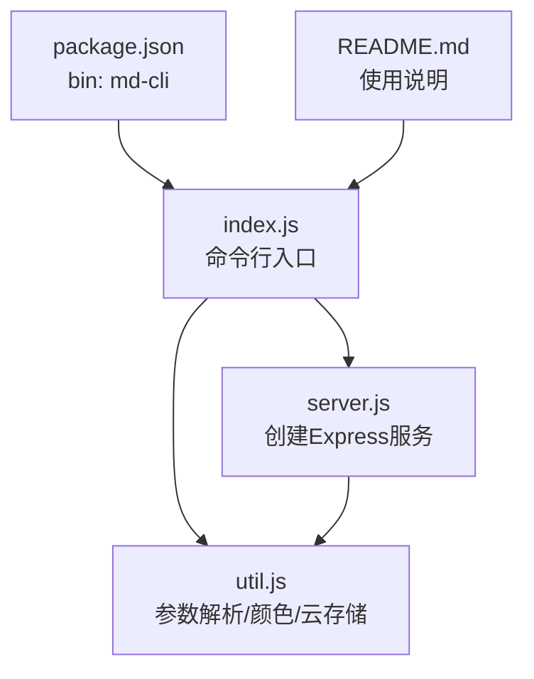
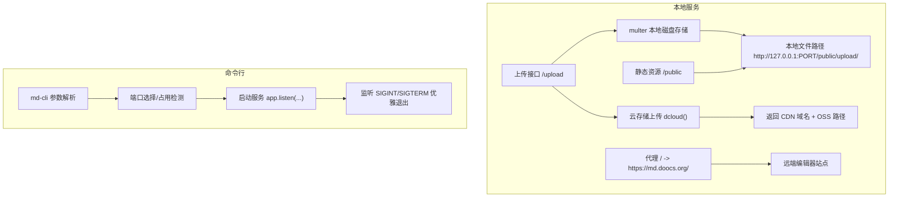
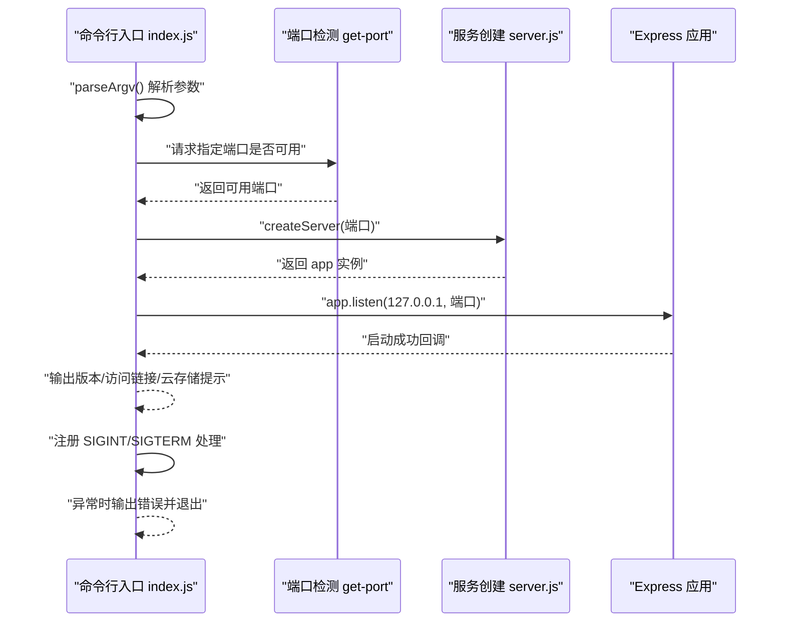
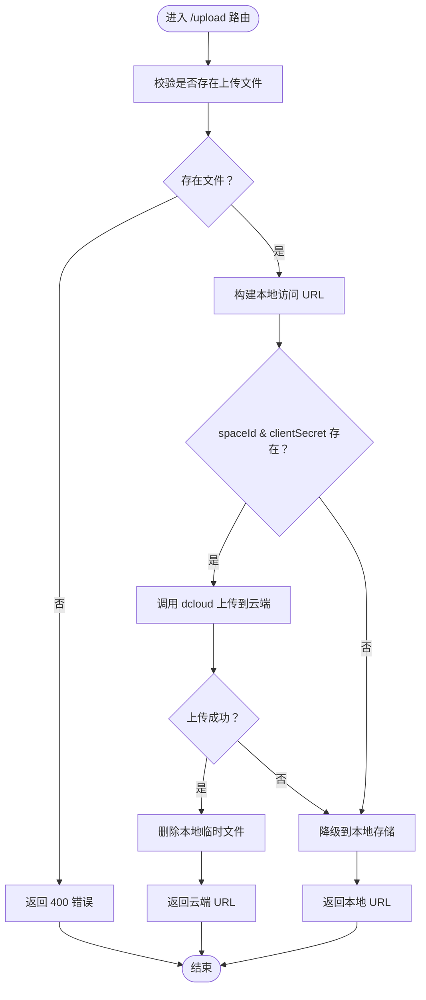
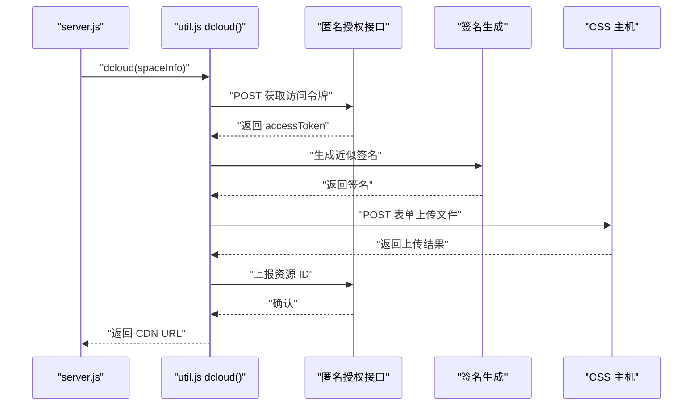
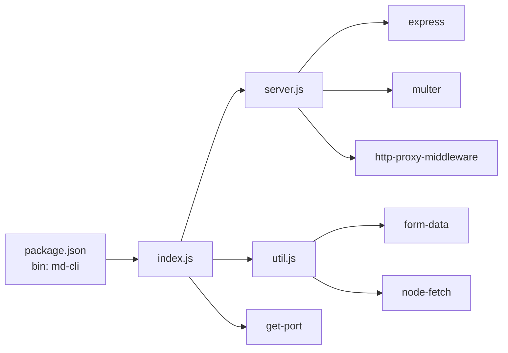

# CLI工具参考

<cite>
**本文引用的文件**
- [index.js](file://packages/md-cli/index.js)
- [server.js](file://packages/md-cli/server.js)
- [util.js](file://packages/md-cli/util.js)
- [package.json](file://packages/md-cli/package.json)
- [README.md](file://packages/md-cli/README.md)
</cite>

## 目录
1. [简介](#简介)
2. [项目结构](#项目结构)
3. [核心组件](#核心组件)
4. [架构总览](#架构总览)
5. [详细组件分析](#详细组件分析)
6. [依赖关系分析](#依赖关系分析)
7. [性能考虑](#性能考虑)
8. [故障排查指南](#故障排查指南)
9. [结论](#结论)
10. [附录](#附录)

## 简介
本文件面向使用 md-cli 命令行工具的用户与维护者，系统性梳理其命令行接口规范、服务启动流程、云存储配置与上传策略、错误处理与优雅关闭行为，并给出标准使用示例与关键实现路径，帮助快速上手与深入理解。

## 项目结构
md-cli 位于 packages/md-cli 目录，核心入口为 index.js，服务创建与路由在 server.js，参数解析与云存储签名/上传逻辑在 util.js。包配置通过 package.json 暴露二进制入口 md-cli。

图表来源
- [index.js](file://packages/md-cli/index.js#L1-L58)
- [server.js](file://packages/md-cli/server.js#L1-L105)
- [util.js](file://packages/md-cli/util.js#L1-L170)
- [package.json](file://packages/md-cli/package.json#L1-L43)
- [README.md](file://packages/md-cli/README.md#L1-L51)

章节来源
- [package.json](file://packages/md-cli/package.json#L1-L43)
- [README.md](file://packages/md-cli/README.md#L1-L51)

## 核心组件
- 命令行入口与启动流程：负责解析参数、选择端口、启动服务、监听信号与错误处理。
- 服务器创建与路由：提供静态资源、文件上传、代理转发与云存储上传降级逻辑。
- 工具模块：参数解析、终端颜色输出、云存储签名与上传流程。

章节来源
- [index.js](file://packages/md-cli/index.js#L1-L58)
- [server.js](file://packages/md-cli/server.js#L1-L105)
- [util.js](file://packages/md-cli/util.js#L1-L170)

## 架构总览
md-cli 启动后创建一个本地 Express 服务，提供：
- 静态资源访问
- 文件上传接口
- 代理到远端 Markdown 编辑器站点
- 可选的云存储上传能力（当提供 spaceId 与 clientSecret 时）

图表来源
- [server.js](file://packages/md-cli/server.js#L1-L105)
- [index.js](file://packages/md-cli/index.js#L1-L58)
- [util.js](file://packages/md-cli/util.js#L1-L170)

## 详细组件分析

### 命令行参数规范
- 支持参数
  - port：整数型，缺省值 8800；用于指定本地服务监听端口。
  - spaceId：字符串；用于启用云存储上传能力。
  - clientSecret：字符串；用于启用云存储上传能力。
  - 其他布尔型参数：当仅传入键名而不带值时，解析为 true。
  - 数字/布尔/字符串混合：根据值进行类型推断与转换。
- 参数解析规则
  - 使用键值对形式（如 key=value）或仅键名（解析为 true）。
  - 字符串中的数值会尝试转为数字，布尔字符串会被解析为布尔值。
- 云存储配置提示
  - 当同时提供 spaceId 与 clientSecret 时，控制台会提示“云存储已配置”，否则提示“未配置云存储，降级到本地存储”。

章节来源
- [index.js](file://packages/md-cli/index.js#L1-L58)
- [util.js](file://packages/md-cli/util.js#L42-L59)
- [server.js](file://packages/md-cli/server.js#L19-L23)

### 服务启动流程与端口占用检测
- 端口选择
  - 默认端口 8800。
  - 若指定端口被占用，将自动寻找可用端口并继续启动。
- 启动步骤
  - 解析参数，计算最终端口。
  - 调用 createServer(port) 创建应用实例。
  - app.listen 绑定 127.0.0.1 与指定端口。
  - 输出版本号、启动状态与访问链接。
  - 若提供 spaceId 与 clientSecret，输出云存储已配置提示。
- 错误处理
  - 启动异常时打印错误并以非零退出码退出。

图表来源
- [index.js](file://packages/md-cli/index.js#L1-L58)
- [server.js](file://packages/md-cli/server.js#L29-L36)

章节来源
- [index.js](file://packages/md-cli/index.js#L1-L58)

### 服务器创建与 HTTP 服务实现
- 服务器创建
  - createServer(port) 返回一个 Express 应用实例。
  - 确保上传目录存在，初始化 multer 磁盘存储。
  - 注册中间件：JSON、URL 编码、静态资源。
- 路由与功能
  - 上传接口：接收单文件上传，返回本地或云端 URL。
  - 代理：将所有请求代理到远端编辑器站点，捕获代理错误并返回友好提示。
- 云存储上传策略
  - 若提供 spaceId 与 clientSecret，则调用 dcloud 执行云上传；上传成功后删除本地临时文件。
  - 云上传失败时降级到本地存储，并输出降级提示。
- 静态资源
  - 提供 public 目录下的静态文件访问。

图表来源
- [server.js](file://packages/md-cli/server.js#L57-L89)

章节来源
- [server.js](file://packages/md-cli/server.js#L1-L105)

### 云存储配置与上传流程
- 配置项
  - spaceId：云存储空间标识。
  - clientSecret：用于生成签名的密钥。
- 上传流程
  - 匿名授权获取访问令牌。
  - 生成近似签名与 OSS 相关参数。
  - 通过表单提交到 OSS 主机。
  - 上报资源 ID 并返回 CDN 域名 + OSS 路径。
- 安全与签名
  - 使用 HMAC-MD5 对排序后的参数进行签名。
  - 请求头包含签名与令牌信息。

图表来源
- [util.js](file://packages/md-cli/util.js#L61-L161)
- [server.js](file://packages/md-cli/server.js#L66-L79)

章节来源
- [util.js](file://packages/md-cli/util.js#L61-L161)
- [server.js](file://packages/md-cli/server.js#L66-L79)

### 错误处理与优雅关闭
- 启动失败
  - 捕获启动异常并输出错误信息，进程以非零退出码退出。
- 代理错误
  - 代理过程中出现网络问题时，记录错误并返回 502 提示。
- 云上传失败
  - 云上传抛错时降级到本地存储，并输出降级提示。
- 进程信号
  - 监听 SIGINT 与 SIGTERM，输出关闭提示并正常退出。

章节来源
- [index.js](file://packages/md-cli/index.js#L51-L55)
- [server.js](file://packages/md-cli/server.js#L91-L101)

## 依赖关系分析
- 依赖模块
  - express：Web 服务框架。
  - multer：文件上传中间件。
  - http-proxy-middleware：反向代理。
  - get-port：端口占用检测与自动选择。
  - form-data、node-fetch：云存储上传所需的表单与网络请求。
- 二进制入口
  - package.json 中通过 bin 将 md-cli 指向 index.js，便于全局或局部安装后直接运行。

图表来源
- [package.json](file://packages/md-cli/package.json#L1-L43)
- [index.js](file://packages/md-cli/index.js#L1-L58)
- [server.js](file://packages/md-cli/server.js#L1-L105)
- [util.js](file://packages/md-cli/util.js#L1-L170)

章节来源
- [package.json](file://packages/md-cli/package.json#L1-L43)

## 性能考虑
- 端口检测与自动重试
  - 通过 get-port 在端口冲突时自动寻找可用端口，避免手动干预。
- 本地上传与云上传
  - 本地上传直接写入磁盘，延迟低；云上传在网络稳定时提升可靠性与可访问性。
- 代理性能
  - 代理层不做缓存，适合开发场景；若需生产级优化，可在上游增加缓存层或 CDN。

## 故障排查指南
- 启动失败
  - 现象：启动时报错并退出。
  - 排查：查看控制台输出的错误信息；确认端口是否被占用；检查网络连通性。
- 端口冲突
  - 现象：启动后自动切换到其他端口。
  - 排查：使用 port 参数显式指定端口；或关闭占用端口的应用。
- 云上传失败
  - 现象：控制台提示降级到本地存储。
  - 排查：确认 spaceId 与 clientSecret 是否正确；检查网络与签名生成逻辑；查看代理错误日志。
- 代理不可用
  - 现象：访问页面返回 502。
  - 排查：检查网络连接；确认远端站点可达；查看代理错误日志。

章节来源
- [index.js](file://packages/md-cli/index.js#L51-L55)
- [server.js](file://packages/md-cli/server.js#L91-L101)

## 结论
md-cli 提供了简单易用的本地 Markdown 渲染与上传能力，支持端口自动检测、云存储可选上传与代理转发。通过统一的参数解析与清晰的服务分层，开发者可以快速搭建本地开发环境并按需启用云存储能力。

## 附录

### 标准使用示例
- 默认启动
  - 命令：md-cli
  - 说明：使用默认端口 8800 启动本地服务。
- 指定端口
  - 命令：md-cli port=8899
  - 说明：在 8899 端口启动服务。
- 启用云存储
  - 命令：md-cli spaceId=your_space_id clientSecret=your_client_secret
  - 说明：提供 spaceId 与 clientSecret 后，上传将优先走云存储；失败则降级到本地存储。

章节来源
- [README.md](file://packages/md-cli/README.md#L25-L44)
- [index.js](file://packages/md-cli/index.js#L34-L39)
- [server.js](file://packages/md-cli/server.js#L66-L79)