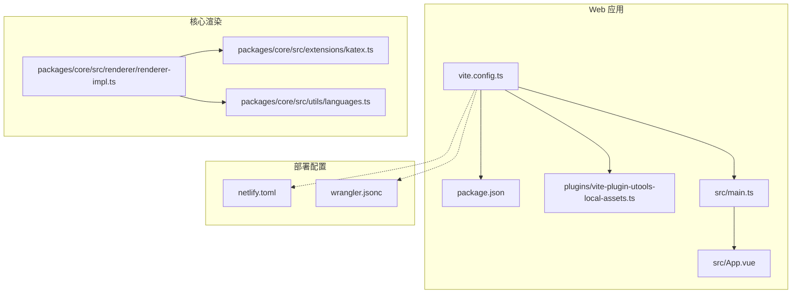
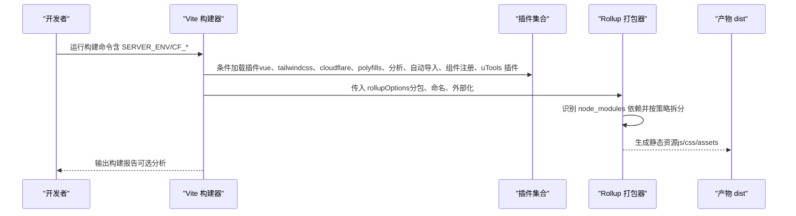
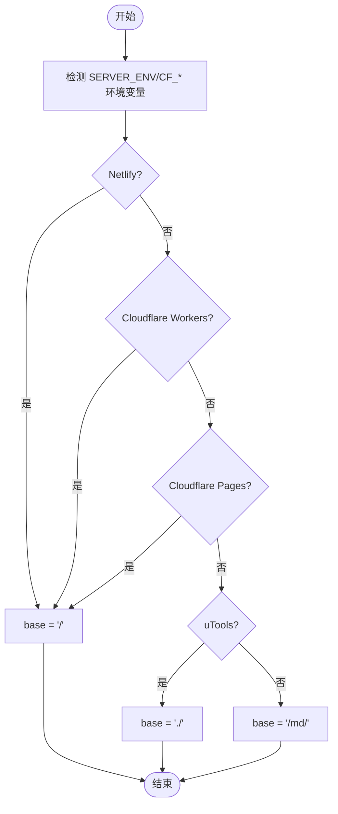
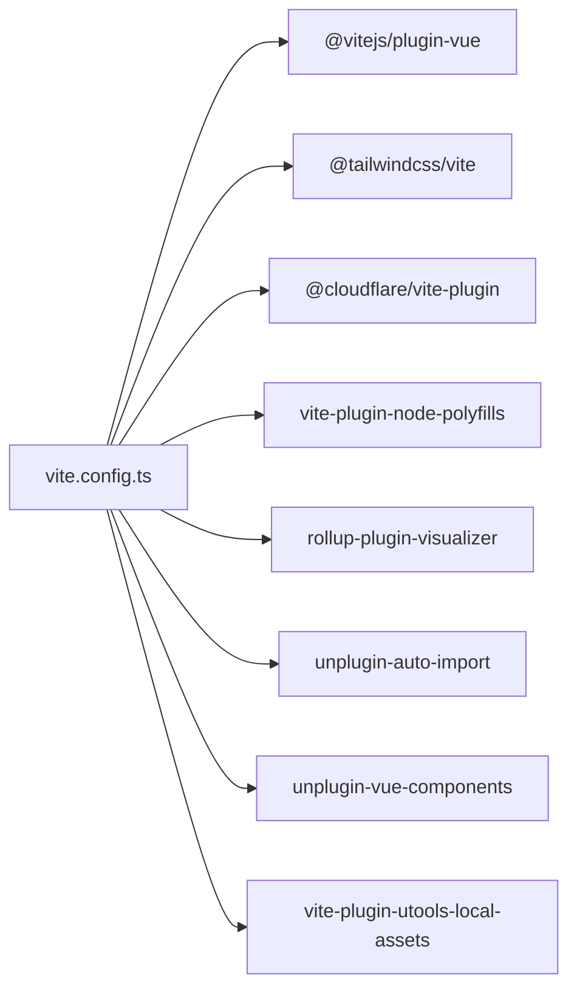
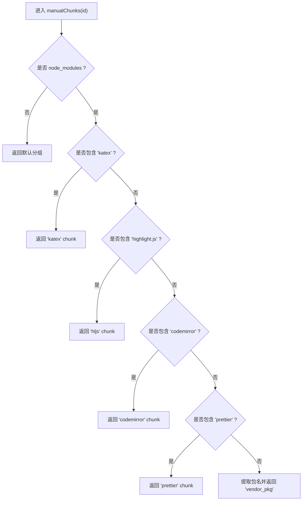
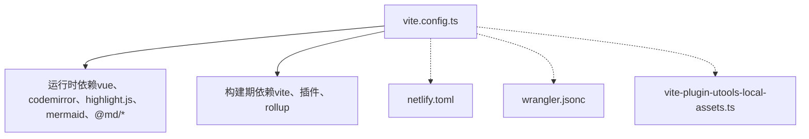

# 构建配置

<cite>
**本文引用的文件列表**
- [apps/web/vite.config.ts](file://apps/web/vite.config.ts)
- [apps/web/package.json](file://apps/web/package.json)
- [apps/web/netlify.toml](file://apps/web/netlify.toml)
- [apps/web/wrangler.jsonc](file://apps/web/wrangler.jsonc)
- [apps/web/plugins/vite-plugin-utools-local-assets.ts](file://apps/web/plugins/vite-plugin-utools-local-assets.ts)
- [apps/web/tailwind.config.cjs](file://apps/web/tailwind.config.cjs)
- [apps/web/postcss.config.js](file://apps/web/postcss.config.js)
- [apps/web/src/main.ts](file://apps/web/src/main.ts)
- [apps/web/src/App.vue](file://apps/web/src/App.vue)
- [packages/core/src/renderer/renderer-impl.ts](file://packages/core/src/renderer/renderer-impl.ts)
- [packages/core/src/extensions/katex.ts](file://packages/core/src/extensions/katex.ts)
- [packages/core/src/utils/languages.ts](file://packages/core/src/utils/languages.ts)
- [apps/web/src/views/CodemirrorEditor.vue](file://apps/web/src/views/CodemirrorEditor.vue)
</cite>

## 目录
1. [简介](#简介)
2. [项目结构](#项目结构)
3. [核心组件](#核心组件)
4. [架构总览](#架构总览)
5. [详细组件分析](#详细组件分析)
6. [依赖关系分析](#依赖关系分析)
7. [性能考量](#性能考量)
8. [故障排查指南](#故障排查指南)
9. [结论](#结论)
10. [附录](#附录)

## 简介
本文件围绕 apps/web/vite.config.ts 的构建配置进行深入解析，重点涵盖：
- 多环境 base 路径策略（Netlify、Cloudflare Pages/Workers、uTools 等）
- define 宏定义与环境变量前缀
- 插件系统（vue、tailwindcss、cloudflare、node polyfills、可视化分析、自动导入、组件自动注册、uTools 本地资源替换等）的条件加载机制
- rollupOptions 的代码分割策略，尤其是对 katex、highlight.js、codemirror 等大型依赖的独立打包处理
- resolve.alias 的 @ 符号配置与 CSS 开发 sourcemap 支持
- 不同部署场景下的配置调整建议，并给出扩展插件与修改构建输出结构的实践思路

## 项目结构
该仓库采用多包工作区结构，Web 应用位于 apps/web，核心渲染与扩展逻辑位于 packages/core。构建配置集中在 Web 应用的 vite.config.ts，配合各部署平台的配置文件（如 Netlify、Cloudflare Wrangler）实现差异化发布。

图表来源
- [apps/web/vite.config.ts](file://apps/web/vite.config.ts#L1-L92)
- [apps/web/package.json](file://apps/web/package.json#L1-L108)
- [apps/web/plugins/vite-plugin-utools-local-assets.ts](file://apps/web/plugins/vite-plugin-utools-local-assets.ts#L1-L54)
- [apps/web/netlify.toml](file://apps/web/netlify.toml#L1-L10)
- [apps/web/wrangler.jsonc](file://apps/web/wrangler.jsonc#L1-L52)
- [apps/web/src/main.ts](file://apps/web/src/main.ts#L1-L24)
- [apps/web/src/App.vue](file://apps/web/src/App.vue#L1-L121)
- [packages/core/src/renderer/renderer-impl.ts](file://packages/core/src/renderer/renderer-impl.ts#L1-L234)
- [packages/core/src/extensions/katex.ts](file://packages/core/src/extensions/katex.ts#L1-L163)
- [packages/core/src/utils/languages.ts](file://packages/core/src/utils/languages.ts#L1-L213)

章节来源
- [apps/web/vite.config.ts](file://apps/web/vite.config.ts#L1-L92)
- [apps/web/package.json](file://apps/web/package.json#L1-L108)

## 核心组件
- 多环境 base 路径：通过 SERVER_ENV 与 CF_* 环境变量决定 base 前缀，适配 Netlify、Cloudflare Pages/Workers、uTools 以及默认 Web 场景。
- define 宏定义：注入 process 对象，便于运行时获取 Node 环境信息。
- 插件系统：按需启用 vue、tailwindcss、cloudflare、node polyfills、可视化分析、自动导入、组件自动注册、uTools 本地资源替换等。
- 解析别名：@ 指向 src 目录，提升导入便捷性。
- CSS 开发 sourcemap：devSourcemap 启用，便于调试样式。
- Rollup 输出：统一命名模板与分包策略，对 katex、highlight.js、codemirror、prettier 等进行独立 chunk 提升缓存命中率与加载效率。

章节来源
- [apps/web/vite.config.ts](file://apps/web/vite.config.ts#L1-L92)

## 架构总览
下图展示了构建阶段的关键流程与插件交互，以及不同部署环境的差异点。

图表来源
- [apps/web/vite.config.ts](file://apps/web/vite.config.ts#L1-L92)

## 详细组件分析

### 多环境 base 路径与部署适配
- 环境变量判定：
  - Netlify：SERVER_ENV=NETLIFY
  - Cloudflare Pages：CF_PAGES=1
  - Cloudflare Workers：CF_WORKERS=1
  - uTools：SERVER_ENV=UTOOLS
- base 计算规则：
  - 在 Netlify 或 Cloudflare Workers 或 Cloudflare Pages 时，base 为“/”
  - 在 uTools 时，base 为“./”
  - 其他 Web 场景，base 为“/md/”
- 部署平台差异：
  - Netlify：通过 netlify.toml 设置 SPA 重定向至 index.html，确保路由正确回退
  - Cloudflare Workers：通过 wrangler.jsonc 配置静态资源绑定与单页应用回退策略
  - uTools：通过自定义插件将远程资源替换为本地资源，保证离线可用

图表来源
- [apps/web/vite.config.ts](file://apps/web/vite.config.ts#L17-L22)
- [apps/web/netlify.toml](file://apps/web/netlify.toml#L1-L10)
- [apps/web/wrangler.jsonc](file://apps/web/wrangler.jsonc#L1-L52)
- [apps/web/plugins/vite-plugin-utools-local-assets.ts](file://apps/web/plugins/vite-plugin-utools-local-assets.ts#L1-L54)

章节来源
- [apps/web/vite.config.ts](file://apps/web/vite.config.ts#L17-L22)
- [apps/web/netlify.toml](file://apps/web/netlify.toml#L1-L10)
- [apps/web/wrangler.jsonc](file://apps/web/wrangler.jsonc#L1-L52)
- [apps/web/plugins/vite-plugin-utools-local-assets.ts](file://apps/web/plugins/vite-plugin-utools-local-assets.ts#L1-L54)

### define 宏定义与环境变量前缀
- define：注入 process 对象，便于在浏览器端访问 Node 环境信息（如 process.env）
- envPrefix：VITE_ 与 CF_ 前缀的环境变量会被注入到客户端代码中，便于在运行时读取部署相关配置

章节来源
- [apps/web/vite.config.ts](file://apps/web/vite.config.ts#L27-L31)

### 插件系统与条件加载
- Vue 插件：始终启用
- TailwindCSS 插件：始终启用
- Cloudflare 插件：仅在 CF_WORKERS=1 时启用
- Node Polyfills：非 Cloudflare Workers 环境启用，包含 path、util、timers、stream、fs 等
- 可视化分析：当 ANALYZE=true 时启用 rollup-plugin-visualizer，生成 stats.html
- 自动导入：自动导入 vue、pinia、@vueuse/core，并扫描 stores、utils/toast、composables 目录
- 组件自动注册：按需 resolver（当前为空）
- uTools 本地资源替换：仅在 SERVER_ENV=UTOOLS 时启用，将远程资源替换为本地资源路径

图表来源
- [apps/web/vite.config.ts](file://apps/web/vite.config.ts#L1-L92)
- [apps/web/plugins/vite-plugin-utools-local-assets.ts](file://apps/web/plugins/vite-plugin-utools-local-assets.ts#L1-L54)

章节来源
- [apps/web/vite.config.ts](file://apps/web/vite.config.ts#L31-L57)
- [apps/web/plugins/vite-plugin-utools-local-assets.ts](file://apps/web/plugins/vite-plugin-utools-local-assets.ts#L1-L54)

### 代码分割策略（rollupOptions）
- external：将 mermaid 标记为外部依赖，避免被打包进主包
- globals：在浏览器环境中将 mermaid 暴露为全局变量，供运行时使用
- 文件命名：统一使用 md 前缀的 hash 命名，便于缓存控制
- manualChunks：
  - node_modules 下的依赖按包名拆分，katex、highlight.js、codemirror、prettier 单独成块
  - 其余第三方库按 vendor_pkg 形式聚合，减少碎片 chunk 数量
- 与运行时的关系：
  - renderer-impl.ts 中对 mermaid 的运行时回退逻辑与 external/globals 配合，确保在无全局时动态导入
  - highlight.js 语言注册与按需加载在核心包中实现，配合 CDN 与动态加载策略

图表来源
- [apps/web/vite.config.ts](file://apps/web/vite.config.ts#L63-L88)
- [packages/core/src/renderer/renderer-impl.ts](file://packages/core/src/renderer/renderer-impl.ts#L200-L234)
- [packages/core/src/utils/languages.ts](file://packages/core/src/utils/languages.ts#L78-L127)

章节来源
- [apps/web/vite.config.ts](file://apps/web/vite.config.ts#L63-L88)
- [packages/core/src/renderer/renderer-impl.ts](file://packages/core/src/renderer/renderer-impl.ts#L200-L234)
- [packages/core/src/utils/languages.ts](file://packages/core/src/utils/languages.ts#L78-L127)

### resolve.alias 与 CSS 开发 sourcemap
- alias：@ 指向 src 目录，简化相对路径导入
- CSS devSourcemap：启用开发环境 CSS sourcemap，便于定位样式来源

章节来源
- [apps/web/vite.config.ts](file://apps/web/vite.config.ts#L58-L61)

### 关键运行时依赖与渲染链路
- mermaid：external + globals + 运行时回退（优先全局，否则动态导入）
- highlight.js：核心包中注册常用语言并在渲染时高亮代码块
- katex：核心扩展提供公式解析与渲染逻辑，配合 CDN 与动态加载策略

章节来源
- [apps/web/vite.config.ts](file://apps/web/vite.config.ts#L63-L88)
- [packages/core/src/renderer/renderer-impl.ts](file://packages/core/src/renderer/renderer-impl.ts#L1-L234)
- [packages/core/src/extensions/katex.ts](file://packages/core/src/extensions/katex.ts#L1-L163)
- [packages/core/src/utils/languages.ts](file://packages/core/src/utils/languages.ts#L1-L213)

## 依赖关系分析
- 构建期依赖：vite、@vitejs/plugin-vue、@tailwindcss/vite、@cloudflare/vite-plugin、rollup、rollup-plugin-visualizer、unplugin-auto-import、unplugin-vue-components、vite-plugin-node-polyfills、vite-plugin-radar、vite-plugin-vue-devtools
- 运行时依赖：vue、pinia、@vueuse/core、codemirror、highlight.js、mermaid、@md/core、@md/shared 等
- 与部署平台的耦合：
  - Cloudflare Workers：通过 CF_WORKERS=1 触发 cloudflare 插件与 polyfills 的条件启用
  - Netlify：通过 netlify.toml 的 SPA 重定向保证路由
  - uTools：通过自定义插件替换远程资源为本地资源

图表来源
- [apps/web/vite.config.ts](file://apps/web/vite.config.ts#L1-L92)
- [apps/web/package.json](file://apps/web/package.json#L1-L108)
- [apps/web/netlify.toml](file://apps/web/netlify.toml#L1-L10)
- [apps/web/wrangler.jsonc](file://apps/web/wrangler.jsonc#L1-L52)
- [apps/web/plugins/vite-plugin-utools-local-assets.ts](file://apps/web/plugins/vite-plugin-utools-local-assets.ts#L1-L54)

章节来源
- [apps/web/package.json](file://apps/web/package.json#L1-L108)
- [apps/web/vite.config.ts](file://apps/web/vite.config.ts#L1-L92)

## 性能考量
- 代码分割：
  - 将 katex、highlight.js、codemirror、prettier 独立打包，有利于 CDN 缓存与并行加载
  - 其他第三方库按包聚合，减少 chunk 数量，降低请求开销
- 外部化与全局暴露：
  - mermaid external + globals，避免重复打包，同时在运行时回退到动态导入，兼顾生产与开发
- 资源命名：
  - 统一的 md 前缀 + hash 命名，提升缓存命中率
- 开发体验：
  - 启用 CSS devSourcemap 与可视化分析，便于定位性能瓶颈与体积分布

章节来源
- [apps/web/vite.config.ts](file://apps/web/vite.config.ts#L63-L88)

## 故障排查指南
- base 路径导致的资源 404
  - 检查 SERVER_ENV 与 CF_* 环境变量是否正确设置
  - Netlify 需确认 netlify.toml 的 SPA 重定向规则生效
  - uTools 环境需确认自定义插件已启用且替换规则匹配
- Cloudflare Workers 环境异常
  - 确认 CF_WORKERS=1 已设置，cloudflare 插件与 node polyfills 条件加载正确
- mermaid 未渲染
  - 确认 external 与 globals 配置，检查运行时回退逻辑是否触发
- highlight.js 语言缺失
  - 核心包中已注册常用语言，若出现未注册语言，需在渲染时动态加载对应语言模块
- CSS 样式定位困难
  - 开发环境下启用 devSourcemap 并检查样式来源映射

章节来源
- [apps/web/vite.config.ts](file://apps/web/vite.config.ts#L17-L22)
- [apps/web/netlify.toml](file://apps/web/netlify.toml#L1-L10)
- [apps/web/wrangler.jsonc](file://apps/web/wrangler.jsonc#L1-L52)
- [apps/web/plugins/vite-plugin-utools-local-assets.ts](file://apps/web/plugins/vite-plugin-utools-local-assets.ts#L1-L54)
- [packages/core/src/renderer/renderer-impl.ts](file://packages/core/src/renderer/renderer-impl.ts#L200-L234)
- [packages/core/src/utils/languages.ts](file://packages/core/src/utils/languages.ts#L78-L127)

## 结论
本构建配置通过环境变量驱动的多环境 base 路径策略、条件化的插件加载、精细的 rollup 代码分割与运行时依赖外部化，实现了对 Netlify、Cloudflare Pages/Workers、uTools 等多种部署场景的良好适配。配合 CSS devSourcemap 与可视化分析工具，既提升了开发体验，也优化了生产构建的性能与可维护性。

## 附录

### 不同部署场景下的配置调整建议
- Netlify
  - 确保 SERVER_ENV=NETLIFY，base 为“/”，并启用 netlify.toml 的 SPA 重定向
  - 参考路径：[apps/web/netlify.toml](file://apps/web/netlify.toml#L1-L10)
- Cloudflare Pages
  - 确保 CF_PAGES=1，base 为“/”，无需额外插件启用
  - 参考路径：[apps/web/vite.config.ts](file://apps/web/vite.config.ts#L17-L22)
- Cloudflare Workers
  - 确保 CF_WORKERS=1，启用 cloudflare 插件与 node polyfills
  - 参考路径：[apps/web/vite.config.ts](file://apps/web/vite.config.ts#L31-L57)
- uTools
  - 确保 SERVER_ENV=UTOOLS，启用自定义插件替换远程资源
  - 参考路径：[apps/web/plugins/vite-plugin-utools-local-assets.ts](file://apps/web/plugins/vite-plugin-utools-local-assets.ts#L1-L54)

### 如何扩展插件或修改构建输出结构
- 扩展插件
  - 在 plugins 数组中添加新的插件实例，并根据需要设置 apply 条件
  - 参考路径：[apps/web/vite.config.ts](file://apps/web/vite.config.ts#L31-L57)
- 修改构建输出结构
  - 调整 rollupOptions.output 的命名模板与分包策略
  - 参考路径：[apps/web/vite.config.ts](file://apps/web/vite.config.ts#L63-L88)
- 自定义 Tailwind 配置
  - 在 tailwind.config.cjs 中扩展 content、theme、plugins 等
  - 参考路径：[apps/web/tailwind.config.cjs](file://apps/web/tailwind.config.cjs#L1-L88)
- PostCSS 集成
  - 在 postcss.config.js 中添加或调整插件
  - 参考路径：[apps/web/postcss.config.js](file://apps/web/postcss.config.js#L1-L6)