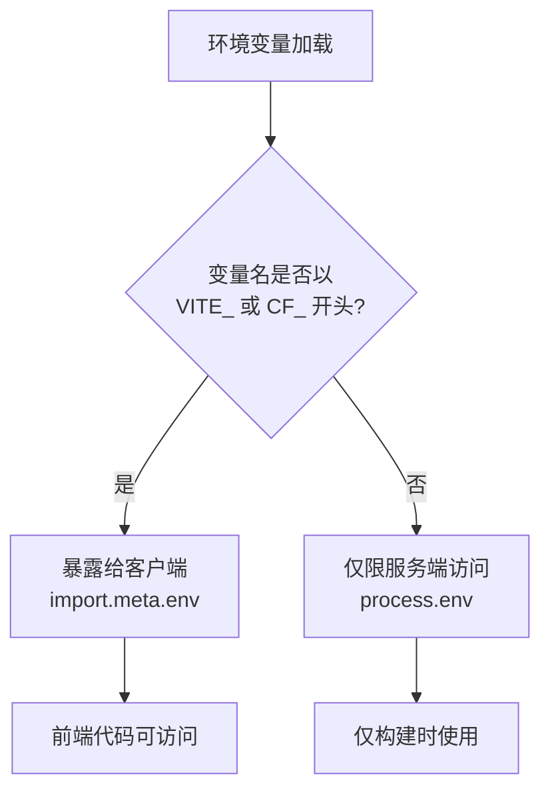
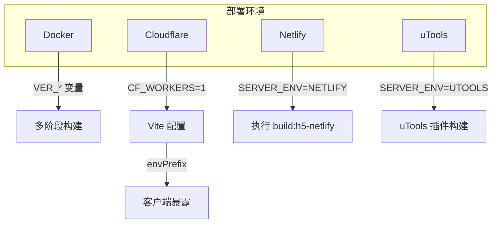

# 环境变量

<cite>
**本文档中引用的文件**  
- [vite.config.ts](file://apps/web/vite.config.ts)
- [.env](file://docker/latest/.env)
- [Dockerfile](file://docker/Dockerfile)
- [Dockerfile.base](file://docker/latest/Dockerfile.base)
- [Dockerfile.nginx](file://docker/latest/Dockerfile.nginx)
- [Dockerfile.standalone](file://docker/latest/Dockerfile.standalone)
- [Dockerfile.static](file://docker/latest/Dockerfile.static)
- [netlify.toml](file://apps/web/netlify.toml)
- [wrangler.jsonc](file://apps/web/wrangler.jsonc)
- [package.json](file://apps/web/package.json)
</cite>

## 目录
1. [简介](#简介)
2. [构建时环境变量](#构建时环境变量)
3. [运行时环境变量](#运行时环境变量)
4. [Vite 环境变量前缀配置](#vite-环境变量前缀配置)
5. [不同部署环境中的应用](#不同部署环境中的应用)
6. [环境变量优先级说明](#环境变量优先级说明)
7. [完整环境变量清单](#完整环境变量清单)

## 简介
本项目通过多种环境变量实现跨平台构建与部署的灵活性，涵盖 Docker、Cloudflare Workers、Netlify 和 uTools 等多个部署场景。环境变量分为构建时变量（用于 Docker 构建）和运行时变量（用于 Vite 应用配置），并通过 `envPrefix` 控制前端可访问的变量范围。

**Section sources**
- [vite.config.ts](file://apps/web/vite.config.ts#L1-L92)
- [package.json](file://apps/web/package.json#L1-L108)

## 构建时环境变量
构建时环境变量主要用于 Docker 镜像的多阶段构建过程，定义在 `docker/latest/.env` 文件中，并通过 `ARG` 指令在 Dockerfile 中引用。

### 构建时变量清单
- `VER_APP`: 应用版本标签，当前设为 `latest`
- `VER_NGX`: Nginx 基础镜像版本，当前为 `1.21.6-alpine`
- `VER_GOLANG`: Go 编译环境版本，当前为 `1.25.2-alpine`
- `VER_ALPINE`: Alpine Linux 基础镜像版本，当前为 `3.20`

这些变量在以下 Dockerfile 中被引用：
- `Dockerfile.nginx` 使用 `VER_NGX`
- `Dockerfile.standalone` 使用 `VER_GOLANG` 和 `VER_ALPINE`

**Section sources**
- [.env](file://docker/latest/.env#L1-L5)
- [Dockerfile.nginx](file://docker/latest/Dockerfile.nginx#L1-L7)
- [Dockerfile.standalone](file://docker/latest/Dockerfile.standalone#L1-L23)

## 运行时环境变量
运行时环境变量用于控制 Vite 构建行为和应用运行逻辑，主要通过 `process.env` 和 `import.meta.env` 访问。

### 主要运行时变量
- `SERVER_ENV`: 指定部署环境，可选值包括 `NETLIFY`、`UTOOLS`
- `CF_WORKERS`: 标识是否在 Cloudflare Workers 环境下运行，值为 `1` 时表示启用
- `CF_PAGES`: 标识是否在 Cloudflare Pages 环境下运行
- `ANALYZE`: 启用构建分析工具，值为 `true` 时生成 `stats.html`

这些变量在 `vite.config.ts` 中被用于条件判断，影响插件加载和基础路径设置。

**Section sources**
- [vite.config.ts](file://apps/web/vite.config.ts#L17-L22)
- [package.json](file://apps/web/package.json#L20-L21)

## Vite 环境变量前缀配置
在 `vite.config.ts` 中，`envPrefix` 配置项被设置为 `['VITE_', 'CF_']`，这意味着只有以 `VITE_` 或 `CF_` 开头的环境变量会被暴露给客户端代码（通过 `import.meta.env` 访问）。

**Diagram sources**
- [vite.config.ts](file://apps/web/vite.config.ts#L30)

**Section sources**
- [vite.config.ts](file://apps/web/vite.config.ts#L25-L30)

## 不同部署环境中的应用
### Docker 部署
Docker 构建使用多阶段 Dockerfile，通过 `ARG` 和 `ENV` 指令管理版本依赖。`Dockerfile.base` 用于构建静态资源，其他 Dockerfile 基于此基础镜像进行扩展。

### Cloudflare Workers
通过 `wrangler.jsonc` 配置 Cloudflare Workers 的兼容性标志，启用 `nodejs_compat` 和 `nodejs_compat_populate_process_env` 以支持 Node.js 兼容模式。`CF_WORKERS=1` 触发 Vite 的 Cloudflare 插件。

### Netlify 部署
`netlify.toml` 定义了构建命令和发布目录，`SERVER_ENV=NETLIFY` 触发特定的构建流程（`build:h5-netlify`），并设置基础路径为 `/`。

### uTools 插件
`SERVER_ENV=UTOOLS` 触发特定的构建输出目录（`../utools/dist`），并启用 `utoolsLocalAssetsPlugin` 插件处理本地资源。

**Diagram sources**
- [netlify.toml](file://apps/web/netlify.toml#L1-L10)
- [wrangler.jsonc](file://apps/web/wrangler.jsonc#L1-L52)
- [vite.config.ts](file://apps/web/vite.config.ts#L17-L22)

**Section sources**
- [netlify.toml](file://apps/web/netlify.toml#L1-L10)
- [wrangler.jsonc](file://apps/web/wrangler.jsonc#L1-L52)
- [Dockerfile](file://docker/Dockerfile#L1-L39)

## 环境变量优先级说明
环境变量的优先级遵循以下顺序（从高到低）：
1. **命令行参数**：通过 `cross-env VAR=value` 直接传递
2. **.env.[mode] 文件**：特定模式下的环境变量文件
3. **.env 文件**：通用环境变量文件
4. **系统环境变量**：操作系统级别的环境变量

在 Vite 中，`loadEnv()` 函数会按照此优先级加载变量。值得注意的是，只有 `VITE_` 和 `CF_` 前缀的变量会被注入到客户端代码中。

**Section sources**
- [vite.config.ts](file://apps/web/vite.config.ts#L25)

## 完整环境变量清单
| 变量名 | 类型 | 用途 | 可选值 | 示例 |
|-------|------|------|--------|------|
| `VER_APP` | 构建时 | 应用版本标签 | latest, v2.1.0 | VER_APP=latest |
| `VER_NGX` | 构建时 | Nginx 版本 | 1.21.6-alpine | VER_NGX=1.21.6-alpine |
| `VER_GOLANG` | 构建时 | Go 编译版本 | 1.25.2-alpine | VER_GOLANG=1.25.2-alpine |
| `VER_ALPINE` | 构建时 | Alpine 版本 | 3.20 | VER_ALPINE=3.20 |
| `SERVER_ENV` | 运行时 | 部署环境 | NETLIFY, UTOOLS | SERVER_ENV=NETLIFY |
| `CF_WORKERS` | 运行时 | Cloudflare Workers 标识 | 1, undefined | CF_WORKERS=1 |
| `CF_PAGES` | 运行时 | Cloudflare Pages 标识 | 1, undefined | CF_PAGES=1 |
| `ANALYZE` | 运行时 | 构建分析开关 | true, false | ANALYZE=true |
| `VITE_LAUNCH_EDITOR` | 运行时 | Vite DevTools 编辑器 | code, vscode | VITE_LAUNCH_EDITOR=code |

**Section sources**
- [.env](file://docker/latest/.env#L1-L5)
- [vite.config.ts](file://apps/web/vite.config.ts#L17-L48)
- [package.json](file://apps/web/package.json#L14-L21)