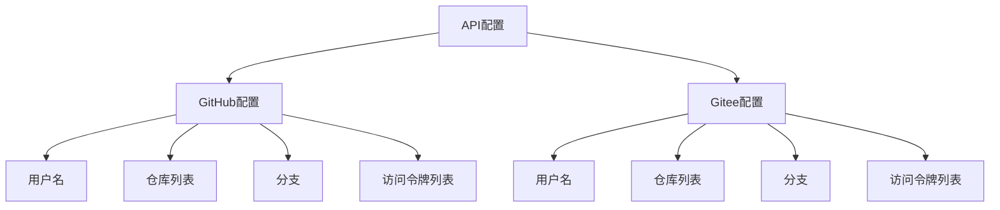
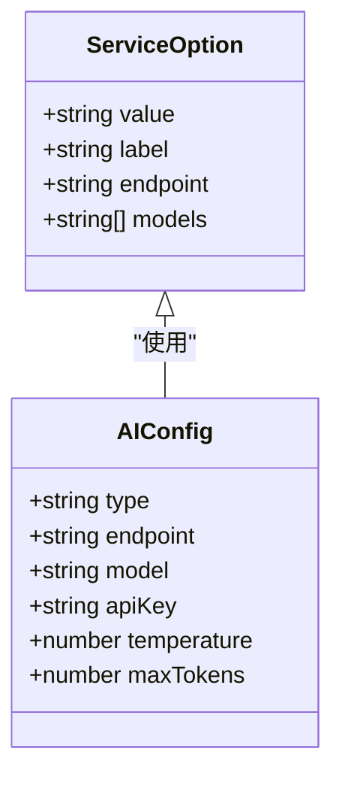
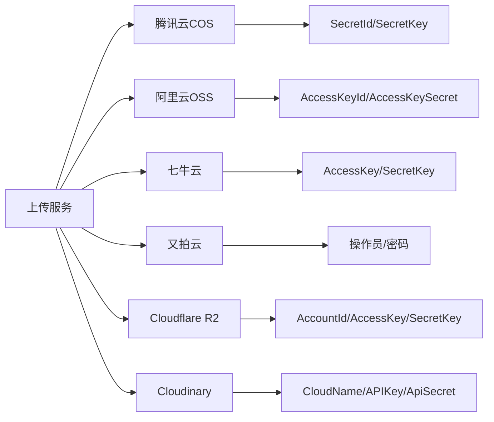
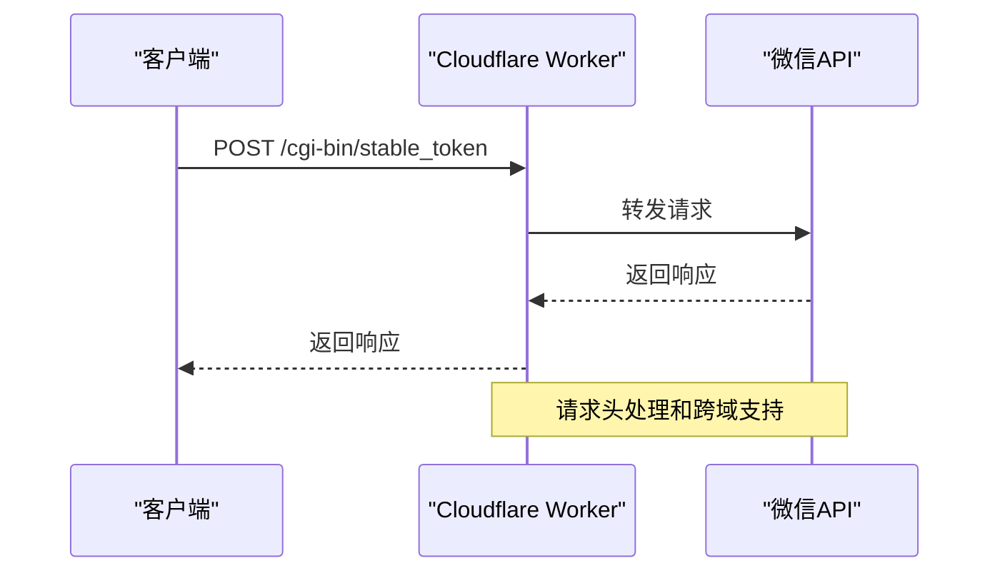
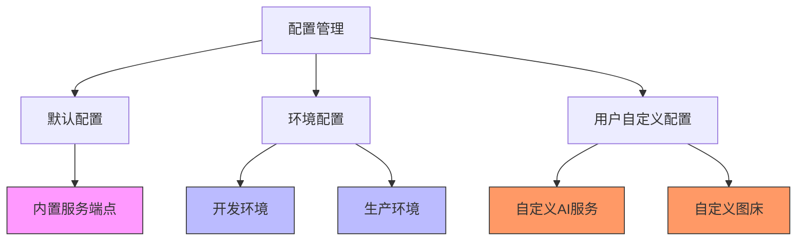
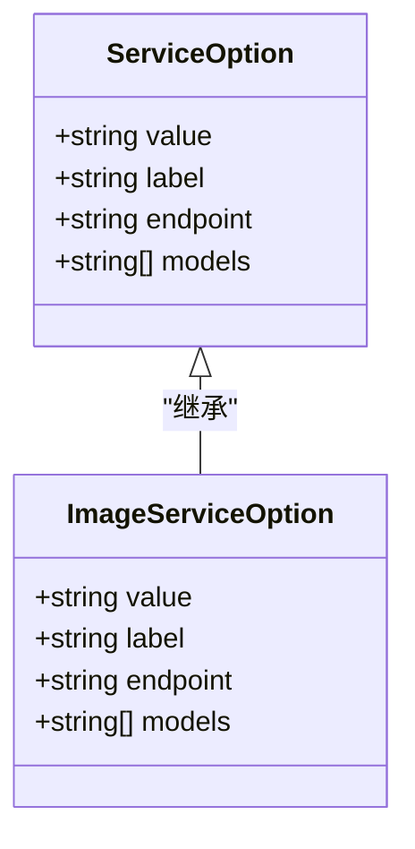
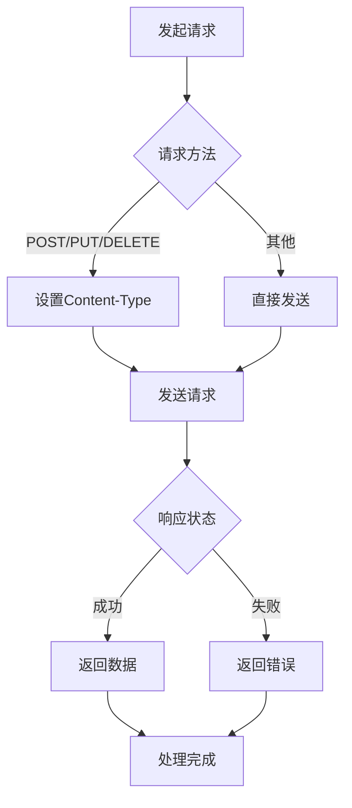
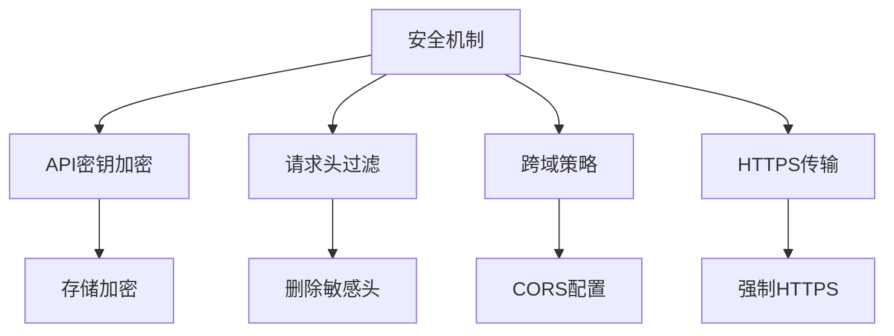
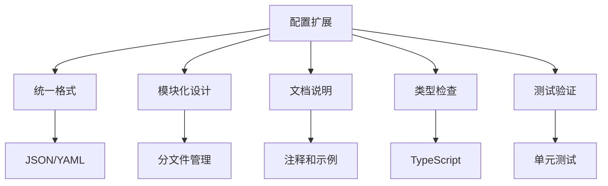

# API端点配置

<cite>
**本文档引用的文件**
- [api.ts](file://packages/shared/src/configs/api.ts)
- [ai-service-options.ts](file://packages/shared/src/configs/ai-service-options.ts)
- [ai-config.ts](file://packages/shared/src/constants/ai-config.ts)
- [fetch.ts](file://packages/shared/src/utils/fetch.ts)
- [worker/index.ts](file://apps/web/worker/index.ts)
- [UploadImgDialog.vue](file://apps/web/src/components/editor/UploadImgDialog.vue)
- [AIConfig.vue](file://apps/web/src/components/ai/chat-box/AIConfig.vue)
- [AIImageConfig.vue](file://apps/web/src/components/ai/image-generator/AIImageConfig.vue)
</cite>

## 目录
1. [简介](#简介)
2. [核心API端点配置](#核心api端点配置)
3. [AI服务端点配置](#ai服务端点配置)
4. [图床上传服务配置](#图床上传服务配置)
5. [内容同步服务配置](#内容同步服务配置)
6. [配置管理与多环境支持](#配置管理与多环境支持)
7. [类型定义与接口规范](#类型定义与接口规范)
8. [请求处理与错误处理](#请求处理与错误处理)
9. [安全性与敏感信息保护](#安全性与敏感信息保护)
10. [配置扩展最佳实践](#配置扩展最佳实践)

## 简介
本项目提供了一套完整的API端点配置系统，支持多种AI服务、图床上传和内容同步功能。系统通过TypeScript配置文件定义了所有服务端点，包括请求方法、URL模式、认证方式和超时设置等关键参数。配置系统支持多环境切换和自定义覆盖，确保在不同部署场景下的灵活性和安全性。

**Section sources**
- [api.ts](file://packages/shared/src/configs/api.ts)
- [ai-service-options.ts](file://packages/shared/src/configs/ai-service-options.ts)

## 核心API端点配置
系统的核心API端点配置主要集中在`packages/shared/src/configs/api.ts`文件中，定义了GitHub和Gitee等代码托管平台的访问配置。这些配置包括用户名、仓库列表、分支名称和访问令牌列表等关键信息。

**Diagram sources**
- [api.ts](file://packages/shared/src/configs/api.ts)

**Section sources**
- [api.ts](file://packages/shared/src/configs/api.ts)

## AI服务端点配置
AI服务端点配置通过`serviceOptions`数组定义，支持多种主流AI服务提供商，包括内置服务、DeepSeek、OpenAI、通义千问、腾讯混元等。每个服务配置包含唯一标识、显示标签、API端点和可用模型列表。

**Diagram sources**
- [ai-service-options.ts](file://packages/shared/src/configs/ai-service-options.ts)
- [types/ai-services-types.ts](file://packages/shared/src/types/ai-services-types.ts)

**Section sources**
- [ai-service-options.ts](file://packages/shared/src/configs/ai-service-options.ts)
- [types/ai-services-types.ts](file://packages/shared/src/types/ai-services-types.ts)

## 图床上传服务配置
图床上传服务支持多种云存储和CDN服务，包括腾讯云COS、阿里云OSS、七牛云、又拍云、Cloudflare R2和Cloudinary等。每种服务都有独立的配置模式，包含访问密钥、存储桶、区域和CDN域名等必要信息。

**Diagram sources**
- [UploadImgDialog.vue](file://apps/web/src/components/editor/UploadImgDialog.vue)
- [file.ts](file://apps/web/src/utils/file.ts)

**Section sources**
- [UploadImgDialog.vue](file://apps/web/src/components/editor/UploadImgDialog.vue)
- [file.ts](file://apps/web/src/utils/file.ts)

## 内容同步服务配置
内容同步服务主要用于公众号文章发布，通过Cloudflare Workers代理请求到微信API。系统配置了必要的代理设置和认证信息，确保跨域请求的安全性和可靠性。

**Diagram sources**
- [worker/index.ts](file://apps/web/worker/index.ts)
- [UploadImgDialog.vue](file://apps/web/src/components/editor/UploadImgDialog.vue)

**Section sources**
- [worker/index.ts](file://apps/web/worker/index.ts)
- [UploadImgDialog.vue](file://apps/web/src/components/editor/UploadImgDialog.vue)

## 配置管理与多环境支持
系统通过环境变量和配置文件实现了多环境支持，包括开发、生产等不同部署场景。配置系统允许用户自定义覆盖默认设置，确保灵活性和可扩展性。

**Diagram sources**
- [ai-config.ts](file://packages/shared/src/constants/ai-config.ts)
- [wrangler.jsonc](file://apps/web/wrangler.jsonc)

**Section sources**
- [ai-config.ts](file://packages/shared/src/constants/ai-config.ts)
- [wrangler.jsonc](file://apps/web/wrangler.jsonc)

## 类型定义与接口规范
系统使用TypeScript定义了严格的接口规范，确保配置的一致性和类型安全。主要类型包括`ServiceOption`、`ImageServiceOption`等，为AI服务和图像生成服务提供了类型约束。

**Diagram sources**
- [types/ai-services-types.ts](file://packages/shared/src/types/ai-services-types.ts)

**Section sources**
- [types/ai-services-types.ts](file://packages/shared/src/types/ai-services-types.ts)

## 请求处理与错误处理
系统使用Axios作为HTTP客户端，配置了统一的请求拦截器和响应拦截器。请求超时设置为30秒，支持multipart/form-data内容类型，并对响应数据进行统一处理。

**Diagram sources**
- [fetch.ts](file://packages/shared/src/utils/fetch.ts)

**Section sources**
- [fetch.ts](file://packages/shared/src/utils/fetch.ts)

## 安全性与敏感信息保护
系统通过多种机制保护敏感信息，包括API密钥的加密存储、请求头的安全处理和跨域策略的合理配置。所有敏感信息都通过安全的方式进行传输和存储。

**Diagram sources**
- [worker/index.ts](file://apps/web/worker/index.ts)
- [fetch.ts](file://packages/shared/src/utils/fetch.ts)

**Section sources**
- [worker/index.ts](file://apps/web/worker/index.ts)
- [fetch.ts](file://packages/shared/src/utils/fetch.ts)

## 配置扩展最佳实践
为了确保系统的可维护性和扩展性，建议遵循以下最佳实践：使用统一的配置格式、保持配置的模块化、提供清晰的文档说明、实施严格的类型检查和进行充分的测试验证。

**Diagram sources**
- [index.ts](file://packages/shared/src/configs/index.ts)
- [ai-service-options.ts](file://packages/shared/src/configs/ai-service-options.ts)

**Section sources**
- [index.ts](file://packages/shared/src/configs/index.ts)
- [ai-service-options.ts](file://packages/shared/src/configs/ai-service-options.ts)