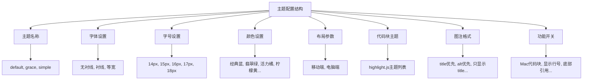
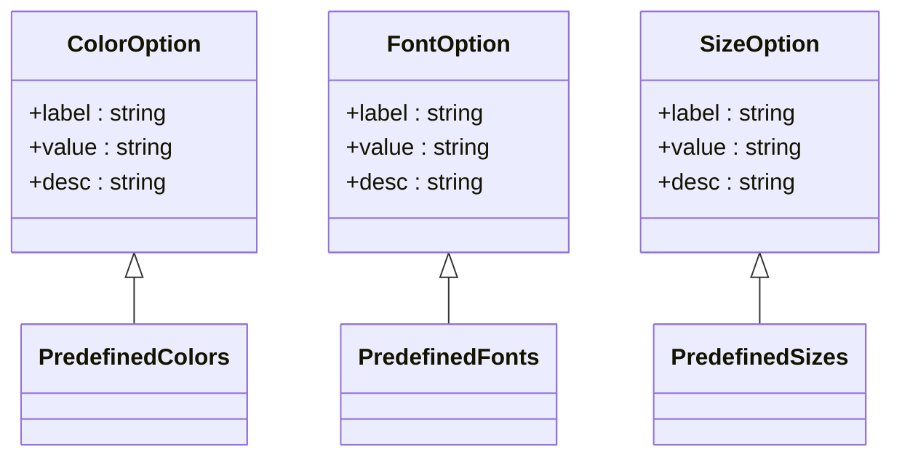
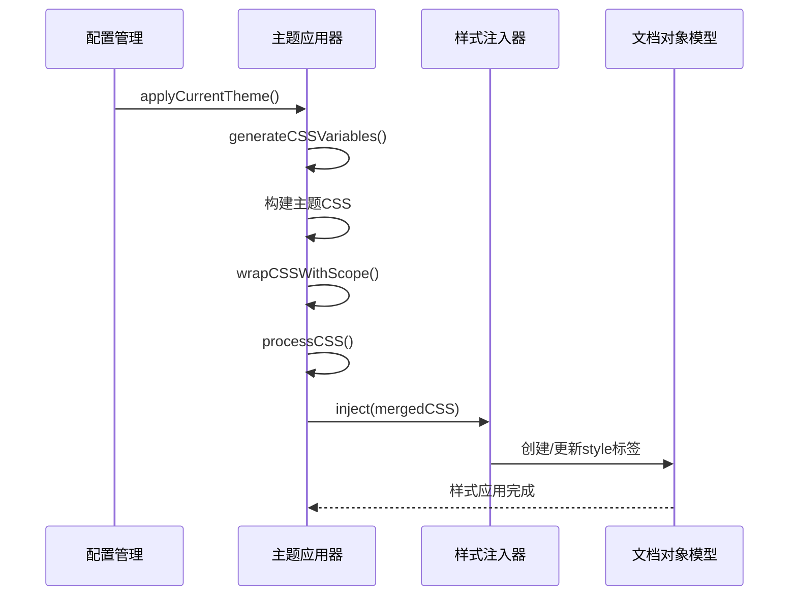
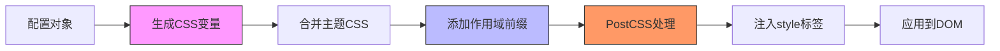

# 主题与样式配置

<cite>
**本文档中引用的文件**  
- [theme.ts](file://packages/shared/src/configs/theme.ts)
- [style.ts](file://packages/shared/src/configs/style.ts)
- [theme-css/index.ts](file://packages/shared/src/configs/theme-css/index.ts)
- [theme-css/default.css](file://packages/shared/src/configs/theme-css/default.css)
- [theme-css/grace.css](file://packages/shared/src/configs/theme-css/grace.css)
- [theme-css/simple.css](file://packages/shared/src/configs/theme-css/simple.css)
- [common.ts](file://packages/shared/src/types/common.ts)
- [cssVariables.ts](file://packages/core/src/theme/cssVariables.ts)
- [themeInjector.ts](file://packages/core/src/theme/themeInjector.ts)
- [themeApplicator.ts](file://packages/core/src/theme/themeApplicator.ts)
- [cssScopeWrapper.ts](file://packages/core/src/theme/cssScopeWrapper.ts)
- [selectorMapping.ts](file://packages/core/src/theme/selectorMapping.ts)
- [cssProcessor.ts](file://packages/core/src/theme/cssProcessor.ts)
- [theme.ts](file://apps/web/src/stores/theme.ts)
</cite>

## 目录
1. [简介](#简介)
2. [主题变量结构与配置选项](#主题变量结构与配置选项)
3. [颜色体系与字体设置](#颜色体系与字体设置)
4. [布局参数与预览宽度](#布局参数与预览宽度)
5. [CSS预设主题加载机制](#css预设主题加载机制)
6. [CSS变量联动机制](#css变量联动机制)
7. [自定义样式注入流程](#自定义样式注入流程)
8. [深色模式切换实现](#深色模式切换实现)
9. [性能优化建议](#性能优化建议)
10. [TypeScript接口与CSS类名映射](#typescript接口与css类名映射)

## 简介
本项目采用基于CSS变量和动态注入的主题系统，实现了灵活的样式配置与主题切换功能。系统通过分离基础样式、主题样式和用户自定义样式，结合CSS作用域包装和PostCSS处理，确保了样式的可维护性和性能表现。核心机制包括主题配置管理、CSS变量生成、样式注入与作用域隔离等。

**Section sources**
- [theme.ts](file://packages/shared/src/configs/theme.ts#L1-L42)
- [style.ts](file://packages/shared/src/configs/style.ts#L1-L244)

## 主题变量结构与配置选项

系统定义了完整的主题配置结构，包含主题名称、字体、字号、主色、代码块主题、图注格式等核心属性。默认配置通过`defaultStyleConfig`对象定义，确保应用启动时具有合理的初始样式状态。

主题配置采用模块化设计，各配置项分别定义在独立的选项数组中，便于维护和扩展。所有配置选项均遵循统一的`IConfigOption`接口，包含标签、值和描述三个基本属性。



**Diagram sources**
- [style.ts](file://packages/shared/src/configs/style.ts#L4-L243)
- [theme.ts](file://packages/shared/src/configs/theme.ts#L7-L41)

**Section sources**
- [style.ts](file://packages/shared/src/configs/style.ts#L232-L243)
- [theme.ts](file://packages/shared/src/configs/theme.ts#L7-L41)

## 颜色体系与字体设置

### 颜色配置体系
系统提供了12种预设颜色选项，涵盖经典蓝、翡翠绿、活力橘等多种视觉风格。每种颜色均配有中文标签和描述性说明，便于用户选择。颜色值以十六进制格式存储，可直接用于CSS变量赋值。

颜色配置不仅用于标题和强调文本，还作为主题主色影响整个文档的视觉一致性。通过CSS变量`--md-primary-color`实现全局颜色统一，确保修改主色后所有相关元素同步更新。

### 字体设置选项
字体配置包含三种主要类型：无衬线、衬线和等宽字体。每种字体类型对应一组跨平台的字体栈，确保在不同操作系统上都能获得良好的显示效果。

- **无衬线字体**：适用于现代简洁风格，包含苹果、谷歌、微软等主流系统的默认无衬线字体
- **衬线字体**：适用于传统印刷风格，包含Optima、Georgia等经典衬线字体
- **等宽字体**：专用于代码显示，包含Menlo、Monaco、Courier New等编程常用字体



**Diagram sources**
- [style.ts](file://packages/shared/src/configs/style.ts#L50-L106)
- [style.ts](file://packages/shared/src/configs/style.ts#L4-L20)

**Section sources**
- [style.ts](file://packages/shared/src/configs/style.ts#L50-L106)
- [style.ts](file://packages/shared/src/configs/style.ts#L4-L20)

## 布局参数与预览宽度

布局配置主要包含预览区域宽度设置，提供两种模式：

- **移动端模式**：固定宽度375px，模拟手机屏幕显示效果
- **电脑端模式**：自适应宽度，充分利用可用空间

宽度配置通过Tailwind CSS类名实现，`w-[375px]`和`w-full`分别对应两种模式。这种设计充分利用了现代CSS框架的能力，避免了传统CSS中复杂的媒体查询和响应式逻辑。

此外，系统还支持段落首行缩进和两端对齐两个排版选项，通过CSS变量和条件样式实现，满足不同用户的排版需求。

**Section sources**
- [style.ts](file://packages/shared/src/configs/style.ts#L108-L118)
- [cssVariables.ts](file://packages/core/src/theme/cssVariables.ts#L6-L12)

## CSS预设主题加载机制

系统提供了三种预设CSS主题：经典（default）、优雅（grace）和简洁（simple）。主题加载机制采用分层叠加策略，确保样式的可扩展性和向后兼容性。

### 主题加载流程
1. **基础样式层**：加载`base.css`，包含所有主题共用的基础样式规则
2. **默认主题层**：加载`default.css`，作为所有主题的基础样式
3. **特定主题层**：根据选择的主题加载对应的CSS文件（如`grace.css`）
4. **用户自定义层**：合并用户在CSS编辑器中输入的自定义样式

这种分层机制允许特定主题只定义与默认主题的差异部分，减少了重复代码，提高了维护效率。例如，优雅主题主要增强了阴影和圆角效果，而简洁主题则专注于极简设计。



**Diagram sources**
- [themeApplicator.ts](file://packages/core/src/theme/themeApplicator.ts#L24-L60)
- [themeInjector.ts](file://packages/core/src/theme/themeInjector.ts#L9-L42)

**Section sources**
- [theme-css/index.ts](file://packages/shared/src/configs/theme-css/index.ts#L6-L25)
- [themeApplicator.ts](file://packages/core/src/theme/themeApplicator.ts#L24-L60)

## CSS变量联动机制

系统采用CSS变量作为动态样式配置的核心机制，实现了配置与样式的解耦。主要CSS变量包括：

- `--md-primary-color`：主题主色，影响标题、边框、强调色等
- `--md-font-family`：字体族，控制全文本字体
- `--md-font-size`：基础字号，作为相对单位计算的基准

### 变量生成与应用
`generateCSSVariables`函数负责将配置对象转换为CSS变量声明。生成的变量作用于`:root`选择器，确保全局可用。同时，该函数还处理段落缩进和对齐等布局相关的CSS规则。

CSS变量的使用贯穿所有主题样式文件。例如，在`default.css`中，标题边框颜色通过`var(--md-primary-color)`引用，确保与配置的主色保持一致。这种机制使得样式修改无需重新编译CSS，只需更新变量值即可实时生效。

**Section sources**
- [cssVariables.ts](file://packages/core/src/theme/cssVariables.ts#L6-L34)
- [default.css](file://packages/shared/src/configs/theme-css/default.css#L1-L324)

## 自定义样式注入流程

### 样式注入器
`ThemeInjector`类负责管理动态样式注入，采用单例模式确保全局唯一实例。其核心功能包括：

- **inject(cssContent)**：注入或更新样式内容
- **remove()**：移除已注入的样式
- **isInjected()**：检查样式是否已注入

注入器创建一个具有特定ID的`<style>`标签并添加到`<head>`中，后续更新直接修改`textContent`属性，避免频繁的DOM操作。

### 样式处理管道
完整的样式处理流程包含多个阶段：

1. **变量生成**：基于配置生成CSS变量
2. **主题合并**：按层级合并基础样式、主题样式和自定义样式
3. **作用域包装**：使用`wrapCSSWithScope`限制样式作用范围
4. **CSS处理**：通过PostCSS处理`calc()`表达式和CSS变量
5. **最终注入**：将处理后的CSS注入到页面

作用域包装确保所有主题样式仅影响`#output`预览区域，避免污染全局样式。`cssScopeWrapper`通过正则表达式处理CSS规则，为每个选择器添加`#output`前缀。



**Diagram sources**
- [themeInjector.ts](file://packages/core/src/theme/themeInjector.ts#L9-L42)
- [cssScopeWrapper.ts](file://packages/core/src/theme/cssScopeWrapper.ts#L14-L59)
- [cssProcessor.ts](file://packages/core/src/theme/cssProcessor.ts#L19-L34)

**Section sources**
- [themeInjector.ts](file://packages/core/src/theme/themeInjector.ts#L9-L42)
- [cssScopeWrapper.ts](file://packages/core/src/theme/cssScopeWrapper.ts#L14-L59)
- [cssProcessor.ts](file://packages/core/src/theme/cssProcessor.ts#L19-L34)

## 深色模式切换实现

虽然当前配置中未直接提供深色模式选项，但系统架构支持通过自定义CSS实现深色主题。用户可以通过以下方式实现深色模式：

1. **修改主色**：选择深色系颜色作为主色
2. **自定义CSS**：在CSS编辑器中添加针对深色背景的样式规则
3. **代码块主题**：选择适合深色模式的highlight.js主题

系统通过`codeBlockThemeOptions`提供了多种深色代码块主题，如`a11y-dark`、`atom-one-dark`、`github-dark`等，可与深色文档主题搭配使用。

未来扩展可考虑添加专门的深色模式开关，通过JavaScript动态切换CSS变量值或加载不同的CSS主题文件。

**Section sources**
- [style.ts](file://packages/shared/src/configs/style.ts#L121-L202)
- [theme.ts](file://apps/web/src/stores/theme.ts#L25-L26)

## 性能优化建议

### 减少重绘策略
1. **批量样式更新**：通过单个`<style>`标签注入所有主题相关CSS，避免多次DOM操作
2. **CSS变量优化**：使用CSS变量而非内联样式，减少重排和重绘
3. **作用域隔离**：限制样式作用范围，避免不必要的样式计算

### 样式隔离策略
1. **选择器映射**：通过`SELECTOR_MAPPING`实现旧选择器到新类名的转换，确保向后兼容
2. **作用域前缀**：使用`#output`前缀隔离预览区域样式，防止全局污染
3. **@规则保护**：在作用域包装中跳过`@keyframes`、`@media`等规则，避免破坏响应式设计

### 其他优化措施
1. **PostCSS处理**：在运行时简化`calc()`表达式，提高渲染性能
2. **CSS压缩**：合并后的CSS经过PostCSS处理，减少文件大小
3. **条件渲染**：仅在配置变化时重新应用主题，避免不必要的处理

```mermaid
graph TD
A[性能优化] --> B[减少重绘]
A --> C[样式隔离]
A --> D[处理优化]
B --> B1[批量更新]
B --> B2[CSS变量]
B --> B3[减少DOM操作]
C --> C1[作用域前缀]
C --> C2[选择器映射]
C --> C3[@规则保护]
D --> D1[PostCSS处理]
D --> D2[calc()简化]
D --> D3[变量替换]
```

**Diagram sources**
- [cssScopeWrapper.ts](file://packages/core/src/theme/cssScopeWrapper.ts#L14-L59)
- [selectorMapping.ts](file://packages/core/src/theme/selectorMapping.ts#L11-L50)
- [cssProcessor.ts](file://packages/core/src/theme/cssProcessor.ts#L19-L34)

**Section sources**
- [cssScopeWrapper.ts](file://packages/core/src/theme/cssScopeWrapper.ts#L14-L59)
- [selectorMapping.ts](file://packages/core/src/theme/selectorMapping.ts#L11-L50)
- [cssProcessor.ts](file://packages/core/src/theme/cssProcessor.ts#L19-L34)

## TypeScript接口与CSS类名映射

### 核心接口定义
系统定义了多个TypeScript接口确保类型安全：

- `IConfigOption`：配置选项的通用接口
- `CSSVariableConfig`：CSS变量配置接口
- `ThemeConfig`：主题配置接口
- `AlertOptions`：警告块配置接口

这些接口在多个模块间共享，确保配置数据的一致性和可预测性。

### CSS类名映射
`SELECTOR_MAPPING`对象实现了旧有选择器到现代类名的映射转换，主要映射关系包括：

- **GFM警告块**：`blockquote_note` → `markdown-alert-note`
- **代码相关**：`code_pre` → `code-block`, `codespan` → `code-inline`
- **公式相关**：`inline_katex` → `katex-inline`
- **标记相关**：`markup_highlight` → `markup-highlight`

这种映射机制实现了向后兼容，允许旧的Markdown内容在新样式系统下正确渲染，同时推动使用更规范的类名约定。

**Section sources**
- [common.ts](file://packages/shared/src/types/common.ts#L16-L20)
- [cssVariables.ts](file://packages/core/src/theme/cssVariables.ts#L6-L12)
- [themeApplicator.ts](file://packages/core/src/theme/themeApplicator.ts#L14-L18)
- [selectorMapping.ts](file://packages/core/src/theme/selectorMapping.ts#L11-L50)