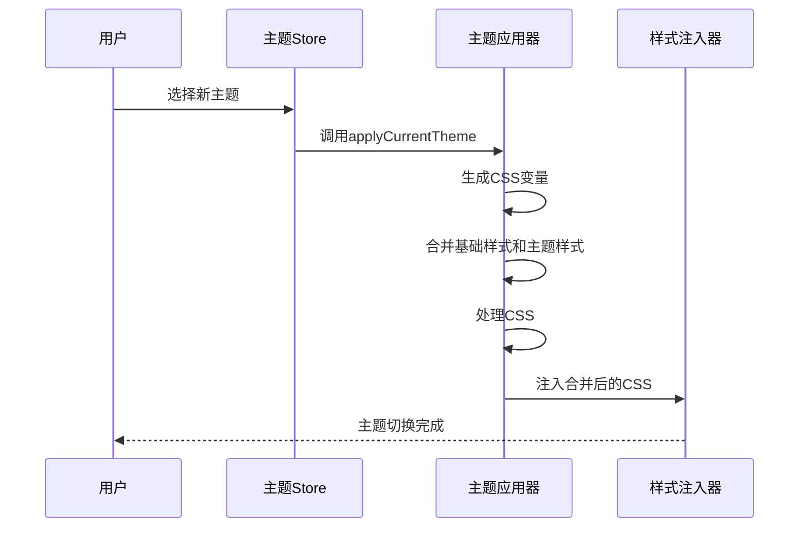
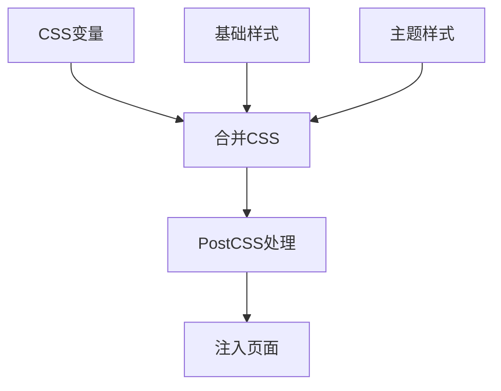
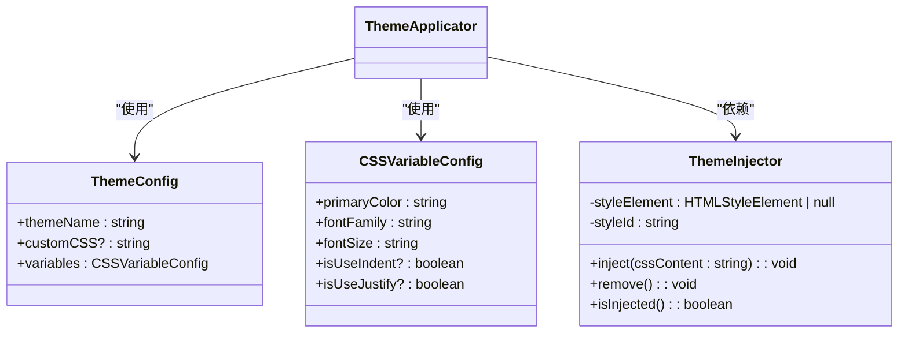

# 主题配置

<cite>
**本文档引用的文件**
- [theme.ts](file://apps/web/src/stores/theme.ts)
- [theme.ts](file://packages/shared/src/configs/theme.ts)
- [index.ts](file://packages/shared/src/configs/theme-css/index.ts)
- [default.css](file://packages/shared/src/configs/theme-css/default.css)
- [grace.css](file://packages/shared/src/configs/theme-css/grace.css)
- [simple.css](file://packages/shared/src/configs/theme-css/simple.css)
- [base.css](file://packages/shared/src/configs/theme-css/base.css)
- [themeApplicator.ts](file://packages/core/src/theme/themeApplicator.ts)
- [themeInjector.ts](file://packages/core/src/theme/themeInjector.ts)
- [cssVariables.ts](file://packages/core/src/theme/cssVariables.ts)
- [cssProcessor.ts](file://packages/core/src/theme/cssProcessor.ts)
- [cssScopeWrapper.ts](file://packages/core/src/theme/cssScopeWrapper.ts)
- [selectorMapping.ts](file://packages/core/src/theme/selectorMapping.ts)
</cite>

## 目录
1. [主题类型定义与选项映射](#主题类型定义与选项映射)
2. [预设主题设计理念与视觉特征](#预设主题设计理念与视觉特征)
3. [主题动态加载与切换机制](#主题动态加载与切换机制)
4. [基础样式与主题映射机制](#基础样式与主题映射机制)
5. [CSS字符串嵌入构建原理](#css字符串嵌入构建原理)
6. [TypeScript接口使用示例](#typescript接口使用示例)
7. [扩展新主题方法](#扩展新主题方法)
8. [主题切换性能优化建议](#主题切换性能优化建议)

## 主题类型定义与选项映射

主题系统通过TypeScript类型系统实现类型安全的主题管理。`ThemeName`类型通过`keyof typeof themeMap`从主题映射表中动态生成，确保主题名称的类型安全和自动更新。

`themeOptionsMap`对象定义了主题选项的完整映射关系，包含主题值、标签和描述信息。该映射表为用户界面提供主题选择的数据源，同时保持与底层主题实现的解耦。每个主题选项包含：
- **label**: 用户界面显示的中文名称
- **value**: 主题的唯一标识符，与CSS文件名对应
- **desc**: 主题作者信息（如适用）

这种设计实现了主题配置的集中化管理，便于维护和扩展。

**Section sources**
- [theme.ts](file://packages/shared/src/configs/theme.ts#L7-L42)
- [index.ts](file://packages/shared/src/configs/theme-css/index.ts#L25)

## 预设主题设计理念与视觉特征

系统提供了三种预设主题，每种主题都有独特的设计理念和视觉特征：

### 经典主题（default）
作为基础主题，采用微信公众号经典的排版风格：
- 标题使用表格显示实现居中效果
- 一级标题底部有彩色下划线
- 二级标题为彩色背景块
- 三级标题左侧有彩色边框
- 整体风格正式、稳重，适合专业内容发布

### 优雅主题（grace）
由@brzhang设计，强调优雅的视觉层次：
- 标题增加文字阴影和盒阴影效果
- 引用块采用斜体并添加阴影
- 图片添加圆角和阴影
- 表格整体添加阴影和圆角
- 整体风格现代、精致，适合设计类内容

### 简洁主题（simple）
由@okooo5km设计，追求极简主义：
- 标题采用柔和的阴影效果
- 三级标题具有独特的左右边框设计
- 引用块采用细线边框
- 图片添加细边框
- 整体风格干净、现代，适合技术文档

所有主题都遵循CSS变量规范，通过`var(--md-primary-color)`等变量实现主题色的统一管理。

**Section sources**
- [default.css](file://packages/shared/src/configs/theme-css/default.css#L1-L324)
- [grace.css](file://packages/shared/src/configs/theme-css/grace.css#L1-L137)
- [simple.css](file://packages/shared/src/configs/theme-css/simple.css#L1-L130)

## 主题动态加载与切换机制

主题切换通过JavaScript动态注入CSS样式实现，避免了页面重载。核心流程如下：

1. 用户选择新主题后，触发`applyCurrentTheme`方法
2. 从`themeMap`中获取对应主题的CSS字符串
3. 结合用户自定义CSS和运行时变量生成完整样式
4. 通过`ThemeInjector`单例注入到页面`<head>`中

`ThemeInjector`类采用单例模式，确保全局只有一个样式注入实例。它管理一个具有特定ID的`<style>`标签，实现样式的动态更新和移除。当应用新主题时，直接更新现有`<style>`标签的内容，避免重复创建DOM元素。

**Diagram sources**
- [theme.ts](file://apps/web/src/stores/theme.ts#L102-L125)
- [themeApplicator.ts](file://packages/core/src/theme/themeApplicator.ts#L24-L60)
- [themeInjector.ts](file://packages/core/src/theme/themeInjector.ts#L17-L24)

## 基础样式与主题映射机制

系统采用模块化的CSS架构，将样式分为三个层次：

### baseCSSContent基础样式
位于`base.css`文件中，定义了所有主题共享的基础样式：
- 容器的基本字体、字号和行高
- #output预览区域的样式继承
- 首个元素的margin-top重置

这些样式对所有主题全局生效，确保基本的排版一致性。

### themeMap主题映射
`themeMap`对象将主题名称映射到对应的CSS字符串：
- **default**: 基础主题样式，作为所有主题的起点
- **grace**: 优雅主题的CSS内容
- **simple**: 简洁主题的CSS内容

主题应用时采用"叠加"策略：以default主题为基础，根据选择的主题叠加特定样式。这种设计既保证了样式的一致性，又实现了主题间的差异化。

**Diagram sources**
- [base.css](file://packages/shared/src/configs/theme-css/base.css#L1-L27)
- [index.ts](file://packages/shared/src/configs/theme-css/index.ts#L19-L23)
- [themeApplicator.ts](file://packages/core/src/theme/themeApplicator.ts#L29-L37)

## CSS字符串嵌入构建原理

系统利用Vite的`?raw`导入功能，将CSS文件作为字符串嵌入JavaScript中。这种构建原理的关键在于：

### ?raw导入机制
在`index.ts`中，通过`import defaultCSS from './default.css?raw'`语法导入CSS文件。Vite在构建时会将CSS文件内容转换为字符串字面量，而不是传统的CSS模块。

### 构建时处理
这种导入方式在构建阶段完成，避免了运行时的网络请求。所有CSS主题在应用启动时就已经作为字符串存在于JavaScript包中，实现了：
- 零延迟的主题切换
- 离线可用性
- 简化的资源管理

### 类型安全
通过`as const`断言和`keyof`操作符，确保`themeMap`的键类型与`ThemeName`类型完全匹配，提供编译时的类型检查。

**Section sources**
- [index.ts](file://packages/shared/src/configs/theme-css/index.ts#L6-L26)

## TypeScript接口使用示例

主题系统提供了类型安全的API接口，使用示例如下：

**Diagram sources**
- [themeApplicator.ts](file://packages/core/src/theme/themeApplicator.ts#L14-L18)
- [cssVariables.ts](file://packages/core/src/theme/cssVariables.ts#L6-L12)
- [themeInjector.ts](file://packages/core/src/theme/themeInjector.ts#L9-L42)

## 扩展新主题方法

扩展新主题的步骤如下：

1. 在`packages/shared/src/configs/theme-css/`目录下创建新的CSS文件
2. 在`index.ts`的`themeMap`中添加新的主题映射
3. 在`theme.ts`的`themeOptionsMap`中添加主题选项
4. 在`themeOptions`数组中添加相应的配置项

新主题应遵循以下规范：
- 使用CSS变量`var(--md-primary-color)`作为主题色
- 避免使用ID选择器，优先使用类选择器
- 保持与基础样式的兼容性
- 通过叠加而非覆盖的方式修改样式

**Section sources**
- [index.ts](file://packages/shared/src/configs/theme-css/index.ts#L19-L23)
- [theme.ts](file://packages/shared/src/configs/theme.ts#L7-L23)

## 主题切换性能优化建议

为优化主题切换性能，建议采用以下策略：

### 预加载CSS字符串
由于CSS内容已通过`?raw`导入作为字符串存在于包中，主题切换时无需网络请求，实现了即时切换。

### 避免重复注入
`ThemeInjector`单例模式确保只有一个样式标签存在，更新主题时只需修改现有标签的内容，避免了DOM的重复创建和销毁。

### CSS处理优化
`processCSS`函数使用PostCSS在运行时处理CSS，包括：
- 替换CSS变量为实际值
- 简化calc()表达式
- 移除未使用的变量定义

这些优化减少了浏览器的计算负担，提升了渲染性能。

### 内存管理
`ThemeInjector`提供`remove()`方法，可在不需要主题样式时清理内存，适用于需要动态启用/禁用主题的场景。

**Section sources**
- [themeInjector.ts](file://packages/core/src/theme/themeInjector.ts#L17-L34)
- [cssProcessor.ts](file://packages/core/src/theme/cssProcessor.ts#L19-L35)