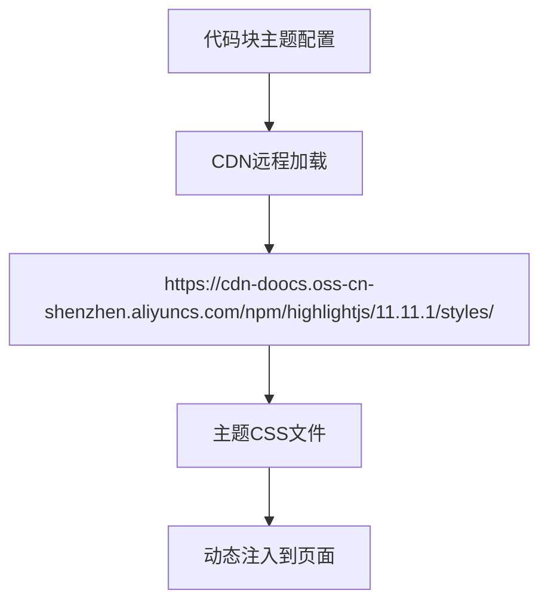
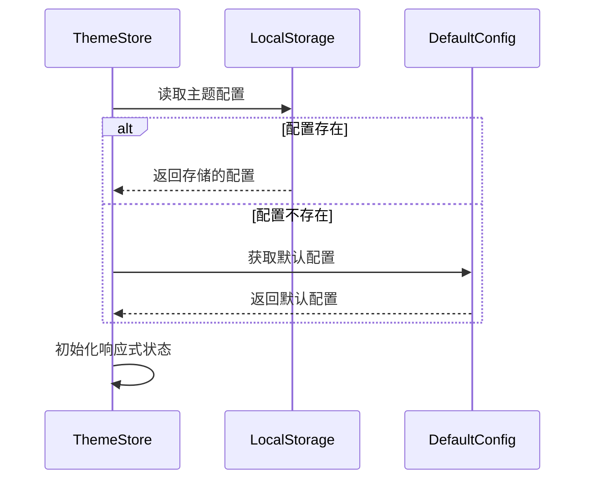
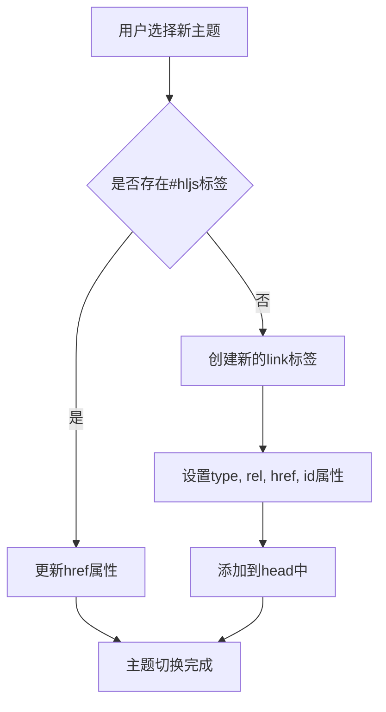
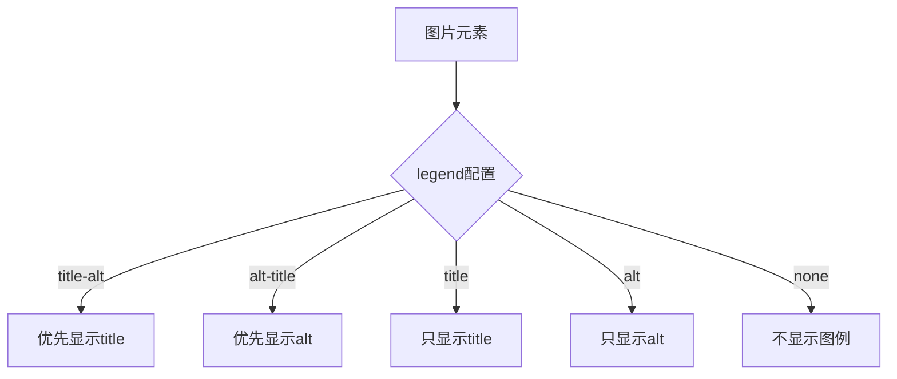
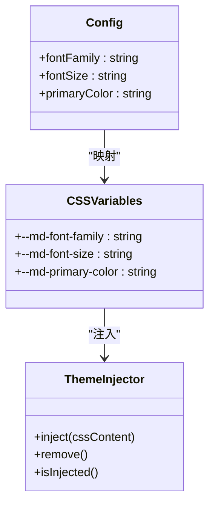
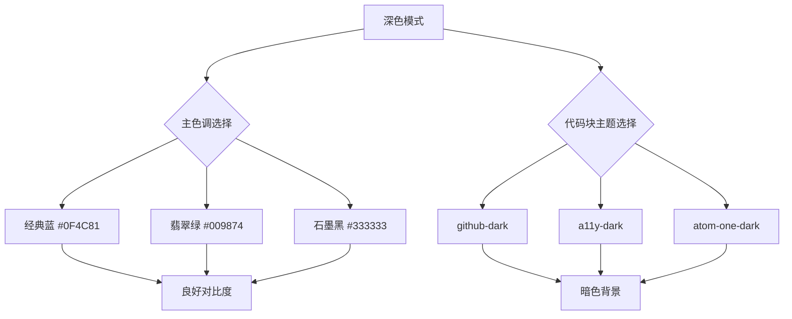
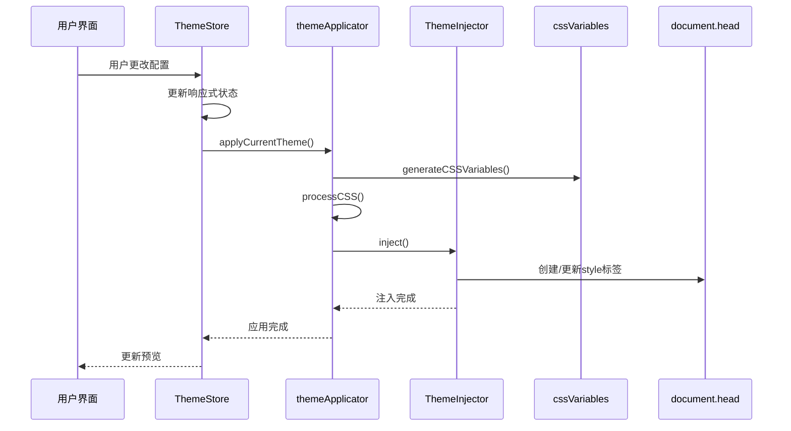

# 样式配置

<cite>
**本文档引用的文件**
- [style.ts](file://packages/shared/src/configs/style.ts)
- [base.css](file://packages/shared/src/configs/theme-css/base.css)
- [theme.ts](file://packages/shared/src/configs/theme.ts)
- [themeApplicator.ts](file://packages/core/src/theme/themeApplicator.ts)
- [themeInjector.ts](file://packages/core/src/theme/themeInjector.ts)
- [cssVariables.ts](file://packages/core/src/theme/cssVariables.ts)
- [theme.css](file://apps/web/src/stores/theme.ts)
</cite>

## 目录
1. [简介](#简介)
2. [核心样式配置项](#核心样式配置项)
3. [默认配置与初始化](#默认配置与初始化)
4. [代码块主题远程加载机制](#代码块主题远程加载机制)
5. [图例显示策略](#图例显示策略)
6. [CSS类名映射关系](#css类名映射关系)
7. [最佳实践](#最佳实践)
8. [配置应用流程](#配置应用流程)

## 简介
本项目提供了一套完整的样式配置系统，允许用户自定义字体、字号、颜色、布局等视觉元素。系统通过CSS变量和动态样式注入实现主题切换，支持本地主题和远程代码高亮主题。配置项集中管理在`style.ts`文件中，通过Pinia store进行状态管理，并在应用启动时注入到页面中。

## 核心样式配置项

### 字体族配置
提供了三种预设的字体族选项，每种都针对不同场景优化：

- **无衬线**: `-apple-system-font,BlinkMacSystemFont, Helvetica Neue, PingFang SC, Hiragino Sans GB , Microsoft YaHei UI , Microsoft YaHei ,Arial,sans-serif`
- **衬线**: `Optima-Regular, Optima, PingFangSC-light, PingFangTC-light, 'PingFang SC', Cambria, Cochin, Georgia, Times, 'Times New Roman', serif`
- **等宽**: `Menlo, Monaco, 'Courier New', monospace`

**Section sources**
- [style.ts](file://packages/shared/src/configs/style.ts#L4-L19)

### 字号配置
提供五种字号选项，从更小到更大，满足不同阅读需求：

- 14px (更小)
- 15px (稍小)
- 16px (推荐)
- 17px (稍大)
- 18px (更大)

**Section sources**
- [style.ts](file://packages/shared/src/configs/style.ts#L22-L47)

### 主色调配置
提供11种主色调选项，每种都有独特的视觉感受和描述：

- 经典蓝 (#0F4C81) - 稳重冷静
- 翡翠绿 (#009874) - 自然平衡
- 活力橘 (#FA5151) - 热情活力
- 柠檬黄 (#FECE00) - 明亮温暖
- 薰衣紫 (#92617E) - 优雅神秘
- 天空蓝 (#55C9EA) - 清爽自由
- 玫瑰金 (#B76E79) - 奢华现代
- 橄榄绿 (#556B2F) - 沉稳自然
- 石墨黑 (#333333) - 内敛极简
- 雾烟灰 (#A9A9A9) - 柔和低调
- 樱花粉 (#FFB7C5) - 浪漫甜美

**Section sources**
- [style.ts](file://packages/shared/src/configs/style.ts#L50-L106)

### 布局宽度配置
提供两种布局宽度选项，适应不同设备：

- 移动端: `w-[375px]` (固定)
- 电脑端: `w-full` (适应)

**Section sources**
- [style.ts](file://packages/shared/src/configs/style.ts#L108-L118)

### 代码块主题配置
基于Highlight.js提供49种代码高亮主题，通过CDN远程加载：



**Diagram sources**
- [style.ts](file://packages/shared/src/configs/style.ts#L121-L202)

**Section sources**
- [style.ts](file://packages/shared/src/configs/style.ts#L121-L202)

## 默认配置与初始化

### 默认配置定义
`defaultStyleConfig`对象定义了应用启动时的默认样式配置：

```typescript
export const defaultStyleConfig = {
  isCiteStatus: false,
  isMacCodeBlock: true,
  isShowLineNumber: false,
  isCountStatus: false,
  theme: themeOptions[0].value,
  fontFamily: fontFamilyOptions[0].value,
  fontSize: fontSizeOptions[2].value,
  primaryColor: colorOptions[0].value,
  codeBlockTheme: codeBlockThemeOptions[23].value,
  legend: legendOptions[3].value,
}
```

**Section sources**
- [style.ts](file://packages/shared/src/configs/style.ts#L232-L243)

### 初始化流程
应用启动时，`useThemeStore`从本地存储中读取配置，若无则使用默认配置：



**Diagram sources**
- [theme.ts](file://apps/web/src/stores/theme.ts#L13-L28)

**Section sources**
- [theme.ts](file://apps/web/src/stores/theme.ts#L13-L28)

## 代码块主题远程加载机制

### CDN加载实现
代码块主题通过CDN远程加载，避免将所有主题打包到应用中：

```typescript
const codeBlockUrlPrefix = `https://cdn-doocs.oss-cn-shenzhen.aliyuncs.com/npm/highlightjs/11.11.1/styles/`
export const codeBlockThemeOptions: IConfigOption[] = codeBlockThemeList.map(codeBlockTheme => ({
  label: codeBlockTheme,
  value: `${codeBlockUrlPrefix}${codeBlockTheme}.min.css`,
  desc: ``,
}))
```

**Section sources**
- [style.ts](file://packages/shared/src/configs/style.ts#L121-L202)

### 动态注入流程
当用户切换代码块主题时，系统动态创建或更新link标签：



**Diagram sources**
- [theme.ts](file://apps/web/src/stores/theme.ts#L81-L96)

**Section sources**
- [theme.ts](file://apps/web/src/stores/theme.ts#L81-L96)

## 图例显示策略

### 图例选项
提供五种图例显示策略，控制图片alt和title属性的渲染方式：

- title 优先: 优先显示title，无title时显示alt
- alt 优先: 优先显示alt，无alt时显示title
- 只显示 title: 仅显示title属性
- 只显示 alt: 仅显示alt属性
- 不显示: 不显示任何图例

**Section sources**
- [style.ts](file://packages/shared/src/configs/style.ts#L204-L229)

### 渲染影响
图例策略通过`legend`参数传递给渲染器，影响图片的alt/title渲染：



**Diagram sources**
- [common.ts](file://packages/shared/src/types/common.ts#L8-L14)

## CSS类名映射关系

### 基础样式规则
`base.css`定义了所有元素的基础样式和CSS变量：

```css
section, container {
  font-family: var(--md-font-family);
  font-size: var(--md-font-size);
  line-height: 1.75;
  text-align: left;
}

#output {
  font-family: var(--md-font-family);
  font-size: var(--md-font-size);
  line-height: 1.75;
  text-align: left;
}
```

**Section sources**
- [base.css](file://packages/shared/src/configs/theme-css/base.css#L6-L21)

### CSS变量映射
配置项与CSS变量的映射关系：



**Diagram sources**
- [cssVariables.ts](file://packages/core/src/theme/cssVariables.ts#L6-L34)
- [themeInjector.ts](file://packages/core/src/theme/themeInjector.ts#L9-L42)

**Section sources**
- [cssVariables.ts](file://packages/core/src/theme/cssVariables.ts#L6-L34)

## 最佳实践

### 深色模式配色方案
在深色模式下，建议选择对比度适中的主色调和代码块主题：



**Diagram sources**
- [style.ts](file://packages/shared/src/configs/style.ts#L50-L106)
- [style.ts](file://packages/shared/src/configs/style.ts#L123-L196)

### 代码块主题协同设置
根据整体风格选择协调的代码块主题：

- **经典风格**: `github`, `default`, `vs`
- **现代风格**: `atom-one-light`, `vs2015`, `xcode`
- **暗色风格**: `github-dark`, `a11y-dark`, `atom-one-dark`
- **创意风格**: `shades-of-purple`, `tokyo-night-dark`, `nord`

**Section sources**
- [style.ts](file://packages/shared/src/configs/style.ts#L123-L196)

## 配置应用流程

### 主题应用流程
完整的主题配置应用流程：



**Diagram sources**
- [theme.ts](file://apps/web/src/stores/theme.ts#L102-L121)
- [themeApplicator.ts](file://packages/core/src/theme/themeApplicator.ts#L24-L43)
- [themeInjector.ts](file://packages/core/src/theme/themeInjector.ts#L17-L23)

**Section sources**
- [theme.ts](file://apps/web/src/stores/theme.ts#L102-L121)
- [themeApplicator.ts](file://packages/core/src/theme/themeApplicator.ts#L24-L43)