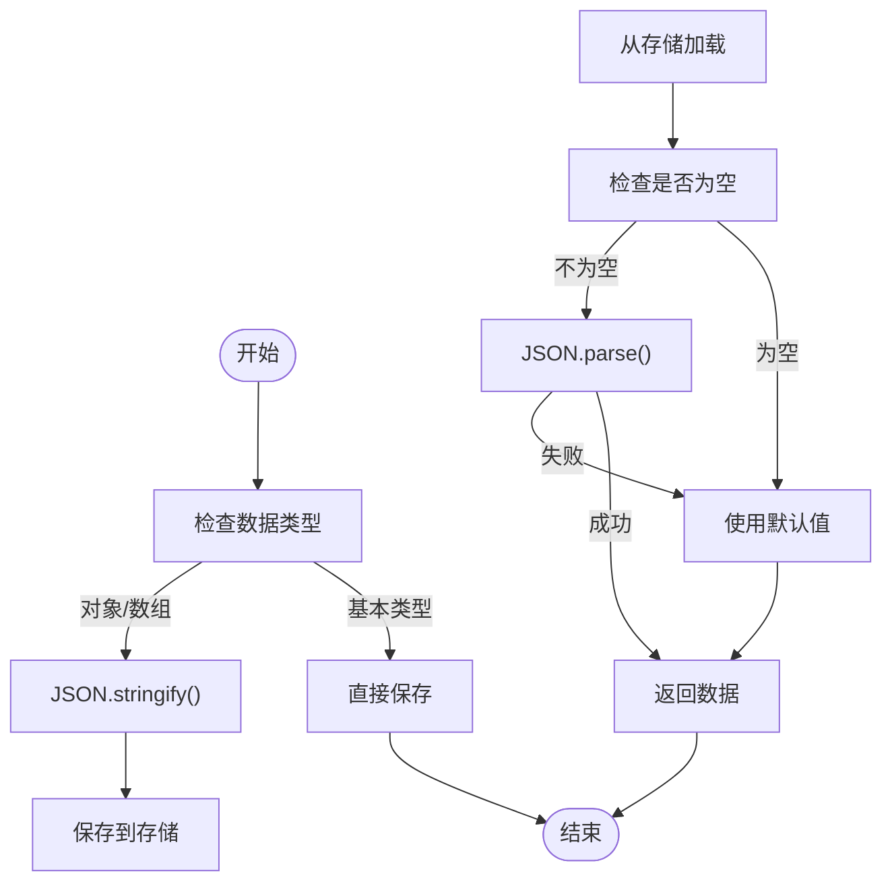

# 存储配置

<cite>
**本文档引用的文件**  
- [store.ts](file://packages/shared/src/configs/store.ts#L1-L35)
- [storage.ts](file://apps/web/src/utils/storage.ts#L1-L362)
- [ui.ts](file://apps/web/src/stores/ui.ts#L1-L146)
- [theme.ts](file://apps/web/src/stores/theme.ts#L1-L156)
- [post.ts](file://apps/web/src/stores/post.ts#L1-L187)
- [cssEditor.ts](file://apps/web/src/stores/cssEditor.ts#L1-L218)
- [render.ts](file://apps/web/src/stores/render.ts#L1-L110)
- [style.ts](file://packages/shared/src/configs/style.ts#L1-L244)
- [theme.ts](file://packages/shared/src/configs/theme.ts#L1-L42)
- [preload.js](file://apps/utools/preload.js#L1-L60)
</cite>

## 目录
1. [简介](#简介)
2. [持久化存储结构](#持久化存储结构)
3. [字段详解](#字段详解)
4. [数据序列化与反序列化](#数据序列化与反序列化)
5. [Pinia Store 集成](#pinia-store-集成)
6. [跨平台兼容性处理](#跨平台兼容性处理)
7. [使用示例](#使用示例)
8. [错误处理与默认值回退](#错误处理与默认值回退)
9. [结论](#结论)

## 简介
本项目实现了一套完整的持久化存储系统，用于管理用户偏好设置、编辑器状态、主题配置等关键应用状态。该系统基于 TypeScript 和 Pinia 构建，支持 Web、VS Code 和 uTools 三大平台，具备良好的可扩展性和健壮性。通过统一的存储抽象层，实现了本地存储和远程存储的无缝切换，同时确保了数据在不同环境下的兼容性和一致性。

**Section sources**
- [store.ts](file://packages/shared/src/configs/store.ts#L1-L35)
- [storage.ts](file://apps/web/src/utils/storage.ts#L1-L362)

## 持久化存储结构
系统的核心存储结构定义在 `store.ts` 文件中，通过 `storeLabels` 常量对象统一管理所有可持久化状态的键名和中文标签。这些状态被组织为多个逻辑分组，包括主状态、显示状态等，涵盖了从用户界面偏好到内容管理的各个方面。

存储系统采用分层架构设计，上层是基于 Pinia 的响应式状态管理，底层是统一的异步存储引擎。这种设计既保证了状态管理的响应式特性，又提供了灵活的存储后端支持。


**Diagram sources**
- [store.ts](file://packages/shared/src/configs/store.ts#L1-L35)
- [storage.ts](file://apps/web/src/utils/storage.ts#L1-L362)

**Section sources**
- [store.ts](file://packages/shared/src/configs/store.ts#L1-L35)
- [storage.ts](file://apps/web/src/utils/storage.ts#L1-L362)

## 字段详解
持久化存储中的每个字段都有明确的含义、数据类型和应用场景。以下是对主要字段的详细解释：

### 用户界面设置
- **isDark**: 布尔值，表示是否启用深色模式
- **isEditOnLeft**: 布尔值，表示编辑器是否在左侧显示
- **isOpenRightSlider**: 布尔值，表示是否开启右侧滑块
- **isOpenPostSlider**: 布尔值，表示是否开启文章列表滑块
- **showAIToolbox**: 布尔值，表示AI工具箱的显示状态

### 主题与样式配置
- **theme**: 字符串，表示当前使用的主题名称
- **fontFamily**: 字符串，表示文本字体
- **fontSize**: 字符串，表示文本大小
- **primaryColor**: 字符串，表示自定义主题色
- **codeBlockTheme**: 字符串，表示代码块主题的CSS URL
- **legend**: 字符串，表示图注格式选项

### 编辑器状态
- **isMacCodeBlock**: 布尔值，表示是否使用Mac风格代码块
- **isShowLineNumber**: 布尔值，表示是否显示代码块行号
- **isCiteStatus**: 布尔值，表示微信外链接底部引用状态
- **isCountStatus**: 布尔值，表示字数统计状态
- **isUseIndent**: 布尔值，表示是否使用段落首行缩进
- **isUseJustify**: 布尔值，表示是否使用两端对齐

### 内容管理
- **currentPostId**: 字符串，表示当前文章的唯一标识符
- **currentPostIndex**: 计算属性，表示当前文章在列表中的索引
- **posts**: 数组，存储所有文章的内容和元数据
- **cssContentConfig**: 对象，包含自定义CSS方案的配置信息

### 显示控制
- **isShowCssEditor**: 布尔值，控制CSS编辑器对话框的显示
- **isShowInsertFormDialog**: 布尔值，控制插入表单对话框的显示
- **isShowInsertMpCardDialog**: 布尔值，控制插入公众号名片对话框的显示
- **aiDialogVisible**: 布尔值，控制AI对话框的可见性

**Section sources**
- [store.ts](file://packages/shared/src/configs/store.ts#L1-L35)
- [ui.ts](file://apps/web/src/stores/ui.ts#L1-L146)
- [theme.ts](file://apps/web/src/stores/theme.ts#L1-L156)
- [post.ts](file://apps/web/src/stores/post.ts#L1-L187)
- [cssEditor.ts](file://apps/web/src/stores/cssEditor.ts#L1-L218)

## 数据序列化与反序列化
存储系统提供了完整的数据序列化与反序列化机制，确保复杂数据结构能够正确地在内存和持久化存储之间转换。

### 序列化过程
当数据需要保存到存储时，系统会自动将JavaScript对象转换为JSON字符串：
- 基本类型（字符串、数字、布尔值）直接存储
- 对象和数组通过 `JSON.stringify()` 方法序列化
- 特殊数据结构（如日期对象）在序列化时转换为字符串格式

### 反序列化过程
从存储读取数据时，系统会执行反序列化操作：
- JSON字符串通过 `JSON.parse()` 方法转换为JavaScript对象
- 提供默认值参数，当存储中无数据或解析失败时使用默认值
- 包含错误处理机制，防止无效JSON导致应用崩溃



**Diagram sources**
- [storage.ts](file://apps/web/src/utils/storage.ts#L189-L204)
- [storage.ts](file://apps/web/src/utils/storage.ts#L209-L218)

**Section sources**
- [storage.ts](file://apps/web/src/utils/storage.ts#L189-L218)

## Pinia Store 集成
持久化存储系统与 Pinia 状态管理库深度集成，实现了响应式状态的自动持久化。

### 集成机制
每个 Pinia Store 通过注入的 `store` 实例创建持久化状态：
- 使用 `store.reactive()` 方法创建响应式且持久化的引用
- 初始值从存储中读取，确保页面刷新后状态恢复
- 状态变化时自动保存到存储，无需手动调用保存方法

### 具体实现
以 `ui.ts` 中的UI Store为例：
- `isEditOnLeft` 状态通过 `store.reactive('isEditOnLeft', true)` 创建
- `isOpenRightSlider` 状态使用带前缀的键名 `addPrefix('is_open_right_slider')`
- 所有状态变化都会触发自动保存，确保数据一致性


**Diagram sources**
- [storage.ts](file://apps/web/src/utils/storage.ts#L155-L362)
- [ui.ts](file://apps/web/src/stores/ui.ts#L1-L146)

**Section sources**
- [storage.ts](file://apps/web/src/utils/storage.ts#L155-L362)
- [ui.ts](file://apps/web/src/stores/ui.ts#L1-L146)
- [theme.ts](file://apps/web/src/stores/theme.ts#L1-L156)

## 跨平台兼容性处理
系统设计充分考虑了在不同平台（Web、VS Code、uTools）间的兼容性问题。

### 平台检测
通过全局变量标识当前运行环境：
- Web平台：标准浏览器环境
- uTools平台：通过 `window.__MD_UTOOLS__` 标识
- VS Code平台：通过特定的扩展API检测

### 存储适配
不同平台可能使用不同的存储机制：
- Web平台：使用 `localStorage`
- uTools平台：可能使用插件专用存储
- VS Code平台：使用扩展上下文存储

### 兼容性策略
- 统一的存储接口抽象，屏蔽底层差异
- 键名前缀处理，避免不同平台间的命名冲突
- 异常处理机制，确保在不支持的存储环境下优雅降级


**Diagram sources**
- [preload.js](file://apps/utools/preload.js#L1-L60)
- [storage.ts](file://apps/web/src/utils/storage.ts#L24-L149)

**Section sources**
- [preload.js](file://apps/utools/preload.js#L1-L60)
- [storage.ts](file://apps/web/src/utils/storage.ts#L24-L149)

## 使用示例
以下是持久化存储系统的典型使用场景和代码示例。

### 读取配置值
```typescript
// 从UI Store读取深色模式状态
const uiStore = useUIStore()
console.log(uiStore.isDark) // 直接访问响应式状态

// 从Theme Store读取当前主题
const themeStore = useThemeStore()
console.log(themeStore.theme) // 获取当前主题名称
```

### 写入配置值
```typescript
// 切换深色模式
uiStore.toggleDark()

// 更改字体大小
themeStore.fontSize = '18px'

// 添加新的CSS方案
const cssEditorStore = useCssEditorStore()
cssEditorStore.addCssContentTab('自定义方案', '/* CSS内容 */')
```

### 状态持久化验证
```typescript
// 验证状态是否正确持久化
const postStore = usePostStore()
console.log('当前文章ID:', postStore.currentPostId)
// 刷新页面后，该值应保持不变
```

**Section sources**
- [ui.ts](file://apps/web/src/stores/ui.ts#L1-L146)
- [theme.ts](file://apps/web/src/stores/theme.ts#L1-L156)
- [post.ts](file://apps/web/src/stores/post.ts#L1-L187)

## 错误处理与默认值回退
系统内置了完善的错误处理和默认值回退机制，确保在异常情况下仍能正常运行。

### 错误处理
- 存储读取失败时返回 `null` 而非抛出异常
- JSON解析失败时记录警告日志并返回默认值
- 存储写入失败时记录错误日志但不影响应用流程

### 默认值回退
- 每个持久化状态都有明确的默认值
- 当存储中无数据时使用默认值初始化
- 默认值定义在 `defaultStyleConfig` 中，确保一致性

### 异常恢复
- 提供重置功能，可恢复所有配置到默认状态
- 迁移机制，处理配置结构变更时的数据兼容
- 备份与导入功能，防止数据丢失


**Diagram sources**
- [storage.ts](file://apps/web/src/utils/storage.ts#L191-L204)
- [style.ts](file://packages/shared/src/configs/style.ts#L232-L243)

**Section sources**
- [storage.ts](file://apps/web/src/utils/storage.ts#L191-L204)
- [style.ts](file://packages/shared/src/configs/style.ts#L232-L243)

## 结论
本项目的持久化存储系统设计合理、功能完整，成功实现了用户偏好设置、编辑器状态和主题配置的持久化管理。通过统一的存储抽象层和Pinia的深度集成，系统既保证了状态管理的响应式特性，又提供了良好的跨平台兼容性。完善的错误处理和默认值回退机制确保了系统的健壮性，为用户提供了一致且可靠的应用体验。