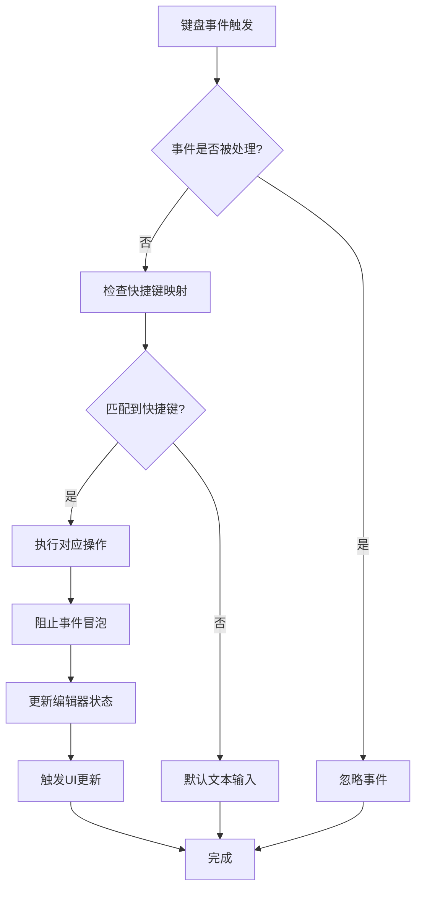
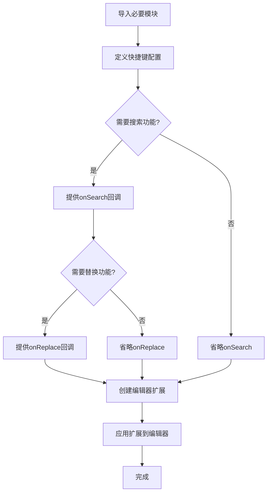

# 快捷键配置

<cite>
**本文档引用的文件**
- [shortcut-key.ts](file://packages/shared/src/configs/shortcut-key.ts)
- [markdown.ts](file://packages/shared/src/editor/markdown.ts)
- [format.ts](file://packages/shared/src/editor/format.ts)
- [FormatDropdown.vue](file://apps/web/src/components/editor/editor-header/FormatDropdown.vue)
- [EditDropdown.vue](file://apps/web/src/components/editor/editor-header/EditDropdown.vue)
- [CodemirrorEditor.vue](file://apps/web/src/views/CodemirrorEditor.vue)
- [@codemirror/view@6.38.8.patch](file://patches/@codemirror__view@6.38.8.patch)
</cite>

## 目录
1. [快捷键映射机制](#快捷键映射机制)
2. [预设快捷键组合](#预设快捷键组合)
3. [平台适配逻辑](#平台适配逻辑)
4. [快捷键扩展与覆盖](#快捷键扩展与覆盖)
5. [Vue组件中的快捷键绑定](#vue组件中的快捷键绑定)
6. [键盘事件处理流程](#键盘事件处理流程)
7. [自定义快捷键示例](#自定义快捷键示例)
8. [无障碍访问兼容性](#无障碍访问兼容性)

## 快捷键映射机制

快捷键映射机制基于CodeMirror编辑器的keymap系统实现，通过`markdownKeymap`函数定义了一组针对Markdown编辑的快捷键。该机制利用CodeMirror的`keymap.of`方法创建快捷键映射数组，并通过`Prec.high`确保自定义快捷键的优先级高于默认快捷键。快捷键的执行逻辑与编辑器功能模块紧密耦合，每个快捷键绑定到特定的格式化函数，如加粗、斜体、标题等。

**Section sources**
- [markdown.ts](file://packages/shared/src/editor/markdown.ts#L47-L87)
- [format.ts](file://packages/shared/src/editor/format.ts#L14-L46)

## 预设快捷键组合

系统预设了完整的快捷键组合，覆盖了常见的编辑操作：

- **文本格式化**：
  - 加粗：Ctrl+B / ⌘B
  - 斜体：Ctrl+I / ⌘I
  - 删除线：Ctrl+D / ⌘D
  - 超链接：Ctrl+K / ⌘K
  - 行内代码：Ctrl+E / ⌘E

- **标题设置**：
  - 标题1：Ctrl+1 / ⌘1
  - 标题2：Ctrl+2 / ⌘2
  - 标题3：Ctrl+3 / ⌘3
  - 标题4：Ctrl+4 / ⌘4
  - 标题5：Ctrl+5 / ⌘5
  - 标题6：Ctrl+6 / ⌘6

- **列表操作**：
  - 无序列表：Ctrl+U / ⌘U
  - 有序列表：Ctrl+O / ⌘O

- **编辑操作**：
  - 撤销：Ctrl+Z / ⌘Z
  - 重做：Ctrl+Y / ⌘Y
  - 搜索：Ctrl+F / ⌘F
  - 替换：Ctrl+H / ⌘H
  - 格式化：Shift+Alt+F

- **其他操作**：
  - 插入缩进：Tab
  - 阻止搜索：Ctrl+G / ⌘G

**Section sources**
- [markdown.ts](file://packages/shared/src/editor/markdown.ts#L50-L85)
- [FormatDropdown.vue](file://apps/web/src/components/editor/editor-header/FormatDropdown.vue#L122-L396)
- [EditDropdown.vue](file://apps/web/src/components/editor/editor-header/EditDropdown.vue#L118-L145)

## 平台适配逻辑

系统通过`shortcut-key.ts`文件实现了跨平台的快捷键适配逻辑。核心机制是检测用户代理字符串中的"Mac"标识来判断操作系统类型，并据此调整快捷键的显示符号和底层键值。

在Windows/Linux系统上，`ctrlKey`被映射为"Ctrl"，显示符号为"Ctrl"；而在macOS系统上，`ctrlKey`被映射为"Mod"（CodeMirror的修饰键），显示符号为"⌘"。同样的适配逻辑也应用于Alt键（"⌥"）和Shift键（"⇧"）。这种设计确保了快捷键在不同操作系统上的语义一致性，同时保持了用户界面的本地化体验。

**Section sources**
- [shortcut-key.ts](file://packages/shared/src/configs/shortcut-key.ts#L1-L9)
- [FormatDropdown.vue](file://apps/web/src/components/editor/editor-header/FormatDropdown.vue#L3-L4)

## 快捷键扩展与覆盖

系统提供了灵活的快捷键扩展与覆盖机制。通过`markdownSetup`函数的`options`参数，可以动态添加或修改快捷键行为。例如，搜索和替换功能通过可选的`onSearch`和`onReplace`回调实现，允许调用者自定义这些操作的具体实现。

要扩展快捷键，可以在调用`markdownSetup`时提供相应的回调函数。要覆盖默认快捷键，可以通过创建新的keymap扩展并使用`Prec.high`或`Prec.low`控制优先级来实现。这种设计模式允许在不修改核心代码的情况下，通过配置方式调整快捷键行为，满足不同用户的个性化需求。

**Section sources**
- [markdown.ts](file://packages/shared/src/editor/markdown.ts#L47-L132)
- [CodemirrorEditor.vue](file://apps/web/src/views/CodemirrorEditor.vue#L501-L504)

## Vue组件中的快捷键绑定

在Vue组件中，快捷键事件通过多种方式动态绑定。`FormatDropdown.vue`组件展示了典型的菜单项快捷键绑定模式，使用`@click`事件处理器调用`addFormat`函数，并传入快捷键字符串。`EditDropdown.vue`组件则直接调用编辑器的撤销和重做功能。

`CodemirrorEditor.vue`组件展示了更复杂的全局快捷键处理，通过`handleGlobalKeydown`函数监听文档级别的键盘事件，特别是处理ESC键关闭搜索面板的场景。这种分层的快捷键绑定策略既保证了编辑器核心功能的快捷键响应，又支持了UI组件的特定快捷键需求。

**Section sources**
- [FormatDropdown.vue](file://apps/web/src/components/editor/editor-header/FormatDropdown.vue#L75-L121)
- [EditDropdown.vue](file://apps/web/src/components/editor/editor-header/EditDropdown.vue#L58-L84)
- [CodemirrorEditor.vue](file://apps/web/src/views/CodemirrorEditor.vue#L276-L285)

## 键盘事件处理流程

**Diagram sources**
- [markdown.ts](file://packages/shared/src/editor/markdown.ts#L50-L87)
- [CodemirrorEditor.vue](file://apps/web/src/views/CodemirrorEditor.vue#L276-L285)

**Section sources**
- [markdown.ts](file://packages/shared/src/editor/markdown.ts#L47-L87)
- [CodemirrorEditor.vue](file://apps/web/src/views/CodemirrorEditor.vue#L276-L285)

## 自定义快捷键示例

**Diagram sources**
- [markdown.ts](file://packages/shared/src/editor/markdown.ts#L99-L132)
- [CodemirrorEditor.vue](file://apps/web/src/views/CodemirrorEditor.vue#L501-L504)

**Section sources**
- [markdown.ts](file://packages/shared/src/editor/markdown.ts#L99-L132)
- [CodemirrorEditor.vue](file://apps/web/src/views/CodemirrorEditor.vue#L501-L504)

## 无障碍访问兼容性

系统在无障碍访问兼容性方面采取了多项措施。首先，所有快捷键在UI界面上都有清晰的视觉标识，使用`MenubarShortcut`组件显示快捷键组合，包括适当的键盘符号。其次，通过`kbd`元素标记快捷键显示，为屏幕阅读器提供语义化信息。

在`@codemirror/view@6.38.8.patch`补丁中，修改了macOS平台的快捷键检测逻辑，特别处理了Alt+Shift组合，确保这些快捷键不会被误识别为特殊字符输入。这种改进增强了键盘导航的可靠性，使依赖键盘操作的用户能够更稳定地使用快捷键功能。此外，UI组件如`Label.vue`使用了适当的ARIA属性，进一步提升了整体的无障碍访问体验。

**Section sources**
- [shortcut-key.ts](file://packages/shared/src/configs/shortcut-key.ts#L7-L9)
- [FormatDropdown.vue](file://apps/web/src/components/editor/editor-header/FormatDropdown.vue#L186-L212)
- [@codemirror/view@6.38.8.patch](file://patches/@codemirror__view@6.38.8.patch#L23-L24)
- [Label.vue](file://apps/web/src/components/ui/label/Label.vue#L1-L28)