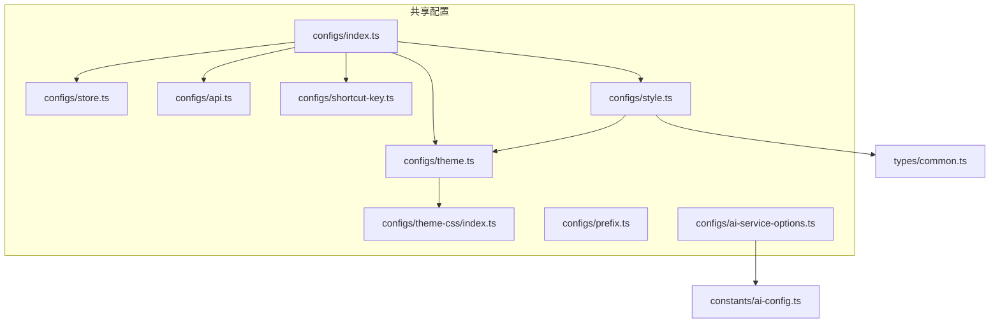
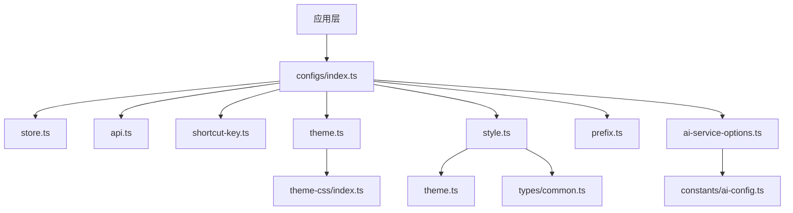
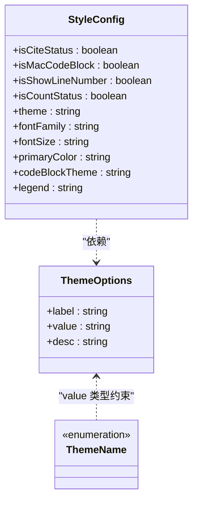
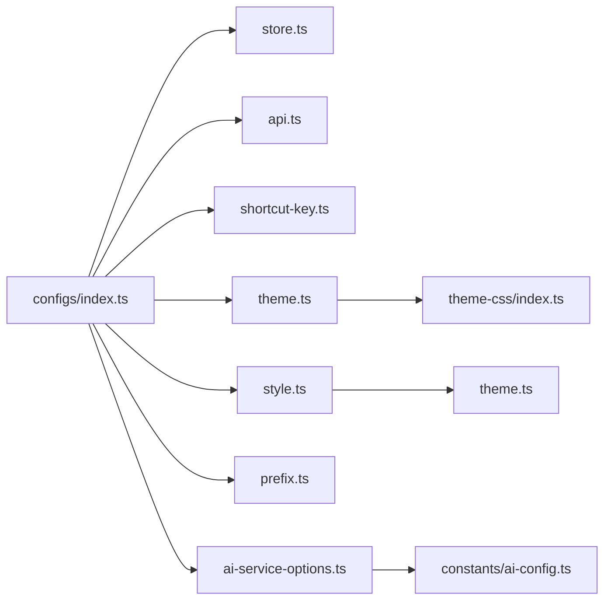

# 运行时配置

<cite>
**本文引用的文件**
- [packages/shared/src/configs/index.ts](file://packages/shared/src/configs/index.ts)
- [packages/shared/src/configs/store.ts](file://packages/shared/src/configs/store.ts)
- [packages/shared/src/configs/api.ts](file://packages/shared/src/configs/api.ts)
- [packages/shared/src/configs/shortcut-key.ts](file://packages/shared/src/configs/shortcut-key.ts)
- [packages/shared/src/configs/theme.ts](file://packages/shared/src/configs/theme.ts)
- [packages/shared/src/configs/style.ts](file://packages/shared/src/configs/style.ts)
- [packages/shared/src/configs/theme-css/index.ts](file://packages/shared/src/configs/theme-css/index.ts)
- [packages/shared/src/configs/prefix.ts](file://packages/shared/src/configs/prefix.ts)
- [packages/shared/src/configs/ai-service-options.ts](file://packages/shared/src/configs/ai-service-options.ts)
- [packages/shared/src/types/common.ts](file://packages/shared/src/types/common.ts)
- [packages/shared/src/constants/ai-config.ts](file://packages/shared/src/constants/ai-config.ts)
</cite>

## 目录
1. [简介](#简介)
2. [项目结构](#项目结构)
3. [核心组件](#核心组件)
4. [架构总览](#架构总览)
5. [详细组件分析](#详细组件分析)
6. [依赖关系分析](#依赖关系分析)
7. [性能与可维护性考量](#性能与可维护性考量)
8. [故障排查指南](#故障排查指南)
9. [结论](#结论)
10. [附录：TypeScript 接口与类型参考](#附录typescript-接口与类型参考)

## 简介
本文件系统化梳理 packages/shared/src/configs 目录下的运行时配置模块，覆盖以下方面：
- store.ts 中持久化存储结构与字段语义
- api.ts 中服务端点配置
- shortcut-key.ts 中跨平台快捷键映射机制
- theme.ts 与 style.ts 中样式相关配置选项
- index.ts 的导出聚合模式
- 配置项在应用启动时的加载流程与优先级规则（环境变量 > 配置文件 > 默认值）
- 实际使用示例与最佳实践

## 项目结构
configs 目录采用“按功能分层”的组织方式，每个文件聚焦一类配置：
- store.ts：持久化存储键名与标签
- api.ts：第三方图床/仓库访问配置
- shortcut-key.ts：跨平台快捷键符号映射
- theme.ts：主题选项与导出
- style.ts：字体、字号、颜色、宽度、代码块主题、图注策略与默认样式配置
- theme-css/index.ts：主题 CSS 字符串导出与主题映射
- prefix.ts：命名前缀常量
- ai-service-options.ts：AI 服务与图片服务的端点与模型清单
- index.ts：统一导出入口

图表来源
- [packages/shared/src/configs/index.ts](file://packages/shared/src/configs/index.ts#L1-L8)
- [packages/shared/src/configs/store.ts](file://packages/shared/src/configs/store.ts#L1-L36)
- [packages/shared/src/configs/api.ts](file://packages/shared/src/configs/api.ts#L1-L47)
- [packages/shared/src/configs/shortcut-key.ts](file://packages/shared/src/configs/shortcut-key.ts#L1-L10)
- [packages/shared/src/configs/theme.ts](file://packages/shared/src/configs/theme.ts#L1-L42)
- [packages/shared/src/configs/style.ts](file://packages/shared/src/configs/style.ts#L1-L244)
- [packages/shared/src/configs/theme-css/index.ts](file://packages/shared/src/configs/theme-css/index.ts#L1-L26)
- [packages/shared/src/configs/prefix.ts](file://packages/shared/src/configs/prefix.ts#L1-L2)
- [packages/shared/src/configs/ai-service-options.ts](file://packages/shared/src/configs/ai-service-options.ts#L1-L420)
- [packages/shared/src/constants/ai-config.ts](file://packages/shared/src/constants/ai-config.ts#L1-L6)
- [packages/shared/src/types/common.ts](file://packages/shared/src/types/common.ts#L1-L80)

章节来源
- [packages/shared/src/configs/index.ts](file://packages/shared/src/configs/index.ts#L1-L8)

## 核心组件
- 持久化存储键名与标签：store.ts 提供所有可持久化状态的键名与其中文标签，便于 UI 展示与本地存储键名一致性。
- 服务端点配置：api.ts 定义了 GitHub 与 Gitee 的仓库、分支与令牌池，用于图片上传等场景。
- 快捷键映射：shortcut-key.ts 基于用户代理判断平台，输出跨平台的快捷键符号与修饰键名称。
- 主题与样式：theme.ts 导出主题选项与主题映射；style.ts 提供字体、字号、颜色、宽度、代码块主题、图注策略及默认样式配置。
- 统一导出：index.ts 聚合导出所有配置模块，简化上层导入路径。
- 命名前缀：prefix.ts 提供统一前缀常量，便于命名空间隔离。
- AI 服务：ai-service-options.ts 提供多厂商服务端点与模型清单，配合 constants 中默认端点使用。

章节来源
- [packages/shared/src/configs/store.ts](file://packages/shared/src/configs/store.ts#L1-L36)
- [packages/shared/src/configs/api.ts](file://packages/shared/src/configs/api.ts#L1-L47)
- [packages/shared/src/configs/shortcut-key.ts](file://packages/shared/src/configs/shortcut-key.ts#L1-L10)
- [packages/shared/src/configs/theme.ts](file://packages/shared/src/configs/theme.ts#L1-L42)
- [packages/shared/src/configs/style.ts](file://packages/shared/src/configs/style.ts#L1-L244)
- [packages/shared/src/configs/index.ts](file://packages/shared/src/configs/index.ts#L1-L8)
- [packages/shared/src/configs/prefix.ts](file://packages/shared/src/configs/prefix.ts#L1-L2)
- [packages/shared/src/configs/ai-service-options.ts](file://packages/shared/src/configs/ai-service-options.ts#L1-L420)
- [packages/shared/src/constants/ai-config.ts](file://packages/shared/src/constants/ai-config.ts#L1-L6)

## 架构总览
运行时配置模块围绕“配置即数据”的理念设计，通过统一导出入口为上层应用提供一致的配置访问方式。主题与样式配置通过 CSS 注入实现，避免渲染器参数传递，降低耦合度。

图表来源
- [packages/shared/src/configs/index.ts](file://packages/shared/src/configs/index.ts#L1-L8)
- [packages/shared/src/configs/store.ts](file://packages/shared/src/configs/store.ts#L1-L36)
- [packages/shared/src/configs/api.ts](file://packages/shared/src/configs/api.ts#L1-L47)
- [packages/shared/src/configs/shortcut-key.ts](file://packages/shared/src/configs/shortcut-key.ts#L1-L10)
- [packages/shared/src/configs/theme.ts](file://packages/shared/src/configs/theme.ts#L1-L42)
- [packages/shared/src/configs/style.ts](file://packages/shared/src/configs/style.ts#L1-L244)
- [packages/shared/src/configs/theme-css/index.ts](file://packages/shared/src/configs/theme-css/index.ts#L1-L26)
- [packages/shared/src/configs/prefix.ts](file://packages/shared/src/configs/prefix.ts#L1-L2)
- [packages/shared/src/configs/ai-service-options.ts](file://packages/shared/src/configs/ai-service-options.ts#L1-L420)
- [packages/shared/src/constants/ai-config.ts](file://packages/shared/src/constants/ai-config.ts#L1-L6)
- [packages/shared/src/types/common.ts](file://packages/shared/src/types/common.ts#L1-L80)

## 详细组件分析

### 持久化存储结构（store.ts）
- 键名与标签：提供主状态与显示状态的键名集合，键名为本地存储与 UI 状态管理的关键标识，标签用于界面文案展示。
- 字段分类：
  - 主状态：如深色模式、编辑布局、代码块风格、引用与字数统计开关、主题、字体、字号、主题色、代码块主题、图注格式、阅读时间、当前文章信息、内容列表、自定义 CSS、标题列表等。
  - 显示状态：如 CSS 编辑器显示、插入表单对话框、公众号名片对话框、上传图片对话框、AI 对话框可见性等。
- 设计意图：通过集中定义键名，确保 UI 与存储层的一致性，减少硬编码与拼写错误。

章节来源
- [packages/shared/src/configs/store.ts](file://packages/shared/src/configs/store.ts#L1-L36)

### 服务端点配置（api.ts）
- GitHub 配置：包含用户名、仓库列表、分支与令牌池，支持多令牌轮换与并发上传。
- Gitee 配置：同上，面向国内镜像与合规需求。
- 使用建议：令牌池用于提高上传稳定性与并发能力；生产环境应从安全渠道注入令牌。

章节来源
- [packages/shared/src/configs/api.ts](file://packages/shared/src/configs/api.ts#L1-L47)

### 快捷键映射机制（shortcut-key.ts）
- 平台检测：基于用户代理判断是否为 Mac 平台。
- 符号映射：根据平台返回对应的快捷键符号（如 ⌘、⌥、⇧）与修饰键名称（Mod、Alt、Shift）。
- 应用场景：用于菜单、工具栏与快捷键提示的跨平台适配。

章节来源
- [packages/shared/src/configs/shortcut-key.ts](file://packages/shared/src/configs/shortcut-key.ts#L1-L10)

### 主题与样式配置（theme.ts 与 style.ts）
- 主题导出：theme.ts 导出主题映射与主题选项，支持“经典”“优雅”“简洁”等主题。
- 样式选项：
  - 字体族：无衬线、衬线、等宽三类预设。
  - 字号：14px 到 18px 多档位。
  - 主题色：多种品牌色系选择。
  - 宽度：移动端固定宽度与电脑端自适应两种。
  - 代码块主题：通过 CDN 列表生成主题选项。
  - 图注策略：title 优先、alt 优先、仅 title、仅 alt、不显示五种策略。
  - 默认样式配置：提供默认值集合，确保首次加载体验一致。
- 主题 CSS：theme-css/index.ts 将主题 CSS 以字符串形式导出，供运行时注入。

图表来源
- [packages/shared/src/configs/theme.ts](file://packages/shared/src/configs/theme.ts#L1-L42)
- [packages/shared/src/configs/style.ts](file://packages/shared/src/configs/style.ts#L1-L244)
- [packages/shared/src/configs/theme-css/index.ts](file://packages/shared/src/configs/theme-css/index.ts#L1-L26)
- [packages/shared/src/types/common.ts](file://packages/shared/src/types/common.ts#L1-L80)

章节来源
- [packages/shared/src/configs/theme.ts](file://packages/shared/src/configs/theme.ts#L1-L42)
- [packages/shared/src/configs/style.ts](file://packages/shared/src/configs/style.ts#L1-L244)
- [packages/shared/src/configs/theme-css/index.ts](file://packages/shared/src/configs/theme-css/index.ts#L1-L26)
- [packages/shared/src/types/common.ts](file://packages/shared/src/types/common.ts#L1-L80)

### 统一导出聚合（index.ts）
- 聚合导出：将 ai-service-options、api、prefix、shortcut-key、store、style、theme 等模块统一导出，简化上层导入路径。
- 使用方式：上层应用只需从 configs/index.ts 导入即可获取全部配置。

章节来源
- [packages/shared/src/configs/index.ts](file://packages/shared/src/configs/index.ts#L1-L8)

### 命名前缀（prefix.ts）
- 提供统一前缀常量，用于命名空间隔离与键名前缀规范，避免冲突。

章节来源
- [packages/shared/src/configs/prefix.ts](file://packages/shared/src/configs/prefix.ts#L1-L2)

### AI 服务与图片服务（ai-service-options.ts 与 constants）
- 服务清单：包含多家厂商的端点与模型列表，支持“内置服务”“DeepSeek”“OpenAI”“通义千问”“腾讯混元”“火山方舟”“硅基流动”“302.AI”“智谱 AI”“百川智能”“零一万物”“月之暗面”“百度千帆”“自定义兼容 OpenAI API 的服务”等。
- 默认端点：constants 中提供默认代理端点与温度、最大 token、默认服务类型与密钥等默认值。
- 图片服务：同样提供多厂商端点与模型清单，默认内置服务与 OpenAI、硅基流动、302.AI 等。

章节来源
- [packages/shared/src/configs/ai-service-options.ts](file://packages/shared/src/configs/ai-service-options.ts#L1-L420)
- [packages/shared/src/constants/ai-config.ts](file://packages/shared/src/constants/ai-config.ts#L1-L6)

## 依赖关系分析
- theme.ts 依赖 theme-css/index.ts 的主题映射与 CSS 字符串。
- style.ts 依赖 theme.ts 的主题选项，用于默认样式配置。
- ai-service-options.ts 依赖 constants/ai-config.ts 的默认端点。
- index.ts 聚合导出上述模块，形成统一入口。

图表来源
- [packages/shared/src/configs/index.ts](file://packages/shared/src/configs/index.ts#L1-L8)
- [packages/shared/src/configs/store.ts](file://packages/shared/src/configs/store.ts#L1-L36)
- [packages/shared/src/configs/api.ts](file://packages/shared/src/configs/api.ts#L1-L47)
- [packages/shared/src/configs/shortcut-key.ts](file://packages/shared/src/configs/shortcut-key.ts#L1-L10)
- [packages/shared/src/configs/theme.ts](file://packages/shared/src/configs/theme.ts#L1-L42)
- [packages/shared/src/configs/style.ts](file://packages/shared/src/configs/style.ts#L1-L244)
- [packages/shared/src/configs/theme-css/index.ts](file://packages/shared/src/configs/theme-css/index.ts#L1-L26)
- [packages/shared/src/configs/prefix.ts](file://packages/shared/src/configs/prefix.ts#L1-L2)
- [packages/shared/src/configs/ai-service-options.ts](file://packages/shared/src/configs/ai-service-options.ts#L1-L420)
- [packages/shared/src/constants/ai-config.ts](file://packages/shared/src/constants/ai-config.ts#L1-L6)

## 性能与可维护性考量
- 配置集中化：通过 index.ts 聚合导出，减少上层导入复杂度，提升可维护性。
- 主题 CSS 注入：主题样式通过 CSS 字符串注入，避免渲染器参数传递，降低渲染器耦合度。
- 令牌池与默认端点：服务端点与令牌池设计提升上传稳定性与并发能力；默认端点保证首次使用体验。
- 选项枚举化：样式选项与主题选项采用枚举化与类型约束，减少运行时错误。

[本节为通用指导，无需列出具体文件来源]

## 故障排查指南
- 快捷键显示异常：检查用户代理识别逻辑与平台差异，确认符号映射是否正确。
- 主题切换无效：确认主题 CSS 是否成功注入，检查 theme.ts 与 theme-css/index.ts 的导出是否一致。
- 样式选项不生效：核对 style.ts 的默认样式配置与运行时设置是否覆盖，确认 CSS 变量系统是否正确应用。
- 服务端点不可用：检查 ai-service-options.ts 中的端点与模型列表，确认 constants 中默认端点是否被覆盖。
- 存储键名不一致：核对 store.ts 的键名与本地存储键名是否一致，避免 UI 与存储不同步。

章节来源
- [packages/shared/src/configs/shortcut-key.ts](file://packages/shared/src/configs/shortcut-key.ts#L1-L10)
- [packages/shared/src/configs/theme.ts](file://packages/shared/src/configs/theme.ts#L1-L42)
- [packages/shared/src/configs/theme-css/index.ts](file://packages/shared/src/configs/theme-css/index.ts#L1-L26)
- [packages/shared/src/configs/style.ts](file://packages/shared/src/configs/style.ts#L1-L244)
- [packages/shared/src/configs/ai-service-options.ts](file://packages/shared/src/configs/ai-service-options.ts#L1-L420)
- [packages/shared/src/configs/store.ts](file://packages/shared/src/configs/store.ts#L1-L36)

## 结论
configs 目录通过模块化与聚合导出的设计，提供了清晰、可扩展且易于维护的运行时配置体系。主题与样式配置采用 CSS 注入的方式，降低了渲染器耦合度；快捷键映射与服务端点配置增强了跨平台与多厂商适配能力。结合统一导出入口，上层应用可以以最小成本获得完整的配置能力。

[本节为总结性内容，无需列出具体文件来源]

## 附录：TypeScript 接口与类型参考
- IConfigOption：配置选项的通用接口，包含 label、value、desc 字段。
- IOpts：渲染器选项接口，包含图注策略、引用状态、字数统计、代码块风格与行号显示等。
- ThemeName：主题名称枚举，基于 theme-css/index.ts 的主题映射键名生成。
- 其他类型：包括 Alert、PostAccount、Post 等与配置无关但与共享类型体系相关的接口。

章节来源
- [packages/shared/src/types/common.ts](file://packages/shared/src/types/common.ts#L1-L80)
- [packages/shared/src/configs/theme-css/index.ts](file://packages/shared/src/configs/theme-css/index.ts#L1-L26)