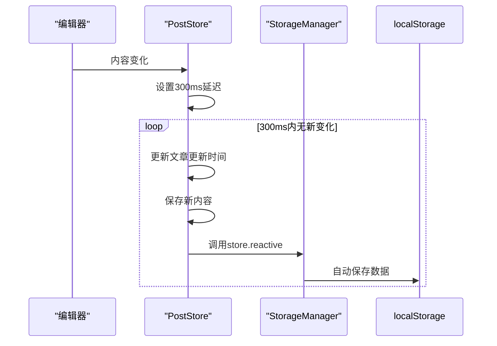
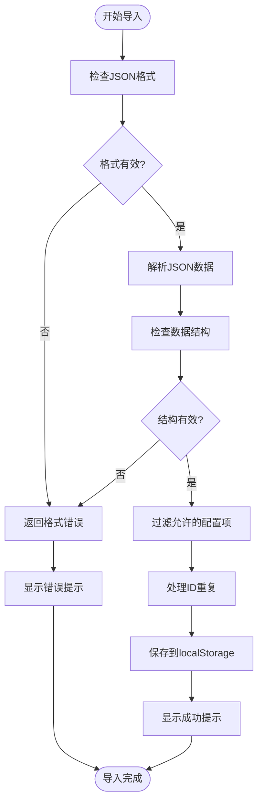
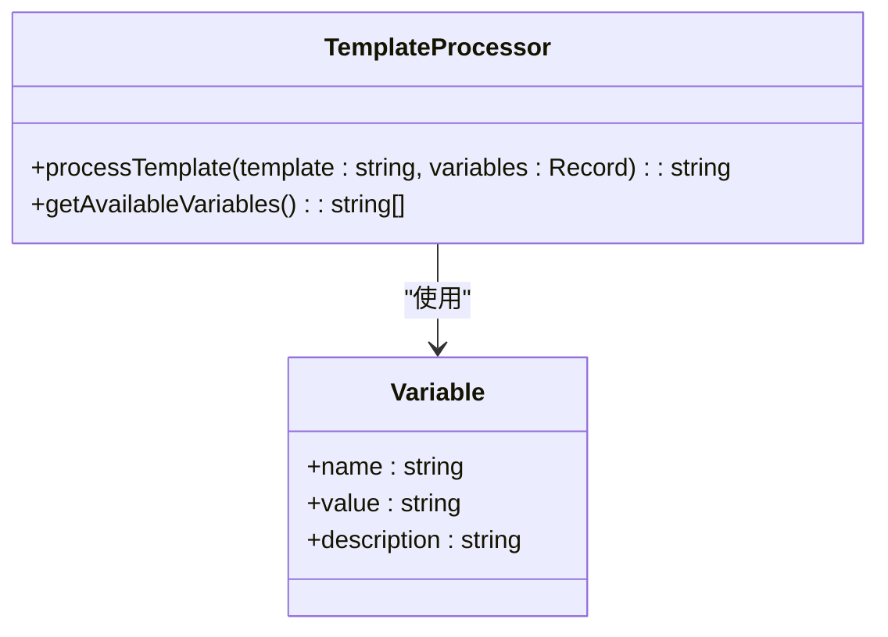

# 内容管理

<cite>
**本文档引用的文件**   
- [TemplateDialog.vue](file://apps/web/src/components/editor/TemplateDialog.vue)
- [template.ts](file://apps/web/src/stores/template.ts)
- [post.ts](file://apps/web/src/stores/post.ts)
- [EditorStateDialog.vue](file://apps/web/src/components/editor/EditorStateDialog.vue)
- [editor.ts](file://apps/web/src/stores/editor.ts)
- [storage.ts](file://apps/web/src/utils/storage.ts)
- [template.ts](file://packages/shared/src/types/template.ts)
</cite>

## 目录
1. [简介](#简介)
2. [模板系统设计与使用](#模板系统设计与使用)
3. [草稿自动保存机制](#草稿自动保存机制)
4. [文章信息管理](#文章信息管理)
5. [数据导入导出功能](#数据导入导出功能)
6. [模板变量插值机制](#模板变量插值机制)
7. [批量管理文章草稿](#批量管理文章草稿)
8. [数据安全与备份策略](#数据安全与备份策略)

## 简介
本文档详细介绍了多平台微信公众号Markdown编辑器的内容管理功能。重点阐述了模板系统的设计与使用，包括如何创建、保存、编辑和应用内容模板，以及TemplateDialog.vue提供的UI操作界面。文档还说明了草稿自动保存机制的实现原理，基于localStorage的持久化策略，以及post store如何跟踪文章元数据（标题、摘要、封面等）。此外，文档描述了EditorStateDialog组件提供的文章信息管理功能，如修改发布时间、作者、分类等。解释了数据导入导出功能的支持格式（JSON、HTML），特别是JSON结构的字段定义和兼容性考虑。提供了模板变量插值机制的说明，如如何在模板中使用动态占位符。指导用户如何批量管理文章草稿，并确保数据安全与备份策略。

## 模板系统设计与使用

内容管理功能的核心是模板系统，它允许用户创建、保存、编辑和应用Markdown模板，以快速复用常用内容。模板系统通过`TemplateDialog.vue`组件提供用户界面，通过`template.ts` store管理模板数据。

### 模板创建与编辑
用户可以通过点击"新建模板"按钮来创建新的模板。在创建模板时，需要填写模板名称（必填）、模板描述（可选）和模板内容（Markdown格式）。模板名称不能超过50个字符。创建模板时，系统会自动将当前编辑器中的内容作为模板的默认内容。

```mermaid
classDiagram
class Template {
+string id
+string name
+string content
+string? description
+number createdAt
+number updatedAt
+string[]? tags
}
class TemplateDialog {
-searchKeyword : string
-isShowForm : boolean
-formMode : 'create' | 'edit'
-editingTemplateId : string
-formData : { name : string, description : string, content : string }
-formErrors : { name : string }
+openCreateForm()
+openEditForm(template : Template)
+validateForm() : boolean
+saveTemplate()
+cancelForm()
+applyTemplate(template : Template)
+insertTemplate(template : Template)
+openDeleteConfirm(template : Template)
+confirmDelete()
+formatDate(timestamp : number) : string
}
class TemplateStore {
-templates : Template[]
+sortedTemplates : ComputedRef<Template[]>
+templateCount : ComputedRef<number>
+createTemplate(params : CreateTemplateParams) : Template
+getTemplateById(id : string) : Template | undefined
+updateTemplate(id : string, params : UpdateTemplateParams) : boolean
+deleteTemplate(id : string) : boolean
+searchTemplates(keyword : string) : Template[]
+deleteTemplates(ids : string[]) : number
+clearAllTemplates() : void
+exportTemplates() : string
+importTemplates(jsonData : string) : boolean
}
TemplateDialog --> TemplateStore : "使用"
TemplateDialog --> Template : "显示"
```

**Diagram sources**
- [TemplateDialog.vue](file://apps/web/src/components/editor/TemplateDialog.vue#L1-L383)
- [template.ts](file://apps/web/src/stores/template.ts#L1-L209)
- [template.ts](file://packages/shared/src/types/template.ts#L1-L52)

**Section sources**
- [TemplateDialog.vue](file://apps/web/src/components/editor/TemplateDialog.vue#L1-L383)
- [template.ts](file://apps/web/src/stores/template.ts#L1-L209)

### 模板应用与插入
用户可以通过两种方式将模板应用到当前文章：
1. **应用模板**：替换当前文章的全部内容为模板内容
2. **插入模板**：在当前光标位置插入模板内容

这两种操作都通过`TemplateDialog.vue`组件中的相应按钮实现。应用或插入模板后，系统会显示成功提示，并自动关闭模板对话框。

### 模板搜索与管理
模板系统支持通过关键词搜索模板，搜索范围包括模板名称、描述和标签。用户可以对模板进行编辑、删除等管理操作。删除模板时，系统会弹出确认对话框以防止误操作。

**Section sources**
- [TemplateDialog.vue](file://apps/web/src/components/editor/TemplateDialog.vue#L1-L383)

## 草稿自动保存机制

草稿自动保存机制是内容管理的重要组成部分，它确保用户在编辑过程中不会丢失未保存的内容。该机制基于localStorage实现持久化存储，通过定时器定期保存编辑状态。

### 实现原理
草稿自动保存机制主要通过以下方式实现：
1. **响应式存储**：使用`store.reactive`方法创建响应式存储，自动将数据持久化到localStorage
2. **定时保存**：设置定时器，每隔30秒检查内容是否发生变化，如有变化则保存
3. **编辑器更新监听**：监听编辑器内容变化，在用户停止输入300毫秒后触发保存



**Diagram sources**
- [CodemirrorEditor.vue](file://apps/web/src/views/CodemirrorEditor.vue#L491-L679)
- [post.ts](file://apps/web/src/stores/post.ts#L1-L187)
- [storage.ts](file://apps/web/src/utils/storage.ts#L1-L363)

**Section sources**
- [CodemirrorEditor.vue](file://apps/web/src/views/CodemirrorEditor.vue#L491-L679)
- [post.ts](file://apps/web/src/stores/post.ts#L1-L187)

### 历史记录功能
除了自动保存当前草稿，系统还实现了历史记录功能。每隔30秒，系统会检查当前内容与最近一条历史记录是否相同，如果不同则创建新的历史记录。历史记录最多保存10条，遵循先进先出的原则。

**Section sources**
- [CodemirrorEditor.vue](file://apps/web/src/views/CodemirrorEditor.vue#L639-L660)

## 文章信息管理

文章信息管理功能通过`EditorStateDialog.vue`组件提供，允许用户导入和导出项目配置，包括UI状态、主题设置、文章数据等。

### 文章元数据跟踪
`post.ts` store负责跟踪文章的元数据，包括：
- 文章ID
- 标题
- 内容
- 创建时间
- 更新时间
- 父级ID（用于组织文章结构）
- 展开/收起状态

```mermaid
classDiagram
class Post {
+string id
+string title
+string content
+{ datetime : string, content : string }[] history
+Date createDatetime
+Date updateDatetime
+string? parentId
+boolean? collapsed
}
class PostStore {
-posts : Post[]
-currentPostId : string
-currentPostIndex : ComputedRef<number>
+currentPost : ComputedRef<Post | undefined>
+addPost(title : string, parentId : string | null) : void
+renamePost(id : string, title : string) : void
+delPost(id : string) : void
+updatePostParentId(postId : string, parentId : string | null) : void
+updatePostContent(id : string, content : string) : void
+collapseAllPosts() : void
+expandAllPosts() : void
}
PostStore --> Post : "包含"
```

**Diagram sources**
- [post.ts](file://apps/web/src/stores/post.ts#L1-L187)

**Section sources**
- [post.ts](file://apps/web/src/stores/post.ts#L1-L187)

### EditorStateDialog组件
`EditorStateDialog.vue`组件提供了导入/导出配置的功能，用户可以选择性地导出或导入特定的配置项，如：
- UI状态（深色模式、编辑位置等）
- 主题设置（字体、字号、代码块主题等）
- 文章数据（当前文章ID、文章列表等）
- CSS编辑器配置
- 渲染设置

**Section sources**
- [EditorStateDialog.vue](file://apps/web/src/components/editor/EditorStateDialog.vue#L1-L506)

## 数据导入导出功能

数据导入导出功能支持多种格式，包括JSON和HTML，方便用户在不同平台间迁移数据。

### JSON格式支持
系统支持导入和导出JSON格式的数据，JSON结构定义如下：

```json
{
  "posts": [
    {
      "id": "string",
      "title": "string",
      "content": "string",
      "history": [
        {
          "datetime": "string",
          "content": "string"
        }
      ],
      "createDatetime": "Date",
      "updateDatetime": "Date",
      "parentId": "string | null",
      "collapsed": "boolean"
    }
  ],
  "currentPostId": "string",
  "isDark": "boolean",
  "theme": "string",
  "fontFamily": "string",
  "fontSize": "string",
  "primaryColor": "string",
  "codeBlockTheme": "string"
}
```

### 兼容性考虑
在导入JSON数据时，系统会进行以下兼容性检查：
1. 验证数据是否为对象类型
2. 检查必需字段是否存在
3. 过滤掉不允许的配置项
4. 处理ID重复的情况（为重复ID生成新UUID）



**Diagram sources**
- [EditorStateDialog.vue](file://apps/web/src/components/editor/EditorStateDialog.vue#L1-L506)
- [template.ts](file://apps/web/src/stores/template.ts#L1-L209)

**Section sources**
- [EditorStateDialog.vue](file://apps/web/src/components/editor/EditorStateDialog.vue#L1-L506)
- [template.ts](file://apps/web/src/stores/template.ts#L1-L209)

### HTML导出功能
系统支持将Markdown内容导出为HTML格式，包括：
- 带样式的HTML（用于微信公众号）
- 无样式的HTML（用于其他平台）
- PDF文档

导出的HTML文件包含完整的HTML结构，包括DOCTYPE、head和body标签，并添加了必要的CSS样式。

**Section sources**
- [export.ts](file://apps/web/src/stores/export.ts#L1-L100)

## 模板变量插值机制

虽然当前代码中没有直接实现模板变量插值机制，但可以通过以下方式实现动态占位符功能：

### 实现方案
1. 在模板内容中使用特殊语法标记占位符，如`{{title}}`、`{{date}}`等
2. 在应用模板时，通过正则表达式匹配并替换这些占位符
3. 提供预定义的变量列表，如当前日期、文章标题等



**Diagram sources**
- [template.ts](file://apps/web/src/stores/template.ts#L1-L209)

**Section sources**
- [template.ts](file://apps/web/src/stores/template.ts#L1-L209)

### 使用示例
用户可以在模板中使用以下动态占位符：
- `{{title}}`：当前文章标题
- `{{date}}`：当前日期
- `{{author}}`：作者名称
- `{{tags}}`：文章标签

当应用模板时，系统会自动将这些占位符替换为实际值。

## 批量管理文章草稿

系统提供了批量管理文章草稿的功能，用户可以通过以下方式操作：

### 批量删除
通过`templateStore.deleteTemplates(ids: string[])`方法，可以批量删除多个模板。该方法会返回实际删除的模板数量，并显示相应的提示信息。

### 批量导出
用户可以选择多个配置项进行批量导出，系统会生成包含所选配置的JSON文件。

### 批量应用
虽然当前没有直接的批量应用功能，但可以通过以下方式实现：
1. 创建一个包含多个子模板的主模板
2. 在主模板中引用子模板的占位符
3. 应用主模板时，系统会自动处理所有子模板

**Section sources**
- [template.ts](file://apps/web/src/stores/template.ts#L1-L209)

## 数据安全与备份策略

数据安全与备份策略是内容管理系统的重要组成部分，确保用户数据的安全性和可恢复性。

### 持久化策略
系统使用localStorage作为主要的持久化存储方案，具有以下特点：
- 数据存储在用户本地，不会上传到服务器
- 支持大容量存储（通常5-10MB）
- 数据在浏览器关闭后仍然保留

```mermaid
classDiagram
class StorageManager {
-engine : StorageEngine
+setEngine(engine : StorageEngine) : void
+getEngine() : StorageEngine
+get(key : string) : Promise<string | null>
+set(key : string, value : string) : Promise<void>
+getJSON<T>(key : string, defaultValue? : T) : Promise<T | null>
+setJSON<T>(key : string, value : T) : Promise<void>
+remove(key : string) : Promise<void>
+has(key : string) : Promise<boolean>
+clear() : Promise<void>
+keys() : Promise<string[]>
+reactive<T>(key : string, defaultValue : T) : Ref<T>
+customReactive<T>(key : string, defaultValue : T, options? : { get? : (stored : T | null) => T, set? : (value : T) => T }) : Ref<T>
}
class LocalStorageEngine {
+get(key : string) : Promise<string | null>
+set(key : string, value : string) : Promise<void>
+remove(key : string) : Promise<void>
+has(key : string) : Promise<boolean>
+clear() : Promise<void>
+keys() : Promise<string[]>
}
class RestfulStorageEngine {
+get(key : string) : Promise<string | null>
+set(key : string, value : string) : Promise<void>
+remove(key : string) : Promise<void>
+has(key : string) : Promise<boolean>
+clear() : Promise<void>
+keys() : Promise<string[]>
}
StorageManager --> LocalStorageEngine : "默认实现"
StorageManager --> RestfulStorageEngine : "可选实现"
```

**Diagram sources**
- [storage.ts](file://apps/web/src/utils/storage.ts#L1-L363)

**Section sources**
- [storage.ts](file://apps/web/src/utils/storage.ts#L1-L363)

### 备份与恢复
系统提供了完整的数据备份与恢复机制：
1. **导出备份**：用户可以导出所有配置为JSON文件，作为本地备份
2. **导入恢复**：当需要恢复数据时，可以导入之前导出的JSON文件
3. **版本兼容**：系统在导入时会进行数据验证，确保兼容性

### 安全考虑
- 所有数据存储在用户本地，不会上传到任何服务器
- 使用UUID作为模板和文章的唯一标识符，避免冲突
- 在删除操作前提供确认对话框，防止误操作
- 定期自动保存草稿，防止数据丢失

**Section sources**
- [storage.ts](file://apps/web/src/utils/storage.ts#L1-L363)
- [template.ts](file://apps/web/src/stores/template.ts#L1-L209)
- [post.ts](file://apps/web/src/stores/post.ts#L1-L187)