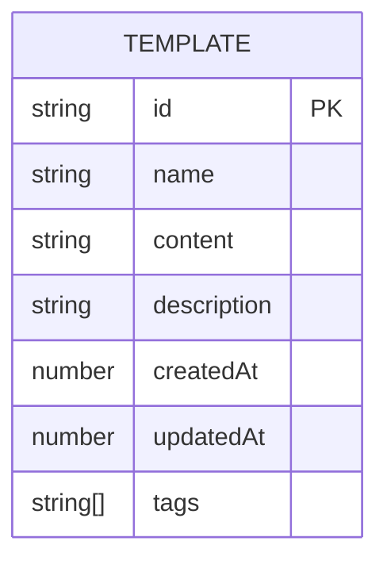
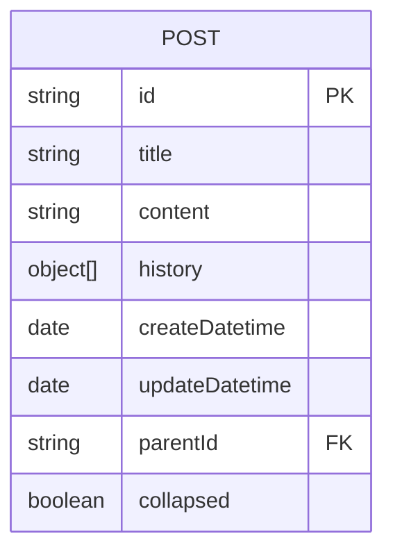
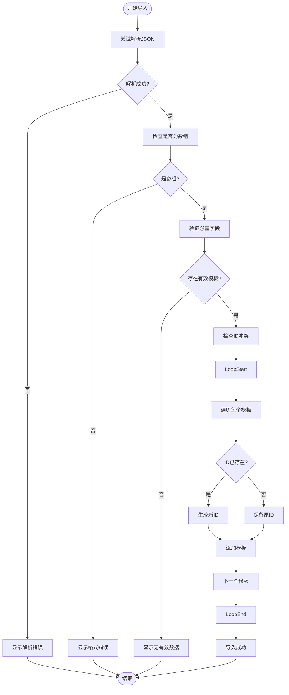

# 数据导入导出

<cite>
**本文档引用的文件**  
- [template.ts](file://apps/web/src/stores/template.ts)
- [EditorStateDialog.vue](file://apps/web/src/components/editor/EditorStateDialog.vue)
- [export.ts](file://apps/web/src/stores/export.ts)
- [PostInfo.vue](file://apps/web/src/components/editor/editor-header/PostInfo.vue)
- [storage.ts](file://apps/web/src/utils/storage.ts)
- [template.ts](file://packages/shared/src/types/template.ts)
- [post.ts](file://apps/web/src/stores/post.ts)
</cite>

## 目录
1. [简介](#简介)
2. [数据结构与类型定义](#数据结构与类型定义)
3. [模板数据的序列化与反序列化](#模板数据的序列化与反序列化)
4. [项目配置的导入与导出](#项目配置的导入与导出)
5. [文章元数据的导出格式](#文章元数据的导出格式)
6. [数据迁移与备份恢复操作指南](#数据迁移与备份恢复操作指南)
7. [安全性考虑](#安全性考虑)

## 简介

本项目提供了一套完整的数据导入导出功能，旨在帮助用户在不同设备间同步配置、备份重要数据以及迁移工作环境。核心功能聚焦于模板（Templates）和文章（Posts）数据的序列化与反序列化过程，通过JSON格式实现数据的持久化与交换。系统设计了健壮的错误处理机制，并充分考虑了数据安全性和用户体验。

**Section sources**
- [template.ts](file://apps/web/src/stores/template.ts#L1-L209)
- [EditorStateDialog.vue](file://apps/web/src/components/editor/EditorStateDialog.vue#L1-L506)

## 数据结构与类型定义

### 模板数据结构

模板（Template）是用户保存的可复用Markdown内容片段。其核心数据结构定义在 `packages/shared/src/types/template.ts` 中，包含以下关键字段：

- **id**: 字符串，模板的唯一标识符（UUID）
- **name**: 字符串，模板名称
- **content**: 字符串，模板内容（Markdown格式）
- **description**: 字符串（可选），模板描述
- **createdAt**: 数字，创建时间戳
- **updatedAt**: 数字，最后修改时间戳
- **tags**: 字符串数组（可选），模板标签

**Diagram sources**
- [template.ts](file://packages/shared/src/types/template.ts#L8-L23)

### 文章数据结构

文章（Post）是用户编辑的主要内容单元。其数据结构定义在 `apps/web/src/stores/post.ts` 中，包含标题、内容、历史记录和时间戳等信息。

**Diagram sources**
- [post.ts](file://apps/web/src/stores/post.ts#L9-L23)

## 模板数据的序列化与反序列化

### 序列化：exportTemplates 方法

`exportTemplates` 方法负责将内存中的模板数据转换为JSON字符串，以便导出和保存。该方法位于 `template.ts` 文件中。

- **字段映射**: 直接将 `Template` 类型的数组转换为JSON，所有字段均被保留。
- **时间戳处理**: `createdAt` 和 `updatedAt` 字段以Unix时间戳（毫秒）的形式存储，确保了时间信息的精确性。
- **格式化选项**: 使用 `JSON.stringify(templates.value, null, 2)` 进行序列化，其中 `null` 表示不使用自定义的replacer函数，`2` 表示使用2个空格进行缩进，生成的JSON文件具有良好的可读性，便于用户检查和编辑。

**Section sources**
- [template.ts](file://apps/web/src/stores/template.ts#L138-L140)

### 反序列化：importTemplates 方法

`importTemplates` 方法负责从JSON字符串中解析并导入模板数据，其设计体现了高度的健壮性。

- **JSON解析异常捕获**: 整个解析过程被包裹在 `try...catch` 块中，任何解析错误都会被捕获，并通过 `toast.error` 向用户显示“导入失败：数据解析错误”的提示。
- **数据类型验证**: 使用 `Array.isArray(importedTemplates)` 确保导入的数据是一个数组，防止非预期的数据类型导致程序崩溃。
- **必需字段检查**: 通过 `filter` 方法对每个模板进行验证，确保 `id`, `name`, `content`, `createdAt`, `updatedAt` 等关键字段均存在且不为 `null` 或 `undefined`。如果没有任何有效模板，导入过程将终止。
- **ID冲突处理**: 当检测到导入的模板ID与现有模板ID冲突时，系统不会覆盖原有模板，而是调用 `uuidv4()` 生成一个新的唯一ID，然后将该模板作为新条目插入。这保证了用户数据的安全，避免了意外的数据丢失。

**Diagram sources**
- [template.ts](file://apps/web/src/stores/template.ts#L145-L186)

## 项目配置的导入与导出

`EditorStateDialog.vue` 组件提供了项目级配置的导入导出功能，其能力远超单一的模板管理。

- **导出功能**: 用户可以勾选需要导出的配置项（如主题设置、UI状态、文章列表等），系统会将这些状态聚合到一个JSON对象中，并使用 `JSON.stringify(filteredExportJSON, null, 2)` 生成格式化的JSON文件供下载。这为用户提供了细粒度的备份选择。
- **导入功能**: 用户上传JSON文件后，系统会进行解析和验证。用户可以在导入前再次选择要应用的配置项，避免覆盖所有设置。导入过程会遍历JSON中的每个键值对，并根据键名将值赋给相应的状态管理器（如 `uiStore`, `themeStore`, `postStore`），实现配置的批量恢复。

**Section sources**
- [EditorStateDialog.vue](file://apps/web/src/components/editor/EditorStateDialog.vue#L1-L506)

## 文章元数据的导出格式

`PostInfo.vue` 组件展示了文章元数据的导出格式，这些数据在发布文章时被收集和使用。

- **核心元数据**: 包括 `title` (标题), `digest` (摘要), `cover` (封面图信息)。
- **内容字段**: 包含 `content` (HTML内容), `markdownContent` (原始Markdown内容)。
- **资源列表**: `images`, `videos`, `fileDatas` 等数组用于存储文章中引用的媒体文件信息。
- **数据来源**: 标题和摘要通过DOM查询从渲染后的HTML中自动提取，而Markdown内容则直接从编辑器状态中获取，确保了数据的准确性和一致性。

**Section sources**
- [PostInfo.vue](file://apps/web/src/components/editor/editor-header/PostInfo.vue#L53-L93)

## 数据迁移与备份恢复操作指南

### 跨设备同步最佳实践

1.  **在设备A上导出**:
    *   打开“文件”菜单，选择“项目配置”。
    *   在弹出的对话框中，选择“导出配置”。
    *   勾选所有需要同步的配置项（建议全选以确保一致性）。
    *   点击“导出选中配置”，将生成的 `exported_config.json` 文件保存到安全位置（如云盘）。

2.  **在设备B上导入**:
    *   在新设备上打开编辑器。
    *   打开“文件”菜单，选择“项目配置”。
    *   选择“导入配置”，点击“重新导入”按钮并选择之前保存的JSON文件。
    *   检查预览，确认配置项无误后，点击“应用选中配置”。
    *   刷新页面以使新配置生效。

### 备份与恢复

- **定期备份**: 建议用户定期使用“项目配置”中的导出功能，将 `exported_config.json` 文件备份到多个位置（本地硬盘、U盘、云存储）。
- **灾难恢复**: 当系统崩溃或数据丢失时，只需将备份的JSON文件通过“项目配置”的导入功能重新载入，即可快速恢复工作环境。

## 安全性考虑

系统在数据导入过程中采取了多项措施来防范安全风险：

- **原型污染防护**: 由于系统使用 `JSON.parse` 进行反序列化，而 `JSON.parse` 本身不会执行代码，因此天然免疫原型污染攻击。此外，导入的数据在赋值前会经过严格的键名白名单检查（在 `EditorStateDialog.vue` 中通过 `allowedKeys` 数组实现），只允许预定义的配置项被应用。
- **XSS风险防范**: 导入的数据主要用于更新应用的内部状态（如颜色、字体、文章内容），并不会直接作为HTML插入到页面中。对于文章内容，系统在渲染时会使用 `marked` 库进行解析，该库默认会转义HTML标签，有效防止了存储型XSS攻击。用户导入的模板内容在使用时也会经过同样的安全渲染流程。

**Section sources**
- [EditorStateDialog.vue](file://apps/web/src/components/editor/EditorStateDialog.vue#L204-L217)
- [template.ts](file://apps/web/src/stores/template.ts#L147-L157)