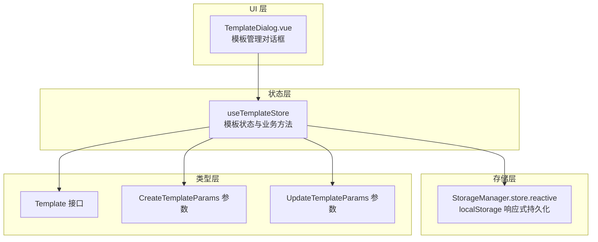
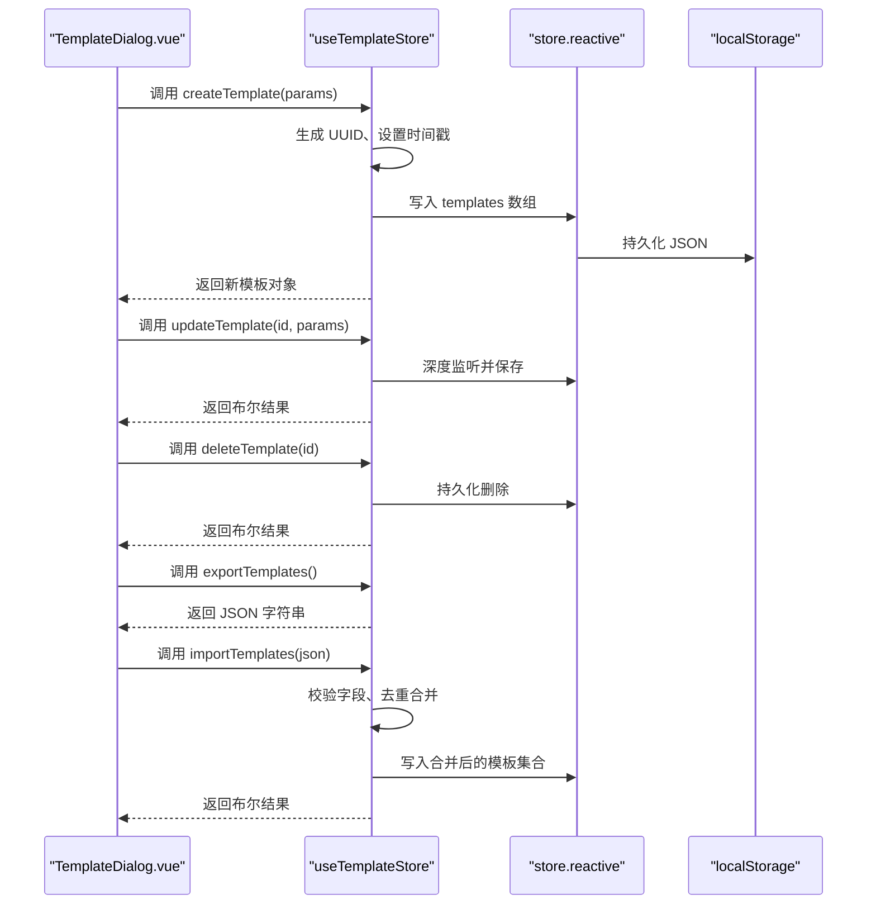
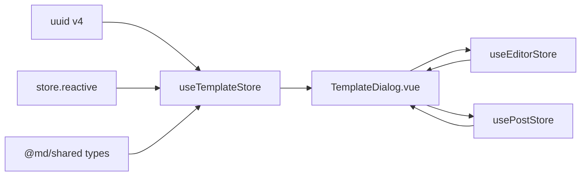

# 模板管理

<cite>
**本文引用的文件**
- [apps/web/src/stores/template.ts](file://apps/web/src/stores/template.ts)
- [apps/web/src/components/editor/TemplateDialog.vue](file://apps/web/src/components/editor/TemplateDialog.vue)
- [apps/web/src/utils/storage.ts](file://apps/web/src/utils/storage.ts)
- [packages/shared/src/types/template.ts](file://packages/shared/src/types/template.ts)
- [apps/web/package.json](file://apps/web/package.json)
</cite>

## 目录
1. [简介](#简介)
2. [项目结构](#项目结构)
3. [核心组件](#核心组件)
4. [架构总览](#架构总览)
5. [详细组件分析](#详细组件分析)
6. [依赖关系分析](#依赖关系分析)
7. [性能考量](#性能考量)
8. [故障排查指南](#故障排查指南)
9. [结论](#结论)
10. [附录](#附录)

## 简介
本文件系统性梳理“模板管理”功能，围绕 useTemplateStore 的实现机制展开，涵盖模板的增删改查（CRUD）操作、基于 Pinia 和 localStorage 的响应式持久化存储策略；解释 createTemplate、updateTemplate、deleteTemplate 等核心方法的参数、返回值与内部逻辑，重点说明 UUID 生成、时间戳管理与重复 ID 处理；阐述 TemplateDialog.vue 提供的 UI 交互能力，包括模板创建表单、编辑界面、批量删除与应用/插入模板；最后给出模板导入导出的技术细节与最佳实践，帮助用户进行批量管理与数据备份。

## 项目结构
模板管理功能主要由以下模块组成：
- 状态层：useTemplateStore（Pinia Store），负责模板数据的增删改查、排序、计数、导入导出与批量删除
- 存储层：统一存储抽象 store.reactive（基于 localStorage 的响应式持久化）
- 类型层：共享类型定义 Template、CreateTemplateParams、UpdateTemplateParams
- UI 层：TemplateDialog.vue，提供模板管理的可视化交互（搜索、创建/编辑、应用/插入、删除）

图表来源
- [apps/web/src/stores/template.ts](file://apps/web/src/stores/template.ts#L1-L208)
- [apps/web/src/utils/storage.ts](file://apps/web/src/utils/storage.ts#L254-L305)
- [packages/shared/src/types/template.ts](file://packages/shared/src/types/template.ts#L1-L51)
- [apps/web/src/components/editor/TemplateDialog.vue](file://apps/web/src/components/editor/TemplateDialog.vue#L1-L383)

章节来源
- [apps/web/src/stores/template.ts](file://apps/web/src/stores/template.ts#L1-L208)
- [apps/web/src/utils/storage.ts](file://apps/web/src/utils/storage.ts#L1-L363)
- [packages/shared/src/types/template.ts](file://packages/shared/src/types/template.ts#L1-L51)
- [apps/web/src/components/editor/TemplateDialog.vue](file://apps/web/src/components/editor/TemplateDialog.vue#L1-L383)

## 核心组件
- useTemplateStore：提供模板 CRUD、搜索、批量删除、清空、导入导出等能力，内部使用 store.reactive 实现响应式持久化
- TemplateDialog.vue：模板管理的 UI，支持搜索、创建/编辑、应用到当前文章或插入到编辑器、删除确认
- 存储抽象 store：封装 localStorage 读写、JSON 序列化/反序列化、响应式监听与自动保存
- 共享类型：定义模板实体与参数结构，保证前后端/跨模块一致

章节来源
- [apps/web/src/stores/template.ts](file://apps/web/src/stores/template.ts#L1-L208)
- [apps/web/src/components/editor/TemplateDialog.vue](file://apps/web/src/components/editor/TemplateDialog.vue#L1-L383)
- [apps/web/src/utils/storage.ts](file://apps/web/src/utils/storage.ts#L254-L305)
- [packages/shared/src/types/template.ts](file://packages/shared/src/types/template.ts#L1-L51)

## 架构总览
模板管理采用“状态-存储-类型-UI”的分层架构：
- 状态层：useTemplateStore 将模板数组作为响应式数据源，自动持久化到 localStorage
- 存储层：store.reactive 提供键值对的响应式包装，首次渲染时同步读取 localStorage，后续变更自动保存
- 类型层：共享类型约束模板字段，确保 create/update/import 的一致性
- UI 层：TemplateDialog.vue 通过调用 useTemplateStore 的方法完成模板管理操作

图表来源
- [apps/web/src/stores/template.ts](file://apps/web/src/stores/template.ts#L28-L206)
- [apps/web/src/utils/storage.ts](file://apps/web/src/utils/storage.ts#L254-L305)
- [apps/web/src/components/editor/TemplateDialog.vue](file://apps/web/src/components/editor/TemplateDialog.vue#L1-L383)

## 详细组件分析

### useTemplateStore：模板状态与业务方法
- 状态
  - templates：响应式数组，键名经 addPrefix 包装，自动持久化至 localStorage
  - sortedTemplates：按 createdAt 倒序的计算属性
  - templateCount：模板总数
- 方法
  - createTemplate(params)：生成 UUID、设置 createdAt/updatedAt、推入数组并提示
  - getTemplateById(id)：按 id 查找模板
  - updateTemplate(id, params)：按 id 更新，未命中返回 false 并提示
  - deleteTemplate(id)：按 id 删除，未命中返回 false 并提示
  - searchTemplates(keyword)：关键字检索（名称、描述、标签），空关键字返回按时间排序的完整列表
  - deleteTemplates(ids[])：批量删除，返回删除数量
  - clearAllTemplates()：清空所有模板
  - exportTemplates()：返回 JSON 字符串
  - importTemplates(jsonData)：解析 JSON，校验字段，去重合并（重复 ID 生成新 UUID），提示导入结果

关键点
- ID 生成：使用 uuidv4 生成全局唯一标识
- 时间戳：createdAt/updatedAt 均以毫秒时间戳记录
- 重复 ID 处理：导入时若发现相同 id，自动替换为新 UUID，避免冲突
- 持久化：store.reactive 自动监听变更并写回 localStorage

章节来源
- [apps/web/src/stores/template.ts](file://apps/web/src/stores/template.ts#L1-L208)
- [apps/web/package.json](file://apps/web/package.json#L69-L76)

### TemplateDialog.vue：模板管理 UI
- 功能
  - 搜索：输入关键字实时过滤模板列表
  - 创建/编辑：表单校验（名称必填且长度限制），提交后调用 useTemplateStore 的 create/update
  - 应用模板：替换当前文章内容或编辑器内容
  - 插入模板：在光标处插入模板内容，并同步更新当前文章内容
  - 删除：打开确认对话框，确认后调用 deleteTemplate
  - 统计：显示模板总数
- 交互细节
  - 打开创建表单时，内容默认取自编辑器当前内容
  - 关闭对话框时清理表单显示状态

章节来源
- [apps/web/src/components/editor/TemplateDialog.vue](file://apps/web/src/components/editor/TemplateDialog.vue#L1-L383)

### 存储抽象：store.reactive 与 localStorage
- store.reactive(key, defaultValue)：创建响应式引用，首次渲染同步读取 localStorage，后续变更自动 setJSON
- 导入导出：exportTemplates/importTemplates 通过 JSON 序列化/反序列化实现
- 错误处理：导入失败时捕获异常并提示

章节来源
- [apps/web/src/utils/storage.ts](file://apps/web/src/utils/storage.ts#L254-L305)
- [apps/web/src/stores/template.ts](file://apps/web/src/stores/template.ts#L135-L187)

### 类型定义：Template、CreateTemplateParams、UpdateTemplateParams
- Template：包含 id、name、content、description、createdAt、updatedAt、tags
- CreateTemplateParams：创建所需字段（name、content、可选 description、tags）
- UpdateTemplateParams：更新可选字段（name、content、description、tags）

章节来源
- [packages/shared/src/types/template.ts](file://packages/shared/src/types/template.ts#L1-L51)

## 依赖关系分析
- useTemplateStore 依赖
  - uuid：生成模板 ID
  - store.reactive：持久化模板数组
  - toast：提示反馈
- TemplateDialog.vue 依赖
  - useTemplateStore：调用 CRUD 与搜索
  - useEditorStore/usePostStore：应用/插入模板时更新编辑器与文章内容
  - useUIStore：控制对话框显示/隐藏
- 类型依赖
  - @md/shared 中的模板类型定义

图表来源
- [apps/web/src/stores/template.ts](file://apps/web/src/stores/template.ts#L1-L208)
- [apps/web/src/components/editor/TemplateDialog.vue](file://apps/web/src/components/editor/TemplateDialog.vue#L1-L383)
- [apps/web/package.json](file://apps/web/package.json#L69-L76)

章节来源
- [apps/web/src/stores/template.ts](file://apps/web/src/stores/template.ts#L1-L208)
- [apps/web/src/components/editor/TemplateDialog.vue](file://apps/web/src/components/editor/TemplateDialog.vue#L1-L383)
- [apps/web/package.json](file://apps/web/package.json#L69-L76)

## 性能考量
- 搜索复杂度：searchTemplates 对模板数组进行线性过滤，时间复杂度 O(n)，n 为模板数量；建议在模板规模较大时配合前端分页或更细粒度筛选
- 持久化策略：store.reactive 使用 watch 深度监听并异步保存，避免频繁写入导致主线程阻塞
- 导入导出：exportTemplates 与 importTemplates 均为一次性 JSON 序列化/反序列化，适合中小规模数据；大规模数据建议分批导入或服务端处理

[本节为通用性能讨论，无需特定文件引用]

## 故障排查指南
- 导入失败
  - 数据格式不正确：检查 JSON 结构是否为数组
  - 缺少必要字段：确保每个模板包含 id、name、content、createdAt、updatedAt
  - 处理流程：importTemplates 会过滤无效条目并提示
- 删除失败
  - 模板不存在：update/delete 会在未找到 id 时返回 false 并提示
- 应用/插入异常
  - 当前文章为空时，应用/插入仅作用于编辑器内容
- 导出内容为空
  - 确认 templates 中存在数据；exportTemplates 返回 JSON 字符串，需在外部保存为文件

章节来源
- [apps/web/src/stores/template.ts](file://apps/web/src/stores/template.ts#L135-L187)
- [apps/web/src/components/editor/TemplateDialog.vue](file://apps/web/src/components/editor/TemplateDialog.vue#L107-L133)

## 结论
模板管理功能以 useTemplateStore 为核心，结合 store.reactive 实现了响应式与持久化的统一；UI 层 TemplateDialog.vue 提供直观易用的操作入口。导入导出采用 JSON 格式，具备基础校验与去重合并策略，满足日常批量管理与备份需求。建议在模板规模扩大后优化搜索与分页策略，并在团队协作场景下规范模板命名与标签体系，提升复用效率。

[本节为总结性内容，无需特定文件引用]

## 附录

### API 与方法速览（路径定位）
- 创建模板
  - 路径：[apps/web/src/stores/template.ts](file://apps/web/src/stores/template.ts#L28-L43)
  - 参数：CreateTemplateParams（name、content、可选 description、tags）
  - 返回：Template
- 更新模板
  - 路径：[apps/web/src/stores/template.ts](file://apps/web/src/stores/template.ts#L55-L70)
  - 参数：id（string）、UpdateTemplateParams（可选 name、content、description、tags）
  - 返回：boolean
- 删除模板
  - 路径：[apps/web/src/stores/template.ts](file://apps/web/src/stores/template.ts#L75-L86)
  - 参数：id（string）
  - 返回：boolean
- 搜索模板
  - 路径：[apps/web/src/stores/template.ts](file://apps/web/src/stores/template.ts#L91-L104)
  - 参数：keyword（string）
  - 返回：Template[]
- 批量删除
  - 路径：[apps/web/src/stores/template.ts](file://apps/web/src/stores/template.ts#L109-L124)
  - 参数：ids（string[]）
  - 返回：number（删除数量）
- 清空模板
  - 路径：[apps/web/src/stores/template.ts](file://apps/web/src/stores/template.ts#L129-L133)
  - 参数：无
  - 返回：void
- 导出模板
  - 路径：[apps/web/src/stores/template.ts](file://apps/web/src/stores/template.ts#L135-L140)
  - 参数：无
  - 返回：string（JSON）
- 导入模板
  - 路径：[apps/web/src/stores/template.ts](file://apps/web/src/stores/template.ts#L145-L187)
  - 参数：jsonData（string）
  - 返回：boolean
- UI 交互
  - 路径：[apps/web/src/components/editor/TemplateDialog.vue](file://apps/web/src/components/editor/TemplateDialog.vue#L1-L383)
  - 功能：创建/编辑/应用/插入/删除/统计/搜索

### 模板导入导出技术细节
- exportTemplates
  - 输出结构：JSON 数组，元素为 Template 对象（包含 id、name、content、description、createdAt、updatedAt、tags）
  - 用途：用于备份与迁移
- importTemplates
  - 输入：JSON 字符串
  - 校验：要求为数组，且每条记录包含 id、name、content、createdAt、updatedAt
  - 去重合并：若 id 已存在，则生成新 UUID 并追加；否则直接合并
  - 提示：成功导入条数与失败原因均有 toast 反馈

章节来源
- [apps/web/src/stores/template.ts](file://apps/web/src/stores/template.ts#L135-L187)

### 如何通过 API 创建和应用模板（路径指引）
- 创建模板
  - 在 UI 中打开 TemplateDialog.vue，填写表单并点击“创建”
  - 实际调用：useTemplateStore.createTemplate(...)
  - 路径参考：[apps/web/src/stores/template.ts](file://apps/web/src/stores/template.ts#L28-L43)
- 应用模板到当前文章
  - 在 TemplateDialog.vue 中选择“应用模板（替换全部内容）”
  - 实际调用：useTemplateStore.getTemplateById(...) + usePostStore.updatePostContent(...) + useEditorStore.importContent(...)
  - 路径参考：[apps/web/src/components/editor/TemplateDialog.vue](file://apps/web/src/components/editor/TemplateDialog.vue#L107-L119)
- 插入模板到编辑器光标处
  - 在 TemplateDialog.vue 中选择“插入模板（在光标处插入）”
  - 实际调用：useEditorStore.insertAtCursor(...) + usePostStore.updatePostContent(...)（如有当前文章）
  - 路径参考：[apps/web/src/components/editor/TemplateDialog.vue](file://apps/web/src/components/editor/TemplateDialog.vue#L122-L133)

### 批量管理与数据备份建议
- 批量删除
  - 使用 TemplateDialog.vue 的批量操作或调用 useTemplateStore.deleteTemplates([...])
  - 路径参考：[apps/web/src/stores/template.ts](file://apps/web/src/stores/template.ts#L109-L124)
- 数据备份
  - 导出：调用 useTemplateStore.exportTemplates()，将返回的 JSON 保存为文件
  - 路径参考：[apps/web/src/stores/template.ts](file://apps/web/src/stores/template.ts#L135-L140)
- 数据恢复
  - 导入：将备份 JSON 传入 useTemplateStore.importTemplates(json)，系统自动去重合并
  - 路径参考：[apps/web/src/stores/template.ts](file://apps/web/src/stores/template.ts#L145-L187)