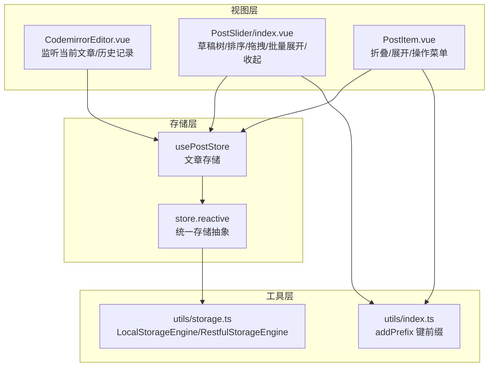
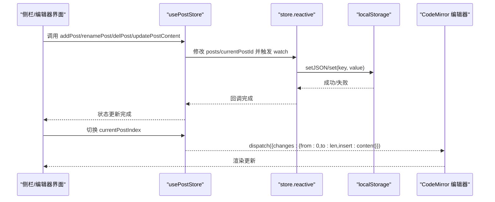
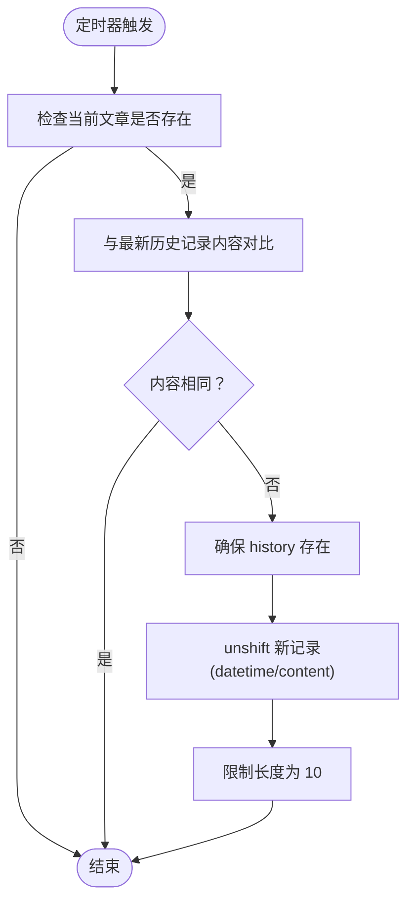
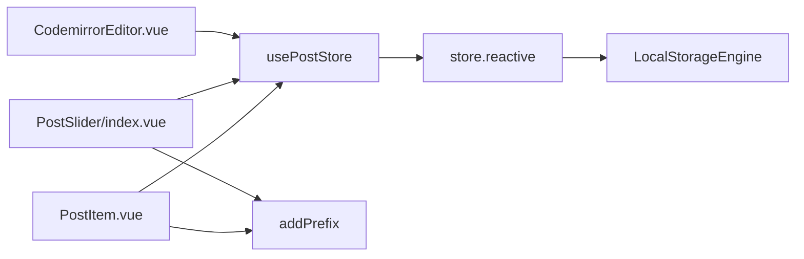

# 草稿管理

<cite>
**本文引用的文件**
- [apps/web/src/stores/post.ts](file://apps/web/src/stores/post.ts)
- [apps/web/src/utils/storage.ts](file://apps/web/src/utils/storage.ts)
- [apps/web/src/views/CodemirrorEditor.vue](file://apps/web/src/views/CodemirrorEditor.vue)
- [apps/web/src/components/editor/post-slider/index.vue](file://apps/web/src/components/editor/post-slider/index.vue)
- [apps/web/src/components/editor/post-slider/PostItem.vue](file://apps/web/src/components/editor/post-slider/PostItem.vue)
- [apps/web/src/stores/editor.ts](file://apps/web/src/stores/editor.ts)
- [apps/web/src/utils/index.ts](file://apps/web/src/utils/index.ts)
</cite>

## 目录
1. [简介](#简介)
2. [项目结构](#项目结构)
3. [核心组件](#核心组件)
4. [架构总览](#架构总览)
5. [详细组件分析](#详细组件分析)
6. [依赖关系分析](#依赖关系分析)
7. [性能考量](#性能考量)
8. [故障排查指南](#故障排查指南)
9. [结论](#结论)
10. [附录](#附录)

## 简介
本文件围绕“草稿管理”能力，系统性梳理 usePostStore 的设计与实现，重点解析文章（Post）数据模型结构、posts 数组的响应式持久化机制、currentPostId 的选中逻辑、onBeforeMount 中的数据迁移兼容处理，以及 addPost、updatePostContent、delPost 等核心操作的实现流程与历史记录（history）更新策略。同时说明文章层级结构（parentId）与折叠状态（collapsed）的管理方法，并结合代码路径给出 API 使用示例，帮助开发者完成多篇草稿的生命周期管理。

## 项目结构
草稿管理相关的核心代码分布在以下模块：
- 存储层：usePostStore 定义在文章存储模块，负责文章列表、当前文章、CRUD 操作与历史记录。
- 持久化层：统一存储抽象 store.reactive 实现响应式持久化，基于本地存储引擎。
- 视图层：编辑器视图 CodemirrorEditor.vue 负责监听当前文章切换与历史记录定时写入；侧栏 PostSlider 与 PostItem 负责草稿树形展示、排序、折叠/展开、拖拽与批量展开/收起。
- 工具层：addPrefix 提供键名前缀，保证不同模块键空间隔离。

图表来源
- [apps/web/src/stores/post.ts](file://apps/web/src/stores/post.ts#L1-L186)
- [apps/web/src/utils/storage.ts](file://apps/web/src/utils/storage.ts#L1-L363)
- [apps/web/src/views/CodemirrorEditor.vue](file://apps/web/src/views/CodemirrorEditor.vue#L600-L799)
- [apps/web/src/components/editor/post-slider/index.vue](file://apps/web/src/components/editor/post-slider/index.vue#L1-L485)
- [apps/web/src/components/editor/post-slider/PostItem.vue](file://apps/web/src/components/editor/post-slider/PostItem.vue#L1-L216)
- [apps/web/src/utils/index.ts](file://apps/web/src/utils/index.ts#L41-L43)

章节来源
- [apps/web/src/stores/post.ts](file://apps/web/src/stores/post.ts#L1-L186)
- [apps/web/src/utils/storage.ts](file://apps/web/src/utils/storage.ts#L1-L363)
- [apps/web/src/views/CodemirrorEditor.vue](file://apps/web/src/views/CodemirrorEditor.vue#L600-L799)
- [apps/web/src/components/editor/post-slider/index.vue](file://apps/web/src/components/editor/post-slider/index.vue#L1-L485)
- [apps/web/src/components/editor/post-slider/PostItem.vue](file://apps/web/src/components/editor/post-slider/PostItem.vue#L1-L216)
- [apps/web/src/utils/index.ts](file://apps/web/src/utils/index.ts#L41-L43)

## 核心组件
- usePostStore：定义文章数据模型 Post，提供 posts 列表、currentPostId、currentPostIndex、currentPost 等状态与 addPost、renamePost、delPost、updatePostParentId、updatePostContent、collapseAllPosts、expandAllPosts 等动作。
- store.reactive：统一的响应式持久化入口，自动监听变更并写入本地存储，支持字符串与 JSON 两种序列化方式。
- CodemirrorEditor.vue：监听 currentPostIndex 变化，同步编辑器内容；每 30 秒检查当前文章内容差异，自动写入历史记录，最多保留 10 条。
- PostSlider/index.vue：提供新增、重命名、删除、历史记录、排序、拖拽、批量展开/收起等交互。
- PostItem.vue：单个草稿项的折叠/展开、操作菜单、拖拽支持。
- utils/index.ts：addPrefix 为存储键名加前缀，避免冲突。

章节来源
- [apps/web/src/stores/post.ts](file://apps/web/src/stores/post.ts#L1-L186)
- [apps/web/src/utils/storage.ts](file://apps/web/src/utils/storage.ts#L248-L305)
- [apps/web/src/views/CodemirrorEditor.vue](file://apps/web/src/views/CodemirrorEditor.vue#L600-L799)
- [apps/web/src/components/editor/post-slider/index.vue](file://apps/web/src/components/editor/post-slider/index.vue#L1-L485)
- [apps/web/src/components/editor/post-slider/PostItem.vue](file://apps/web/src/components/editor/post-slider/PostItem.vue#L1-L216)
- [apps/web/src/utils/index.ts](file://apps/web/src/utils/index.ts#L41-L43)

## 架构总览
草稿管理采用“存储-视图-工具”三层协作：
- 存储层：usePostStore 通过 store.reactive 将 posts 与 currentPostId 持久化到 localStorage，实现跨会话恢复。
- 视图层：编辑器视图根据 currentPostIndex 同步 CodeMirror 内容；侧栏视图负责草稿树展示、排序、折叠/展开、拖拽与批量操作。
- 工具层：统一存储抽象支持本地与远端引擎切换，键名前缀保障命名空间安全。

图表来源
- [apps/web/src/stores/post.ts](file://apps/web/src/stores/post.ts#L1-L186)
- [apps/web/src/utils/storage.ts](file://apps/web/src/utils/storage.ts#L248-L305)
- [apps/web/src/views/CodemirrorEditor.vue](file://apps/web/src/views/CodemirrorEditor.vue#L613-L637)

## 详细组件分析

### usePostStore 设计与实现
- 数据模型 Post
  - 字段：id、title、content、history（datetime、content）、createDatetime、updateDatetime、parentId（可空）、collapsed（可空）。
  - 用途：承载单篇草稿的元数据与层级关系；history 用于版本回溯；时间戳用于排序与迁移。
- 状态与计算属性
  - posts：响应式文章数组，持久化键由 addPrefix 包装。
  - currentPostId：当前选中文章的 id，持久化键由 addPrefix 包装。
  - currentPostIndex：基于 currentPostId 的计算索引，支持双向绑定（setter 会反向设置 currentPostId）。
  - currentPost：基于 currentPostId 的计算文章引用。
- 生命周期与迁移
  - onBeforeMount：补全旧数据缺失的 id、createDatetime、updateDatetime；若 currentPostId 无效或不存在则自动指向第一篇。
  - onMounted：迁移旧版 editorContent 至当前文章内容，完成后重置旧字段。
- 核心动作
  - addPost：生成新文章，初始化 history，设置当前文章为新建项。
  - renamePost：重命名并更新 updateDatetime。
  - delPost：删除指定文章，调整 currentPostId 指向相邻文章。
  - updatePostParentId：设置 parentId，更新 updateDatetime。
  - updatePostContent：更新 content，更新 updateDatetime。
  - collapseAllPosts/expandAllPosts：批量折叠/展开。
- 历史记录策略
  - history 由编辑器定时器维护，每 30 秒比较当前内容与最新历史记录，不同则写入新记录，最多保留 10 条。

章节来源
- [apps/web/src/stores/post.ts](file://apps/web/src/stores/post.ts#L1-L186)
- [apps/web/src/views/CodemirrorEditor.vue](file://apps/web/src/views/CodemirrorEditor.vue#L639-L660)

### 响应式持久化机制（store.reactive）
- store.reactive 的工作原理
  - 同步读取初始值（本地引擎）或异步加载（远端引擎），确保首次渲染正确。
  - 监听 ref 变化，深拷贝触发 deep: true，按类型选择 set 或 setJSON。
  - 出错时记录日志，不影响应用运行。
- 键名前缀
  - 使用 addPrefix 包装键名，避免不同模块键冲突。
- 与 localStorage 的关系
  - 默认使用 LocalStorageEngine，直接读写 localStorage；也可切换为 RestfulStorageEngine 以接入远端存储。

章节来源
- [apps/web/src/utils/storage.ts](file://apps/web/src/utils/storage.ts#L248-L305)
- [apps/web/src/utils/index.ts](file://apps/web/src/utils/index.ts#L41-L43)

### currentPostId 选中逻辑与迁移兼容
- 选中逻辑
  - currentPostIndex.get 返回当前文章索引；currentPostIndex.set 将索引转换为 id 并写回 currentPostId。
  - 侧栏点击或拖拽均可直接设置 currentPostId，从而驱动 currentPostIndex 的计算。
- 迁移兼容
  - onBeforeMount：遍历 posts，补全 id、createDatetime、updateDatetime；若 currentPostId 为空或指向的文章不存在，自动设为首篇文章 id。
  - onMounted：若检测到旧版 editorContent 与默认内容不同，将其写入当前文章 content，并重置旧字段。

章节来源
- [apps/web/src/stores/post.ts](file://apps/web/src/stores/post.ts#L50-L66)
- [apps/web/src/stores/post.ts](file://apps/web/src/stores/post.ts#L155-L164)

### 历史记录（history）更新策略
- 触发时机
  - 每 30 秒执行一次定时器，仅在当前文章存在且编辑器已挂载时生效。
- 更新规则
  - 与最新历史记录内容对比，相同则跳过；不同则在 history 头部插入新记录，datetime 为本地化时间字符串。
  - 限制长度为 10，超出部分截断。
- 恢复流程
  - 侧栏历史记录对话框选择某条记录，将对应 content 赋给当前文章 content，并通过 CodeMirror dispatch 将内容替换到编辑器。

图表来源
- [apps/web/src/views/CodemirrorEditor.vue](file://apps/web/src/views/CodemirrorEditor.vue#L639-L660)

章节来源
- [apps/web/src/views/CodemirrorEditor.vue](file://apps/web/src/views/CodemirrorEditor.vue#L639-L660)
- [apps/web/src/components/editor/post-slider/index.vue](file://apps/web/src/components/editor/post-slider/index.vue#L114-L139)

### 文章层级结构（parentId）与折叠状态（collapsed）
- 层级结构
  - parentId 表示父子关系；拖拽时禁止将父节点拖到其子节点下，防止循环引用。
  - 侧栏 PostItem 通过过滤 parentId 与父级一致的子项进行嵌套渲染，支持多级树形展示。
- 折叠状态
  - collapsed 控制子项是否渲染；侧栏提供“全部收起/全部展开”快捷操作，分别将 posts 中每个文章的 collapsed 设为 true/false。
  - PostItem 提供单个文章的折叠/展开按钮，图标旋转表示展开状态。

章节来源
- [apps/web/src/stores/post.ts](file://apps/web/src/stores/post.ts#L141-L154)
- [apps/web/src/components/editor/post-slider/PostItem.vue](file://apps/web/src/components/editor/post-slider/PostItem.vue#L78-L84)
- [apps/web/src/components/editor/post-slider/index.vue](file://apps/web/src/components/editor/post-slider/index.vue#L331-L356)

### API 使用示例（代码路径）
- 管理多篇草稿
  - 新增草稿：调用 addPost(title, parentId?)，返回值为 void；新增后 currentPostId 自动指向新文章。
    - 示例路径：[addPost 实现](file://apps/web/src/stores/post.ts#L87-L102)
  - 重命名草稿：调用 renamePost(id, title)。
    - 示例路径：[renamePost 实现](file://apps/web/src/stores/post.ts#L104-L111)
  - 删除草稿：调用 delPost(id)，删除后 currentPostId 自动调整到相邻文章。
    - 示例路径：[delPost 实现](file://apps/web/src/stores/post.ts#L113-L121)
- 切换当前文章
  - 直接设置 currentPostId 或通过 currentPostIndex.set 索引切换。
    - 示例路径：[currentPostId 状态](file://apps/web/src/stores/post.ts#L44-L46)、[currentPostIndex 计算](file://apps/web/src/stores/post.ts#L71-L80)
- 批量展开/收起
  - 调用 collapseAllPosts()/expandAllPosts()。
    - 示例路径：[collapseAllPosts/expandAllPosts](file://apps/web/src/stores/post.ts#L141-L154)
- 历史记录管理
  - 打开历史记录对话框并恢复某条记录：调用 openHistoryDialog(id) 与 recoverHistory()。
    - 示例路径：[历史记录对话框与恢复](file://apps/web/src/components/editor/post-slider/index.vue#L114-L139)
- 拖拽与层级调整
  - 拖拽源与目标处理，禁止将父节点拖入其子节点。
    - 示例路径：[拖拽处理逻辑](file://apps/web/src/components/editor/post-slider/index.vue#L168-L201)

章节来源
- [apps/web/src/stores/post.ts](file://apps/web/src/stores/post.ts#L87-L154)
- [apps/web/src/components/editor/post-slider/index.vue](file://apps/web/src/components/editor/post-slider/index.vue#L114-L201)

## 依赖关系分析
- 组件耦合
  - usePostStore 与 store.reactive 高内聚，通过 addPrefix 与键名解耦。
  - CodemirrorEditor.vue 依赖 currentPostIndex 与 posts，负责内容同步与历史记录写入。
  - PostSlider/index.vue 与 PostItem.vue 依赖 usePostStore 的 actions 与状态，实现树形展示与批量操作。
- 外部依赖
  - localStorage 作为默认持久化介质；可通过切换存储引擎支持远端存储。
  - addPrefix 提供键名前缀，避免键冲突。

图表来源
- [apps/web/src/stores/post.ts](file://apps/web/src/stores/post.ts#L1-L186)
- [apps/web/src/utils/storage.ts](file://apps/web/src/utils/storage.ts#L1-L363)
- [apps/web/src/utils/index.ts](file://apps/web/src/utils/index.ts#L41-L43)
- [apps/web/src/views/CodemirrorEditor.vue](file://apps/web/src/views/CodemirrorEditor.vue#L600-L799)
- [apps/web/src/components/editor/post-slider/index.vue](file://apps/web/src/components/editor/post-slider/index.vue#L1-L485)
- [apps/web/src/components/editor/post-slider/PostItem.vue](file://apps/web/src/components/editor/post-slider/PostItem.vue#L1-L216)

章节来源
- [apps/web/src/stores/post.ts](file://apps/web/src/stores/post.ts#L1-L186)
- [apps/web/src/utils/storage.ts](file://apps/web/src/utils/storage.ts#L1-L363)
- [apps/web/src/utils/index.ts](file://apps/web/src/utils/index.ts#L41-L43)
- [apps/web/src/views/CodemirrorEditor.vue](file://apps/web/src/views/CodemirrorEditor.vue#L600-L799)
- [apps/web/src/components/editor/post-slider/index.vue](file://apps/web/src/components/editor/post-slider/index.vue#L1-L485)
- [apps/web/src/components/editor/post-slider/PostItem.vue](file://apps/web/src/components/editor/post-slider/PostItem.vue#L1-L216)

## 性能考量
- 历史记录写入频率控制
  - 每 30 秒写入一次，避免频繁 IO；仅在内容发生变化时写入，减少冗余。
- 历史记录数量限制
  - 最多保留 10 条，降低内存与存储占用。
- 编辑器内容同步
  - 仅在内容不同时才 dispatch 更新，避免不必要的渲染。
- 批量操作
  - collapseAllPosts/expandAllPosts 遍历 posts 执行批量更新，复杂度 O(n)。

[本节为通用建议，无需特定文件引用]

## 故障排查指南
- 历史记录未更新
  - 检查定时器是否在 mounted 后启动，且当前文章存在。
  - 确认内容确实发生了变化（与最新历史记录对比）。
  - 参考路径：[历史记录定时器](file://apps/web/src/views/CodemirrorEditor.vue#L639-L660)
- 当前文章未同步到编辑器
  - 检查 currentPostIndex 是否有效，编辑器实例是否已挂载。
  - 参考路径：[内容同步逻辑](file://apps/web/src/views/CodemirrorEditor.vue#L613-L637)
- 旧数据迁移失败
  - onBeforeMount 会自动补齐 id 与时间戳；若 currentPostId 无效会自动指向首篇文章。
  - 参考路径：[迁移逻辑](file://apps/web/src/stores/post.ts#L50-L66)
- 拖拽导致层级异常
  - 拖拽处理会阻止将父节点拖入其子节点，若仍出现异常，检查 parentId 循环引用。
  - 参考路径：[拖拽处理](file://apps/web/src/components/editor/post-slider/index.vue#L168-L201)
- 批量展开/收起无效
  - 确认 posts 数组非空，且 collapsed 字段存在。
  - 参考路径：[批量操作](file://apps/web/src/stores/post.ts#L141-L154)

章节来源
- [apps/web/src/views/CodemirrorEditor.vue](file://apps/web/src/views/CodemirrorEditor.vue#L613-L660)
- [apps/web/src/stores/post.ts](file://apps/web/src/stores/post.ts#L50-L66)
- [apps/web/src/components/editor/post-slider/index.vue](file://apps/web/src/components/editor/post-slider/index.vue#L168-L201)
- [apps/web/src/stores/post.ts](file://apps/web/src/stores/post.ts#L141-L154)

## 结论
usePostStore 通过清晰的数据模型与完善的持久化机制，提供了稳定可靠的草稿管理能力。配合编辑器视图的自动历史记录与侧栏的树形展示、排序、折叠/展开、拖拽与批量操作，开发者可以高效地完成多篇草稿的全生命周期管理。迁移兼容逻辑确保旧版本数据平滑过渡，响应式持久化保障跨会话一致性。

[本节为总结，无需特定文件引用]

## 附录
- 关键 API 路径速查
  - 新增：[addPost](file://apps/web/src/stores/post.ts#L87-L102)
  - 重命名：[renamePost](file://apps/web/src/stores/post.ts#L104-L111)
  - 删除：[delPost](file://apps/web/src/stores/post.ts#L113-L121)
  - 更新内容：[updatePostContent](file://apps/web/src/stores/post.ts#L132-L139)
  - 更新父级：[updatePostParentId](file://apps/web/src/stores/post.ts#L123-L131)
  - 批量展开/收起：[collapseAllPosts/expandAllPosts](file://apps/web/src/stores/post.ts#L141-L154)
  - 历史记录定时器：[historyTimer](file://apps/web/src/views/CodemirrorEditor.vue#L639-L660)
  - 历史记录恢复：[recoverHistory](file://apps/web/src/components/editor/post-slider/index.vue#L124-L139)
  - 持久化入口：[store.reactive](file://apps/web/src/utils/storage.ts#L248-L305)

[本节为补充信息，无需特定文件引用]