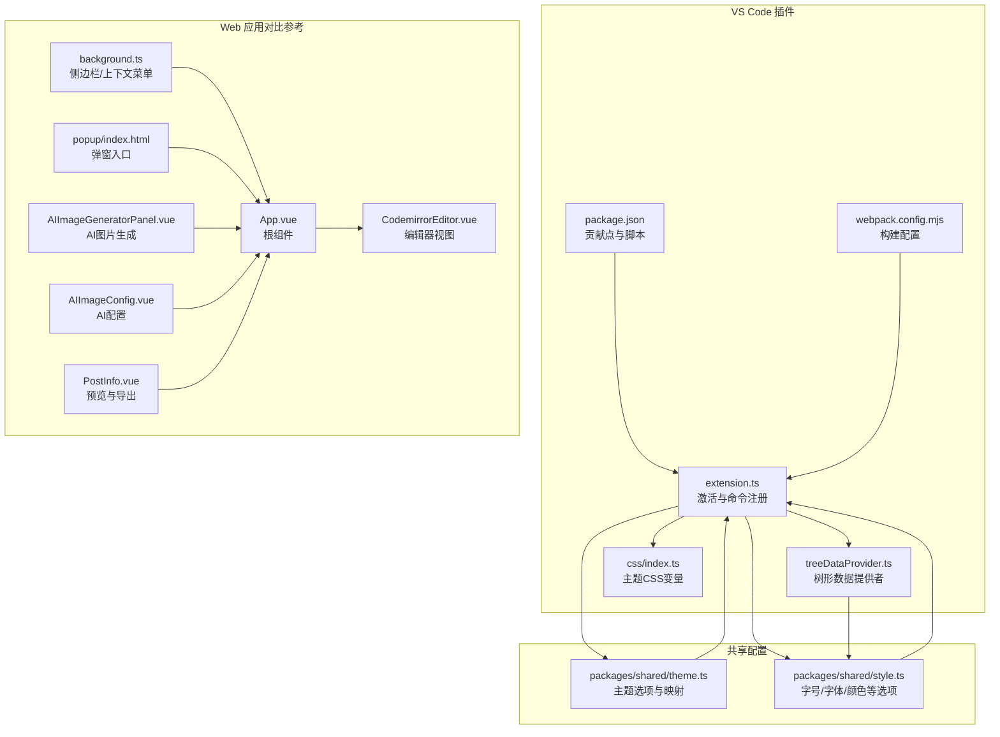
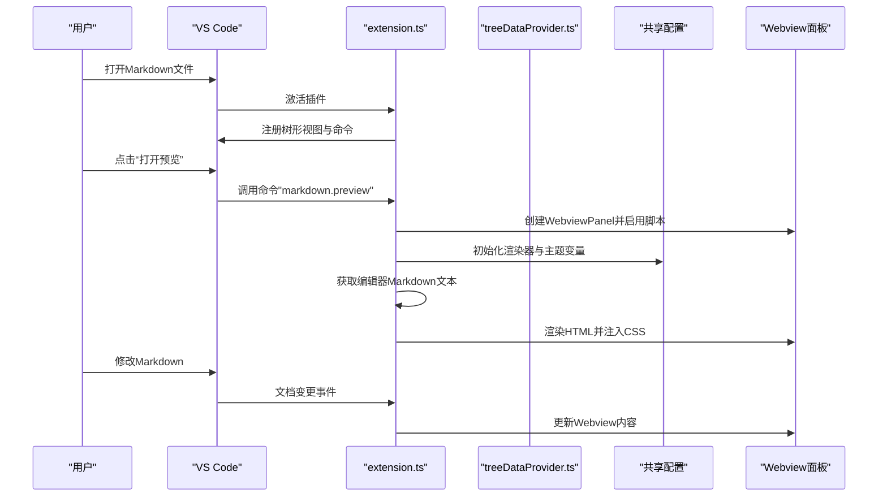
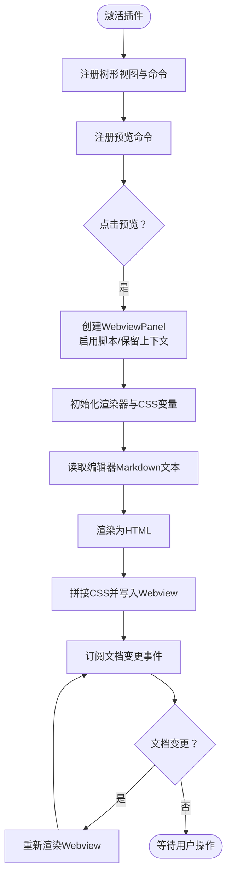
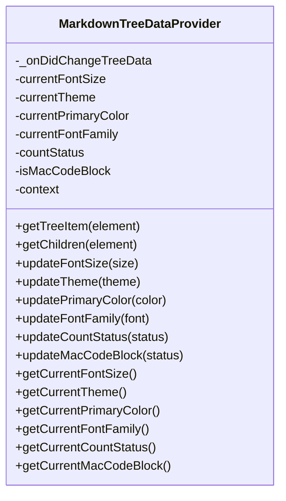
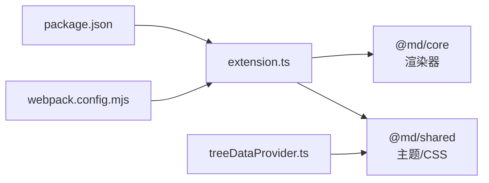

# VS Code插件集成

<cite>
**本文引用的文件列表**
- [apps/vscode/src/extension.ts](file://apps/vscode/src/extension.ts)
- [apps/vscode/src/treeDataProvider.ts](file://apps/vscode/src/treeDataProvider.ts)
- [apps/vscode/src/css/index.ts](file://apps/vscode/src/css/index.ts)
- [apps/vscode/src/styleChoices.ts](file://apps/vscode/src/styleChoices.ts)
- [apps/vscode/package.json](file://apps/vscode/package.json)
- [apps/vscode/webpack.config.mjs](file://apps/vscode/webpack.config.mjs)
- [packages/shared/src/configs/theme.ts](file://packages/shared/src/configs/theme.ts)
- [packages/shared/src/configs/style.ts](file://packages/shared/src/configs/style.ts)
- [apps/web/src/modules/build-extension.ts](file://apps/web/src/modules/build-extension.ts)
- [apps/web/vite.config.ts](file://apps/web/vite.config.ts)
- [apps/web/src/App.vue](file://apps/web/src/App.vue)
- [apps/web/src/views/CodemirrorEditor.vue](file://apps/web/src/views/CodemirrorEditor.vue)
- [apps/web/src/entrypoints/background.ts](file://apps/web/src/entrypoints/background.ts)
- [apps/web/src/entrypoints/popup/index.html](file://apps/web/src/entrypoints/popup/index.html)
- [apps/web/src/components/ai/image-generator/AIImageGeneratorPanel.vue](file://apps/web/src/components/ai/image-generator/AIImageGeneratorPanel.vue)
- [apps/web/src/components/ai/image-generator/AIImageConfig.vue](file://apps/web/src/components/ai/image-generator/AIImageConfig.vue)
- [apps/web/src/components/editor/editor-header/PostInfo.vue](file://apps/web/src/components/editor/editor-header/PostInfo.vue)
</cite>

## 目录
1. [简介](#简介)
2. [项目结构](#项目结构)
3. [核心组件](#核心组件)
4. [架构总览](#架构总览)
5. [详细组件分析](#详细组件分析)
6. [依赖关系分析](#依赖关系分析)
7. [性能考量](#性能考量)
8. [故障排查指南](#故障排查指南)
9. [结论](#结论)
10. [附录](#附录)

## 简介
本文件面向VS Code插件集成场景，围绕extension.ts中的插件激活逻辑、命令注册与贡献点配置展开；解析treeDataProvider.ts实现的树形数据结构与Markdown条目展示；说明插件如何通过自定义Webview嵌入Multipost编辑器UI，实现主题、内容、配置的跨平台一致性；并给出webpack.config.mjs对Vue组件的构建适配与VS Code环境兼容性要点。同时提供调试方法、打包发布流程（vsce publish）及版本更新策略，并对比Web版与VS Code插件的功能差异（如AI能力受限于本地环境）。

## 项目结构
VS Code插件位于apps/vscode目录，核心入口为extension.ts，树形侧边栏由treeDataProvider.ts提供数据源，样式变量与主题映射来自packages/shared，构建配置由webpack.config.mjs负责。Web端用于对比与参考，包含完整的Multipost编辑器UI、AI工具与浏览器扩展侧边栏能力。

图表来源
- [apps/vscode/src/extension.ts](file://apps/vscode/src/extension.ts#L1-L130)
- [apps/vscode/src/treeDataProvider.ts](file://apps/vscode/src/treeDataProvider.ts#L1-L198)
- [apps/vscode/src/css/index.ts](file://apps/vscode/src/css/index.ts#L1-L67)
- [apps/vscode/package.json](file://apps/vscode/package.json#L1-L95)
- [apps/vscode/webpack.config.mjs](file://apps/vscode/webpack.config.mjs#L1-L62)
- [packages/shared/src/configs/theme.ts](file://packages/shared/src/configs/theme.ts#L1-L42)
- [packages/shared/src/configs/style.ts](file://packages/shared/src/configs/style.ts#L1-L244)
- [apps/web/src/App.vue](file://apps/web/src/App.vue#L1-L121)
- [apps/web/src/views/CodemirrorEditor.vue](file://apps/web/src/views/CodemirrorEditor.vue#L526-L573)
- [apps/web/src/entrypoints/background.ts](file://apps/web/src/entrypoints/background.ts#L1-L33)
- [apps/web/src/entrypoints/popup/index.html](file://apps/web/src/entrypoints/popup/index.html#L1-L13)
- [apps/web/src/components/ai/image-generator/AIImageGeneratorPanel.vue](file://apps/web/src/components/ai/image-generator/AIImageGeneratorPanel.vue#L680-L833)
- [apps/web/src/components/ai/image-generator/AIImageConfig.vue](file://apps/web/src/components/ai/image-generator/AIImageConfig.vue#L92-L146)
- [apps/web/src/components/editor/editor-header/PostInfo.vue](file://apps/web/src/components/editor/editor-header/PostInfo.vue#L46-L100)

章节来源
- [apps/vscode/src/extension.ts](file://apps/vscode/src/extension.ts#L1-L130)
- [apps/vscode/src/treeDataProvider.ts](file://apps/vscode/src/treeDataProvider.ts#L1-L198)
- [apps/vscode/package.json](file://apps/vscode/package.json#L1-L95)
- [apps/vscode/webpack.config.mjs](file://apps/vscode/webpack.config.mjs#L1-L62)
- [packages/shared/src/configs/theme.ts](file://packages/shared/src/configs/theme.ts#L1-L42)
- [packages/shared/src/configs/style.ts](file://packages/shared/src/configs/style.ts#L1-L244)

## 核心组件
- 插件激活与命令注册：在extension.ts中注册树形视图、命令（设置字号、字体、主题、主题色、切换计数状态、切换Mac代码块），并通过Webview面板实时预览Markdown渲染结果。
- 树形数据提供者：treeDataProvider.ts实现TreeDataProvider接口，维护工作区状态，提供字号/字体/主题/主题色/计数状态/Mac代码块等配置项的树形菜单与命令绑定。
- 主题与样式：通过packages/shared的themeOptions与styleOptions提供统一的配置项，extension.ts动态生成CSS变量与主题映射，注入到Webview中。
- Webview嵌入：extension.ts创建WebviewPanel，将当前编辑器的Markdown内容渲染为HTML，并拼接主题CSS后写入Webview的html属性，实现跨平台一致的预览体验。
- 构建适配：webpack.config.mjs以node为目标、commonjs2输出、vscode外部化，配合ts-loader与asset/source处理CSS/文本资源，保证VS Code环境兼容。

章节来源
- [apps/vscode/src/extension.ts](file://apps/vscode/src/extension.ts#L1-L130)
- [apps/vscode/src/treeDataProvider.ts](file://apps/vscode/src/treeDataProvider.ts#L1-L198)
- [apps/vscode/src/css/index.ts](file://apps/vscode/src/css/index.ts#L1-L67)
- [apps/vscode/src/styleChoices.ts](file://apps/vscode/src/styleChoices.ts#L1-L11)
- [apps/vscode/package.json](file://apps/vscode/package.json#L1-L95)
- [apps/vscode/webpack.config.mjs](file://apps/vscode/webpack.config.mjs#L1-L62)
- [packages/shared/src/configs/theme.ts](file://packages/shared/src/configs/theme.ts#L1-L42)
- [packages/shared/src/configs/style.ts](file://packages/shared/src/configs/style.ts#L1-L244)

## 架构总览
VS Code插件通过激活函数建立树形侧边栏与Webview预览，命令注册与贡献点驱动用户交互；共享配置模块提供统一的主题与样式选项；构建配置确保在VS Code环境中正确打包与运行。

图表来源
- [apps/vscode/src/extension.ts](file://apps/vscode/src/extension.ts#L1-L130)
- [apps/vscode/src/treeDataProvider.ts](file://apps/vscode/src/treeDataProvider.ts#L1-L198)
- [packages/shared/src/configs/theme.ts](file://packages/shared/src/configs/theme.ts#L1-L42)
- [packages/shared/src/configs/style.ts](file://packages/shared/src/configs/style.ts#L1-L244)

## 详细组件分析

### 插件激活与命令注册（extension.ts）
- 激活流程
  - 注册树形视图：将MarkdownTreeDataProvider注册为"markdown.preview.view"视图的数据提供者。
  - 注册命令：包括设置字号、字体、主题、主题色，以及切换计数状态与Mac代码块。
  - 预览命令：当活动编辑器为Markdown时，创建WebviewPanel，启用脚本与保留上下文，监听文档变化并实时更新预览。
  - 状态栏上下文：根据当前是否为Markdown文件设置上下文键值，控制菜单显示。
- Webview渲染
  - 使用共享渲染器初始化渲染参数（计数状态、Mac代码块等），将Markdown转换为HTML。
  - 生成CSS变量（主题色、字体族、字号等），合并基础CSS与主题映射，包裹到固定宽度容器中写入Webview。
- 数据同步
  - 订阅文档变更事件，当当前编辑器文档发生变化时，重新渲染Webview，确保预览与编辑器内容保持一致。

图表来源
- [apps/vscode/src/extension.ts](file://apps/vscode/src/extension.ts#L1-L130)

章节来源
- [apps/vscode/src/extension.ts](file://apps/vscode/src/extension.ts#L1-L130)

### 树形数据提供者（treeDataProvider.ts）
- 数据结构
  - 维护当前字号、主题、主题色、字体族、计数状态、Mac代码块等状态，均存储于工作区状态，实现持久化。
  - 实现TreeDataProvider接口，提供树节点与子节点，支持展开/折叠与命令绑定。
- 节点与命令
  - 顶层节点：字号、字体、主题、主题色、计数状态、Mac代码块。
  - 子节点：每个选项对应一个命令参数，执行后更新状态并触发树形视图刷新。
  - 勾选图标：当前选中项显示勾选图标，直观反馈当前配置。
- 状态更新
  - 更新任一配置项后，写入工作区状态并触发onDidChangeTreeData事件，通知UI刷新。

图表来源
- [apps/vscode/src/treeDataProvider.ts](file://apps/vscode/src/treeDataProvider.ts#L1-L198)

章节来源
- [apps/vscode/src/treeDataProvider.ts](file://apps/vscode/src/treeDataProvider.ts#L1-L198)
- [apps/vscode/src/styleChoices.ts](file://apps/vscode/src/styleChoices.ts#L1-L11)
- [packages/shared/src/configs/style.ts](file://packages/shared/src/configs/style.ts#L1-L244)
- [packages/shared/src/configs/theme.ts](file://packages/shared/src/configs/theme.ts#L1-L42)

### 主题与样式系统
- 主题映射
  - 通过packages/shared的theme.ts导出themeMap与ThemeName，extension.ts按当前主题选择对应CSS。
- 样式选项
  - style.ts提供字号、字体、颜色、代码块主题等选项，treeDataProvider.ts作为数据源，extension.ts在Webview中应用这些选项生成CSS变量。
- CSS变量注入
  - extension.ts调用generateCSSVariables生成主题变量，结合baseCSSContent与主题CSS，最终注入Webview。

章节来源
- [packages/shared/src/configs/theme.ts](file://packages/shared/src/configs/theme.ts#L1-L42)
- [packages/shared/src/configs/style.ts](file://packages/shared/src/configs/style.ts#L1-L244)
- [apps/vscode/src/css/index.ts](file://apps/vscode/src/css/index.ts#L1-L67)
- [apps/vscode/src/extension.ts](file://apps/vscode/src/extension.ts#L68-L129)

### Webview嵌入与Multipost编辑器UI一致性
- Webview预览
  - extension.ts创建WebviewPanel，启用脚本与保留上下文，将渲染后的HTML与CSS注入Webview，形成独立的预览窗口。
  - 固定容器宽度模拟移动端预览，保证与Web端一致的展示效果。
- 与Web端UI对比
  - Web端提供完整的编辑器、侧边栏、AI工具与浏览器扩展侧边栏能力；VS Code插件通过Webview聚焦预览与配置，不包含完整编辑器UI。
  - Web端的AI图片生成功能在VS Code插件中不可用，因为VS Code环境限制了网络请求与本地资源访问。

章节来源
- [apps/vscode/src/extension.ts](file://apps/vscode/src/extension.ts#L40-L129)
- [apps/web/src/App.vue](file://apps/web/src/App.vue#L1-L121)
- [apps/web/src/views/CodemirrorEditor.vue](file://apps/web/src/views/CodemirrorEditor.vue#L526-L573)
- [apps/web/src/entrypoints/background.ts](file://apps/web/src/entrypoints/background.ts#L1-L33)
- [apps/web/src/entrypoints/popup/index.html](file://apps/web/src/entrypoints/popup/index.html#L1-L13)
- [apps/web/src/components/ai/image-generator/AIImageGeneratorPanel.vue](file://apps/web/src/components/ai/image-generator/AIImageGeneratorPanel.vue#L680-L833)
- [apps/web/src/components/ai/image-generator/AIImageConfig.vue](file://apps/web/src/components/ai/image-generator/AIImageConfig.vue#L92-L146)

### 构建适配（webpack.config.mjs）
- 目标与输出
  - target: node，输出格式为commonjs2，入口为src/extension.ts，输出文件为dist/extension.js。
- 外部化与解析
  - externals: vscode外部化为commonjs，避免打包VS Code API。
  - resolve.extensions: .ts/.js，fallback禁用部分浏览器polyfill依赖，减少体积。
  - tsconfig-paths-webpack-plugin用于路径解析。
- 模块规则
  - ts-loader处理TypeScript，asset/source处理CSS与文本资源。
- 开发与优化
  - devtool: nosources-source-map，基础设施日志级别为log。
  - optimization: usedExports与sideEffects，提升Tree Shaking效果。

章节来源
- [apps/vscode/webpack.config.mjs](file://apps/vscode/webpack.config.mjs#L1-L62)

## 依赖关系分析
- 插件对共享配置的依赖
  - extension.ts依赖@md/core的渲染器与@md/shared的主题映射与CSS常量。
  - treeDataProvider.ts依赖@md/shared的配置选项集合。
- 构建链路
  - package.json定义main为dist/extension.js，scripts中包含编译、打包与vsce package命令。
  - webpack.config.mjs与tsconfig共同决定产物与兼容性。

图表来源
- [apps/vscode/src/extension.ts](file://apps/vscode/src/extension.ts#L1-L130)
- [apps/vscode/src/treeDataProvider.ts](file://apps/vscode/src/treeDataProvider.ts#L1-L198)
- [apps/vscode/package.json](file://apps/vscode/package.json#L1-L95)
- [apps/vscode/webpack.config.mjs](file://apps/vscode/webpack.config.mjs#L1-L62)

章节来源
- [apps/vscode/src/extension.ts](file://apps/vscode/src/extension.ts#L1-L130)
- [apps/vscode/src/treeDataProvider.ts](file://apps/vscode/src/treeDataProvider.ts#L1-L198)
- [apps/vscode/package.json](file://apps/vscode/package.json#L1-L95)
- [apps/vscode/webpack.config.mjs](file://apps/vscode/webpack.config.mjs#L1-L62)

## 性能考量
- Webview渲染
  - 仅在文档变更时触发更新，避免频繁重渲染。
  - CSS变量与主题映射在内存中计算，减少重复DOM操作。
- 构建优化
  - 使用usedExports与sideEffects，配合ts-loader与asset/source，减小包体。
  - 外部化vscode避免打包过大。
- UI一致性
  - 固定容器宽度与主题变量统一，减少布局抖动。

[本节为通用建议，无需特定文件引用]

## 故障排查指南
- Webview无法加载或空白
  - 检查enableScripts与retainContextWhenHidden是否正确设置。
  - 确认CSS变量与主题映射拼接顺序正确，避免覆盖。
- 配置不生效
  - 确认工作区状态已更新且树形视图事件已触发。
  - 检查共享配置选项是否正确传入渲染器与CSS变量生成函数。
- 构建失败
  - 确认tsconfig-paths-webpack-plugin与ts-loader配置正确。
  - 检查externals中vscode外部化是否生效。
- Web端与VS Code插件差异
  - VS Code插件不包含AI图片生成功能，若需要该能力请使用Web端或浏览器扩展。

章节来源
- [apps/vscode/src/extension.ts](file://apps/vscode/src/extension.ts#L40-L129)
- [apps/vscode/src/treeDataProvider.ts](file://apps/vscode/src/treeDataProvider.ts#L1-L198)
- [apps/vscode/webpack.config.mjs](file://apps/vscode/webpack.config.mjs#L1-L62)

## 结论
VS Code插件通过extension.ts实现了从命令到Webview预览的完整闭环，treeDataProvider.ts提供了可配置的树形侧边栏，共享配置模块确保主题与样式的跨平台一致性。构建配置针对VS Code环境进行了专门适配，保证兼容性与性能。Web端与浏览器扩展提供了更完整的编辑器与AI能力，VS Code插件则专注于Markdown预览与配置管理，二者互补。

[本节为总结，无需特定文件引用]

## 附录

### 贡献点与命令注册（contributes）
- 视图容器与视图
  - 在活动栏创建"Markdown Preview"容器，并添加"Preview"视图。
- 命令
  - 预览命令：打开Markdown预览。
  - 字号/字体/主题/主题色设置命令。
  - 切换计数状态与Mac代码块命令。
- 菜单
  - 在编辑器标题栏显示预览按钮，仅在Markdown语言环境下可见。

章节来源
- [apps/vscode/package.json](file://apps/vscode/package.json#L1-L95)

### 调试方法
- VS Code插件调试
  - 使用VS Code启动调试任务，附加到插件进程，断点定位在extension.ts与treeDataProvider.ts。
- Web端调试
  - 使用Vite开发服务器，结合Vue DevTools进行组件级调试。
  - 对比Web端与VS Code插件的渲染差异，重点检查CSS变量与主题映射。

章节来源
- [apps/vscode/src/extension.ts](file://apps/vscode/src/extension.ts#L1-L130)
- [apps/web/vite.config.ts](file://apps/web/vite.config.ts#L1-L92)

### 打包发布流程（vsce publish）
- 构建与打包
  - 使用npm run build生成生产包，dist/extension.js为最终产物。
  - 使用npm run package生成VSIX包，包含--no-dependencies与--allow-package-secrets参数。
- 发布
  - 使用vsce publish进行发布，需满足VS Code Marketplace要求与签名。

章节来源
- [apps/vscode/package.json](file://apps/vscode/package.json#L70-L95)

### 版本更新策略
- 版本管理
  - package.json中定义版本号，遵循语义化版本。
  - 可参考仓库中的release脚本与CI流程进行版本更新与标签推送。
- Web端与VS Code插件差异
  - VS Code插件不包含AI图片生成功能，Web端提供完整AI工具集；在VS Code环境中，AI相关能力受限于本地网络与权限配置。

章节来源
- [apps/vscode/package.json](file://apps/vscode/package.json#L1-L95)
- [apps/web/src/components/ai/image-generator/AIImageGeneratorPanel.vue](file://apps/web/src/components/ai/image-generator/AIImageGeneratorPanel.vue#L680-L833)
- [apps/web/src/components/ai/image-generator/AIImageConfig.vue](file://apps/web/src/components/ai/image-generator/AIImageConfig.vue#L92-L146)