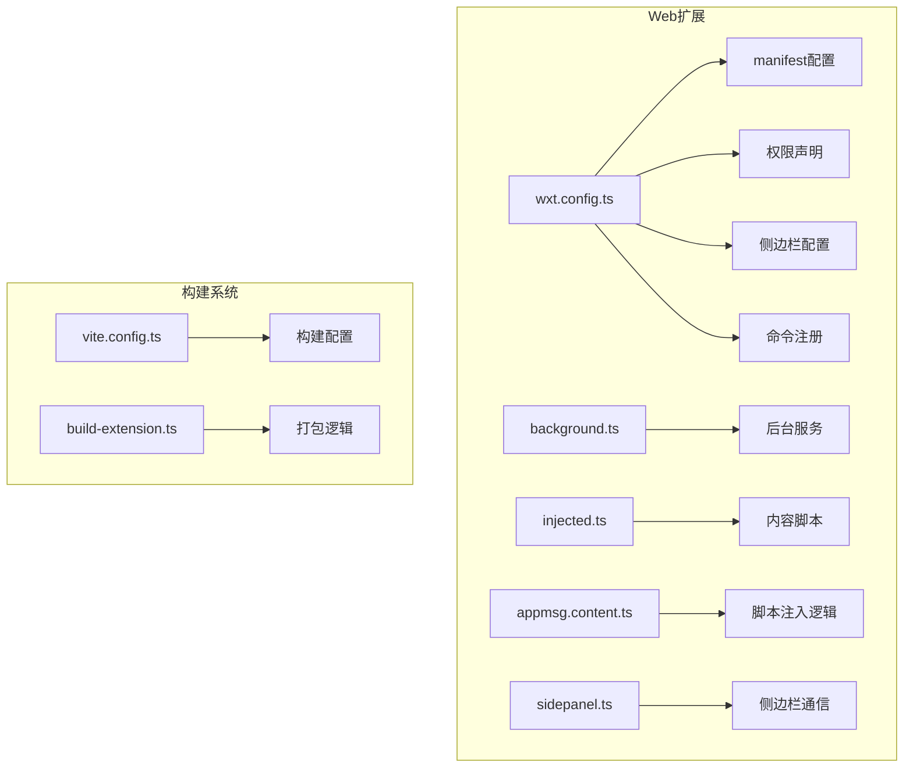
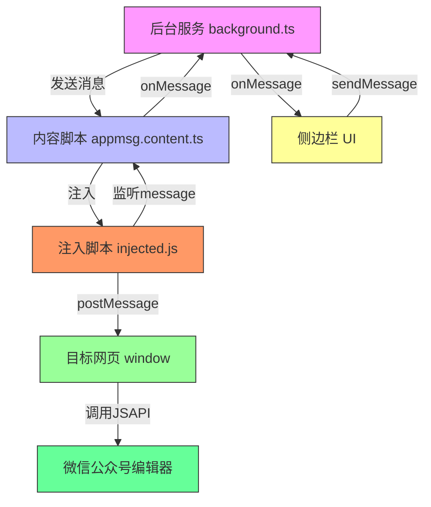
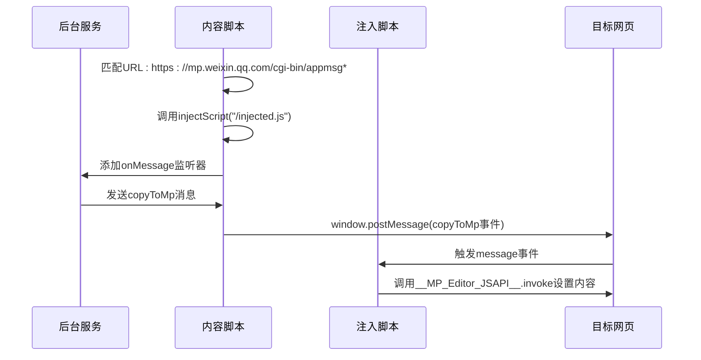
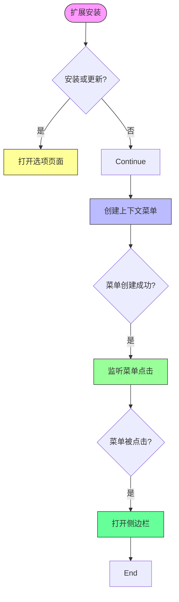
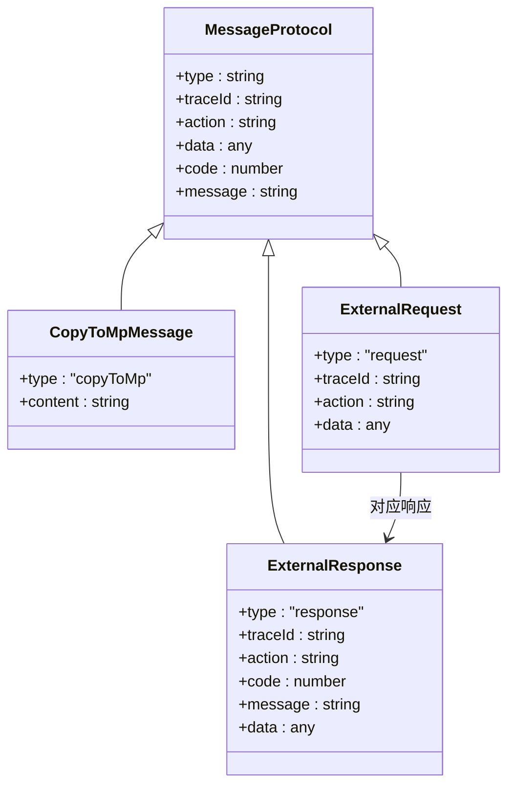
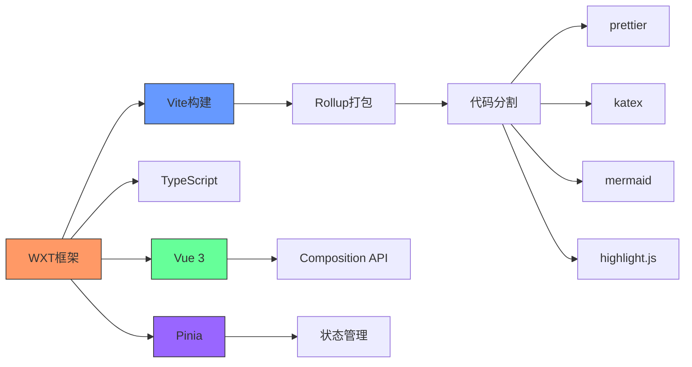

# Web应用集成

<cite>
**本文档中引用的文件**  
- [wxt.config.ts](file://apps/web/wxt.config.ts)
- [injected.ts](file://apps/web/src/entrypoints/injected.ts)
- [background.ts](file://apps/web/src/entrypoints/background.ts)
- [appmsg.content.ts](file://apps/web/src/entrypoints/appmsg.content.ts)
- [sidepanel.ts](file://apps/web/src/sidepanel.ts)
- [extension.ts](file://apps/web/src/utils/extension.ts)
- [vite.config.ts](file://apps/web/vite.config.ts)
- [main.ts](file://apps/web/src/main.ts)
- [App.vue](file://apps/web/src/App.vue)
- [popup.ts](file://apps/web/src/entrypoints/popup/popup.ts)
</cite>

## 目录
1. [项目结构](#项目结构)
2. [核心组件](#核心组件)
3. [架构概述](#架构概述)
4. [详细组件分析](#详细组件分析)
5. [依赖分析](#依赖分析)
6. [性能考虑](#性能考虑)
7. [故障排除指南](#故障排除指南)
8. [结论](#结论)

## 项目结构

该项目是一个基于WXT框架构建的浏览器扩展，主要用于在微信公众号后台等Web应用中集成Markdown编辑功能。项目采用模块化设计，主要分为多个应用入口（apps），包括uTools插件、VS Code扩展和Web浏览器扩展。

Web扩展部分（apps/web）是本项目的核心，包含以下关键目录：
- `src/entrypoints`：入口点文件，包括`background.ts`（后台服务）、`injected.ts`（内容脚本注入）、`popup`（弹出页面）和`appmsg.content.ts`（内容脚本）
- `src/components`：UI组件库，包含AI助手、工具箱、编辑器头部等模块化组件
- `src/stores`：Pinia状态管理模块，管理编辑器、主题、AI配置等状态
- `src/utils`：工具函数，包括扩展通信、存储、文件处理等
- `src/modules`：构建扩展的自定义模块

项目使用Vite作为构建工具，结合WXT框架简化浏览器扩展开发流程，支持Chrome和Firefox等多浏览器兼容。



**Diagram sources**
- [wxt.config.ts](file://apps/web/wxt.config.ts#L23-L70)
- [background.ts](file://apps/web/src/entrypoints/background.ts#L3-L34)
- [injected.ts](file://apps/web/src/entrypoints/injected.ts#L1-L16)
- [appmsg.content.ts](file://apps/web/src/entrypoints/appmsg.content.ts#L3-L19)
- [sidepanel.ts](file://apps/web/src/sidepanel.ts#L1-L38)
- [vite.config.ts](file://apps/web/vite.config.ts#L24-L92)

**Section sources**
- [wxt.config.ts](file://apps/web/wxt.config.ts#L1-L102)
- [project_structure](file://#L1-L200)

## 核心组件

本项目的核心组件包括基于WXT框架的浏览器扩展架构，主要由后台服务（background）、内容脚本（content script）和注入脚本（injected script）三部分组成。这些组件协同工作，实现与目标Web应用（如微信公众号后台）的无缝集成。

后台服务负责管理扩展的生命周期、监听浏览器事件和处理跨页面通信。内容脚本负责在特定网页上下文中执行，注入必要的JavaScript代码。注入脚本则直接与目标网页的DOM和JavaScript环境交互，实现功能集成。

扩展通过侧边栏（side_panel/sidebar_action）提供用户界面，支持快捷键（_execute_sidebar_action）快速打开。通信机制基于`chrome.runtime.sendMessage`和`chrome.runtime.onMessage` API，确保各组件间安全可靠的消息传递。

**Section sources**
- [wxt.config.ts](file://apps/web/wxt.config.ts#L23-L70)
- [background.ts](file://apps/web/src/entrypoints/background.ts#L3-L34)
- [injected.ts](file://apps/web/src/entrypoints/injected.ts#L1-L16)
- [appmsg.content.ts](file://apps/web/src/entrypoints/appmsg.content.ts#L3-L19)

## 架构概述

该项目采用典型的浏览器扩展三层架构：后台服务层、内容脚本层和注入脚本层。这种分层设计确保了安全性和功能分离，同时通过标准化的通信协议实现各层间的协作。



**Diagram sources**
- [background.ts](file://apps/web/src/entrypoints/background.ts#L3-L34)
- [appmsg.content.ts](file://apps/web/src/entrypoints/appmsg.content.ts#L3-L19)
- [injected.ts](file://apps/web/src/entrypoints/injected.ts#L1-L16)
- [sidepanel.ts](file://apps/web/src/sidepanel.ts#L1-L38)

## 详细组件分析

### WXT配置分析

`wxt.config.ts`文件定义了扩展的核心配置，包括manifest配置、权限声明、侧边栏集成和命令注册等关键属性。

```mermaid
classDiagram
class ManifestConfig {
+name : string
+version : string
+icons : object
+permissions : string[]
+host_permissions : string[]
+web_accessible_resources : object[]
+side_panel : object
+sidebar_action : object
+commands : object
}
ManifestConfig : +name = "公众号内容编辑器"
ManifestConfig : +permissions = ["storage", "activeTab", "sidePanel", "contextMenus"]
ManifestConfig : +host_permissions = ["https : //*.weixin.qq.com/*", "https : //*.qpic.cn/*"]
ManifestConfig : +side_panel.default_path = "sidepanel.html"
ManifestConfig : +commands._execute_sidebar_action.description = "Open MD Editor Side Panel"
```

**Diagram sources**
- [wxt.config.ts](file://apps/web/wxt.config.ts#L26-L70)

**Section sources**
- [wxt.config.ts](file://apps/web/wxt.config.ts#L1-L102)

### 内容脚本注入机制

`appmsg.content.ts`文件定义了内容脚本的注入逻辑，该脚本在匹配的URL模式（微信公众号后台）下自动执行。



**Diagram sources**
- [appmsg.content.ts](file://apps/web/src/entrypoints/appmsg.content.ts#L3-L19)
- [injected.ts](file://apps/web/src/entrypoints/injected.ts#L1-L16)

**Section sources**
- [appmsg.content.ts](file://apps/web/src/entrypoints/appmsg.content.ts#L1-L20)
- [injected.ts](file://apps/web/src/entrypoints/injected.ts#L1-L16)

### 后台服务工作原理

`background.ts`文件定义了后台服务的主要功能，包括扩展安装监听、上下文菜单创建和点击事件处理。



**Diagram sources**
- [background.ts](file://apps/web/src/entrypoints/background.ts#L6-L32)

**Section sources**
- [background.ts](file://apps/web/src/entrypoints/background.ts#L1-L34)

### 通信协议分析

扩展各组件间通过标准化的消息通信协议进行交互，主要消息类型包括`copyToMp`用于内容同步。



**Diagram sources**
- [extension.ts](file://apps/web/src/utils/extension.ts#L5-L65)
- [sidepanel.ts](file://apps/web/src/sidepanel.ts#L28-L38)
- [appmsg.content.ts](file://apps/web/src/entrypoints/appmsg.content.ts#L10-L14)

**Section sources**
- [extension.ts](file://apps/web/src/utils/extension.ts#L1-L173)
- [sidepanel.ts](file://apps/web/src/sidepanel.ts#L1-L38)

## 依赖分析

该项目依赖WXT框架作为核心开发工具，简化了浏览器扩展的开发流程。构建系统基于Vite，结合TypeScript、Vue 3和Pinia等现代前端技术栈。



**Diagram sources**
- [wxt.config.ts](file://apps/web/wxt.config.ts#L4-L102)
- [vite.config.ts](file://apps/web/vite.config.ts#L1-L92)
- [package.json](file://apps/web/package.json#L1-L50)

**Section sources**
- [wxt.config.ts](file://apps/web/wxt.config.ts#L1-L102)
- [vite.config.ts](file://apps/web/vite.config.ts#L1-L92)

## 性能考虑

项目在性能方面进行了多项优化，包括代码分割、资源懒加载和高效的通信机制。通过Vite的构建配置，实现了按需加载第三方库（如mermaid、katex等），减少初始加载时间。

扩展采用事件驱动架构，后台服务仅在需要时激活，避免持续占用系统资源。内容脚本和注入脚本的执行范围被严格限制在特定的URL模式下，确保不影响其他网页的性能。

消息通信采用异步Promise模式，配合超时机制，防止长时间阻塞。UUID跟踪ID确保了请求-响应的精确匹配，提高了通信的可靠性和调试能力。

## 故障排除指南

当扩展无法正常工作时，可按照以下步骤进行排查：

1. **检查权限**：确保扩展已获得必要的权限，特别是`sidePanel`和`activeTab`。
2. **验证URL匹配**：确认当前页面URL是否符合`https://mp.weixin.qq.com/cgi-bin/appmsg*`模式。
3. **检查脚本注入**：在开发者工具中查看`injected.js`是否已成功注入目标页面。
4. **查看消息通信**：通过`console.log`检查`copyToMp`消息是否正确发送和接收。
5. **验证JSAPI可用性**：确认目标页面是否存在`__MP_Editor_JSAPI__`对象及其`invoke`方法。

常见问题包括CSP（内容安全策略）限制导致脚本注入失败，或目标页面JSAPI接口变更导致调用失败。建议保持扩展与目标Web应用的兼容性更新。

**Section sources**
- [appmsg.content.ts](file://apps/web/src/entrypoints/appmsg.content.ts#L6-L8)
- [injected.ts](file://apps/web/src/entrypoints/injected.ts#L6-L13)
- [sidepanel.ts](file://apps/web/src/sidepanel.ts#L33-L36)

## 结论

本项目成功实现了基于WXT框架的浏览器扩展，为微信公众号后台等Web应用提供了强大的Markdown编辑集成能力。通过合理的架构设计和组件划分，实现了后台服务、内容脚本和注入脚本的高效协作。

扩展的核心价值在于无缝集成和一键同步功能，用户可以通过侧边栏界面编辑内容，并直接同步到目标网页的编辑器中。通信协议设计安全可靠，支持扩展未来功能的迭代和增强。

该解决方案不仅适用于微信公众号场景，其架构模式也可推广到其他Web应用的内容编辑集成，具有良好的可扩展性和维护性。