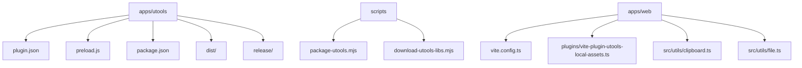
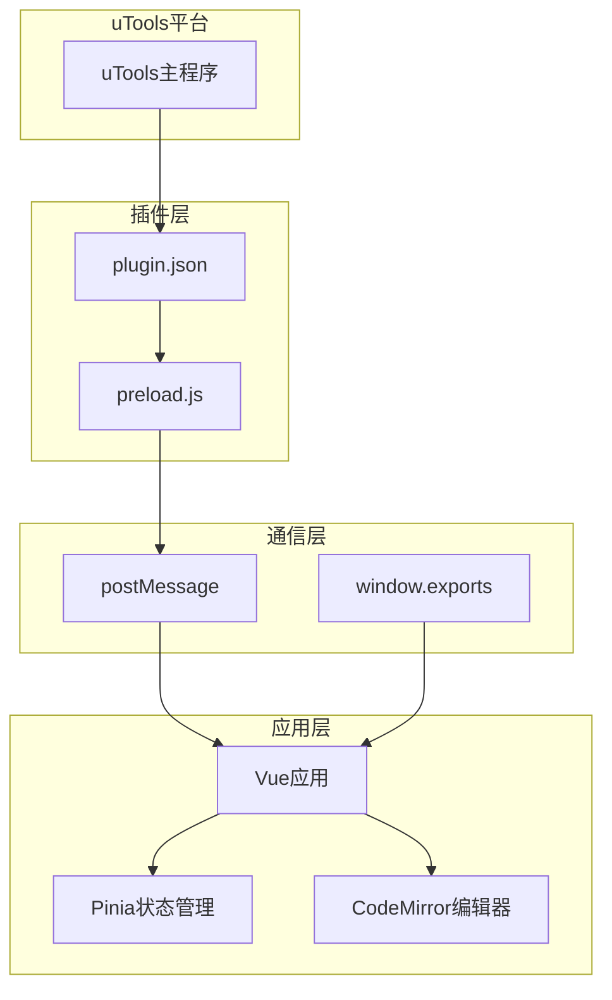
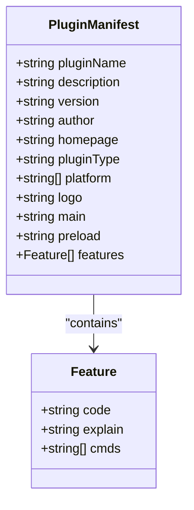
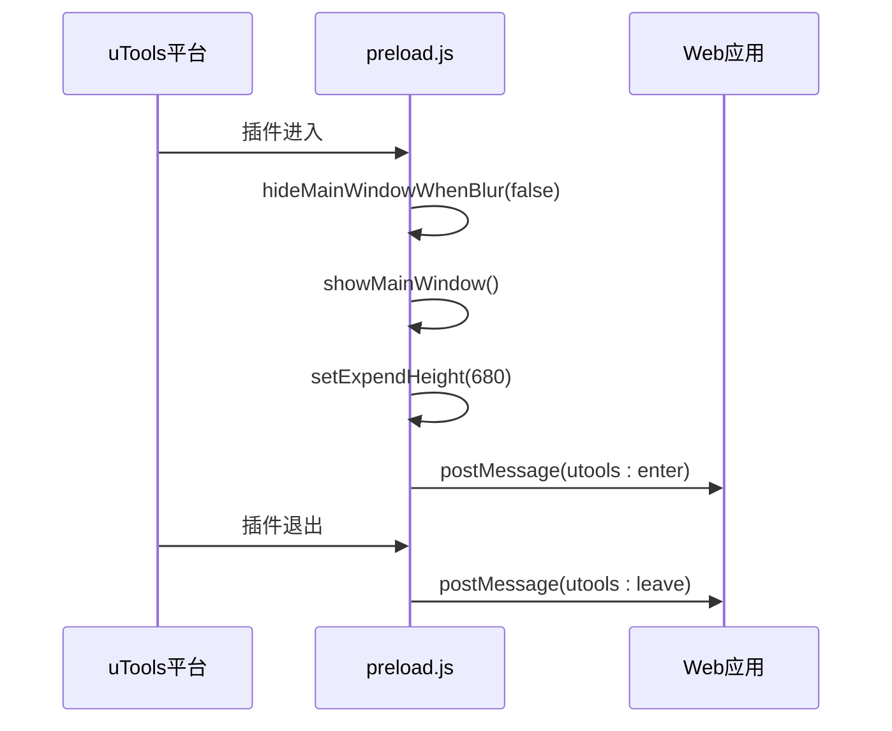
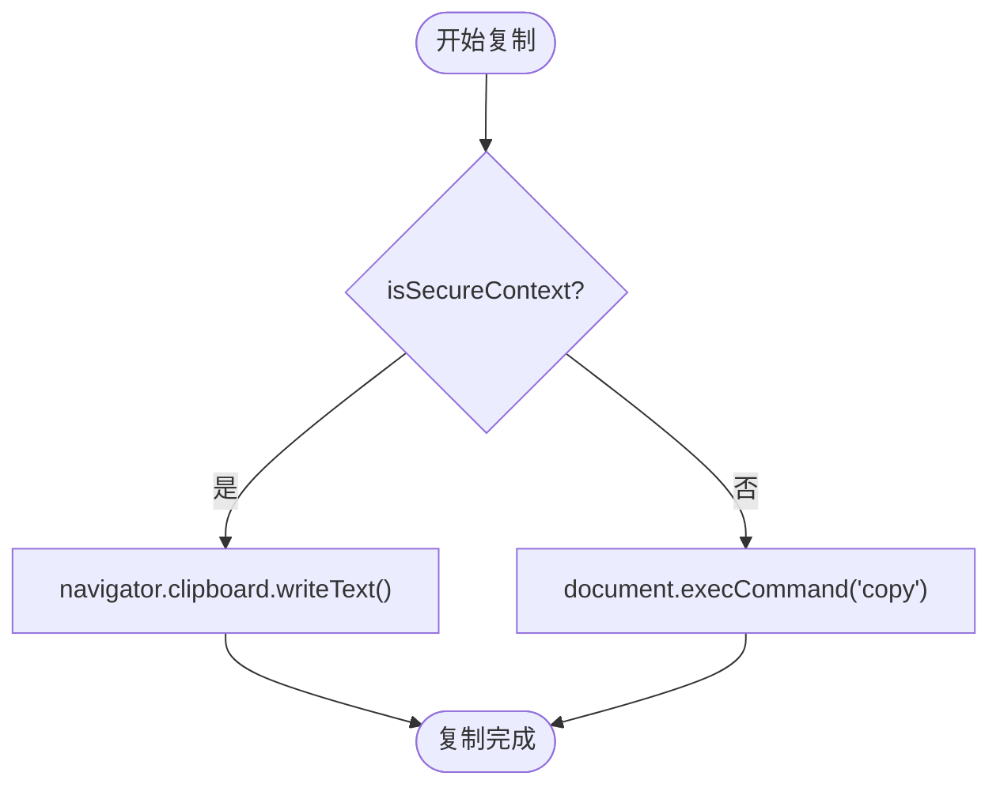
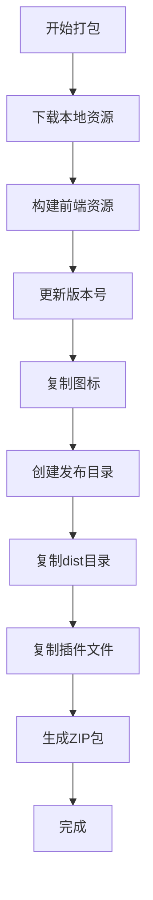
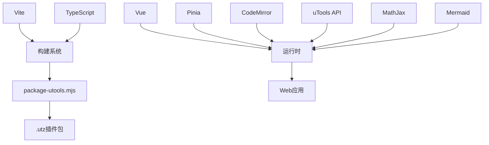

# uTools插件集成

<cite>
**本文档引用的文件**  
- [plugin.json](file://apps/utools/plugin.json)
- [preload.js](file://apps/utools/preload.js)
- [package-utools.mjs](file://scripts/package-utools.mjs)
- [clipboard.ts](file://apps/web/src/utils/clipboard.ts)
- [file.ts](file://apps/web/src/utils/file.ts)
- [vite.config.ts](file://apps/web/vite.config.ts)
- [download-utools-libs.mjs](file://scripts/download-utools-libs.mjs)
- [utools-local-assets.ts](file://apps/web/plugins/vite-plugin-utools-local-assets.ts)
- [main.ts](file://apps/web/src/main.ts)
- [sidepanel.ts](file://apps/web/src/sidepanel.ts)
- [README.md](file://apps/utools/README.md)
</cite>

## 目录
1. [简介](#简介)
2. [项目结构](#项目结构)
3. [核心组件](#核心组件)
4. [架构概述](#架构概述)
5. [详细组件分析](#详细组件分析)
6. [依赖分析](#依赖分析)
7. [性能考虑](#性能考虑)
8. [故障排除指南](#故障排除指南)
9. [结论](#结论)

## 简介
本文档详细阐述了微信Markdown编辑器集成uTools插件的完整实现。通过分析`plugin.json`中的关键字段、`preload.js`的预加载逻辑、本地能力调用机制以及打包脚本的作用，全面解析了插件在uTools平台的注册、触发、通信和发布流程。文档还提供了调试技巧、权限申请和发布注意事项，为开发者提供完整的集成指导。

## 项目结构
uTools插件相关文件位于`apps/utools`目录下，与主Web应用分离但共享核心功能。该结构实现了插件化集成的同时保持代码复用。

**Diagram sources**
- [plugin.json](file://apps/utools/plugin.json)
- [preload.js](file://apps/utools/preload.js)
- [package-utools.mjs](file://scripts/package-utools.mjs)
- [vite.config.ts](file://apps/web/vite.config.ts)
- [utools-local-assets.ts](file://apps/web/plugins/vite-plugin-utools-local-assets.ts)

**Section sources**
- [plugin.json](file://apps/utools/plugin.json)
- [preload.js](file://apps/utools/preload.js)
- [package-utools.mjs](file://scripts/package-utools.mjs)

## 核心组件
核心组件包括插件清单文件`plugin.json`、预加载脚本`preload.js`和打包脚本`package-utools.mjs`。这些组件共同实现了uTools插件的注册、生命周期管理和打包发布功能。`plugin.json`定义了插件的元数据和触发方式，`preload.js`建立了uTools与Web应用之间的通信桥梁，而`package-utools.mjs`则自动化了插件的构建和打包流程。

**Section sources**
- [plugin.json](file://apps/utools/plugin.json)
- [preload.js](file://apps/utools/preload.js)
- [package-utools.mjs](file://scripts/package-utools.mjs)

## 架构概述
uTools插件架构采用分层设计，分为插件层、通信层和应用层。插件层由`plugin.json`和`preload.js`组成，负责与uTools平台交互；通信层通过`postMessage`实现双向通信；应用层是基于Vue的Web应用，提供完整的Markdown编辑功能。打包脚本将这些层次整合为符合uTools规范的插件包。

**Diagram sources**
- [plugin.json](file://apps/utools/plugin.json)
- [preload.js](file://apps/utools/preload.js)
- [main.ts](file://apps/web/src/main.ts)

## 详细组件分析

### plugin.json配置分析
`plugin.json`是uTools插件的清单文件，定义了插件的基本信息和行为。`pluginId`字段标识插件的唯一性，`main`字段指定插件的主页面入口（`dist/index.html`），`preload`字段指定预加载脚本（`preload.js`），`features`字段定义了插件的功能特性，包括触发命令和说明。

**Diagram sources**
- [plugin.json](file://apps/utools/plugin.json)

**Section sources**
- [plugin.json](file://apps/utools/plugin.json)

### preload.js预加载逻辑
`preload.js`脚本在uTools渲染进程和Web应用之间建立通信。它通过`utools.onPluginEnter`监听插件进入事件，配置窗口行为（如设置高度、防止失焦隐藏），并通过`postMessage`通知前端应用。脚本还导出`window.exports`对象，定义插件的进入和退出回调函数。

**Diagram sources**
- [preload.js](file://apps/utools/preload.js)

**Section sources**
- [preload.js](file://apps/utools/preload.js)

### 本地能力调用实现
插件通过多种方式调用系统本地能力。剪贴板操作通过`navigator.clipboard`API实现，兼容旧版浏览器的`document.execCommand`。文件读写通过Node.js的`fs`模块和各种云存储SDK（如AWS S3、腾讯云COS、阿里云OSS）实现，支持多种文件上传目标。

**Diagram sources**
- [clipboard.ts](file://apps/web/src/utils/clipboard.ts)
- [file.ts](file://apps/web/src/utils/file.ts)

**Section sources**
- [clipboard.ts](file://apps/web/src/utils/clipboard.ts)
- [file.ts](file://apps/web/src/utils/file.ts)

### 打包脚本作用分析
`package-utools.mjs`脚本自动化了插件的打包流程。它首先下载所需的本地资源（如MathJax、Mermaid），然后构建前端资源，更新插件版本号，复制图标文件，最后将所有文件打包为`.utz`格式的安装包。该脚本确保了插件符合uTools的离线运行要求。

**Diagram sources**
- [package-utools.mjs](file://scripts/package-utools.mjs)
- [download-utools-libs.mjs](file://scripts/download-utools-libs.mjs)

**Section sources**
- [package-utools.mjs](file://scripts/package-utools.mjs)
- [download-utools-libs.mjs](file://scripts/download-utools-libs.mjs)

## 依赖分析
插件依赖关系清晰分层。构建依赖包括Vite、TypeScript和各种插件；运行时依赖包括Vue、Pinia和CodeMirror；uTools特定依赖包括utools API和本地资源库。Vite插件`utoolsLocalAssetsPlugin`在构建时自动替换CDN链接为本地路径，确保插件离线可用。

**Diagram sources**
- [vite.config.ts](file://apps/web/vite.config.ts)
- [package-utools.mjs](file://scripts/package-utools.mjs)

**Section sources**
- [vite.config.ts](file://apps/web/vite.config.ts)
- [package-utools.mjs](file://scripts/package-utools.mjs)

## 性能考虑
插件性能优化主要体现在构建和运行时两个方面。构建时通过代码分割将第三方库（如mermaid、katex）拆分为独立chunk，减少主包体积。运行时通过懒加载和缓存机制提高响应速度。预加载脚本的轻量化设计确保了快速启动。

## 故障排除指南
常见问题包括插件无法加载、通信失败和资源缺失。调试时应检查`plugin.json`配置是否正确，确认`preload.js`是否成功注入，验证本地资源是否下载完整。使用uTools开发者工具可以查看控制台日志和网络请求，定位具体问题。

**Section sources**
- [README.md](file://apps/utools/README.md)
- [preload.js](file://apps/utools/preload.js)

## 结论
uTools插件集成通过清晰的架构设计和自动化流程，实现了微信Markdown编辑器的无缝集成。`plugin.json`和`preload.js`构成了插件与平台交互的基础，打包脚本确保了发布的便捷性，而本地能力调用则扩展了应用的功能边界。这一集成方案为类似应用提供了可复用的模板。