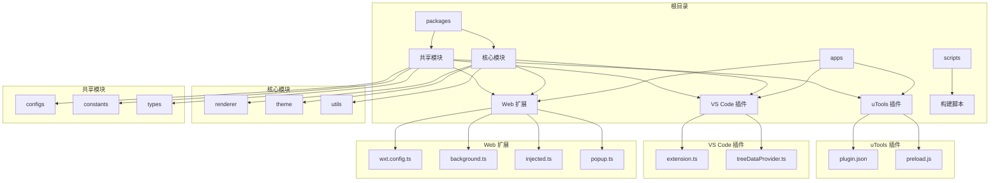
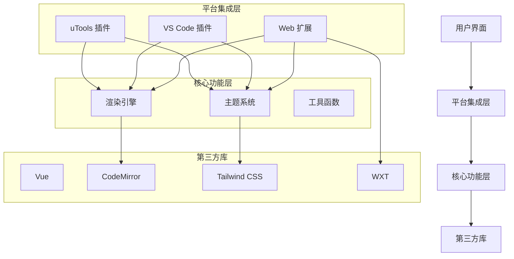
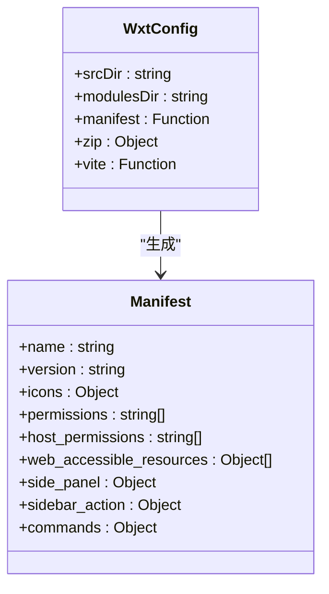
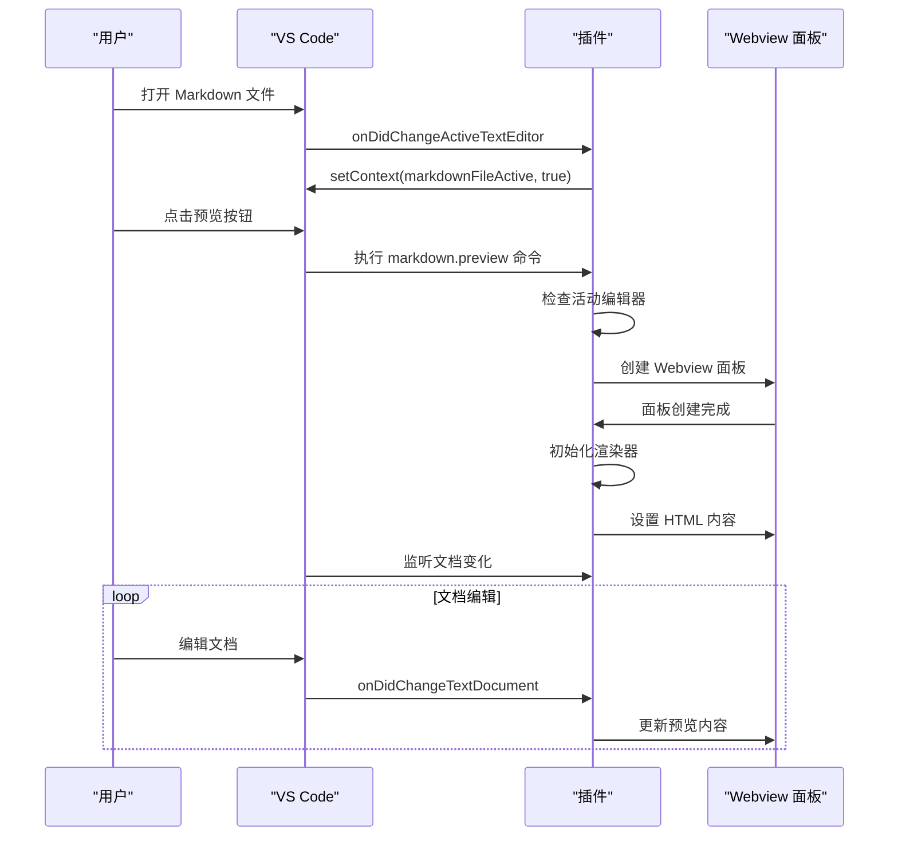
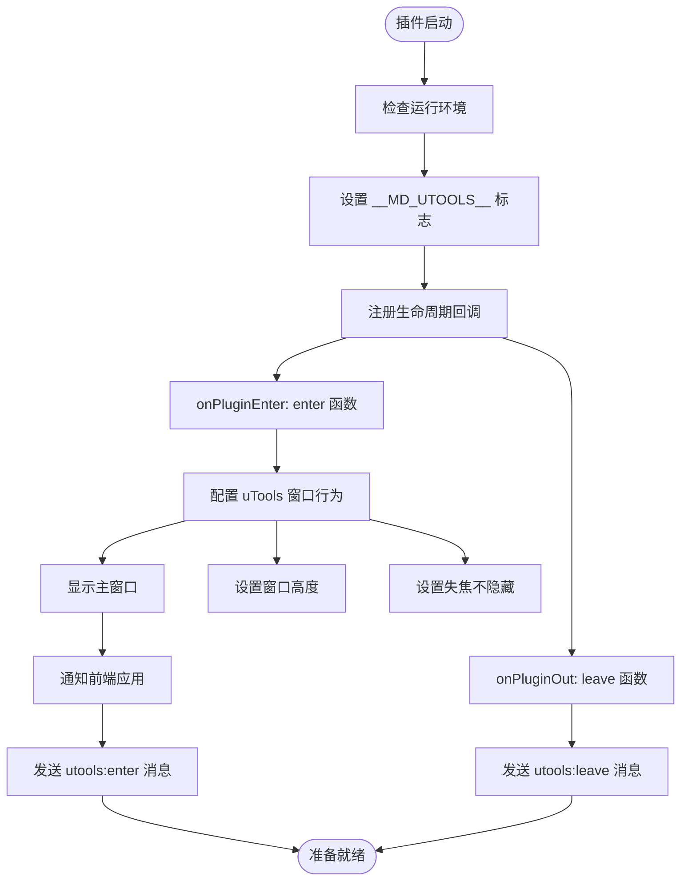
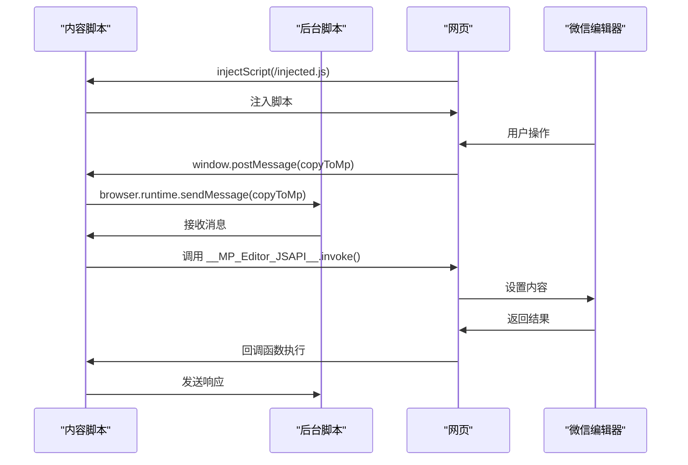
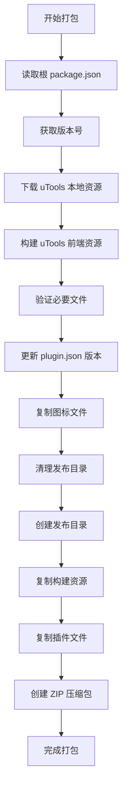

# 多平台集成

<cite>
**本文档中引用的文件**  
- [wxt.config.ts](file://apps/web/wxt.config.ts)
- [extension.ts](file://apps/vscode/src/extension.ts)
- [treeDataProvider.ts](file://apps/vscode/src/treeDataProvider.ts)
- [plugin.json](file://apps/utools/plugin.json)
- [preload.js](file://apps/utools/preload.js)
- [injected.ts](file://apps/web/src/entrypoints/injected.ts)
- [background.ts](file://apps/web/src/entrypoints/background.ts)
- [appmsg.content.ts](file://apps/web/src/entrypoints/appmsg.content.ts)
- [package-utools.mjs](file://scripts/package-utools.mjs)
- [vite.config.ts](file://apps/web/vite.config.ts)
- [popup.ts](file://apps/web/src/entrypoints/popup/popup.ts)
- [extension.ts](file://apps/web/src/utils/extension.ts)
- [sidepanel.ts](file://apps/web/src/sidepanel.ts)
</cite>

## 目录
1. [简介](#简介)
2. [项目结构](#项目结构)
3. [核心组件](#核心组件)
4. [架构概览](#架构概览)
5. [详细组件分析](#详细组件分析)
6. [依赖分析](#依赖分析)
7. [性能考虑](#性能考虑)
8. [故障排除指南](#故障排除指南)
9. [结论](#结论)

## 简介
本项目是一个跨平台的微信 Markdown 编辑器，支持三种主要形态：Web 浏览器扩展、VS Code 插件和 uTools 插件。该项目旨在为用户提供一致的内容编辑体验，无论用户使用何种平台，都能实现 Markdown 文档到微信图文的自动排版。系统通过共享核心模块（@md/core 和 @md/shared）确保功能一致性，同时为每个平台定制特定的集成方式和用户界面。浏览器扩展利用 WXT 框架构建，支持 Chrome 和 Firefox；VS Code 插件提供深度集成的预览功能；uTools 插件则为桌面用户提供快速访问入口。

## 项目结构
项目采用多应用单体架构，包含三个主要应用：Web 扩展、VS Code 插件和 uTools 插件。所有应用共享核心逻辑和配置，通过独立的构建流程生成针对不同平台的包。



**Diagram sources**  
- [apps/web/wxt.config.ts](file://apps/web/wxt.config.ts#L1-L102)
- [apps/vscode/src/extension.ts](file://apps/vscode/src/extension.ts#L1-L130)
- [apps/utools/plugin.json](file://apps/utools/plugin.json#L1-L28)

**Section sources**  
- [apps/web/wxt.config.ts](file://apps/web/wxt.config.ts#L1-L102)
- [apps/vscode/src/extension.ts](file://apps/vscode/src/extension.ts#L1-L130)
- [apps/utools/plugin.json](file://apps/utools/plugin.json#L1-L28)

## 核心组件
项目的核心组件包括跨平台共享的渲染引擎、主题系统和工具函数，以及各平台特定的集成组件。@md/core 提供了 Markdown 渲染和主题处理的核心功能，而 @md/shared 包含了配置、常量和类型定义。Web 扩展使用 WXT 框架管理浏览器扩展的生命周期，VS Code 插件通过 Webview 实现预览功能，uTools 插件则利用预加载脚本与主应用通信。所有平台都实现了与微信公众号编辑器的集成，通过消息传递协议将格式化后的内容注入到微信编辑界面。

**Section sources**  
- [packages/core/src/index.ts](file://packages/core/src/index.ts)
- [packages/shared/src/index.ts](file://packages/shared/src/index.ts)
- [apps/web/src/entrypoints/background.ts](file://apps/web/src/entrypoints/background.ts#L1-L34)

## 架构概览
系统采用分层架构，上层为各平台特定的集成层，中层为共享的核心功能层，底层为第三方库和工具。通信机制基于消息传递模式，各组件通过定义良好的接口进行交互。



**Diagram sources**  
- [apps/web/wxt.config.ts](file://apps/web/wxt.config.ts#L1-L102)
- [apps/vscode/src/extension.ts](file://apps/vscode/src/extension.ts#L1-L130)
- [packages/core/src/index.ts](file://packages/core/src/index.ts)

## 详细组件分析

### Web 扩展配置分析
WXT 框架的配置文件定义了浏览器扩展的元数据、权限和构建选项。配置中声明了必要的权限，包括存储、活动标签页和侧边栏，以及对特定域名的访问权限。



**Diagram sources**  
- [apps/web/wxt.config.ts](file://apps/web/wxt.config.ts#L1-L102)

**Section sources**  
- [apps/web/wxt.config.ts](file://apps/web/wxt.config.ts#L1-L102)

### VS Code 插件激活机制
VS Code 插件的激活机制基于命令注册和事件监听。当用户打开 Markdown 文件时，插件会在状态栏显示预览按钮，点击后创建 Webview 面板并渲染内容。



**Diagram sources**  
- [apps/vscode/src/extension.ts](file://apps/vscode/src/extension.ts#L1-L130)
- [apps/vscode/src/treeDataProvider.ts](file://apps/vscode/src/treeDataProvider.ts#L1-L198)

**Section sources**  
- [apps/vscode/src/extension.ts](file://apps/vscode/src/extension.ts#L1-L130)
- [apps/vscode/src/treeDataProvider.ts](file://apps/vscode/src/treeDataProvider.ts#L1-L198)

### uTools 插件配置结构
uTools 插件的配置文件定义了插件的基本信息、功能入口和平台兼容性。预加载脚本负责与 uTools API 交互，处理插件的生命周期事件。



**Diagram sources**  
- [apps/utools/plugin.json](file://apps/utools/plugin.json#L1-L28)
- [apps/utools/preload.js](file://apps/utools/preload.js#L1-L60)

**Section sources**  
- [apps/utools/plugin.json](file://apps/utools/plugin.json#L1-L28)
- [apps/utools/preload.js](file://apps/utools/preload.js#L1-L60)

### 浏览器消息通信协议
Web 扩展内部组件通过浏览器消息 API 实现通信。内容脚本监听微信编辑器的消息，后台脚本处理上下文菜单事件，两者通过标准化的消息格式进行交互。



**Diagram sources**  
- [apps/web/src/entrypoints/appmsg.content.ts](file://apps/web/src/entrypoints/appmsg.content.ts#L1-L20)
- [apps/web/src/entrypoints/injected.ts](file://apps/web/src/entrypoints/injected.ts#L1-L16)
- [apps/web/src/entrypoints/background.ts](file://apps/web/src/entrypoints/background.ts#L1-L34)

**Section sources**  
- [apps/web/src/entrypoints/appmsg.content.ts](file://apps/web/src/entrypoints/appmsg.content.ts#L1-L20)
- [apps/web/src/entrypoints/injected.ts](file://apps/web/src/entrypoints/injected.ts#L1-L16)
- [apps/web/src/entrypoints/background.ts](file://apps/web/src/entrypoints/background.ts#L1-L34)

### 构建与打包脚本
uTools 插件的构建脚本自动化了整个打包流程，从资源下载到最终压缩包生成，确保版本一致性。



**Diagram sources**  
- [scripts/package-utools.mjs](file://scripts/package-utools.mjs#L1-L102)

**Section sources**  
- [scripts/package-utools.mjs](file://scripts/package-utools.mjs#L1-L102)

## 依赖分析
项目依赖关系清晰，核心模块被所有应用共享，构建工具和平台特定的依赖分别管理。

```mermaid
graph LR
A[@md/core] --> B[Web 扩展]
A --> C[VS Code 插件]
A --> D[uTools 插件]
E[@md/shared] --> B
E --> C
E --> D
F[WXT] --> B
G[VS Code API] --> C
H[uTools API] --> D
I[Vue] --> B
I --> C
I --> D
J[Tailwind CSS] --> B
J --> C
J --> D
```

**Diagram sources**  
- [apps/web/wxt.config.ts](file://apps/web/wxt.config.ts#L1-L102)
- [apps/vscode/package.json](file://apps/vscode/package.json#L1-L95)
- [apps/utools/package.json](file://apps/utools/package.json#L1-L4)

**Section sources**  
- [apps/web/wxt.config.ts](file://apps/web/wxt.config.ts#L1-L102)
- [apps/vscode/package.json](file://apps/vscode/package.json#L1-L95)
- [apps/utools/package.json](file://apps/utools/package.json#L1-L4)

## 性能考虑
项目在性能方面采取了多项优化措施。构建配置中通过 manualChunks 实现了代码分割，将第三方库分离到独立的 chunk 中，减少主包体积。Vue DevTools 的集成提供了开发时的性能分析能力。对于大型 Markdown 文档的渲染，系统利用了 CodeMirror 的虚拟滚动技术，确保编辑器的响应速度。各平台的预加载策略也经过优化，uTools 插件通过 preload.js 提前建立与主应用的连接，VS Code 插件则利用 retainContextWhenHidden 保持 Webview 状态，减少重复渲染的开销。

## 故障排除指南
常见问题主要集中在跨平台集成和消息通信方面。对于 Web 扩展无法注入内容的问题，应检查 manifest 中的 host_permissions 配置和内容脚本的匹配模式。VS Code 插件预览不更新的问题通常与文档变更监听器有关，需要确保 onDidChangeTextDocument 事件正确注册。uTools 插件无法启动的问题可能源于 preload.js 中的 API 调用失败，建议检查 utools 对象的可用性。构建问题可以通过检查 package-utools.mjs 脚本中的文件路径和依赖版本来解决。所有平台都应确保共享模块的版本一致性，避免因核心功能不匹配导致的异常行为。

**Section sources**  
- [apps/web/src/utils/extension.ts](file://apps/web/src/utils/extension.ts#L1-L54)
- [apps/web/src/sidepanel.ts](file://apps/web/src/sidepanel.ts#L1-L38)

## 结论
本项目成功实现了跨平台的微信 Markdown 编辑器，通过合理的架构设计和模块化组织，确保了各平台间的一致性体验。WXT 框架为浏览器扩展提供了现代化的开发体验，VS Code 插件实现了深度集成的预览功能，uTools 插件则为桌面用户提供了便捷的访问方式。消息通信协议的设计保证了与微信编辑器的可靠交互，而共享的核心模块确保了功能的一致性。构建系统的自动化程度高，能够有效支持多平台的持续交付。未来可以进一步优化各平台间的配置同步，增强用户体验的一致性。