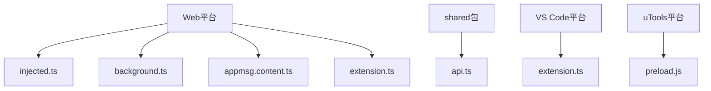
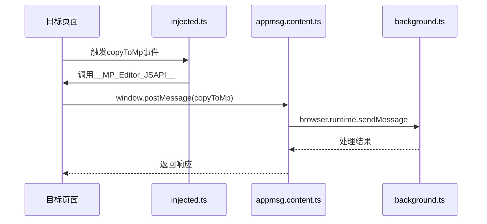
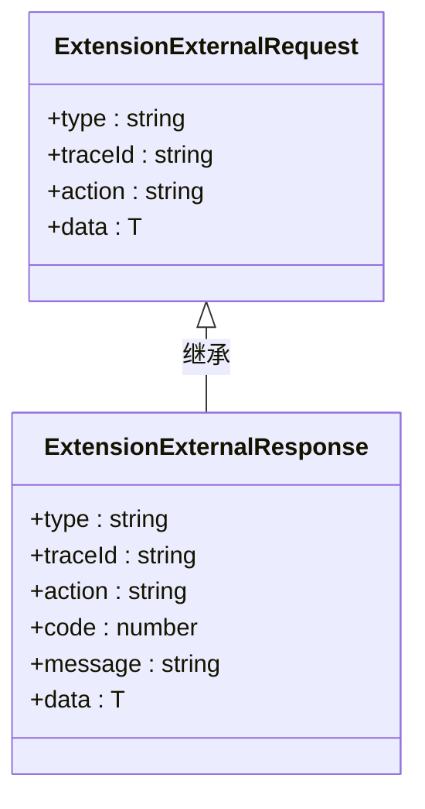
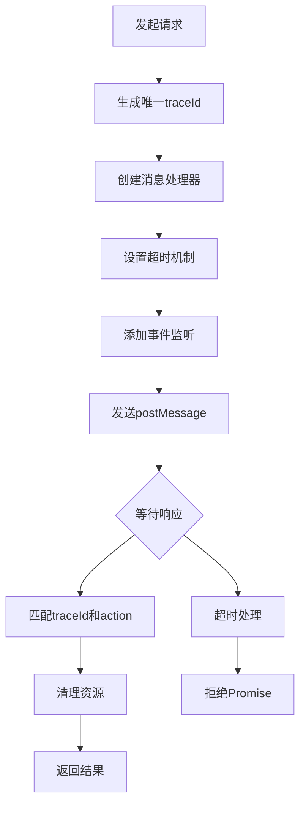
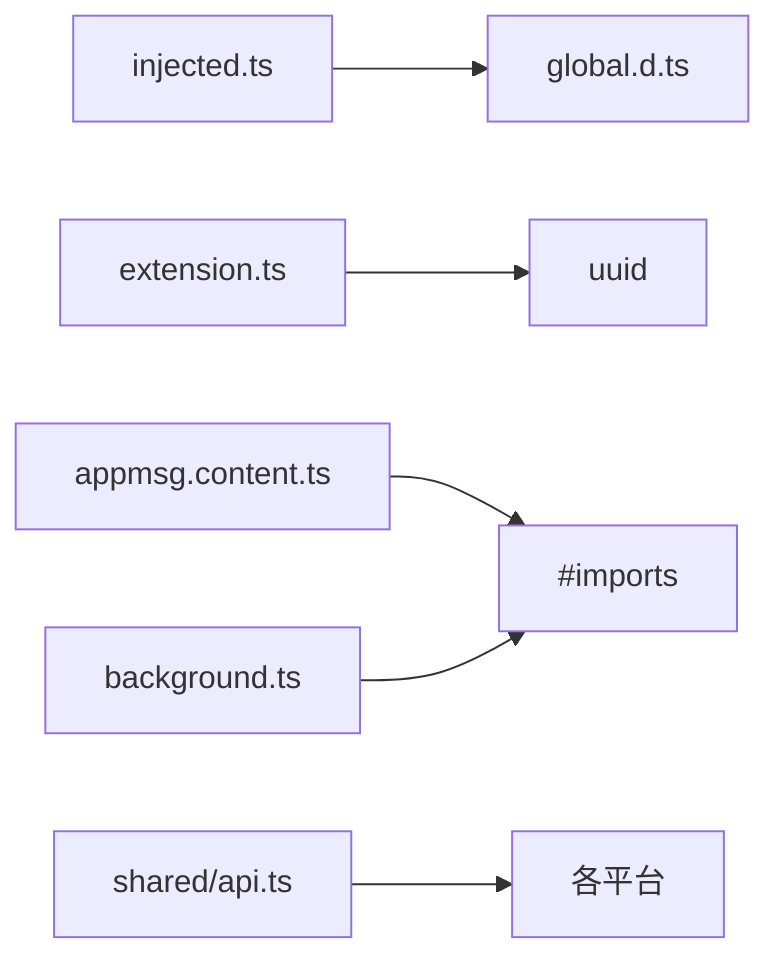

# 跨平台通信机制

<cite>
**本文档引用文件**  
- [injected.ts](file://apps/web/src/entrypoints/injected.ts)
- [background.ts](file://apps/web/src/entrypoints/background.ts)
- [appmsg.content.ts](file://apps/web/src/entrypoints/appmsg.content.ts)
- [extension.ts](file://apps/web/src/utils/extension.ts)
- [api.ts](file://packages/shared/src/configs/api.ts)
- [sidepanel.ts](file://apps/web/src/sidepanel.ts)
- [global.d.ts](file://apps/web/src/types/global.d.ts)
</cite>

## 目录
1. [项目结构](#项目结构)
2. [核心通信组件](#核心通信组件)
3. [架构概览](#架构概览)
4. [详细组件分析](#详细组件分析)
5. [依赖分析](#依赖分析)
6. [性能考虑](#性能考虑)
7. [故障排除指南](#故障排除指南)

## 项目结构

该项目采用多平台架构设计，支持Web、VS Code和uTools等多个平台。核心通信机制主要位于`apps/web/src/entrypoints/`目录下，通过Chrome Extension Messaging API实现跨上下文通信。`injected.ts`和`background.ts`分别代表注入脚本和后台脚本，构成通信的两端。`utils/extension.ts`封装了通用的通信工具函数，而`packages/shared/`包则提供了跨平台的API接口定义。

**图示来源**  
- [injected.ts](file://apps/web/src/entrypoints/injected.ts)
- [background.ts](file://apps/web/src/entrypoints/background.ts)
- [appmsg.content.ts](file://apps/web/src/entrypoints/appmsg.content.ts)
- [extension.ts](file://apps/web/src/utils/extension.ts)
- [api.ts](file://packages/shared/src/configs/api.ts)

**本节来源**  
- [injected.ts](file://apps/web/src/entrypoints/injected.ts)
- [background.ts](file://apps/web/src/entrypoints/background.ts)
- [appmsg.content.ts](file://apps/web/src/entrypoints/appmsg.content.ts)

## 核心通信组件

系统通过`injected.ts`与`background.ts`之间的双向通信模型实现功能交互。`injected.ts`作为内容脚本注入到目标页面，负责监听和转发消息；`background.ts`作为后台脚本，管理扩展的生命周期和核心逻辑。两者通过Chrome Extension Messaging API进行通信，确保了跨域安全性和消息的可靠性。

**本节来源**  
- [injected.ts](file://apps/web/src/entrypoints/injected.ts)
- [background.ts](file://apps/web/src/entrypoints/background.ts)

## 架构概览

系统采用分层架构设计，上层为各平台入口，中层为通信机制，底层为共享服务。通信流程始于内容脚本捕获用户操作，通过`window.postMessage`发送消息，由内容脚本监听并转发至后台脚本，后台脚本处理后返回结果。整个过程通过消息类型和跟踪ID进行精确匹配，确保通信的准确性和可追溯性。

**图示来源**  
- [injected.ts](file://apps/web/src/entrypoints/injected.ts)
- [appmsg.content.ts](file://apps/web/src/entrypoints/appmsg.content.ts)
- [background.ts](file://apps/web/src/entrypoints/background.ts)

## 详细组件分析

### 消息通信机制分析

系统实现了基于消息类型的事件分发机制，通过统一的消息格式确保通信的规范性。消息格式包含类型、跟踪ID、动作和数据四个核心字段，支持请求-响应模式的异步通信。

#### 消息格式定义

**图示来源**  
- [extension.ts](file://apps/web/src/utils/extension.ts)

#### 通信流程分析

**图示来源**  
- [extension.ts](file://apps/web/src/utils/extension.ts)

**本节来源**  
- [extension.ts](file://apps/web/src/utils/extension.ts)

### API接口统一性分析

通过`shared`包中的`api.ts`文件，系统实现了跨平台的API接口统一。各平台通过导入相同的接口定义，确保了调用的一致性和类型安全。这种设计降低了维护成本，提高了代码的可复用性。

**本节来源**  
- [api.ts](file://packages/shared/src/configs/api.ts)

## 依赖分析

系统依赖关系清晰，各组件耦合度低。`injected.ts`依赖于`global.d.ts`中定义的全局接口，`extension.ts`提供了通用的通信工具函数供其他组件调用。`shared`包作为独立模块，被各平台共同引用，实现了代码的最大化复用。

**图示来源**  
- [injected.ts](file://apps/web/src/entrypoints/injected.ts)
- [extension.ts](file://apps/web/src/utils/extension.ts)
- [appmsg.content.ts](file://apps/web/src/entrypoints/appmsg.content.ts)
- [background.ts](file://apps/web/src/entrypoints/background.ts)
- [api.ts](file://packages/shared/src/configs/api.ts)

**本节来源**  
- [injected.ts](file://apps/web/src/entrypoints/injected.ts)
- [extension.ts](file://apps/web/src/utils/extension.ts)
- [appmsg.content.ts](file://apps/web/src/entrypoints/appmsg.content.ts)
- [background.ts](file://apps/web/src/entrypoints/background.ts)
- [api.ts](file://packages/shared/src/configs/api.ts)

## 性能考虑

通信机制设计考虑了性能优化，通过UUID生成唯一跟踪ID，避免了消息冲突。异步处理模式确保了UI的响应性，超时机制防止了无限等待。消息过滤只处理特定类型的消息，减少了不必要的处理开销。

## 故障排除指南

当通信出现问题时，首先检查消息类型是否匹配，跟踪ID是否一致。确认`web_accessible_resources`配置正确，确保注入脚本可被访问。检查权限配置，确保扩展具有必要的host_permissions。使用浏览器开发者工具查看消息传递过程，定位问题所在。

**本节来源**  
- [sidepanel.ts](file://apps/web/src/sidepanel.ts)
- [wxt.config.ts](file://apps/web/wxt.config.ts)