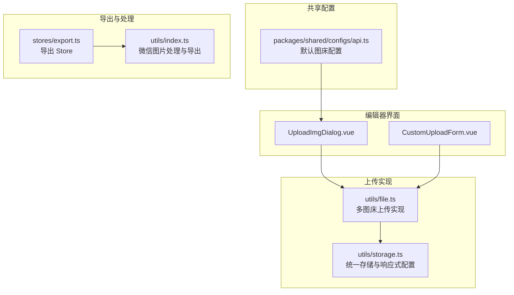
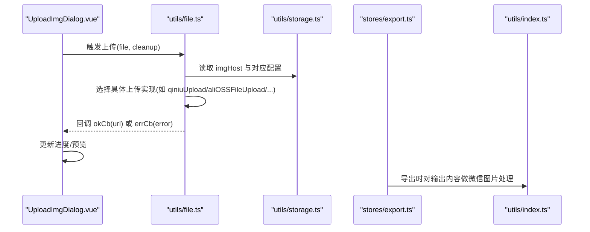
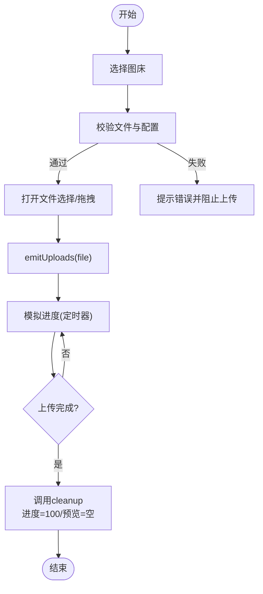
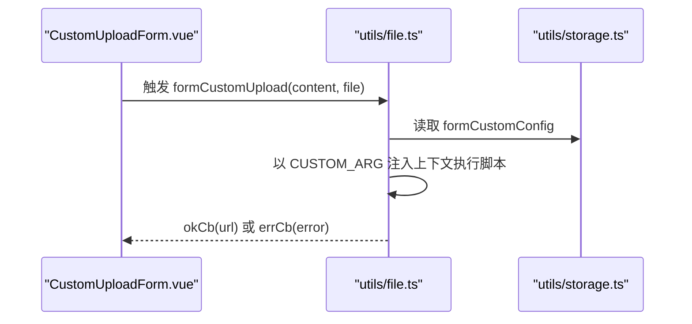
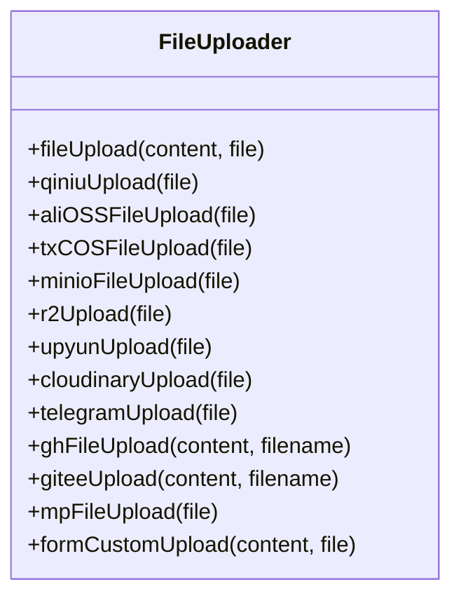
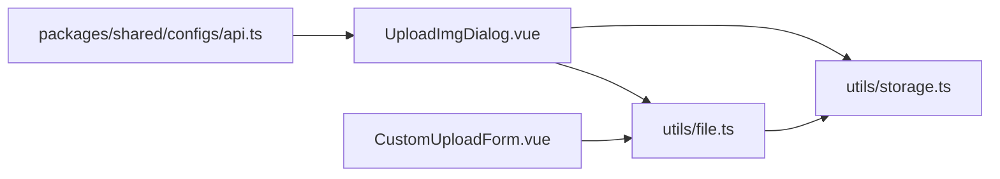

# 媒体资源管理

<cite>
**本文引用的文件列表**
- [UploadImgDialog.vue](file://apps/web/src/components/editor/UploadImgDialog.vue)
- [CustomUploadForm.vue](file://apps/web/src/components/editor/CustomUploadForm.vue)
- [file.ts](file://apps/web/src/utils/file.ts)
- [storage.ts](file://apps/web/src/utils/storage.ts)
- [export.ts](file://apps/web/src/stores/export.ts)
- [index.ts](file://apps/web/src/utils/index.ts)
- [api.ts](file://packages/shared/src/configs/api.ts)
</cite>

## 目录
1. [简介](#简介)
2. [项目结构](#项目结构)
3. [核心组件](#核心组件)
4. [架构总览](#架构总览)
5. [详细组件分析](#详细组件分析)
6. [依赖关系分析](#依赖关系分析)
7. [性能考量](#性能考量)
8. [故障排查指南](#故障排查指南)
9. [结论](#结论)
10. [附录](#附录)

## 简介
本文件面向开发者，系统性梳理媒体资源管理能力，覆盖：
- 支持的图床类型与 SDK 集成方式（七牛云、腾讯云 COS、AWS S3、MinIO、Cloudflare R2、又拍云、Cloudinary、Telegram、GitHub/Gitee），并基于 api.ts 中的配置定义说明。
- UploadImgDialog.vue 用户交互流程（拖拽上传、文件选择、上传进度显示等）。
- CustomUploadForm.vue 自定义上传逻辑与私有化接口适配。
- 与资源上传相关的状态管理与本地图片处理策略（Base64 内联、自动上传转换）。
- 生成符合微信规范的 Markdown 图片语法与导出流程。
- 上传失败的重试机制、错误码映射与网络异常处理方案。
- 扩展新图床支持的步骤与注意事项。

## 项目结构
媒体资源管理相关模块主要分布在以下位置：
- 上传对话框与自定义表单：apps/web/src/components/editor/
- 上传实现与多图床适配：apps/web/src/utils/file.ts
- 存储与状态：apps/web/src/utils/storage.ts、apps/web/src/stores/export.ts
- 默认图床配置：packages/shared/src/configs/api.ts

图表来源
- [UploadImgDialog.vue](file://apps/web/src/components/editor/UploadImgDialog.vue#L1-L120)
- [CustomUploadForm.vue](file://apps/web/src/components/editor/CustomUploadForm.vue#L1-L90)
- [file.ts](file://apps/web/src/utils/file.ts#L1-L120)
- [storage.ts](file://apps/web/src/utils/storage.ts#L1-L120)
- [api.ts](file://packages/shared/src/configs/api.ts#L1-L47)
- [export.ts](file://apps/web/src/stores/export.ts#L1-L100)
- [index.ts](file://apps/web/src/utils/index.ts#L1-L120)

章节来源
- [UploadImgDialog.vue](file://apps/web/src/components/editor/UploadImgDialog.vue#L1-L120)
- [CustomUploadForm.vue](file://apps/web/src/components/editor/CustomUploadForm.vue#L1-L90)
- [file.ts](file://apps/web/src/utils/file.ts#L1-L120)
- [storage.ts](file://apps/web/src/utils/storage.ts#L1-L120)
- [api.ts](file://packages/shared/src/configs/api.ts#L1-L47)
- [export.ts](file://apps/web/src/stores/export.ts#L1-L100)
- [index.ts](file://apps/web/src/utils/index.ts#L1-L120)

## 核心组件
- UploadImgDialog.vue：提供“本地上传”“图床切换”“拖拽/点击选择文件”“上传进度模拟”“预览上传结果”的交互入口。
- CustomUploadForm.vue：提供可编辑的自定义上传脚本编辑器，允许开发者注入私有化上传逻辑。
- file.ts：集中实现各图床上传逻辑，包括七牛云、腾讯云 COS、AWS S3/MinIO、Cloudflare R2、又拍云、Cloudinary、Telegram、GitHub/Gitee、公众号素材库等。
- storage.ts：统一的存储抽象与响应式配置，支撑图床配置持久化与热更新。
- export.ts：导出 Store，负责导出 HTML/PDF/MD/卡片图片等，间接影响图片链接可用性。
- index.ts：提供微信图片属性修正、导出 HTML/PDF 等工具函数。

章节来源
- [UploadImgDialog.vue](file://apps/web/src/components/editor/UploadImgDialog.vue#L1-L120)
- [CustomUploadForm.vue](file://apps/web/src/components/editor/CustomUploadForm.vue#L1-L90)
- [file.ts](file://apps/web/src/utils/file.ts#L604-L641)
- [storage.ts](file://apps/web/src/utils/storage.ts#L150-L363)
- [export.ts](file://apps/web/src/stores/export.ts#L1-L100)
- [index.ts](file://apps/web/src/utils/index.ts#L192-L354)

## 架构总览
媒体资源管理采用“界面组件 + 上传实现 + 存储抽象 + 导出工具”的分层架构：
- 界面层：UploadImgDialog.vue 提供图床选择与上传入口；CustomUploadForm.vue 提供自定义上传脚本编辑。
- 逻辑层：file.ts 根据 imgHost 选择对应上传实现，封装各图床 SDK/HTTP 接口。
- 存储层：storage.ts 提供统一的 get/set/JSON 操作与响应式配置，支持本地与 RESTful 引擎。
- 工具层：index.ts 提供微信图片属性修正、导出 HTML/PDF 等；export.ts 提供导出 Store。

图表来源
- [UploadImgDialog.vue](file://apps/web/src/components/editor/UploadImgDialog.vue#L322-L398)
- [file.ts](file://apps/web/src/utils/file.ts#L604-L641)
- [storage.ts](file://apps/web/src/utils/storage.ts#L150-L363)
- [export.ts](file://apps/web/src/stores/export.ts#L1-L100)
- [index.ts](file://apps/web/src/utils/index.ts#L192-L354)

## 详细组件分析

### UploadImgDialog.vue 用户交互流程
- 图床选择与配置
  - 支持图床选项：默认、GitHub、阿里云 OSS、腾讯云 COS、七牛云、MinIO、公众号、Cloudflare R2、又拍云、Telegram、Cloudinary、自定义代码。
  - 每个图床提供独立表单校验与保存逻辑，配置项通过 store.reactive 持久化。
- 本地上传
  - 支持拖拽与点击选择文件；beforeImageUpload 校验文件类型与图床配置有效性。
  - emitUploads 发起上传流程，内部使用定时器模拟进度条，最终通过回调清理进度并展示预览。
- 上传完成回调
  - 通过 emit('uploadImage', file, cleanup, true) 通知上层，cleanup 负责进度归零与预览清理。

图表来源
- [UploadImgDialog.vue](file://apps/web/src/components/editor/UploadImgDialog.vue#L322-L398)

章节来源
- [UploadImgDialog.vue](file://apps/web/src/components/editor/UploadImgDialog.vue#L1-L120)
- [UploadImgDialog.vue](file://apps/web/src/components/editor/UploadImgDialog.vue#L322-L398)

### CustomUploadForm.vue 自定义上传逻辑
- 功能概述
  - 提供可编辑的 JavaScript 编辑器，允许开发者编写自定义上传脚本。
  - 通过 store.reactive 保存脚本内容，支持暗色主题切换。
  - 运行时注入 CUSTOM_ARG，包含 file、util（含 axios、加密库、SDK 等）、okCb、errCb。
- 使用要点
  - 脚本执行后需调用 okCb(url) 成功返回，或 errCb(error) 报错。
  - 可直接调用 util.axios.post(...) 或第三方 SDK 完成上传。

图表来源
- [CustomUploadForm.vue](file://apps/web/src/components/editor/CustomUploadForm.vue#L1-L90)
- [file.ts](file://apps/web/src/utils/file.ts#L566-L603)
- [storage.ts](file://apps/web/src/utils/storage.ts#L150-L363)

章节来源
- [CustomUploadForm.vue](file://apps/web/src/components/editor/CustomUploadForm.vue#L1-L90)
- [file.ts](file://apps/web/src/utils/file.ts#L566-L603)
- [storage.ts](file://apps/web/src/utils/storage.ts#L150-L363)

### 多图床上传实现与 SDK 集成
- 七牛云（Kodo）
  - 生成上传凭证，使用 qiniu-js 上传，返回域名+key。
- 阿里云 OSS
  - 使用 tiny-oss 客户端 put 上传，支持自定义 CDN 域名。
- 腾讯云 COS
  - 使用 cos-js-sdk-v5 putObject，支持自定义 CDN 域名。
- AWS S3/MinIO
  - 使用 @aws-sdk/client-s3 与 @aws-sdk/s3-request-presigner，生成预签名 URL 后直传。
- Cloudflare R2
  - 使用 S3Client，endpoint 指向 R2，生成预签名 URL 直传。
- 又拍云
  - 计算签名 Authorization，PUT 上传至 v0.api.upyun.com。
- Cloudinary
  - 支持带签名与 unsigned preset 两种模式，返回 secure_url/url。
- Telegram
  - sendPhoto -> getFile -> 拼接下载地址。
- GitHub/Gitee
  - 通过 REST API 上传文件内容，返回 raw/fastly CDN 地址。
- 公众号素材库
  - 获取稳定 token，根据文件大小与类型选择不同接口，必要时使用代理域名。

图表来源
- [file.ts](file://apps/web/src/utils/file.ts#L604-L641)

章节来源
- [file.ts](file://apps/web/src/utils/file.ts#L154-L191)
- [file.ts](file://apps/web/src/utils/file.ts#L194-L220)
- [file.ts](file://apps/web/src/utils/file.ts#L223-L259)
- [file.ts](file://apps/web/src/utils/file.ts#L262-L293)
- [file.ts](file://apps/web/src/utils/file.ts#L383-L405)
- [file.ts](file://apps/web/src/utils/file.ts#L408-L439)
- [file.ts](file://apps/web/src/utils/file.ts#L488-L564)
- [file.ts](file://apps/web/src/utils/file.ts#L74-L117)
- [file.ts](file://apps/web/src/utils/file.ts#L118-L151)
- [file.ts](file://apps/web/src/utils/file.ts#L296-L381)

### 状态管理与本地图片处理策略
- 状态管理
  - 图床类型 imgHost 与各图床配置通过 store.reactive 持久化，支持默认配置与自定义配置。
  - 导出 Store export.ts 提供导出 HTML/PDF/MD/卡片图片等能力，间接影响图片链接可用性。
- 本地图片处理
  - UploadImgDialog.vue 在上传过程中模拟进度与预览，但不改变 Markdown 内容。
  - 导出时通过 utils/index.ts 的微信图片处理函数修正宽度/高度单位，保证微信端显示一致。
  - 未见内置 Base64 内联策略，建议在自定义上传逻辑中自行决定是否内联或直传。

章节来源
- [storage.ts](file://apps/web/src/utils/storage.ts#L150-L363)
- [export.ts](file://apps/web/src/stores/export.ts#L1-L100)
- [index.ts](file://apps/web/src/utils/index.ts#L192-L354)
- [UploadImgDialog.vue](file://apps/web/src/components/editor/UploadImgDialog.vue#L360-L398)

### 生成符合微信规范的 Markdown 图片语法
- 当前实现
  - Markdown 渲染由核心包负责，图片渲染为 <figure><figcaption .../></figure>。
  - 导出时通过微信图片处理函数修正 width/height 属性，确保在微信端正常显示。
- 建议
  - 若需在编辑态即生成微信兼容的 Markdown 图片语法，可在插入图片时统一格式化为标准 Markdown 语法，并在导出阶段保留该格式。

章节来源
- [index.ts](file://apps/web/src/utils/index.ts#L192-L354)
- [file.ts](file://apps/web/src/utils/file.ts#L604-L641)

## 依赖关系分析
- 组件依赖
  - UploadImgDialog.vue 依赖 UI Store、文件校验工具、存储工具。
  - CustomUploadForm.vue 依赖 CodeMirror 编辑器、存储工具。
- 上传实现依赖
  - file.ts 依赖各图床 SDK、fetch 封装、token 工具、UUID、日期工具等。
- 存储抽象
  - storage.ts 提供统一的 get/set/JSON 与响应式 ref，支持本地与 RESTful 引擎。
- 配置来源
  - api.ts 提供默认 GitHub/Gitee 配置，UploadImgDialog.vue 亦支持多种图床配置。

图表来源
- [UploadImgDialog.vue](file://apps/web/src/components/editor/UploadImgDialog.vue#L1-L120)
- [CustomUploadForm.vue](file://apps/web/src/components/editor/CustomUploadForm.vue#L1-L90)
- [file.ts](file://apps/web/src/utils/file.ts#L1-L120)
- [storage.ts](file://apps/web/src/utils/storage.ts#L1-L120)
- [api.ts](file://packages/shared/src/configs/api.ts#L1-L47)

章节来源
- [UploadImgDialog.vue](file://apps/web/src/components/editor/UploadImgDialog.vue#L1-L120)
- [CustomUploadForm.vue](file://apps/web/src/components/editor/CustomUploadForm.vue#L1-L90)
- [file.ts](file://apps/web/src/utils/file.ts#L1-L120)
- [storage.ts](file://apps/web/src/utils/storage.ts#L1-L120)
- [api.ts](file://packages/shared/src/configs/api.ts#L1-L47)

## 性能考量
- 上传性能
  - MinIO/R2 采用预签名直传，减少中间代理开销。
  - 阿里云/七牛/腾讯云等 SDK 上传，注意并发与超时控制。
- 导出性能
  - 导出 PDF/HTML 时尽量避免大图内联，优先使用外链直传 URL。
- 前端交互
  - UploadImgDialog.vue 使用定时器模拟进度，建议在真实上传回调中及时清理计时器，避免内存泄漏。

[本节为通用指导，无需特定文件引用]

## 故障排查指南
- 常见问题
  - 图床配置缺失：beforeImageUpload 会在未配置图床时提示，请先在 UploadImgDialog.vue 中填写对应配置。
  - 跨域与代理：公众号素材库上传可能需要代理域名，确保 mpConfig.proxyOrigin 正确。
  - 上传失败：检查各图床返回的错误信息，必要时在 CustomUploadForm.vue 中增加更详细的错误上报。
- 错误码映射与网络异常
  - 未见统一错误码映射表，建议在 CustomUploadForm.vue 中捕获 errCb 并记录详细错误信息。
  - 网络异常：建议在自定义脚本中增加重试与降级策略（见扩展指南）。
- 重试机制
  - 当前未内置自动重试，可在 CustomUploadForm.vue 中实现指数退避重试与最大次数限制。

章节来源
- [UploadImgDialog.vue](file://apps/web/src/components/editor/UploadImgDialog.vue#L322-L398)
- [file.ts](file://apps/web/src/utils/file.ts#L296-L381)
- [file.ts](file://apps/web/src/utils/file.ts#L488-L564)

## 结论
本系统通过 UploadImgDialog.vue 与 CustomUploadForm.vue 提供直观的上传入口与灵活的自定义能力，file.ts 集中实现了主流图床与私有化上传逻辑，storage.ts 提供统一的配置持久化，index.ts 与 export.ts 辅助导出与微信端兼容处理。建议在实际部署中结合业务需求完善错误上报、重试与代理策略，确保上传稳定性与用户体验。

[本节为总结，无需特定文件引用]

## 附录

### 扩展新图床支持步骤
- 在 UploadImgDialog.vue 中新增图床选项与表单校验、保存逻辑。
- 在 file.ts 中新增上传实现，遵循现有 switch 分支风格，返回图片 URL。
- 在 storage.ts 中新增对应的配置键（如 store.reactive(`${provider}Config`, ...)）。
- 在 CustomUploadForm.vue 中提供示例脚本模板，或在文档中给出接入指引。
- 若涉及鉴权/签名，参考现有实现（如七牛云 token、又拍云 HMAC、Cloudinary 签名）。
- 若需要代理/跨域，参考公众号素材库的代理逻辑。

章节来源
- [UploadImgDialog.vue](file://apps/web/src/components/editor/UploadImgDialog.vue#L1-L120)
- [file.ts](file://apps/web/src/utils/file.ts#L604-L641)
- [storage.ts](file://apps/web/src/utils/storage.ts#L150-L363)
- [CustomUploadForm.vue](file://apps/web/src/components/editor/CustomUploadForm.vue#L1-L90)