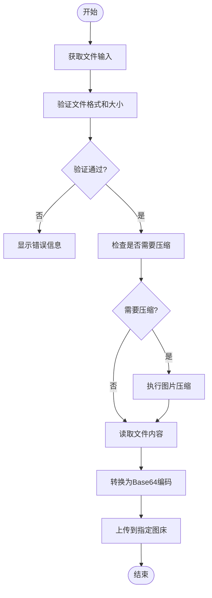
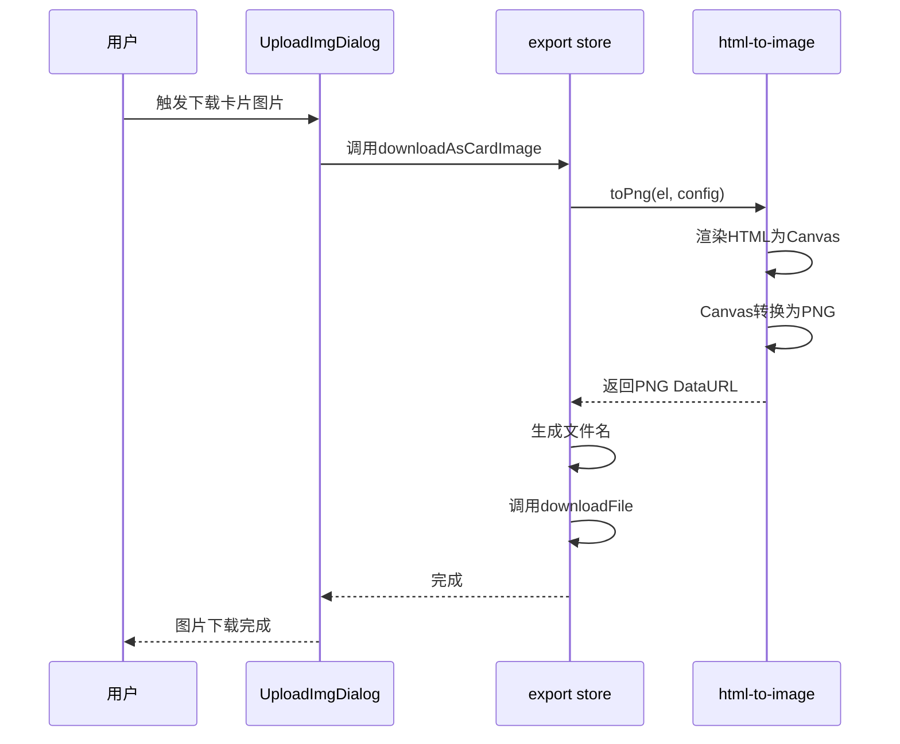
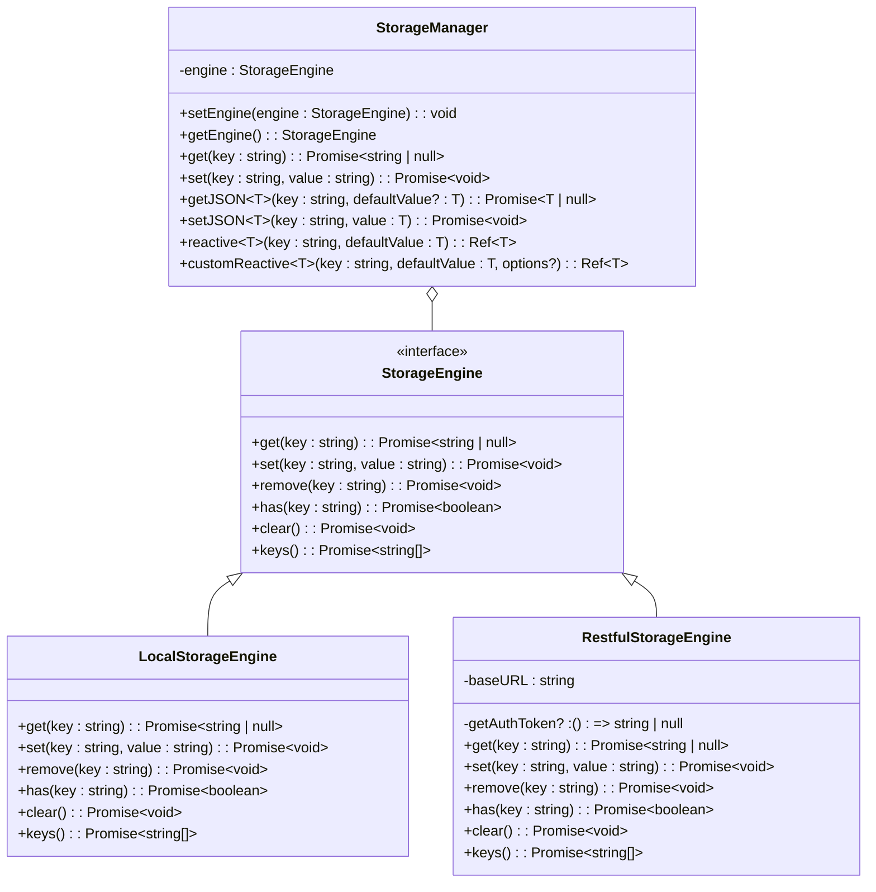

# 本地图片处理

<cite>
**本文档引用的文件**  
- [UploadImgDialog.vue](file://apps/web/src/components/editor/UploadImgDialog.vue)
- [export.ts](file://apps/web/src/stores/export.ts)
- [storage.ts](file://apps/web/src/utils/storage.ts)
- [basicHelpers.ts](file://packages/shared/src/utils/basicHelpers.ts)
- [fileHelpers.ts](file://packages/shared/src/utils/fileHelpers.ts)
</cite>

## 目录
1. [图片输入方式与事件处理机制](#图片输入方式与事件处理机制)
2. [本地图片处理流程](#本地图片处理流程)
3. [HTML转PNG图片功能](#html转png图片功能)
4. [图片缓存与临时文件管理](#图片缓存与临时文件管理)
5. [用户体验优化建议](#用户体验优化建议)
6. [自动上传配置](#自动上传配置)

## 图片输入方式与事件处理机制

`UploadImgDialog.vue` 组件支持三种图片输入方式：拖拽、选择和粘贴。组件通过监听相应的DOM事件来处理这些输入方式。

对于拖拽上传，组件监听 `dragover`、`dragleave` 和 `drop` 事件。当用户将图片文件拖入指定区域时，`dragover` 事件触发并显示视觉反馈；当文件被释放时，`drop` 事件捕获文件对象并进行处理。

对于选择上传，组件使用 `useFileDialog` Hook 来打开系统文件选择对话框。用户点击"点击上传"或区域时触发 `open()` 方法，选择文件后通过 `onChange` 回调处理文件。

粘贴功能虽然在当前代码中未直接实现，但可通过监听 `paste` 事件从剪贴板获取图片数据。这种机制允许用户直接从其他应用程序复制图片并粘贴到编辑器中。

**Section sources**
- [UploadImgDialog.vue](file://apps/web/src/components/editor/UploadImgDialog.vue#L341-L367)

## 本地图片处理流程

本地图片处理流程包含文件读取、格式验证、大小压缩、Base64编码内联和自动上传转换等环节。

文件读取通过浏览器的 `FileReader` API 实现，将二进制文件转换为可处理的数据格式。格式验证在 `beforeImageUpload` 函数中执行，调用 `checkImage` 函数检查文件扩展名和大小限制。

**Diagram sources**
- [UploadImgDialog.vue](file://apps/web/src/components/editor/UploadImgDialog.vue#L322-L339)
- [basicHelpers.ts](file://packages/shared/src/utils/basicHelpers.ts#L45-L65)

图片大小压缩功能由 `useCompression` 状态控制，当启用时会对超过阈值的图片进行压缩处理。Base64编码内联通过 `toBase64` 函数实现，将图片数据转换为可在HTML中直接使用的内联格式。

**Section sources**
- [UploadImgDialog.vue](file://apps/web/src/components/editor/UploadImgDialog.vue#L322-L397)
- [basicHelpers.ts](file://packages/shared/src/utils/basicHelpers.ts#L52-L58)
- [fileHelpers.ts](file://packages/shared/src/utils/fileHelpers.ts#L52-L58)

## HTML转PNG图片功能

`export store` 中的 `downloadAsCardImage` 功能将HTML内容转换为PNG图片，使用 `html-to-image` 库实现转换过程。

该功能通过 `toPng` 函数将指定的HTML元素转换为PNG格式的DataURL。配置参数包括：
- `backgroundColor`: 根据主题设置背景色，深色主题为空白背景，浅色主题为白色背景
- `skipFonts`: 设置为true以跳过字体加载，提高转换效率
- `pixelRatio`: 设置为设备像素比和2之间的较大值，确保高分辨率显示质量
- `style`: 设置边距为0，确保输出图片无额外空白

转换完成后，使用 `downloadFile` 函数将生成的PNG图片下载到本地，文件名基于当前文章标题生成。

**Diagram sources**
- [export.ts](file://apps/web/src/stores/export.ts#L50-L70)

**Section sources**
- [export.ts](file://apps/web/src/stores/export.ts#L50-L70)

## 图片缓存与临时文件管理

`storage.ts` 文件实现了现代化的存储抽象层，支持本地存储和RESTful API存储两种模式。该系统采用完全异步化设计，提供统一的存储管理接口。

本地存储引擎基于 `localStorage` 实现，提供 `get`、`set`、`remove` 等基本操作。系统通过 `StorageManager` 类统一管理存储引擎，支持运行时切换不同的存储实现。

响应式存储引用通过 `reactive` 方法创建，自动同步数据到存储介质。对于 `LocalStorageEngine`，采用同步读取初始值确保首次渲染正确；对于其他引擎，则采用异步加载方式。

临时文件管理通过浏览器的 `URL.createObjectURL` 和 `URL.revokeObjectURL` 实现，确保内存的有效管理。当文件不再需要时，及时释放相关资源，避免内存泄漏。

**Diagram sources**
- [storage.ts](file://apps/web/src/utils/storage.ts#L12-L362)

**Section sources**
- [storage.ts](file://apps/web/src/utils/storage.ts#L12-L362)

## 用户体验优化建议

为提升用户体验，建议实施以下优化措施：

1. **预览生成**：在上传过程中实时生成图片预览，让用户能够立即确认所选图片内容。当前实现中已包含预览功能，通过 `imageUrl` 状态显示Base64编码的图片。

2. **进度显示**：提供清晰的上传进度指示。当前实现使用 `progressValue` 状态和进度条组件展示上传进度，从0%到100%的动画效果给予用户明确反馈。

3. **失败重试机制**：当上传失败时，提供一键重试功能而非要求用户重新选择文件。可以通过保存待上传文件的引用，允许用户在不重新选择的情况下重新尝试上传。

4. **批量上传支持**：扩展功能以支持多文件同时上传，提高处理大量图片时的效率。

5. **错误信息友好化**：将技术性错误信息转换为用户易于理解的语言，并提供解决方案建议。

6. **键盘快捷键**：为常用操作添加键盘快捷键支持，如使用Ctrl+V粘贴图片，提高高级用户的操作效率。

**Section sources**
- [UploadImgDialog.vue](file://apps/web/src/components/editor/UploadImgDialog.vue#L368-L397)

## 自动上传配置

自动上传阈值可通过 `imgHost` 状态配置，该状态存储在 `storage` 系统中，实现跨会话持久化。用户可以在界面中选择不同的图床服务，包括GitHub、阿里云、腾讯云、七牛云等。

每个图床服务都有相应的配置表单，通过Yup库进行表单验证。配置信息保存在本地存储中，下次使用时自动加载。`beforeImageUpload` 函数在上传前检查所选图床的配置是否完整，确保上传能够成功执行。

通过 `useCompression` 开关控制是否启用图片压缩功能，这为用户提供了在图片质量和文件大小之间的权衡选择。这种配置方式平衡了本地处理与云端存储的使用场景，既支持直接内联小图片，也支持将大图片上传到专业图床服务。

**Section sources**
- [UploadImgDialog.vue](file://apps/web/src/components/editor/UploadImgDialog.vue#L310-L339)