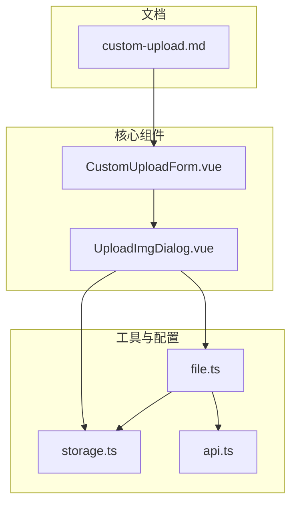
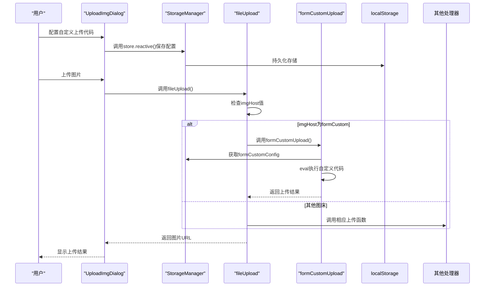
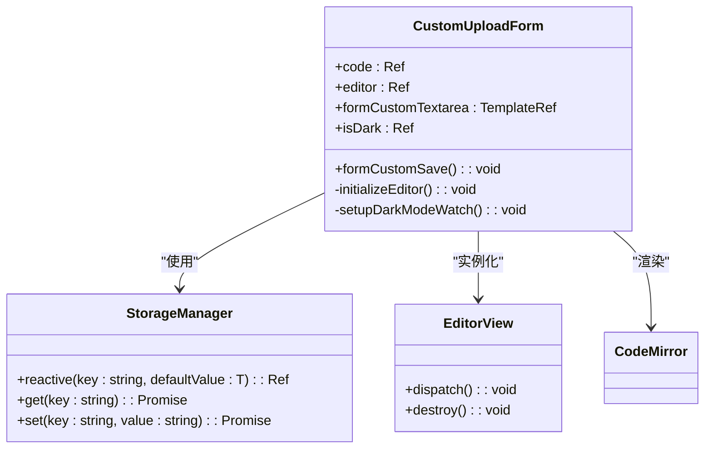
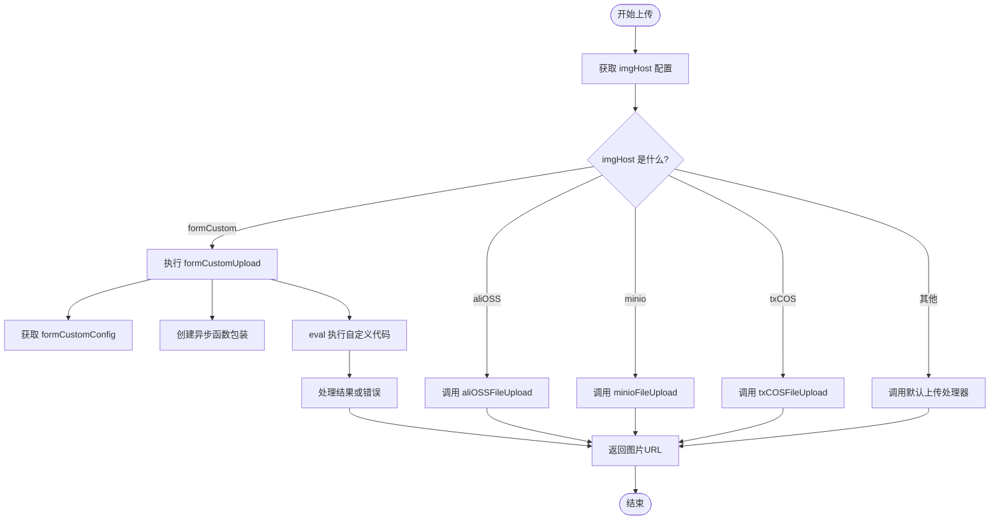

# 自定义上传

<cite>
**本文档引用文件**   
- [CustomUploadForm.vue](file://apps/web/src/components/editor/CustomUploadForm.vue)
- [storage.ts](file://apps/web/src/utils/storage.ts)
- [file.ts](file://apps/web/src/utils/file.ts)
- [api.ts](file://packages/shared/src/configs/api.ts)
- [UploadImgDialog.vue](file://apps/web/src/components/editor/UploadImgDialog.vue)
- [custom-upload.md](file://docs/custom-upload.md)
</cite>

## 目录
1. [简介](#简介)
2. [项目结构](#项目结构)
3. [核心组件](#核心组件)
4. [架构概述](#架构概述)
5. [详细组件分析](#详细组件分析)
6. [依赖分析](#依赖分析)
7. [性能考虑](#性能考虑)
8. [故障排除指南](#故障排除指南)
9. [结论](#结论)
10. [附录](#附录)（如有必要）

## 简介
本文档详细说明了自定义上传功能的技术实现，重点介绍如何通过`CustomUploadForm.vue`组件配置私有化存储，支持用户输入自定义API端点、认证令牌和存储路径。文档涵盖如何通过`api.ts`扩展私有接口配置以集成企业内部存储系统，以及`storage.ts`中上传逻辑如何根据配置动态路由到不同上传处理器，支持RESTful API、S3兼容接口等多种协议。同时提供安全最佳实践，包括令牌加密存储、HTTPS强制传输和CORS策略配置，并给出对接MinIO、FastDFS等私有存储系统的典型部署场景示例，以及错误处理和日志追踪机制。

## 项目结构
该项目采用模块化前端架构，主要包含web应用、VSCode扩展和uTools插件三个应用入口。核心功能集中在`apps/web`目录下，使用Vue 3 Composition API和TypeScript构建。自定义上传功能主要涉及以下几个关键目录和文件：



**图表来源**  
- [CustomUploadForm.vue](file://apps/web/src/components/editor/CustomUploadForm.vue)
- [UploadImgDialog.vue](file://apps/web/src/components/editor/UploadImgDialog.vue)
- [storage.ts](file://apps/web/src/utils/storage.ts)
- [file.ts](file://apps/web/src/utils/file.ts)
- [api.ts](file://packages/shared/src/configs/api.ts)
- [custom-upload.md](file://docs/custom-upload.md)

**本节来源**  
- [CustomUploadForm.vue](file://apps/web/src/components/editor/CustomUploadForm.vue)
- [UploadImgDialog.vue](file://apps/web/src/components/editor/UploadImgDialog.vue)
- [storage.ts](file://apps/web/src/utils/storage.ts)

## 核心组件
自定义上传功能的核心组件是`CustomUploadForm.vue`，它提供了一个代码编辑器界面，允许用户编写自定义的上传逻辑。该组件使用CodeMirror作为代码编辑器，支持JavaScript语法高亮。用户编写的代码会被存储在`formCustomConfig`键下，并在上传时通过`eval`执行。上传逻辑的路由由`file.ts`中的`fileUpload`函数根据当前选择的`imgHost`值决定，当`imgHost`为`formCustom`时，会调用`formCustomUpload`函数执行用户自定义的上传代码。

**本节来源**  
- [CustomUploadForm.vue](file://apps/web/src/components/editor/CustomUploadForm.vue#L1-L90)
- [file.ts](file://apps/web/src/utils/file.ts#L560-L640)

## 架构概述
自定义上传功能的架构采用分层设计，从用户界面到数据存储再到上传处理，各层职责分明。用户通过`UploadImgDialog.vue`中的表单配置各种图床参数，这些参数通过`storage.ts`提供的响应式存储API保存到浏览器的localStorage中。当用户选择"自定义代码"作为图床时，`CustomUploadForm.vue`组件会加载并显示存储在`formCustomConfig`中的自定义上传代码。上传请求由`file.ts`中的`fileUpload`函数统一处理，该函数根据当前配置的`imgHost`值动态选择相应的上传处理器。



**图表来源**  
- [UploadImgDialog.vue](file://apps/web/src/components/editor/UploadImgDialog.vue)
- [storage.ts](file://apps/web/src/utils/storage.ts)
- [file.ts](file://apps/web/src/utils/file.ts)

## 详细组件分析
### CustomUploadForm.vue 组件分析
`CustomUploadForm.vue`组件是自定义上传功能的核心界面，它提供了一个可编辑的代码区域，允许用户编写自定义的上传逻辑。该组件的关键特性包括：

- 使用CodeMirror作为代码编辑器，提供语法高亮和代码编辑功能
- 通过`store.reactive`创建响应式存储，确保配置的实时保存
- 提供保存按钮，用户可以保存自定义的上传代码
- 代码模板中预置了`CUSTOM_ARG`参数，包含文件对象、工具库和回调函数



**图表来源**  
- [CustomUploadForm.vue](file://apps/web/src/components/editor/CustomUploadForm.vue#L1-L90)
- [storage.ts](file://apps/web/src/utils/storage.ts#L254-L305)

**本节来源**  
- [CustomUploadForm.vue](file://apps/web/src/components/editor/CustomUploadForm.vue#L1-L90)

### 上传逻辑处理分析
上传逻辑的处理主要在`file.ts`文件中实现，核心是`fileUpload`函数和`formCustomUpload`函数。`fileUpload`函数作为上传的入口点，根据当前配置的`imgHost`值选择相应的上传处理器。当`imgHost`为`formCustom`时，调用`formCustomUpload`函数执行用户自定义的上传代码。



**图表来源**  
- [file.ts](file://apps/web/src/utils/file.ts#L604-L640)

**本节来源**  
- [file.ts](file://apps/web/src/utils/file.ts#L560-L640)

### 存储管理分析
`storage.ts`文件实现了现代化的存储抽象层，支持本地存储和RESTful API存储。该模块的核心是`StorageManager`类，它提供了统一的存储接口，并支持通过`setEngine`方法切换不同的存储引擎。

```mermaid
classDiagram
class StorageEngine {
<<interface>>
+get(key : string) : Promise<string>
+set(key : string, value : string) : Promise<void>
+remove(key : string) : Promise<void>
+has(key : string) : Promise<boolean>
+clear() : Promise<void>
+keys() : Promise<string[]>
}
class LocalStorageEngine {
+get(key : string) : Promise<string>
+set(key : string, value : string) : Promise<void>
+remove(key : string) : Promise<void>
+has(key : string) : Promise<boolean>
+clear() : Promise<void>
+keys() : Promise<string[]>
}
class RestfulStorageEngine {
+get(key : string) : Promise<string>
+set(key : string, value : string) : Promise<void>
+remove(key : string) : Promise<void>
+has(key : string) : Promise<boolean>
+clear() : Promise<void>
+keys() : Promise<string[]>
-request(method : string, endpoint : string, data? : any) : Promise<any>
}
class StorageManager {
-engine : StorageEngine
+setEngine(engine : StorageEngine) : void
+getEngine() : StorageEngine
+get(key : string) : Promise<string>
+set(key : string, value : string) : Promise<void>
+getJSON<T>(key : string, defaultValue? : T) : Promise<T>
+setJSON<T>(key : string, value : T) : Promise<void>
+reactive<T>(key : string, defaultValue : T) : Ref<T>
+customReactive<T>(key : string, defaultValue : T, options? : {get? : (stored : T | null) => T, set? : (value : T) => T}) : Ref<T>
}
StorageManager --> StorageEngine : "依赖"
LocalStorageEngine --> StorageEngine : "实现"
RestfulStorageEngine --> StorageEngine : "实现"
StorageManager o-- LocalStorageEngine : "默认使用"
CustomUploadForm --> StorageManager : "使用"
```

**图表来源**  
- [storage.ts](file://apps/web/src/utils/storage.ts#L12-L363)

**本节来源**  
- [storage.ts](file://apps/web/src/utils/storage.ts#L1-L363)

## 依赖分析
自定义上传功能依赖于多个外部库和内部模块，形成了一个复杂的依赖网络。主要依赖包括：

```mermaid
graph TD
A[CustomUploadForm.vue] --> B[CodeMirror]
A --> C[storage.ts]
A --> D[utils/storage]
E[UploadImgDialog.vue] --> F[vee-validate]
E --> G[yup]
E --> C
E --> H[utils]
I[file.ts] --> J[@aws-sdk/client-s3]
I --> K[@aws-sdk/s3-request-presigner]
I --> L[cos-js-sdk-v5]
I --> M[qiniu-js]
I --> N[tiny-oss]
I --> O[uuid]
I --> C
I --> P[fetch]
Q[api.ts] --> R[githubConfig]
Q --> S[giteeConfig]
A --> E
I --> E
C --> E
```

**图表来源**  
- [CustomUploadForm.vue](file://apps/web/src/components/editor/CustomUploadForm.vue)
- [UploadImgDialog.vue](file://apps/web/src/components/editor/UploadImgDialog.vue)
- [file.ts](file://apps/web/src/utils/file.ts)
- [api.ts](file://packages/shared/src/configs/api.ts)

**本节来源**  
- [CustomUploadForm.vue](file://apps/web/src/components/editor/CustomUploadForm.vue)
- [UploadImgDialog.vue](file://apps/web/src/components/editor/UploadImgDialog.vue)
- [file.ts](file://apps/web/src/utils/file.ts)

## 性能考虑
自定义上传功能在性能方面有以下考虑：

1. **代码执行性能**：使用`eval`执行用户自定义代码，虽然灵活但存在性能开销和安全风险。建议对用户代码进行缓存，避免重复解析。
2. **存储访问性能**：`storage.ts`中的`StorageManager`对`LocalStorageEngine`采用同步读取初始值，异步保存的策略，确保了首次渲染的性能。
3. **网络请求性能**：对于S3兼容的存储系统（如MinIO），采用预签名URL的方式上传，避免了前端直接处理大文件上传的性能瓶颈。
4. **内存使用**：`reactive`方法在切换存储引擎时会异步加载数据，避免了大量数据一次性加载到内存中。

## 故障排除指南
### 常见问题及解决方案
1. **自定义代码不执行**：
   - 检查`imgHost`是否已设置为`formCustom`
   - 确认`formCustomConfig`中保存了有效的JavaScript代码
   - 检查浏览器控制台是否有语法错误

2. **上传失败**：
   - 检查网络连接和API端点可达性
   - 验证认证令牌的有效性
   - 确认CORS策略是否允许前端访问

3. **存储配置丢失**：
   - 检查浏览器localStorage是否被清除
   - 确认`storage.ts`中的错误处理逻辑是否正常工作

4. **eval安全警告**：
   - 确保用户理解`eval`的安全风险
   - 建议在生产环境中限制自定义代码的功能范围

**本节来源**  
- [file.ts](file://apps/web/src/utils/file.ts#L596-L599)
- [storage.ts](file://apps/web/src/utils/storage.ts#L30-L32)

## 结论
自定义上传功能为用户提供了一个灵活的接口，可以集成各种私有存储系统。通过`CustomUploadForm.vue`组件，用户可以编写自定义的上传逻辑，支持RESTful API、S3兼容接口等多种协议。`storage.ts`提供的现代化存储抽象层确保了配置的安全存储和高效访问。虽然使用`eval`执行用户代码带来了安全风险，但通过适当的文档说明和使用指导，可以最大限度地降低风险。未来可以考虑引入沙箱环境或Web Worker来执行用户代码，进一步提高安全性。

## 附录
### 自定义上传代码示例
根据`docs/custom-upload.md`文档，自定义上传代码的基本结构如下：

```javascript
const { file, util, okCb, errCb } = CUSTOM_ARG
const param = new FormData()
param.append('file', file)
util.axios
  .post('http://127.0.0.1:8800/upload', param, {
    headers: { 'Content-Type': 'multipart/form-data' },
  })
  .then((res) => {
    okCb(res.url)
  })
  .catch((err) => {
    errCb(err)
  })
```

其中`CUSTOM_ARG`提供了以下可用参数：
- `content`: 待上传图片的base64编码
- `file`: 待上传图片的File对象
- `util`: 包含axios、CryptoJS、OSS、COS、Buffer、uuidv4、qiniu、tokenTools、getDir、getDateFilename等工具库
- `okCb`: 上传成功后的回调函数，需传入图片URL
- `errCb`: 上传失败时的回调函数