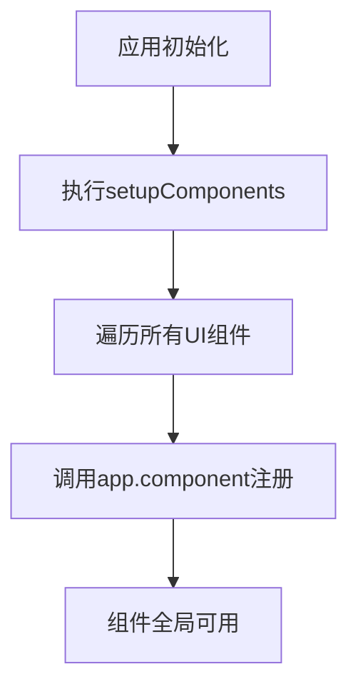
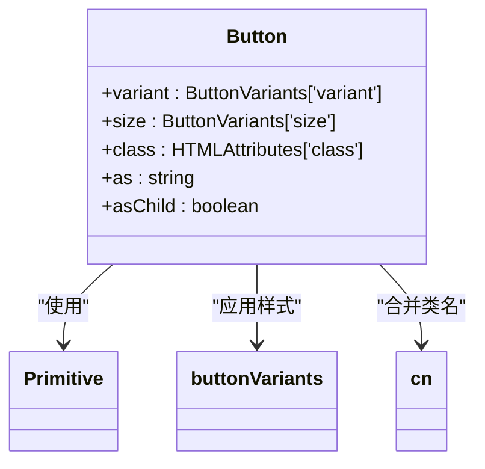
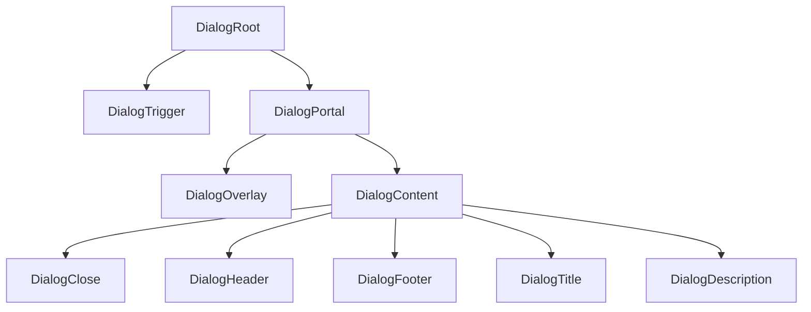
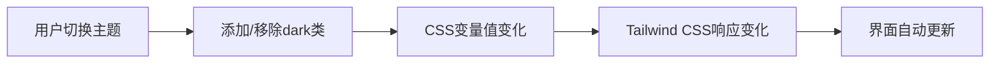

# UI组件系统

<cite>
**本文档引用的文件**   
- [setup-components.ts](file://apps/web/src/utils/setup-components.ts)
- [components.json](file://apps/web/components.json)
- [Button.vue](file://apps/web/src/components/ui/button/Button.vue)
- [Dialog.vue](file://apps/web/src/components/ui/dialog/Dialog.vue)
- [DialogContent.vue](file://apps/web/src/components/ui/dialog/DialogContent.vue)
- [Alert.vue](file://apps/web/src/components/ui/alert/Alert.vue)
- [index.ts](file://apps/web/src/components/ui/dialog/index.ts)
- [index.ts](file://apps/web/src/components/ui/button/index.ts)
- [utils.ts](file://apps/web/src/lib/utils.ts)
- [tailwind.config.cjs](file://apps/web/tailwind.config.cjs)
- [theme.less](file://apps/web/src/assets/less/theme.less)
</cite>

## 目录
1. [简介](#简介)
2. [组件架构设计](#组件架构设计)
3. [组件注册机制](#组件注册机制)
4. [组件目录结构与导出规范](#组件目录结构与导出规范)
5. [核心组件实现分析](#核心组件实现分析)
6. [样式系统与主题联动](#样式系统与主题联动)
7. [自定义组件开发指南](#自定义组件开发指南)
8. [最佳实践与使用示例](#最佳实践与使用示例)

## 简介

本项目构建了一个基于Radix-Vue的无障碍UI组件库，旨在提供一致的交互模式和可访问性支持。组件库通过封装Radix-Vue原生组件，结合Tailwind CSS和CSS变量实现灵活的主题定制。系统采用模块化设计，通过自动注册机制简化组件使用，并通过components.json配置支持IDE智能提示。

**Section sources**
- [setup-components.ts](file://apps/web/src/utils/setup-components.ts)
- [components.json](file://apps/web/components.json)

## 组件架构设计

UI组件库基于Radix-Vue构建，Radix-Vue是一套无样式的、可访问的UI原语，为构建高度可定制的组件提供了坚实基础。每个组件都遵循一致的设计模式：使用`<script setup>`语法糖定义组件，通过`defineProps`声明属性接口，并利用Radix-Vue提供的组合式API实现功能。

组件架构采用分层设计：
- **基础层**：Radix-Vue提供的无障碍原语
- **封装层**：项目自定义的UI组件，添加样式和扩展功能
- **聚合层**：通过index.ts文件统一导出组件

这种架构确保了组件既具有良好的可访问性，又能满足项目特定的设计需求。

**Section sources**
- [Button.vue](file://apps/web/src/components/ui/button/Button.vue)
- [Dialog.vue](file://apps/web/src/components/ui/dialog/Dialog.vue)

## 组件注册机制

项目通过`setup-components.ts`文件实现UI组件的自动全局注册。该机制利用Vue的`app.component()`方法，在应用初始化时注册所有UI组件，使开发者无需在每个使用组件的地方单独导入。



**Diagram sources **
- [setup-components.ts](file://apps/web/src/utils/setup-components.ts)

此外，`components.json`文件配置了组件库的元信息，包括样式配置、TypeScript支持、Tailwind CSS设置和别名定义，为开发工具提供智能提示支持。

```json
{
  "$schema": "https://shadcn-vue.com/schema.json",
  "style": "new-york",
  "typescript": true,
  "tailwind": {
    "config": "tailwind.config.cjs",
    "css": "src/assets/index.css",
    "baseColor": "neutral",
    "cssVariables": true,
    "prefix": ""
  },
  "aliases": {
    "components": "@/components",
    "composables": "@/composables",
    "utils": "@/lib/utils",
    "ui": "@/components/ui",
    "lib": "@/lib"
  },
  "iconLibrary": "lucide"
}
```

**Diagram sources **
- [components.json](file://apps/web/components.json)

**Section sources**
- [setup-components.ts](file://apps/web/src/utils/setup-components.ts)
- [components.json](file://apps/web/components.json)

## 组件目录结构与导出规范

UI组件库采用清晰的目录结构，每个组件都有独立的目录，包含其所有相关文件。目录结构遵循以下规范：

```
components/ui/
├── component-name/
│   ├── ComponentName.vue
│   ├── SubComponent.vue
│   └── index.ts
```

每个组件目录下的`index.ts`文件负责聚合导出该组件的所有部分，实现了一站式导入。例如，对话框组件的导出规范如下：

```ts
export { default as Dialog } from './Dialog.vue'
export { default as DialogClose } from './DialogClose.vue'
export { default as DialogContent } from './DialogContent.vue'
export { default as DialogDescription } from './DialogDescription.vue'
export { default as DialogFooter } from './DialogFooter.vue'
export { default as DialogHeader } from './DialogHeader.vue'
export { default as DialogScrollContent } from './DialogScrollContent.vue'
export { default as DialogTitle } from './DialogTitle.vue'
export { default as DialogTrigger } from './DialogTrigger.vue'
```

这种导出规范使得开发者可以通过单一入口导入所需组件，提高了代码的可维护性和可读性。

**Diagram sources **
- [index.ts](file://apps/web/src/components/ui/dialog/index.ts)

**Section sources**
- [index.ts](file://apps/web/src/components/ui/dialog/index.ts)

## 核心组件实现分析

### 按钮组件分析

按钮组件（Button）是UI库中最基础的交互元素之一。其实现展示了如何通过封装Radix-Vue的Primitive组件来创建可复用的UI元素。



**Diagram sources **
- [Button.vue](file://apps/web/src/components/ui/button/Button.vue)
- [index.ts](file://apps/web/src/components/ui/button/index.ts)

按钮组件的关键特性包括：
- 支持多种变体（default, destructive, outline, secondary, ghost, link）
- 支持多种尺寸（default, xs, sm, lg, icon）
- 通过`cn`工具函数合并Tailwind CSS类名
- 使用`Primitive`组件确保可访问性

### 对话框组件分析

对话框组件（Dialog）展示了复杂组件的实现模式，包含多个子组件协同工作。



**Diagram sources **
- [Dialog.vue](file://apps/web/src/components/ui/dialog/Dialog.vue)
- [DialogContent.vue](file://apps/web/src/components/ui/dialog/DialogContent.vue)

对话框组件的关键特性包括：
- 使用`DialogPortal`确保对话框在DOM树中的正确位置
- 通过`useForwardPropsEmits`组合式函数转发属性和事件
- 使用数据属性（如`data-state`）控制动画状态
- 内置关闭按钮和可访问性标签

**Section sources**
- [Button.vue](file://apps/web/src/components/ui/button/Button.vue)
- [Dialog.vue](file://apps/web/src/components/ui/dialog/Dialog.vue)
- [DialogContent.vue](file://apps/web/src/components/ui/dialog/DialogContent.vue)
- [index.ts](file://apps/web/src/components/ui/button/index.ts)

## 样式系统与主题联动

### Tailwind CSS与CSS变量

项目采用Tailwind CSS作为主要的样式解决方案，并结合CSS变量实现主题联动。`tailwind.config.cjs`文件配置了设计系统的基础，包括颜色、圆角、动画等。

```js
module.exports = {
  darkMode: [`class`],
  theme: {
    extend: {
      colors: {
        border: `hsl(var(--border))`,
        input: `hsl(var(--input))`,
        ring: `hsl(var(--ring))`,
        background: `hsl(var(--background))`,
        foreground: `hsl(var(--foreground))`,
        // ...其他颜色
      },
      borderRadius: {
        xl: `calc(var(--radius) + 4px)`,
        lg: `var(--radius)`,
        md: `calc(var(--radius) - 2px)`,
        sm: `calc(var(--radius) - 4px)`,
      }
    },
  },
  plugins: [require(`tailwindcss-animate`)],
}
```

**Diagram sources **
- [tailwind.config.cjs](file://apps/web/tailwind.config.cjs)

### 混合样式处理

项目同时支持Tailwind CSS和Less样式，通过`theme.less`文件定义深色主题的特定样式。这种混合样式处理方式允许在保持Tailwind CSS优势的同时，处理复杂的主题定制需求。

```less
.dark {
  .container {
    .cm-editor,
    .CodeMirror-wrap {
      background-color: @nightCodeMirrorColor;
    }
    
    .output_night {
      .preview {
        background-color: @nightPreviewColor;
      }
    }
  }
}
```

**Diagram sources **
- [theme.less](file://apps/web/src/assets/less/theme.less)

### 主题联动实现

主题联动通过CSS变量和Tailwind CSS的`darkMode: 'class'`配置实现。当应用根元素添加`dark`类时，所有使用CSS变量的颜色都会自动切换到深色主题对应的值。



**Diagram sources **
- [tailwind.config.cjs](file://apps/web/tailwind.config.cjs)
- [theme.less](file://apps/web/src/assets/less/theme.less)

**Section sources**
- [tailwind.config.cjs](file://apps/web/tailwind.config.cjs)
- [theme.less](file://apps/web/src/assets/less/theme.less)

## 自定义组件开发指南

### Props定义

在创建自定义组件时，应遵循类型安全的原则，使用TypeScript接口定义props。参考现有组件的模式：

```ts
interface Props extends PrimitiveProps {
  variant?: ButtonVariants[`variant`]
  size?: ButtonVariants[`size`]
  class?: HTMLAttributes[`class`]
}

const props = withDefaults(defineProps<Props>(), {
  as: `button`,
})
```

### 事件发射

使用`defineEmits`定义组件可能发射的事件，并利用`useForwardPropsEmits`组合式函数转发事件：

```ts
const emits = defineEmits<DialogRootEmits>()
const forwarded = useForwardPropsEmits(props, emits)
```

### 插槽使用

合理使用插槽（slot）提高组件的灵活性。基础组件通常只包含一个默认插槽，而容器类组件可以包含多个具名插槽：

```vue
<template>
  <div>
    <header v-if="$slots.header">
      <slot name="header" />
    </header>
    <main>
      <slot />
    </main>
    <footer v-if="$slots.footer">
      <slot name="footer" />
    </footer>
  </div>
</template>
```

### 样式继承

通过`cn`工具函数合并类名，允许外部样式覆盖默认样式：

```ts
import { cn } from '@/lib/utils'

// 在模板中使用
:class="cn(buttonVariants({ variant, size }), props.class)"
```

**Section sources**
- [Button.vue](file://apps/web/src/components/ui/button/Button.vue)
- [Dialog.vue](file://apps/web/src/components/ui/dialog/Dialog.vue)
- [utils.ts](file://apps/web/src/lib/utils.ts)

## 最佳实践与使用示例

### 组件使用示例

#### 基础按钮使用
```vue
<Button variant="default" size="default">
  默认按钮
</Button>
```

#### 对话框使用
```vue
<Dialog>
  <DialogTrigger>打开对话框</DialogTrigger>
  <DialogContent>
    <DialogHeader>
      <DialogTitle>对话框标题</DialogTitle>
      <DialogDescription>对话框描述</DialogDescription>
    </DialogHeader>
    <div>对话框内容</div>
    <DialogFooter>
      <Button>确定</Button>
    </DialogFooter>
  </DialogContent>
</Dialog>
```

### 最佳实践

1. **保持一致性**：遵循现有组件的设计模式和命名规范
2. **注重可访问性**：始终考虑屏幕阅读器和其他辅助技术的用户体验
3. **类型安全**：充分利用TypeScript提供编译时检查
4. **样式隔离**：通过Tailwind CSS的实用类避免样式污染
5. **性能优化**：避免不必要的重新渲染，合理使用计算属性

6. **文档化**：为新组件添加必要的JSDoc注释，说明props、事件和插槽的使用方法

**Section sources**
- [Button.vue](file://apps/web/src/components/ui/button/Button.vue)
- [Dialog.vue](file://apps/web/src/components/ui/dialog/Dialog.vue)
- [DialogContent.vue](file://apps/web/src/components/ui/dialog/DialogContent.vue)