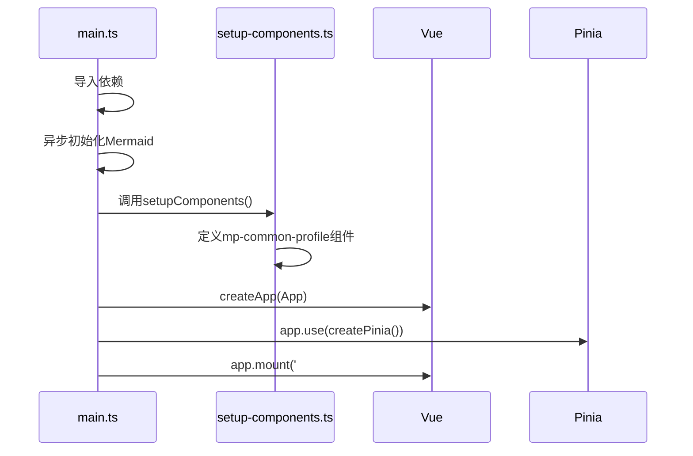
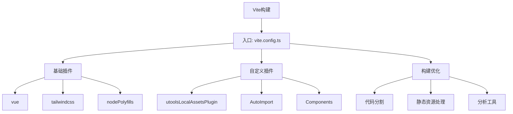
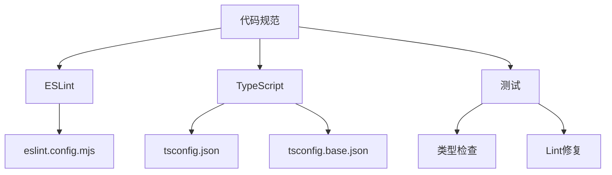

# 开发者指南

<cite>
**本文档引用文件**  
- [pnpm-workspace.yaml](file://pnpm-workspace.yaml)
- [package.json](file://package.json)
- [apps/web/src/main.ts](file://apps/web/src/main.ts)
- [apps/web/vite.config.ts](file://apps/web/vite.config.ts)
- [apps/web/wxt.config.ts](file://apps/web/wxt.config.ts)
- [apps/web/src/utils/setup-components.ts](file://apps/web/src/utils/setup-components.ts)
- [packages/core/package.json](file://packages/core/package.json)
- [packages/shared/package.json](file://packages/shared/package.json)
- [packages/core/src/index.ts](file://packages/core/src/index.ts)
- [packages/shared/src/index.ts](file://packages/shared/src/index.ts)
- [apps/web/plugins/vite-plugin-utools-local-assets.ts](file://apps/web/plugins/vite-plugin-utools-local-assets.ts)
- [apps/web/src/modules/build-extension.ts](file://apps/web/src/modules/build-extension.ts)
- [eslint.config.mjs](file://eslint.config.mjs)
- [tsconfig.json](file://tsconfig.json)
- [packages/config/tsconfig.base.json](file://packages/config/tsconfig.base.json)
- [apps/web/src/stores/editor.ts](file://apps/web/src/stores/editor.ts)
- [packages/core/src/extensions/index.ts](file://packages/core/src/extensions/index.ts)
</cite>

## 目录
1. [Monorepo架构与依赖管理](#monorepo架构与依赖管理)
2. [项目启动流程](#项目启动流程)
3. 核心包职责划分
   - [@md/core](#@mdcore)
   - [@md/shared](#@mdshared)
4. [构建系统工作机制](#构建系统工作机制)
5. [模块扩展最佳实践](#模块扩展最佳实践)
6. [代码规范与质量保障](#代码规范与质量保障)

## Monorepo架构与依赖管理

本项目采用Monorepo架构，通过`pnpm-workspace.yaml`文件定义工作区范围，包含`apps/*`和`packages/*`两个主要目录。这种架构设计实现了应用与共享库的清晰分离，便于跨项目复用代码和统一版本管理。

在`package.json`中，通过`"dependencies"`和`"devDependencies"`声明了项目级依赖，而各个子包（如`@md/core`和`@md/shared`）则在各自的`package.json`中声明具体依赖。特别值得注意的是，`@md/core`通过`"dependencies"`中的`"@md/shared": "workspace:*"`声明了对`@md/shared`包的依赖，这表明它使用了pnpm的workspace协议来引用本地包，确保开发时能够实时同步变更。

```mermaid
graph TD
subgraph "应用层"
A[apps/web]
B[apps/vscode]
C[apps/utools]
end
subgraph "核心包"
D[@md/core]
E[@md/shared]
end
A --> D
B --> D
C --> D
D --> E
```

**图示来源**
- [pnpm-workspace.yaml](file://pnpm-workspace.yaml)
- [package.json](file://package.json)
- [packages/core/package.json](file://packages/core/package.json)
- [packages/shared/package.json](file://packages/shared/package.json)

## 项目启动流程

项目的启动入口是`apps/web/src/main.ts`文件。该文件负责Vue应用的初始化、Pinia状态管理器的注册以及全局组件的注册。

启动流程从导入`createApp`和`createPinia`函数开始，创建Vue应用实例并挂载Pinia。关键步骤包括：
1. 异步初始化Mermaid图表支持
2. 调用`setupComponents()`注册自定义Web Components
3. 创建Vue应用实例并挂载到DOM



**图示来源**
- [apps/web/src/main.ts](file://apps/web/src/main.ts)
- [apps/web/src/utils/setup-components.ts](file://apps/web/src/utils/setup-components.ts)

**本节来源**
- [apps/web/src/main.ts](file://apps/web/src/main.ts#L1-L24)
- [apps/web/src/utils/setup-components.ts](file://apps/web/src/utils/setup-components.ts#L55-L57)

### @md/core

`@md/core`包是项目的核心功能模块，主要负责Markdown的解析与渲染。根据其`package.json`文件的`"exports"`字段配置，该包提供了多个子路径导出，包括`./renderer`、`./extensions`、`./utils`和`./theme`，实现了功能的模块化组织。

该包依赖于`@md/shared`包获取共享的类型定义和配置，并集成了多个第三方库来实现完整的Markdown处理能力，如`marked`用于基础解析，`highlight.js`用于代码高亮，`mermaid`用于图表渲染，`postcss`系列用于CSS处理等。

**本节来源**
- [packages/core/package.json](file://packages/core/package.json)
- [packages/core/src/index.ts](file://packages/core/src/index.ts)

### @md/shared

`@md/shared`包提供了跨包共享的类型、常量和配置。其`package.json`中通过精细的`"exports"`配置，允许按需导入特定模块，如`./configs`、`./constants`、`./types`等，避免了不必要的代码打包。

该包不仅包含项目特定的配置和常量，还引入了CodeMirror相关的依赖，为编辑器功能提供支持。通过将这些共享资源独立成包，确保了`@md/core`和其他应用组件能够使用一致的类型定义和配置，提高了代码的一致性和可维护性。

**本节来源**
- [packages/shared/package.json](file://packages/shared/package.json)
- [packages/shared/src/index.ts](file://packages/shared/src/index.ts)

## 构建系统工作机制

项目的构建系统基于Vite，配置文件为`apps/web/vite.config.ts`。该配置集成了多个插件来满足不同需求：
- `@vitejs/plugin-vue`：Vue 3单文件组件支持
- `@tailwindcss/vite`：Tailwind CSS集成
- `vite-plugin-node-polyfills`：Node.js API浏览器端polyfill
- `VitePluginRadar`：分析工具集成

特别值得注意的是`vite-plugin-utools-local-assets`插件，它在构建uTools版本时，将HTML中的远程资源URL替换为本地路径，确保离线环境下的可用性。`wxt.config.ts`文件则配置了WXT框架，用于构建浏览器扩展，定义了manifest配置、权限和构建选项。



**图示来源**
- [apps/web/vite.config.ts](file://apps/web/vite.config.ts)
- [apps/web/plugins/vite-plugin-utools-local-assets.ts](file://apps/web/plugins/vite-plugin-utools-local-assets.ts)
- [apps/web/wxt.config.ts](file://apps/web/wxt.config.ts)

**本节来源**
- [apps/web/vite.config.ts](file://apps/web/vite.config.ts#L1-L92)
- [apps/web/plugins/vite-plugin-utools-local-assets.ts](file://apps/web/plugins/vite-plugin-utools-local-assets.ts#L1-L54)
- [apps/web/wxt.config.ts](file://apps/web/wxt.config.ts#L1-L102)
- [apps/web/src/modules/build-extension.ts](file://apps/web/src/modules/build-extension.ts#L1-L264)

## 模块扩展最佳实践

### 添加新的Markdown扩展

要添加新的Markdown扩展，应在`packages/core/src/extensions/`目录下创建新的扩展文件，并在`index.ts`中导出。每个扩展应遵循一致的接口规范，通常需要提供解析器和渲染器。例如，现有的`alert.ts`、`katex.ts`等扩展都实现了特定的Markdown语法支持。


**本节来源**
- [packages/core/src/extensions/index.ts](file://packages/core/src/extensions/index.ts)

### 注册自定义UI组件

自定义UI组件的注册通过`setup-components.ts`文件完成。该文件使用`customElements.define()`方法注册Web Components。例如，`MpCommonProfile`组件被定义为`mp-common-profile`，可以在HTML中直接使用。新组件的添加应遵循相同的模式：创建组件类并调用`setupComponents()`函数进行注册。

**本节来源**
- [apps/web/src/utils/setup-components.ts](file://apps/web/src/utils/setup-components.ts#L1-L58)

## 代码规范与质量保障

项目通过`eslint.config.mjs`文件配置了ESLint规则，基于`@antfu/eslint-config`基础配置，并根据项目需求进行了定制。配置中禁用了`semi`、`no-unused-vars`等规则，以适应项目的编码风格。

TypeScript配置通过`tsconfig.json`继承`packages/config/tsconfig.base.json`，确保了整个Monorepo中类型检查的一致性。基础配置启用了严格的类型检查选项，如`"strict": true`和`"noUnusedLocals": true`，有助于在开发阶段捕获潜在错误。

测试策略虽然未在文件中直接体现，但通过`package.json`中的`"scripts"`可以推断出项目支持类型检查（`type-check`）和lint修复（`lint`），形成了基本的质量保障流程。



**图示来源**
- [eslint.config.mjs](file://eslint.config.mjs)
- [tsconfig.json](file://tsconfig.json)
- [packages/config/tsconfig.base.json](file://packages/config/tsconfig.base.json)

**本节来源**
- [eslint.config.mjs](file://eslint.config.mjs#L1-L18)
- [tsconfig.json](file://tsconfig.json#L1-L5)
- [packages/config/tsconfig.base.json](file://packages/config/tsconfig.base.json#L1-L28)