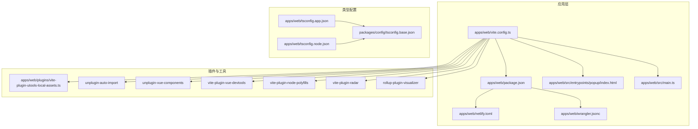
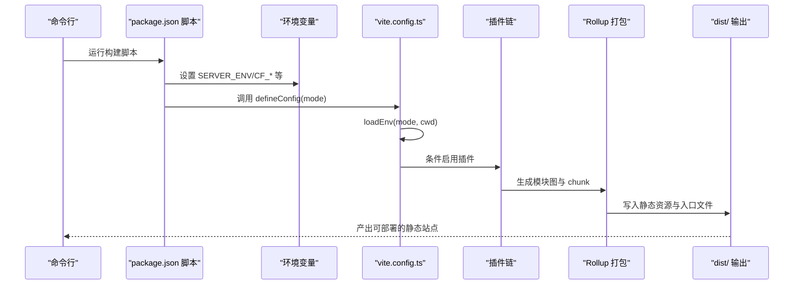
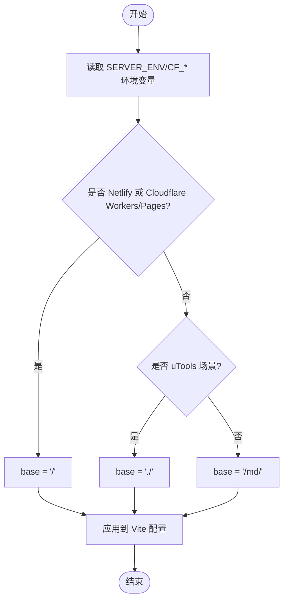
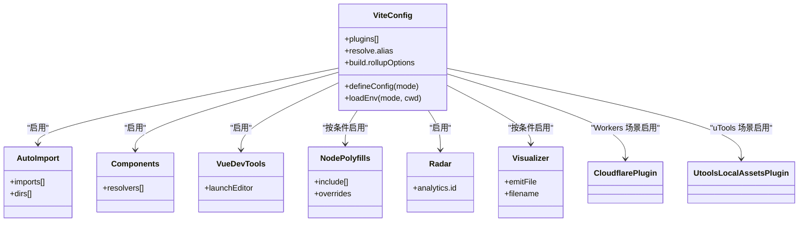
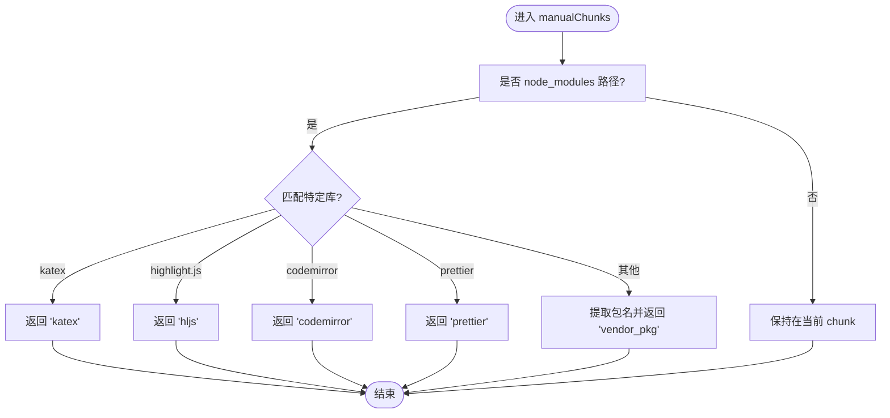
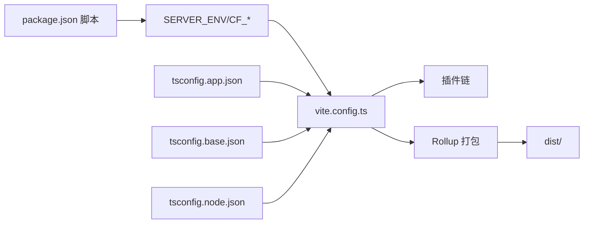

# Vite 构建配置详解

<cite>
**本文引用的文件**
- [apps/web/vite.config.ts](file://apps/web/vite.config.ts)
- [apps/web/package.json](file://apps/web/package.json)
- [apps/web/netlify.toml](file://apps/web/netlify.toml)
- [apps/web/plugins/vite-plugin-utools-local-assets.ts](file://apps/web/plugins/vite-plugin-utools-local-assets.ts)
- [apps/web/src/entrypoints/popup/index.html](file://apps/web/src/entrypoints/popup/index.html)
- [apps/web/src/main.ts](file://apps/web/src/main.ts)
- [apps/web/wrangler.jsonc](file://apps/web/wrangler.jsonc)
- [packages/config/tsconfig.base.json](file://packages/config/tsconfig.base.json)
- [apps/web/tsconfig.app.json](file://apps/web/tsconfig.app.json)
- [apps/web/tsconfig.node.json](file://apps/web/tsconfig.node.json)
</cite>

## 目录
1. [引言](#引言)
2. [项目结构](#项目结构)
3. [核心组件](#核心组件)
4. [架构总览](#架构总览)
5. [详细组件分析](#详细组件分析)
6. [依赖关系分析](#依赖关系分析)
7. [性能考量](#性能考量)
8. [故障排查指南](#故障排查指南)
9. [结论](#结论)
10. [附录](#附录)

## 引言
本文件围绕 Vite 构建配置文件（apps/web/vite.config.ts）进行系统性解析，重点阐述其如何通过条件判断支持多环境构建（开发、生产、浏览器扩展模式），包括 base 路径动态设置、环境变量注入方式、插件的按需加载策略（如 unplugin-auto-import、unplugin-vue-components），并解释构建产物输出目录（dist/）的结构组织与静态资源（assets）处理规则。同时，结合代码片段路径，分析代码分割（code splitting）配置与性能优化策略（如依赖预构建、tree-shaking），并提供常见构建问题（如路径错误、资源加载失败）的排查方法与最佳实践。

## 项目结构
该仓库采用多包工作区结构，前端应用位于 apps/web，核心库位于 packages。Vite 配置集中于 apps/web/vite.config.ts，配合 package.json 中的多条构建脚本，实现不同部署目标（Netlify、Cloudflare Workers、uTools 扩展、浏览器扩展等）的差异化构建。

图表来源
- [apps/web/vite.config.ts](file://apps/web/vite.config.ts#L1-L92)
- [apps/web/package.json](file://apps/web/package.json#L1-L108)
- [apps/web/netlify.toml](file://apps/web/netlify.toml#L1-L10)
- [apps/web/wrangler.jsonc](file://apps/web/wrangler.jsonc#L1-L51)
- [apps/web/plugins/vite-plugin-utools-local-assets.ts](file://apps/web/plugins/vite-plugin-utools-local-assets.ts#L1-L54)
- [apps/web/src/entrypoints/popup/index.html](file://apps/web/src/entrypoints/popup/index.html#L1-L14)
- [apps/web/src/main.ts](file://apps/web/src/main.ts#L1-L24)
- [packages/config/tsconfig.base.json](file://packages/config/tsconfig.base.json#L1-L27)
- [apps/web/tsconfig.app.json](file://apps/web/tsconfig.app.json#L1-L17)
- [apps/web/tsconfig.node.json](file://apps/web/tsconfig.node.json#L1-L4)

章节来源
- [apps/web/vite.config.ts](file://apps/web/vite.config.ts#L1-L92)
- [apps/web/package.json](file://apps/web/package.json#L1-L108)

## 核心组件
- 环境检测与 base 动态设置：通过读取 SERVER_ENV、CF_WORKERS、CF_PAGES 等环境变量，动态决定 base 路径，以适配 Netlify、Cloudflare Workers/Pages、uTools 以及默认 Web 应用场景。
- 插件体系：按需启用 Vue、Tailwind、Vue DevTools、Node Polyfills、Radar、可视化分析、AutoImport、Components、Cloudflare 插件及自定义 uTools 资源替换插件。
- 代码分割与产物命名：通过 Rollup 的 manualChunks 将第三方依赖拆分为独立 chunk，并对 chunk、入口与静态资源文件名进行统一命名，便于缓存与版本控制。
- 路由与 SPA 支持：Netlify 与 Cloudflare Workers 配置中均设置单页应用重定向，保证前端路由在服务端正确回退至 index.html。
- 类型与别名：TS 路径映射 @/* 指向 src，Vite 别名同样指向 src，提升开发体验与一致性。

章节来源
- [apps/web/vite.config.ts](file://apps/web/vite.config.ts#L17-L23)
- [apps/web/vite.config.ts](file://apps/web/vite.config.ts#L24-L91)
- [apps/web/netlify.toml](file://apps/web/netlify.toml#L1-L10)
- [apps/web/wrangler.jsonc](file://apps/web/wrangler.jsonc#L1-L51)
- [apps/web/tsconfig.app.json](file://apps/web/tsconfig.app.json#L1-L17)
- [apps/web/tsconfig.node.json](file://apps/web/tsconfig.node.json#L1-L4)

## 架构总览
下图展示了从命令行到最终产物的关键流程：脚本触发 -> 环境变量注入 -> Vite 加载配置 -> 插件链路执行 -> Rollup 打包 -> 输出 dist/。

图表来源
- [apps/web/package.json](file://apps/web/package.json#L8-L30)
- [apps/web/vite.config.ts](file://apps/web/vite.config.ts#L24-L57)
- [apps/web/vite.config.ts](file://apps/web/vite.config.ts#L62-L91)

## 详细组件分析

### 多环境构建与 base 路径
- 环境变量来源：
  - SERVER_ENV：用于区分部署平台（NETLIFY、UTOOLS）。
  - CF_WORKERS、CF_PAGES：用于识别 Cloudflare Workers/Pages 场景。
- base 计算逻辑：
  - 在 Netlify 或 Cloudflare Workers/Pages 场景下，base 为根路径“/”。
  - 在 uTools 场景下，base 为相对路径“./”，以适配本地打包与资源引用。
  - 默认 Web 场景下，base 为“/md/”，用于子路径部署。
- HTML 入口与运行时：
  - HTML 入口通过 script 标签引入入口模块，base 影响静态资源与入口文件的相对定位。
  - 运行时可通过 window.__BASE__ 或 Vite define 注入 process 对象，辅助运行时行为。

图表来源
- [apps/web/vite.config.ts](file://apps/web/vite.config.ts#L17-L23)
- [apps/web/src/entrypoints/popup/index.html](file://apps/web/src/entrypoints/popup/index.html#L1-L14)

章节来源
- [apps/web/vite.config.ts](file://apps/web/vite.config.ts#L17-L23)
- [apps/web/src/entrypoints/popup/index.html](file://apps/web/src/entrypoints/popup/index.html#L1-L14)

### 环境变量注入与前缀过滤
- loadEnv(mode, cwd)：根据当前模式加载 .env 文件中的键值。
- envPrefix：仅暴露以 VITE_、CF_ 开头的变量，避免泄露敏感信息。
- define：注入 process 对象，使运行时可访问 Node 生态相关能力（在非 Workers 场景下）。

章节来源
- [apps/web/vite.config.ts](file://apps/web/vite.config.ts#L24-L31)

### 插件按需加载策略
- Vue 插件：解析 .vue 单文件组件。
- Tailwind 插件：集成 Tailwind CSS。
- Vue DevTools：开发期调试工具，支持自定义编辑器启动命令。
- Node Polyfills：在浏览器侧为 Node 核心模块提供 polyfill（Workers 场景禁用）。
- Radar：埋点统计。
- 可视化分析：ANALYZE=true 时启用，生成 stats.html。
- AutoImport：自动导入 vue、pinia、@vueuse/core，并扫描指定目录。
- Components：自动注册组件（resolver 为空，按约定自动解析）。
- Cloudflare 插件：Workers 场景启用，提供运行时能力。
- 自定义插件：uTools 场景下替换远程资源为本地资源，减少跨域与网络依赖。

图表来源
- [apps/web/vite.config.ts](file://apps/web/vite.config.ts#L24-L57)
- [apps/web/plugins/vite-plugin-utools-local-assets.ts](file://apps/web/plugins/vite-plugin-utools-local-assets.ts#L1-L54)

章节来源
- [apps/web/vite.config.ts](file://apps/web/vite.config.ts#L24-L57)
- [apps/web/plugins/vite-plugin-utools-local-assets.ts](file://apps/web/plugins/vite-plugin-utools-local-assets.ts#L1-L54)

### 代码分割与产物命名
- external：将 mermaid 设为外部依赖，避免被打包进主包。
- manualChunks：对 node_modules 下的依赖进行分组：
  - 特定库（katex、highlight.js、codemirror、prettier）单独拆分。
  - 其他依赖按包名归类为 vendor_ 前缀的 chunk，便于缓存与增量更新。
- 文件命名：统一使用 static/js 与 static/[ext] 目录，文件名包含 [name]-[hash]，提升缓存命中率。

图表来源
- [apps/web/vite.config.ts](file://apps/web/vite.config.ts#L62-L91)

章节来源
- [apps/web/vite.config.ts](file://apps/web/vite.config.ts#L62-L91)

### 构建产物输出与静态资源处理
- 输出目录：默认 dist/，Netlify 配置 publish 指向 dist。
- 静态资源命名：统一前缀 static/，便于 CDN 缓存与版本控制。
- HTML 入口：入口 HTML 通过 script 引入入口 TS 文件，base 与静态资源路径共同决定运行时加载行为。
- Cloudflare Workers：assets 配置绑定 public 目录，支持单页应用回退。

章节来源
- [apps/web/netlify.toml](file://apps/web/netlify.toml#L1-L10)
- [apps/web/vite.config.ts](file://apps/web/vite.config.ts#L62-L91)
- [apps/web/src/entrypoints/popup/index.html](file://apps/web/src/entrypoints/popup/index.html#L1-L14)
- [apps/web/wrangler.jsonc](file://apps/web/wrangler.jsonc#L1-L51)

### 浏览器扩展模式（uTools 与浏览器扩展）
- uTools 模式：
  - 通过 SERVER_ENV=UTOOLS 触发，启用自定义插件替换远程资源为本地资源，减少跨域与网络失败风险。
  - base 使用相对路径“./”，适配本地打包与资源引用。
- 浏览器扩展（WXT）：
  - 通过 package.json 中的 ext:* 脚本与 wxt 配置协作，构建扩展产物。
  - 扩展 CSP 限制内联脚本，构建阶段会将内联脚本抽取为独立文件或虚拟模块，以满足安全要求。

章节来源
- [apps/web/package.json](file://apps/web/package.json#L1-L30)
- [apps/web/plugins/vite-plugin-utools-local-assets.ts](file://apps/web/plugins/vite-plugin-utools-local-assets.ts#L1-L54)

### 依赖预构建与 Tree-Shaking
- 依赖预构建：Vite 默认对 node_modules 进行预构建，结合 manualChunks 与 external，减少重复打包与体积膨胀。
- Tree-shaking：配合 Rollup 的最小化与模块化打包策略，未使用的导出会被移除；TS 路径映射与类型声明有助于更精确的摇树优化。

章节来源
- [apps/web/vite.config.ts](file://apps/web/vite.config.ts#L62-L91)
- [apps/web/tsconfig.app.json](file://apps/web/tsconfig.app.json#L1-L17)
- [packages/config/tsconfig.base.json](file://packages/config/tsconfig.base.json#L1-L27)

## 依赖关系分析
- Vite 配置依赖于多个插件与工具，形成“条件启用”的插件链：Workers 场景启用 Cloudflare 插件并禁用 Node Polyfills；uTools 场景启用本地资源替换插件；分析模式启用可视化分析。
- 构建脚本通过 cross-env 设置 SERVER_ENV/CF_*，驱动 base 与插件选择。
- 类型配置（tsconfig.base.json、tsconfig.app.json、tsconfig.node.json）统一了路径映射与模块解析策略，保障开发与构建一致性。

图表来源
- [apps/web/package.json](file://apps/web/package.json#L8-L30)
- [apps/web/vite.config.ts](file://apps/web/vite.config.ts#L17-L57)
- [apps/web/tsconfig.app.json](file://apps/web/tsconfig.app.json#L1-L17)
- [apps/web/tsconfig.node.json](file://apps/web/tsconfig.node.json#L1-L4)
- [packages/config/tsconfig.base.json](file://packages/config/tsconfig.base.json#L1-L27)

章节来源
- [apps/web/package.json](file://apps/web/package.json#L8-L30)
- [apps/web/vite.config.ts](file://apps/web/vite.config.ts#L17-L57)

## 性能考量
- 代码分割：manualChunks 将大体量第三方库拆分，降低首屏体积并提升缓存命中率。
- 外部化：将 mermaid 等大型库外部化，减少主包体积，按需加载。
- 文件命名：统一的静态资源命名策略，便于 CDN 缓存与版本控制。
- 分析与可视化：ANALYZE=true 时生成 stats.html，帮助定位体积热点与重复依赖。
- 类型与别名：TS 路径映射与 Vite 别名一致，减少路径解析开销，提升开发体验。

章节来源
- [apps/web/vite.config.ts](file://apps/web/vite.config.ts#L62-L91)
- [apps/web/package.json](file://apps/web/package.json#L14-L18)

## 故障排查指南
- 路径错误（404/资源加载失败）：
  - 检查 base 是否与部署路径一致（Netlify、Cloudflare Pages、子路径部署）。
  - 确认 HTML 入口中的 script src 与 base 结合后是否指向正确路径。
  - uTools 模式下，确认本地资源替换插件已启用且替换规则覆盖目标资源。
- 资源加载失败（跨域/CSP 限制）：
  - 浏览器扩展场景下，检查内联脚本是否被抽取为独立文件或虚拟模块。
  - Cloudflare Workers 场景下，确认 assets 目录与单页应用回退配置正确。
- 构建体积异常：
  - 启用 ANALYZE=true 生成 stats.html，定位大体积模块与重复依赖。
  - 检查 manualChunks 规则是否合理，避免过度拆分导致请求数过多。
- 环境变量未生效：
  - 确认 envPrefix 仅暴露 VITE_/CF_ 前缀变量。
  - 检查 loadEnv(mode, cwd) 的模式与 .env 文件位置是否正确。

章节来源
- [apps/web/vite.config.ts](file://apps/web/vite.config.ts#L24-L31)
- [apps/web/plugins/vite-plugin-utools-local-assets.ts](file://apps/web/plugins/vite-plugin-utools-local-assets.ts#L1-L54)
- [apps/web/netlify.toml](file://apps/web/netlify.toml#L1-L10)
- [apps/web/wrangler.jsonc](file://apps/web/wrangler.jsonc#L1-L51)
- [apps/web/package.json](file://apps/web/package.json#L14-L18)

## 结论
apps/web/vite.config.ts 通过环境变量驱动的条件判断，实现了对多部署场景的灵活适配；借助插件链与 Rollup 配置，完成了高效的代码分割与产物组织。配合脚本与类型配置，整体构建流程清晰、可维护性强。建议在团队内统一环境变量命名规范与构建脚本，持续利用可视化分析工具优化体积与性能。

## 附录
- 关键实现路径参考：
  - 环境检测与 base 设置：[apps/web/vite.config.ts](file://apps/web/vite.config.ts#L17-L23)
  - 插件启用与条件逻辑：[apps/web/vite.config.ts](file://apps/web/vite.config.ts#L24-L57)
  - 代码分割与命名策略：[apps/web/vite.config.ts](file://apps/web/vite.config.ts#L62-L91)
  - uTools 资源替换插件：[apps/web/plugins/vite-plugin-utools-local-assets.ts](file://apps/web/plugins/vite-plugin-utools-local-assets.ts#L1-L54)
  - Netlify 发布配置：[apps/web/netlify.toml](file://apps/web/netlify.toml#L1-L10)
  - Cloudflare Workers 静态资源绑定：[apps/web/wrangler.jsonc](file://apps/web/wrangler.jsonc#L1-L51)
  - HTML 入口与运行时挂载：[apps/web/src/entrypoints/popup/index.html](file://apps/web/src/entrypoints/popup/index.html#L1-L14), [apps/web/src/main.ts](file://apps/web/src/main.ts#L1-L24)
  - TS 路径映射与别名：[apps/web/tsconfig.app.json](file://apps/web/tsconfig.app.json#L1-L17), [apps/web/tsconfig.node.json](file://apps/web/tsconfig.node.json#L1-L4), [packages/config/tsconfig.base.json](file://packages/config/tsconfig.base.json#L1-L27)