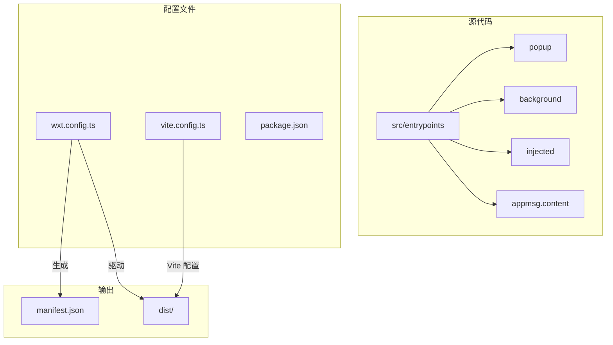
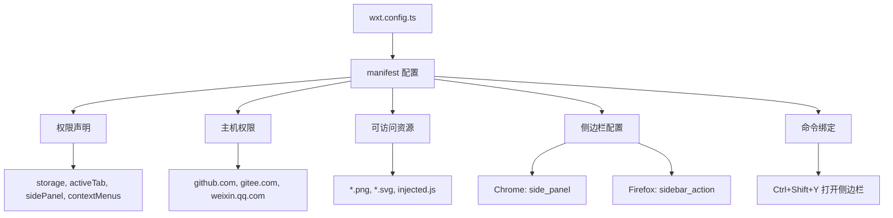
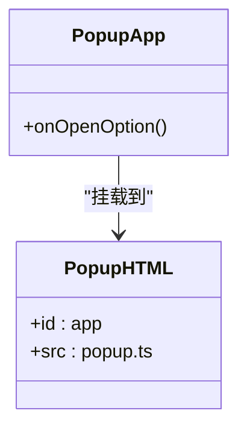
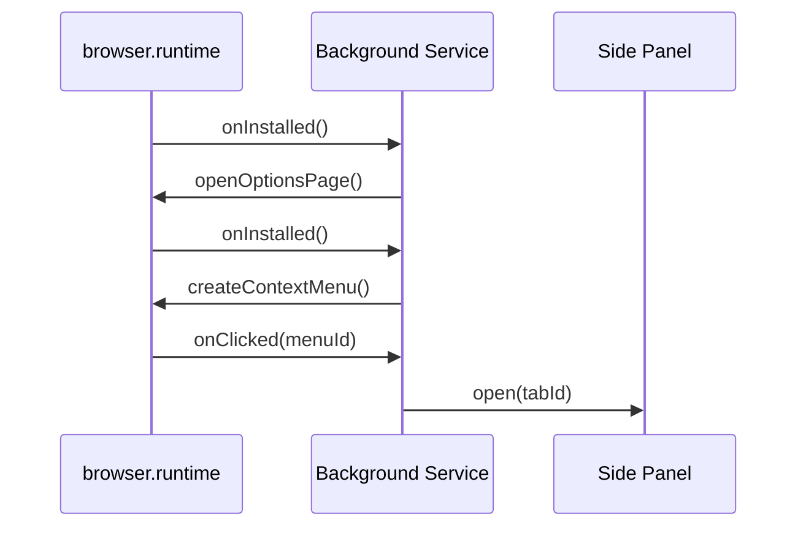
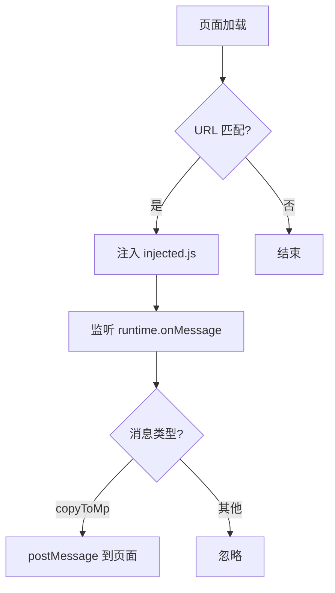
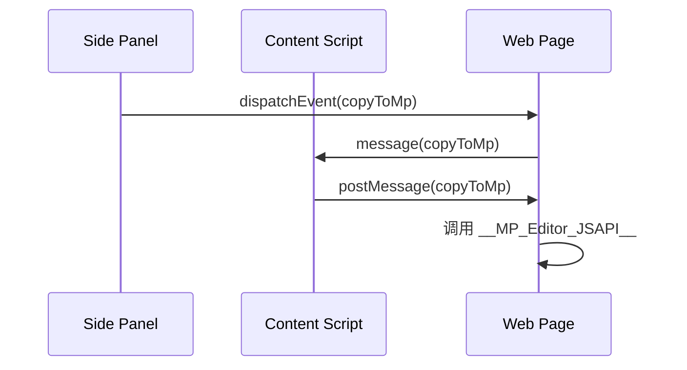
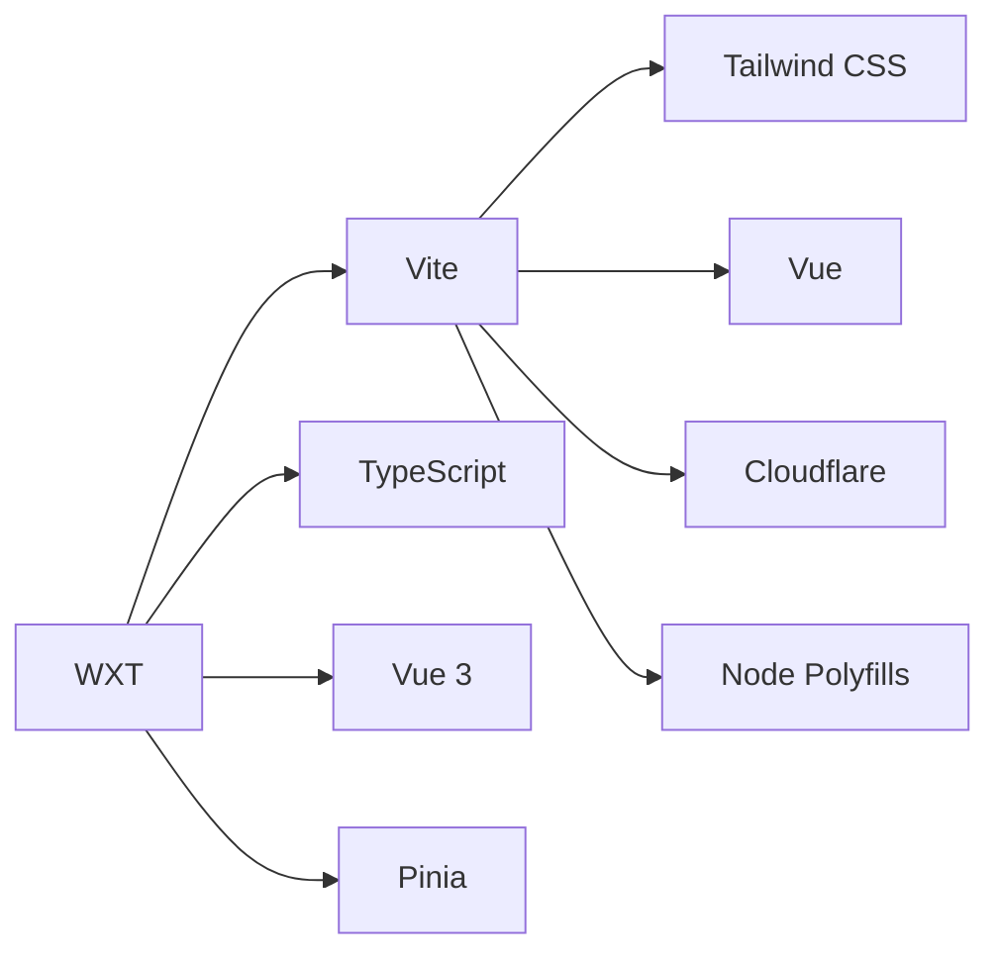

# WXT 框架集成与扩展构建

<cite>
**本文档引用文件**  
- [wxt.config.ts](file://apps/web/wxt.config.ts)
- [package.json](file://apps/web/package.json)
- [vite.config.ts](file://apps/web/vite.config.ts)
- [background.ts](file://apps/web/src/entrypoints/background.ts)
- [popup.ts](file://apps/web/src/entrypoints/popup/popup.ts)
- [injected.ts](file://apps/web/src/entrypoints/injected.ts)
- [appmsg.content.ts](file://apps/web/src/entrypoints/appmsg.content.ts)
- [sidepanel.ts](file://apps/web/src/sidepanel.ts)
- [build-extension.ts](file://apps/web/src/modules/build-extension.ts)
</cite>

## 目录
1. [项目结构](#项目结构)
2. [核心组件](#核心组件)
3. [架构概述](#架构概述)
4. [详细组件分析](#详细组件分析)
5. [依赖分析](#依赖分析)
6. [性能考虑](#性能考虑)
7. [故障排除指南](#故障排除指南)
8. [结论](#结论)

## 项目结构

该项目采用多应用架构，其中 `apps/web` 目录包含基于 WXT 框架的浏览器扩展实现。WXT 作为现代化的浏览器扩展开发框架，通过 `wxt.config.ts` 配置文件驱动整个构建流程。项目结构清晰地分离了源代码、构建配置和入口点。

**图示来源**  
- [wxt.config.ts](file://apps/web/wxt.config.ts#L23-L101)
- [vite.config.ts](file://apps/web/vite.config.ts#L24-L91)

**本节来源**  
- [wxt.config.ts](file://apps/web/wxt.config.ts#L1-L102)
- [project_structure](file://#L1-L500)

## 核心组件

WXT 框架在该项目中实现了完整的浏览器扩展生命周期管理，包括弹出窗口（popup）、后台服务（background）、内容脚本（content script）和注入脚本（injected script）等核心组件。框架通过约定式目录结构自动识别入口文件，并生成符合各浏览器标准的 manifest.json 文件。

**本节来源**  
- [wxt.config.ts](file://apps/web/wxt.config.ts#L23-L101)
- [package.json](file://apps/web/package.json#L23-L26)

## 架构概述

WXT 框架通过 `wxt.config.ts` 文件定义扩展的核心配置，包括权限声明、资源访问、侧边栏集成和命令绑定。配置文件采用函数式编程模式，根据构建模式和目标浏览器动态生成 manifest 配置。

**图示来源**  
- [wxt.config.ts](file://apps/web/wxt.config.ts#L26-L68)

## 详细组件分析

### 弹出窗口（Popup）分析

弹出窗口作为扩展的主要用户界面，通过 `src/entrypoints/popup` 目录下的文件实现。入口文件 `popup.ts` 负责挂载 Vue 应用，而 `App.vue` 定义了用户界面和交互逻辑。

**图示来源**  
- [popup.ts](file://apps/web/src/entrypoints/popup/popup.ts#L1-L9)
- [App.vue](file://apps/web/src/entrypoints/popup/App.vue#L1-L73)
- [index.html](file://apps/web/src/entrypoints/popup/index.html#L1-L14)

**本节来源**  
- [popup.ts](file://apps/web/src/entrypoints/popup/popup.ts#L1-L9)
- [App.vue](file://apps/web/src/entrypoints/popup/App.vue#L1-L73)

### 后台服务（Background）分析

后台服务通过 `background.ts` 文件实现，使用 `defineBackground` 函数定义服务逻辑。服务监听扩展安装事件和上下文菜单点击事件，实现安装后自动打开选项页面和侧边栏功能。

**图示来源**  
- [background.ts](file://apps/web/src/entrypoints/background.ts#L3-L33)

**本节来源**  
- [background.ts](file://apps/web/src/entrypoints/background.ts#L1-L34)

### 内容脚本与注入机制分析

内容脚本通过 `appmsg.content.ts` 文件定义，匹配微信公众号文章编辑页面的 URL 模式。当页面加载时，脚本会注入 `injected.js` 文件，并监听来自扩展的消息，实现内容传递功能。

**图示来源**  
- [appmsg.content.ts](file://apps/web/src/entrypoints/appmsg.content.ts#L3-L19)
- [injected.ts](file://apps/web/src/entrypoints/injected.ts#L1-L15)

**本节来源**  
- [appmsg.content.ts](file://apps/web/src/entrypoints/appmsg.content.ts#L1-L20)
- [injected.ts](file://apps/web/src/entrypoints/injected.ts#L1-L16)

### 侧边栏与消息通信分析

侧边栏通过 `sidepanel.ts` 文件实现，建立了扩展与网页之间的双向通信机制。当用户在侧边栏触发复制操作时，通过 `copyToMp` 自定义事件将内容发送到目标页面。

**图示来源**  
- [sidepanel.ts](file://apps/web/src/sidepanel.ts#L28-L38)
- [injected.ts](file://apps/web/src/entrypoints/injected.ts#L2-L13)

**本节来源**  
- [sidepanel.ts](file://apps/web/src/sidepanel.ts#L1-L39)
- [injected.ts](file://apps/web/src/entrypoints/injected.ts#L1-L16)

## 依赖分析

项目依赖关系清晰，WXT 框架作为核心构建工具，与 Vite 深度集成。通过 `vite.config.ts` 文件，项目配置了 Tailwind CSS、Vue 开发者工具等插件，同时处理了 Cloudflare Workers 等特殊环境的构建需求。

**图示来源**  
- [vite.config.ts](file://apps/web/vite.config.ts#L4-L13)
- [package.json](file://apps/web/package.json#L79-L105)

**本节来源**  
- [vite.config.ts](file://apps/web/vite.config.ts#L1-L92)
- [package.json](file://apps/web/package.json#L1-L108)

## 性能考虑

WXT 框架在构建过程中实现了智能的代码分割策略，通过 `build-extension.ts` 中的 `manualChunks` 配置，将大型依赖库如 KaTeX、Highlight.js 等单独打包，优化了扩展的加载性能。

**本节来源**  
- [build-extension.ts](file://apps/web/src/modules/build-extension.ts#L38-L52)
- [vite.config.ts](file://apps/web/vite.config.ts#L70-L85)

## 故障排除指南

在开发过程中，需要注意 WXT 框架对内联脚本的处理机制。由于浏览器扩展的内容安全策略（CSP）限制，所有内联脚本都会被自动提取为外部文件，这一过程由 `htmlScriptToLocal` 插件处理。

**本节来源**  
- [build-extension.ts](file://apps/web/src/modules/build-extension.ts#L150-L217)
- [wxt.config.ts](file://apps/web/wxt.config.ts#L85-L99)

## 结论

WXT 框架为浏览器扩展开发提供了现代化的解决方案，通过简洁的配置文件实现了复杂的 manifest 生成逻辑。项目成功集成了多入口点（popup、sidepanel、injected），并通过 TypeScript 和 Vue 单文件组件实现了高效的开发体验。开发服务器与生产构建的差异处理确保了在不同环境下的稳定运行。