# 构建系统详解

<cite>
**本文档引用的文件**   
- [vite.config.ts](file://apps/web/vite.config.ts)
- [wxt.config.ts](file://apps/web/wxt.config.ts)
- [vite-plugin-utools-local-assets.ts](file://apps/web/plugins/vite-plugin-utools-local-assets.ts)
- [build-standalone.sh](file://scripts/build-standalone.sh)
- [build-static.sh](file://scripts/build-static.sh)
- [build-multiarch.sh](file://scripts/build-multiarch.sh)
- [Dockerfile.standalone](file://docker/latest/Dockerfile.standalone)
- [Dockerfile.static](file://docker/latest/Dockerfile.static)
- [netlify.toml](file://apps/web/netlify.toml)
- [wrangler.jsonc](file://apps/web/wrangler.jsonc)
- [build-extension.ts](file://apps/web/src/modules/build-extension.ts)
- [package.json](file://apps/web/package.json)
</cite>

## 目录
1. [项目结构](#项目结构)
2. [Vite构建配置](#vite构建配置)
3. [WXT框架在浏览器扩展中的作用](#wxt框架在浏览器扩展中的作用)
4. [自定义Vite插件](#自定义vite插件)
5. [多平台打包脚本](#多平台打包脚本)
6. [构建优化建议](#构建优化建议)

## 项目结构

该项目采用多应用架构，支持多种部署环境和平台。核心Web应用位于`apps/web`目录，通过Vite和WXT框架支持多环境构建。项目包含多个子应用：`utools`（uTools插件）、`vscode`（VS Code扩展）和`web`（Web应用）。构建脚本位于`scripts`目录，Docker配置在`docker`目录，支持多种部署方式。

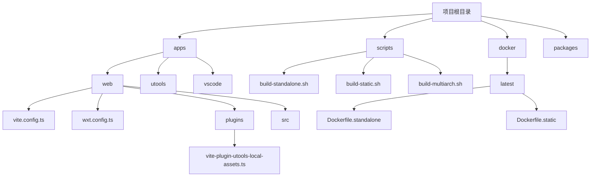

**图示来源**
- [vite.config.ts](file://apps/web/vite.config.ts)
- [wxt.config.ts](file://apps/web/wxt.config.ts)
- [build-standalone.sh](file://scripts/build-standalone.sh)
- [Dockerfile.standalone](file://docker/latest/Dockerfile.standalone)

**本节来源**
- [vite.config.ts](file://apps/web/vite.config.ts)
- [wxt.config.ts](file://apps/web/wxt.config.ts)
- [build-standalone.sh](file://scripts/build-standalone.sh)

## Vite构建配置

Vite配置文件`vite.config.ts`实现了多环境构建支持，通过环境变量区分开发、生产、Netlify、Cloudflare Workers/Pages和uTools等不同构建环境。配置中的`base`路径根据环境动态设置：Netlify、Cloudflare环境使用根路径`/`，uTools环境使用相对路径`./`，其他环境使用`/md/`路径。

```mermaid
graph TD
A[构建环境判断] --> B{SERVER_ENV}
B --> |NETLIFY| C[base = "/"]
B --> |UTOOLS| D[base = "./"]
B --> |其他| E[base = "/md/"]
F[CF_WORKERS] --> |1| G[启用Cloudflare插件]
H[CF_PAGES] --> |1| I[启用Cloudflare插件]
J[ANALYZE=true] --> K[启用visualizer分析]
L[uTools环境] --> M[加载utoolsLocalAssets插件]
```

**图示来源**
- [vite.config.ts](file://apps/web/vite.config.ts#L17-L23)

**本节来源**
- [vite.config.ts](file://apps/web/vite.config.ts#L1-L92)

### 条件性插件加载

Vite配置实现了条件性插件加载机制，根据不同环境加载不同的插件组合。在Cloudflare Workers环境中启用`cloudflare()`插件，在开发环境中启用`vueDevTools`插件，在分析模式下启用`visualizer`插件，在uTools环境中加载自定义的`utoolsLocalAssetsPlugin`插件。

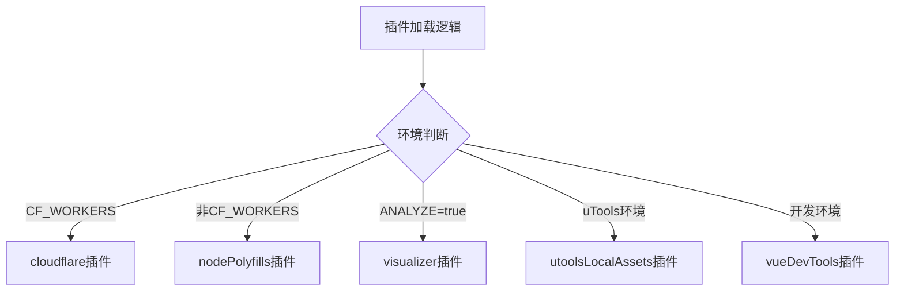

**图示来源**
- [vite.config.ts](file://apps/web/vite.config.ts#L31-L57)

**本节来源**
- [vite.config.ts](file://apps/web/vite.config.ts#L31-L57)

### 资源处理与代码分割

构建配置中的`build.rollupOptions`定义了详细的代码分割策略，将大型依赖库拆分为独立的chunk，优化加载性能。`manualChunks`函数根据模块路径将`katex`、`highlight.js`、`codemirror`、`prettier`等库分别打包，其他node_modules中的依赖按包名创建vendor chunk。

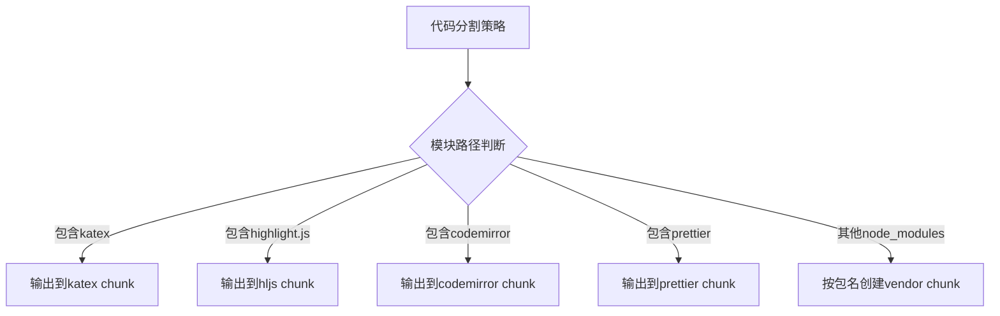

**图示来源**
- [vite.config.ts](file://apps/web/vite.config.ts#L62-L86)

**本节来源**
- [vite.config.ts](file://apps/web/vite.config.ts#L62-L86)

## WXT框架在浏览器扩展中的作用

WXT框架配置文件`wxt.config.ts`定义了浏览器扩展的manifest配置、权限设置、side panel集成和命令注册等核心功能。该配置继承了Vite配置，并针对浏览器扩展环境进行了特殊处理。

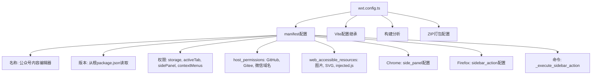

**图示来源**
- [wxt.config.ts](file://apps/web/wxt.config.ts#L23-L69)

**本节来源**
- [wxt.config.ts](file://apps/web/wxt.config.ts#L1-L102)

### Manifest配置生成

WXT配置通过函数式API动态生成manifest配置，支持根据构建模式和浏览器类型进行条件配置。图标路径根据开发模式动态切换，Chrome浏览器使用`side_panel`配置，Firefox浏览器使用`sidebar_action`配置。

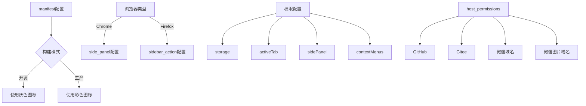

**图示来源**
- [wxt.config.ts](file://apps/web/wxt.config.ts#L26-L40)

**本节来源**
- [wxt.config.ts](file://apps/web/wxt.config.ts#L26-L40)

### Side Panel集成与命令注册

WXT配置实现了side panel的跨浏览器集成，为Chrome和Firefox分别配置了相应的panel选项。同时注册了`_execute_sidebar_action`命令，允许用户通过快捷键`Ctrl+Shift+Y`打开侧边栏。

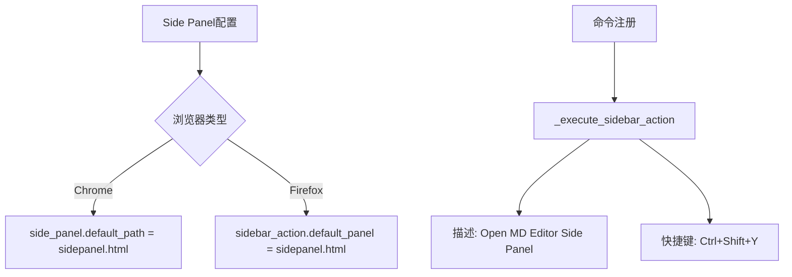

**图示来源**
- [wxt.config.ts](file://apps/web/wxt.config.ts#L47-L67)

**本节来源**
- [wxt.config.ts](file://apps/web/wxt.config.ts#L47-L67)

### WXT模块扩展

通过`build-extension.ts`模块，WXT框架扩展了额外的功能，包括添加options页面、sidepanel入口点、自定义Vite插件和代码分割优化。该模块使用WXT的hook系统在构建过程中注入自定义逻辑。

```mermaid
graph TD
A[build-extension.ts] --> B[defineWxtModule]
B --> C[setup函数]
C --> D[添加alias]
D --> E[/src/main.ts -> ./src/main.ts]
D --> F[/src/sidepanel.ts -> ./src/sidepanel.ts]
C --> G[添加entrypoints]
G --> H[options页面]
G --> I[sidepanel页面]
C --> J[扩展Vite配置]
J --> K[htmlScriptToVirtual插件]
J --> L[vueDevtoolsHack插件]
J --> M[htmlScriptToLocal插件]
C --> N[代码分割优化]
N --> O[prettier chunk]
N --> P[katex chunk]
N --> Q[mermaid chunk]
N --> R[hljs chunk]
```

**图示来源**
- [build-extension.ts](file://apps/web/src/modules/build-extension.ts#L13-L65)

**本节来源**
- [build-extension.ts](file://apps/web/src/modules/build-extension.ts#L1-L264)

## 自定义Vite插件

自定义Vite插件`vite-plugin-utools-local-assets.ts`专门处理uTools平台的本地资源引用问题。该插件在构建时将HTML中的远程CDN资源替换为本地文件路径，确保在uTools环境中能够正确加载资源。

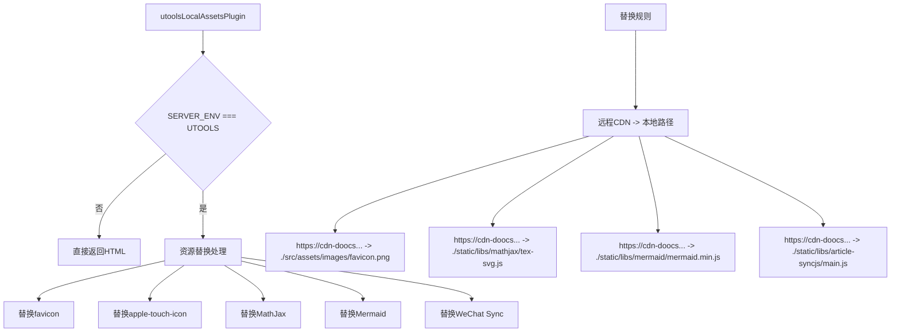

**图示来源**
- [vite-plugin-utools-local-assets.ts](file://apps/web/plugins/vite-plugin-utools-local-assets.ts#L7-L53)

**本节来源**
- [vite-plugin-utools-local-assets.ts](file://apps/web/plugins/vite-plugin-utools-local-assets.ts#L1-L54)

### 插件实现机制

该插件使用Vite的`transformIndexHtml`钩子，在HTML转换后阶段(post)执行资源替换。插件通过正则表达式匹配远程CDN URL，并将其替换为对应的本地文件路径，确保在uTools环境中资源能够正确加载。

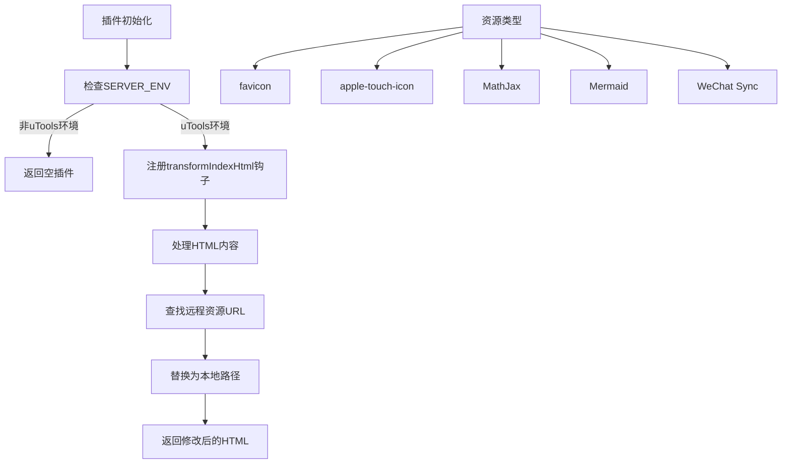

**图示来源**
- [vite-plugin-utools-local-assets.ts](file://apps/web/plugins/vite-plugin-utools-local-assets.ts#L13-L15)

**本节来源**
- [vite-plugin-utools-local-assets.ts](file://apps/web/plugins/vite-plugin-utools-local-assets.ts#L1-L54)

## 多平台打包脚本

项目提供了一系列Shell脚本用于多平台打包，支持standalone、static、multiarch等多种构建模式。这些脚本自动化了Docker镜像构建、环境变量加载和多架构支持等复杂流程。

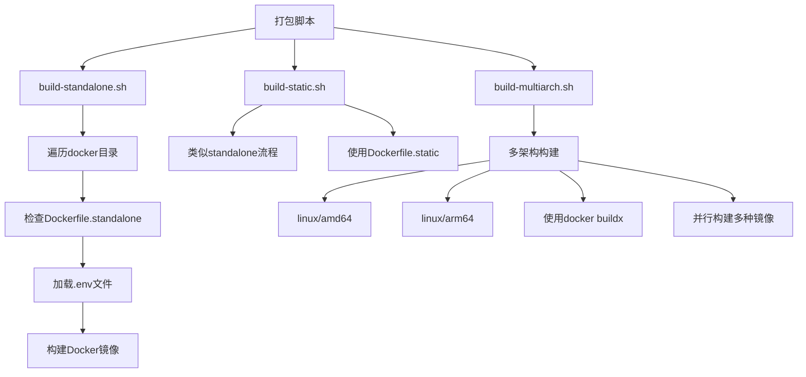

**图示来源**
- [build-standalone.sh](file://scripts/build-standalone.sh)
- [build-static.sh](file://scripts/build-static.sh)
- [build-multiarch.sh](file://scripts/build-multiarch.sh)

**本节来源**
- [build-standalone.sh](file://scripts/build-standalone.sh#L1-L25)
- [build-static.sh](file://scripts/build-static.sh#L1-L25)
- [build-multiarch.sh](file://scripts/build-multiarch.sh#L1-L88)

### Standalone构建流程

`build-standalone.sh`脚本实现了standalone模式的构建流程，遍历`docker`目录下的所有版本目录，检查是否存在`Dockerfile.standalone`，然后加载对应的`.env`文件，最后使用Docker构建包含Go后端和静态资源的完整镜像。

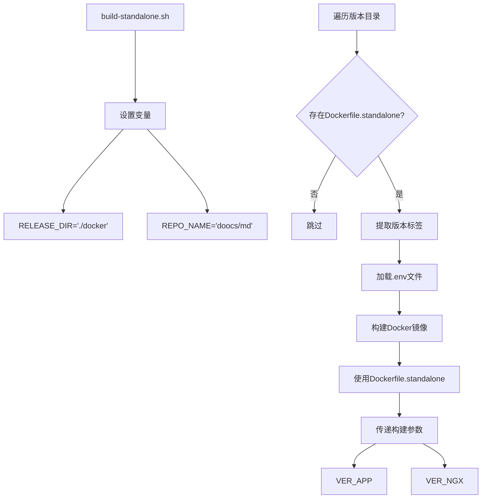

**图示来源**
- [build-standalone.sh](file://scripts/build-standalone.sh#L6-L22)

**本节来源**
- [build-standalone.sh](file://scripts/build-standalone.sh#L1-L25)

### Multiarch构建流程

`build-multiarch.sh`脚本提供了更高级的多架构构建能力，使用`docker buildx`支持`linux/amd64`和`linux/arm64`两种架构。脚本能够并行构建base、nginx、standalone和static四种类型的Docker镜像，并自动推送至镜像仓库。

```mermaid
graph TD
A[build-multiarch.sh] --> B[设置多架构]
B --> C[PLATFORMS="linux/amd64,linux/arm64"]
D[遍历版本目录] --> E[检查.env文件]
E --> F[加载版本变量]
G[构建流程] --> H[base镜像]
G --> I[nginx镜像]
G --> J[standalone镜像]
G --> K[static镜像]
L[构建命令] --> M[docker buildx build]
M --> N[--platform]
M --> O[--build-arg]
M --> P[-f]
M --> Q[-t]
M --> R[--push]
```

**图示来源**
- [build-multiarch.sh](file://scripts/build-multiarch.sh#L7-L87)

**本节来源**
- [build-multiarch.sh](file://scripts/build-multiarch.sh#L1-L88)

### Docker镜像构建

Dockerfile配置实现了分阶段构建，`Dockerfile.standalone`首先从`doocs/md:latest-assets`镜像复制静态资源，然后在Go构建环境中编译Go后端程序，最后在Alpine镜像中打包运行时环境，实现了最小化的镜像体积。

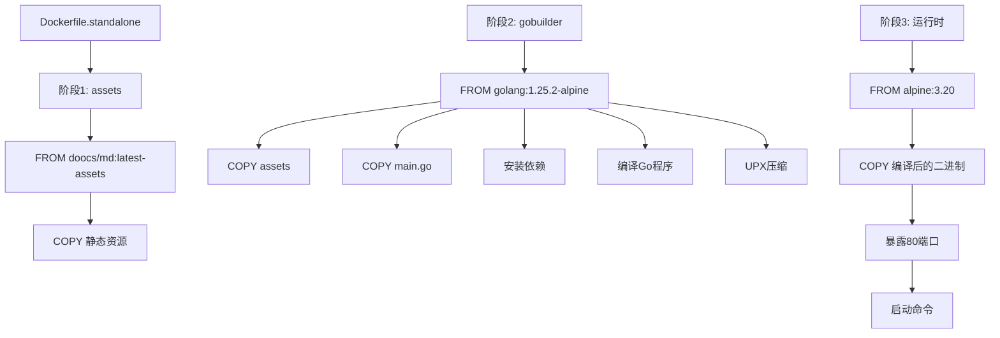

**图示来源**
- [Dockerfile.standalone](file://docker/latest/Dockerfile.standalone#L1-L23)

**本节来源**
- [Dockerfile.standalone](file://docker/latest/Dockerfile.standalone#L1-L23)

## 构建优化建议

### 依赖预构建

项目已通过Vite的依赖预构建机制优化了开发服务器启动速度。建议定期更新`optimizeDeps.include`列表，确保所有重要依赖都被预构建。对于大型库如`codemirror`、`highlight.js`等，应确保它们被正确识别和预构建。

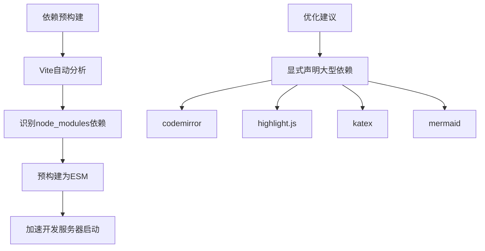

**本节来源**
- [vite.config.ts](file://apps/web/vite.config.ts#L62-L86)

### 代码分割策略

当前的代码分割策略已将主要依赖库分离为独立chunk，建议进一步优化第三方库的分割，将不常用的库延迟加载。可以考虑使用动态import()实现路由级别的代码分割，减少初始加载体积。

```mermaid
graph TD
A[代码分割] --> B[当前策略]
B --> C[katex chunk]
B --> D[hljs chunk]
B --> E[codemirror chunk]
B --> F[prettier chunk]
B --> G[vendor chunk]
H[优化建议] --> I[路由级别分割]
I --> J[动态import()]
H --> K[按需加载]
K --> L[AI功能模块]
K --> M[图像生成]
K --> N[工具箱]
```

**本节来源**
- [vite.config.ts](file://apps/web/vite.config.ts#L62-L86)

### 产物分析工具

项目已集成`rollup-plugin-visualizer`分析工具，通过设置`ANALYZE=true`环境变量可生成构建产物的可视化报告。建议在发布前常规使用此工具分析bundle大小，识别不必要的依赖。

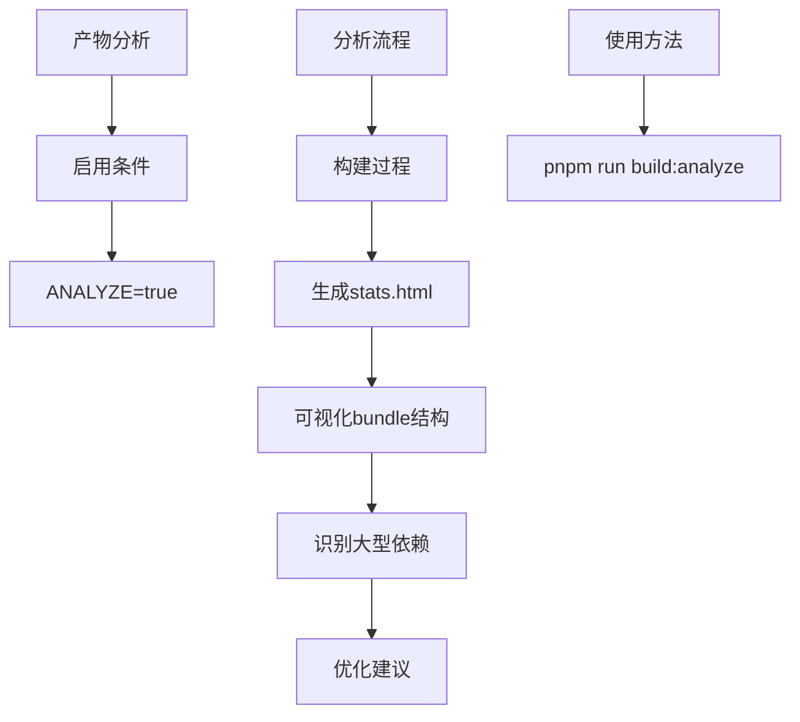

**本节来源**
- [vite.config.ts](file://apps/web/vite.config.ts#L48)
- [package.json](file://apps/web/package.json#L17)