# 构建脚本与自动化流程

<cite>
**本文档中引用的文件**   
- [build-standalone.sh](file://scripts/build-standalone.sh)
- [build-static.sh](file://scripts/build-static.sh)
- [build-multiarch.sh](file://scripts/build-multiarch.sh)
- [build-base-image.sh](file://scripts/build-base-image.sh)
- [build-nginx.sh](file://scripts/build-nginx.sh)
- [Dockerfile.base](file://docker/latest/Dockerfile.base)
- [Dockerfile.standalone](file://docker/latest/Dockerfile.standalone)
- [Dockerfile.nginx](file://docker/latest/Dockerfile.nginx)
- [Dockerfile.static](file://docker/latest/Dockerfile.static)
- [vite.config.ts](file://apps/web/vite.config.ts)
- [wxt.config.ts](file://apps/web/wxt.config.ts)
- [netlify.toml](file://apps/web/netlify.toml)
- [.env](file://docker/latest/.env)
- [package.json](file://package.json)
- [docker-compose-build.yml](file://docker/docker-compose-build.yml)
</cite>

## 目录
1. [项目结构](#项目结构)
2. [构建脚本分析](#构建脚本分析)
3. [Docker镜像构建流程](#docker镜像构建流程)
4. [Vite与WXT构建配置](#vite与wxt构建配置)
5. [CI/CD流程整合](#cicd流程整合)
6. [构建调试与常见问题](#构建调试与常见问题)
7. [性能优化建议](#性能优化建议)

## 项目结构

该项目采用多包（monorepo）架构，通过pnpm工作区管理多个应用和包。核心构建流程集中在`scripts`目录下的构建脚本和`docker`目录的Docker配置中。

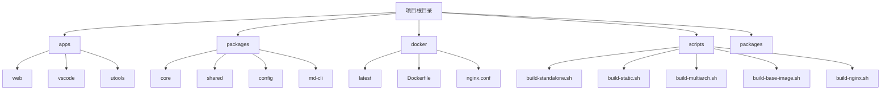

**Diagram sources**
- [package.json](file://package.json#L50-L58)
- [pnpm-workspace.yaml](file://pnpm-workspace.yaml#L1-L3)

**Section sources**
- [package.json](file://package.json)
- [pnpm-workspace.yaml](file://pnpm-workspace.yaml)

## 构建脚本分析

项目提供了一系列构建脚本，用于生成不同形态的部署产物。这些脚本通过遍历`docker`目录下的版本文件夹，读取环境变量并调用Docker构建命令。

### 构建脚本类型

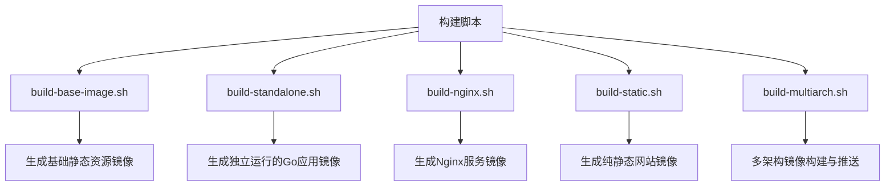

**Diagram sources**
- [build-standalone.sh](file://scripts/build-standalone.sh)
- [build-static.sh](file://scripts/build-static.sh)
- [build-multiarch.sh](file://scripts/build-multiarch.sh)
- [build-base-image.sh](file://scripts/build-base-image.sh)
- [build-nginx.sh](file://scripts/build-nginx.sh)

#### 环境变量加载机制

所有构建脚本都采用相同的环境变量加载模式，通过`set -a`和`set +a`命令将`.env`文件中的变量导入shell环境。

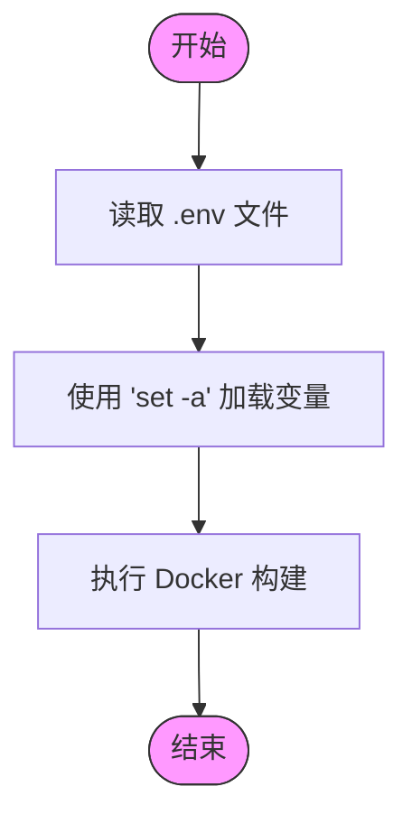

**Diagram sources**
- [build-standalone.sh](file://scripts/build-standalone.sh#L12-L14)
- [build-static.sh](file://scripts/build-static.sh#L12-L14)

**Section sources**
- [build-standalone.sh](file://scripts/build-standalone.sh#L1-L25)
- [build-static.sh](file://scripts/build-static.sh#L1-L25)
- [docker/latest/.env](file://docker/latest/.env)

## Docker镜像构建流程

项目通过多阶段Docker构建策略，生成不同用途的镜像。构建流程分为基础资源构建、独立应用构建、Nginx服务构建和静态网站构建。

### 多阶段构建流程

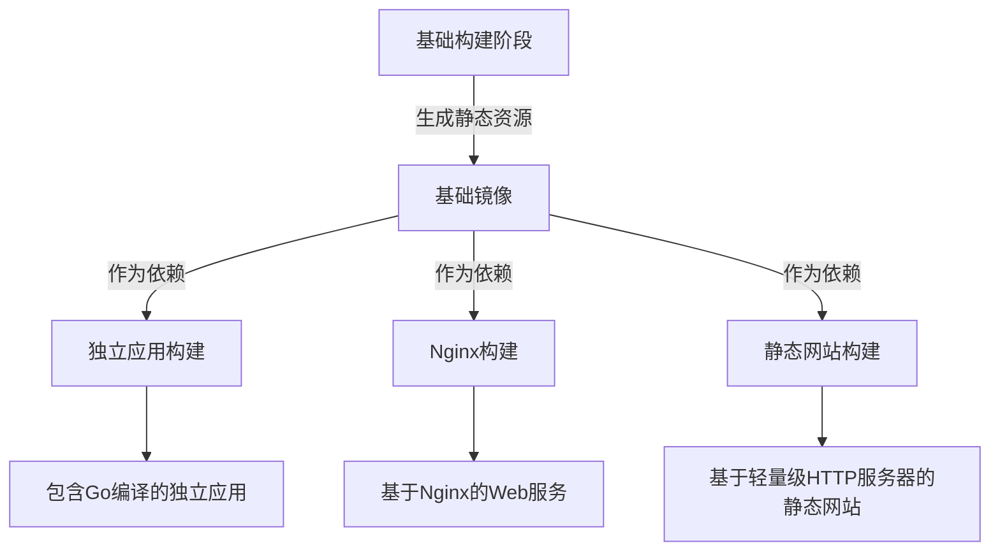

**Diagram sources**
- [Dockerfile.base](file://docker/latest/Dockerfile.base)
- [Dockerfile.standalone](file://docker/latest/Dockerfile.standalone)
- [Dockerfile.nginx](file://docker/latest/Dockerfile.nginx)
- [Dockerfile.static](file://docker/latest/Dockerfile.static)

### 基础镜像构建流程

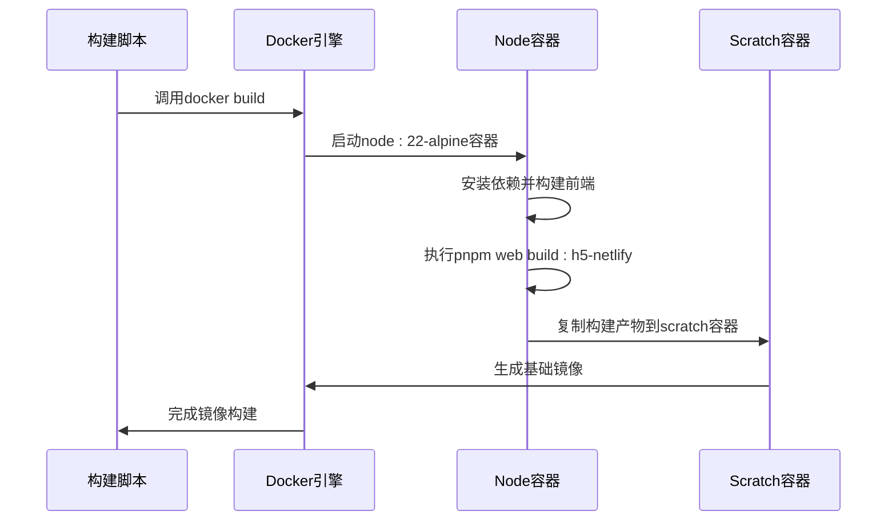

**Diagram sources**
- [build-base-image.sh](file://scripts/build-base-image.sh)
- [Dockerfile.base](file://docker/latest/Dockerfile.base)

**Section sources**
- [build-base-image.sh](file://scripts/build-base-image.sh#L1-L25)
- [Dockerfile.base](file://docker/latest/Dockerfile.base#L1-L15)

### 独立应用构建流程

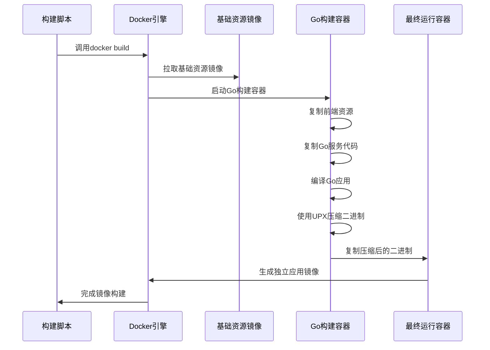

**Diagram sources**
- [build-standalone.sh](file://scripts/build-standalone.sh)
- [Dockerfile.standalone](file://docker/latest/Dockerfile.standalone)

**Section sources**
- [build-standalone.sh](file://scripts/build-standalone.sh#L1-L25)
- [Dockerfile.standalone](file://docker/latest/Dockerfile.standalone#L1-L23)

### 多架构构建与推送流程

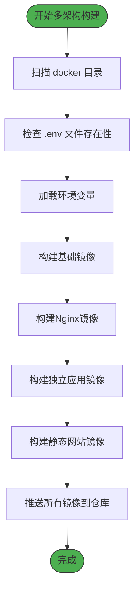

**Diagram sources**
- [build-multiarch.sh](file://scripts/build-multiarch.sh)
- [docker-compose-build.yml](file://docker/docker-compose-build.yml)

**Section sources**
- [build-multiarch.sh](file://scripts/build-multiarch.sh#L1-L88)

## Vite与WXT构建配置

前端构建由Vite驱动，同时支持WXT扩展开发构建，通过环境变量控制不同构建目标。

### Vite构建配置分析

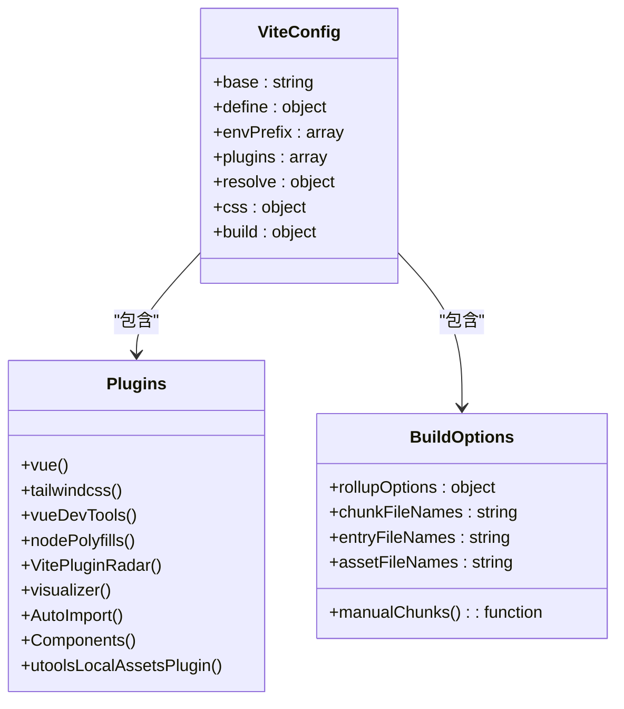

**Diagram sources**
- [vite.config.ts](file://apps/web/vite.config.ts)

**Section sources**
- [vite.config.ts](file://apps/web/vite.config.ts#L1-L92)
- [package.json](file://apps/web/package.json#L8-L29)

### WXT扩展构建配置

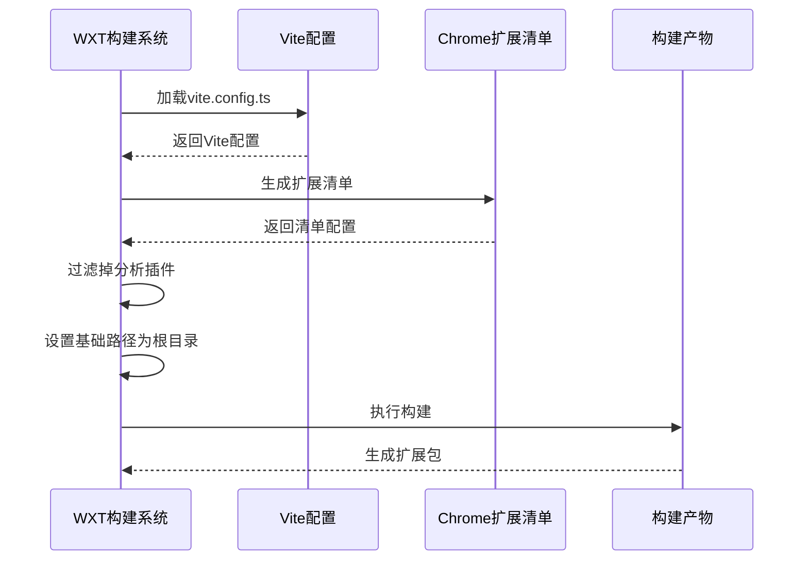

**Diagram sources**
- [wxt.config.ts](file://apps/web/wxt.config.ts)

**Section sources**
- [wxt.config.ts](file://apps/web/wxt.config.ts#L1-L102)

## CI/CD流程整合

从源码到可部署产物的完整CI/CD流程整合了多种部署目标，包括Docker镜像、Netlify静态站点等。

### 完整CI/CD流程

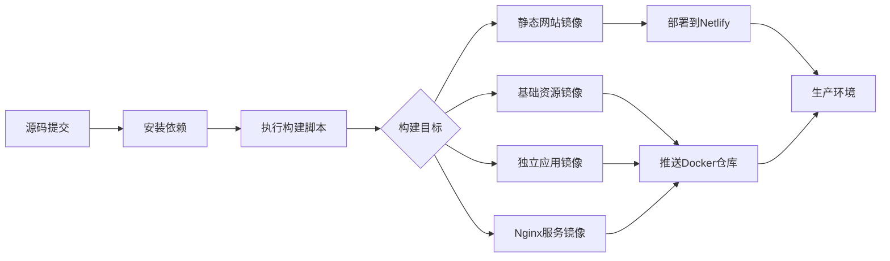

**Diagram sources**
- [netlify.toml](file://apps/web/netlify.toml)
- [Dockerfile](file://docker/Dockerfile)
- [build-multiarch.sh](file://scripts/build-multiarch.sh)

### Netlify部署配置

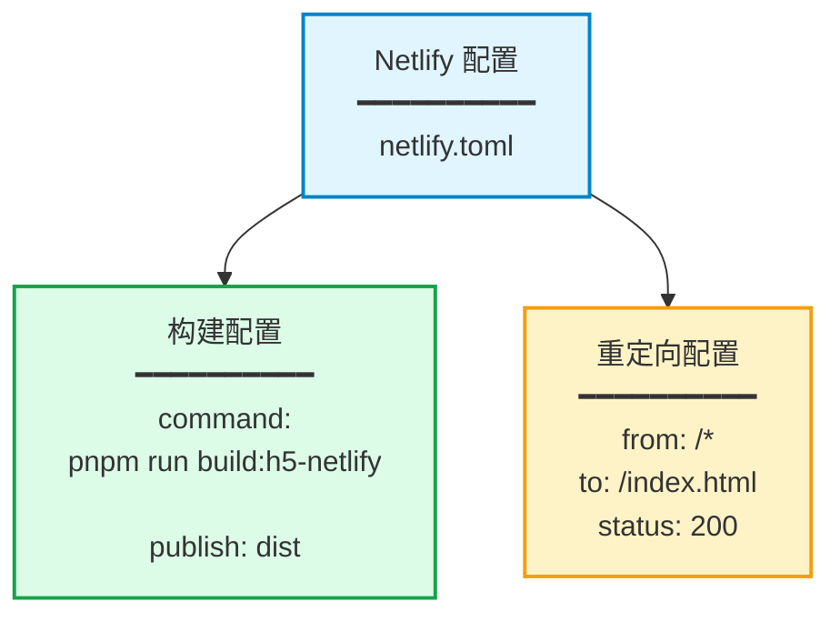

**Diagram sources**
- [netlify.toml](file://apps/web/netlify.toml)

**Section sources**
- [netlify.toml](file://apps/web/netlify.toml#L1-L10)
- [package.json](file://apps/web/package.json#L13-L14)

## 构建调试与常见问题

### 脚本调试方法

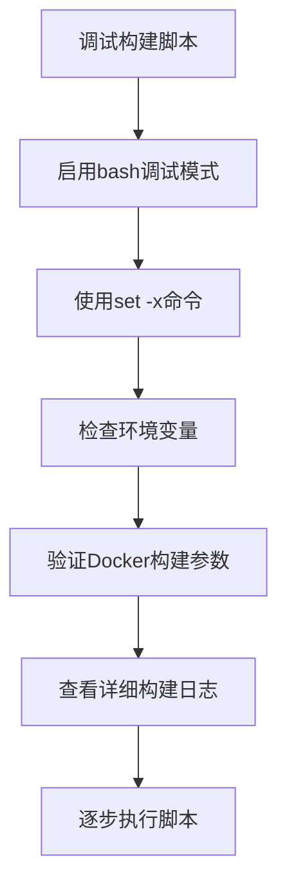

**Section sources**
- [build-standalone.sh](file://scripts/build-standalone.sh)
- [build-multiarch.sh](file://scripts/build-multiarch.sh)

### 常见执行错误及解决方案

| 问题类型 | 错误表现 | 解决方案 |
|---------|--------|---------|
| 权限不足 | `Permission denied` | 确保脚本具有执行权限 `chmod +x script.sh` |
| 依赖缺失 | `command not found` | 安装必需工具：Docker, pnpm, buildx |
| 环境变量缺失 | 变量为空或默认值 | 检查`.env`文件是否存在且格式正确 |
| Docker构建失败 | 构建阶段错误 | 检查Dockerfile语法和构建上下文 |
| 多架构构建失败 | 平台不支持 | 确保Docker配置了buildx builder |

**Section sources**
- [build-multiarch.sh](file://scripts/build-multiarch.sh#L3-L88)
- [docker/latest/.env](file://docker/latest/.env)

## 性能优化建议

### 构建性能优化策略

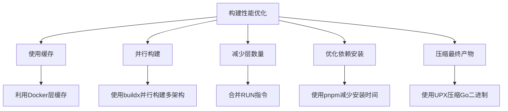

**Section sources**
- [Dockerfile.base](file://docker/latest/Dockerfile.base)
- [Dockerfile.standalone](file://docker/latest/Dockerfile.standalone)
- [build-multiarch.sh](file://scripts/build-multiarch.sh)

### 具体优化措施

1. **Docker层优化**：在`Dockerfile.base`中，将相关的命令合并到单个RUN指令中，减少镜像层数量
2. **依赖缓存**：利用Docker构建缓存机制，避免重复下载和安装npm包
3. **二进制压缩**：在`Dockerfile.standalone`中使用UPX工具压缩Go编译的二进制文件
4. **分块构建**：Vite配置中通过`manualChunks`将第三方库分离，优化前端加载性能
5. **多架构并行**：`build-multiarch.sh`脚本使用buildx同时构建amd64和arm64架构镜像

**Section sources**
- [Dockerfile.base](file://docker/latest/Dockerfile.base#L10)
- [Dockerfile.standalone](file://docker/latest/Dockerfile.standalone#L16)
- [vite.config.ts](file://apps/web/vite.config.ts#L70-L85)
- [build-multiarch.sh](file://scripts/build-multiarch.sh#L7-L88)