# 自定义 Vite 插件开发

<cite>
**本文档引用的文件**  
- [vite-plugin-utools-local-assets.ts](file://apps/web/plugins/vite-plugin-utools-local-assets.ts)
- [vite.config.ts](file://apps/web/vite.config.ts)
- [package.json](file://apps/web/package.json)
- [download-utools-libs.mjs](file://scripts/download-utools-libs.mjs)
- [App.vue](file://apps/web/src/App.vue)
- [AppSplash.vue](file://apps/web/src/components/AppSplash.vue)
</cite>

## 目录
1. [项目结构](#项目结构)
2. [核心组件](#核心组件)
3. [架构概述](#架构概述)
4. [详细组件分析](#详细组件分析)
5. [依赖分析](#依赖分析)
6. [性能考虑](#性能考虑)
7. [故障排除指南](#故障排除指南)
8. [结论](#结论)

## 项目结构

该项目是一个多平台前端项目，支持 uTools、VS Code 和 Web 等多个平台。核心 Web 应用位于 `apps/web` 目录下，包含 Vite 配置、源代码和插件。`plugins` 目录中的 `vite-plugin-utools-local-assets.ts` 是一个自定义 Vite 插件，用于在 uTools 环境中将远程资源替换为本地资源。静态资源通过 `scripts/download-utools-libs.mjs` 脚本预先下载到 `public/static/libs` 目录中，确保在离线或受限网络环境下仍能正常加载关键依赖。

**图示来源**
- [vite-plugin-utools-local-assets.ts](file://apps/web/plugins/vite-plugin-utools-local-assets.ts#L7-L53)
- [download-utools-libs.mjs](file://scripts/download-utools-libs.mjs#L1-L95)

**本节来源**
- [vite-plugin-utools-local-assets.ts](file://apps/web/plugins/vite-plugin-utools-local-assets.ts#L1-L53)
- [vite.config.ts](file://apps/web/vite.config.ts#L1-L92)

## 核心组件

`vite-plugin-utools-local-assets.ts` 插件的核心功能是在构建阶段（`apply: 'build'`）拦截 HTML 文件中的远程资源引用，并将其替换为指向本地静态资源的相对路径。该插件通过 Vite 的 `transformIndexHtml` 钩子实现，该钩子在 HTML 文件生成后执行（`order: 'post'`），确保替换操作发生在所有其他 HTML 处理之后。插件首先检查环境变量 `SERVER_ENV` 是否为 `UTOOLS`，只有在此条件下才会执行替换逻辑，从而保证该行为仅针对 uTools 平台生效。

**本节来源**
- [vite-plugin-utools-local-assets.ts](file://apps/web/plugins/vite-plugin-utools-local-assets.ts#L7-L53)
- [vite.config.ts](file://apps/web/vite.config.ts#L56)

## 架构概述

该插件的设计遵循了 Vite 插件的标准架构，利用了 Vite 的构建时钩子系统。其主要工作流程是：在构建过程中，当 HTML 文件被生成后，插件会检查当前构建环境。如果环境为 uTools，则使用正则表达式匹配 HTML 内容中特定的 CDN 资源 URL，并将其替换为项目内部的本地路径。这些本地资源（如 MathJax、Mermaid 等）由独立的脚本 `download-utools-libs.mjs` 在构建前下载并存储在 `public` 目录下，该目录的内容会被 Vite 直接复制到输出目录，确保资源的可访问性。

```mermaid
sequenceDiagram
participant Build as 构建流程
participant Plugin as utoolsLocalAssetsPlugin
participant HTML as HTML生成器
participant Script as download-utools-libs.mjs
Script->>Public : 下载远程库到public/static/libs
Build->>HTML : 生成初始HTML
HTML->>Plugin : 触发transformIndexHtml
Plugin->>Plugin : 检查SERVER_ENV === UTOOLS
alt 环境为UTOOLS
Plugin->>Plugin : 使用正则替换CDN URL为本地路径
Plugin-->>HTML : 返回修改后的HTML
else
Plugin-->>HTML : 返回原始HTML
end
Build->>Output : 输出最终HTML和资源
```

**图示来源**
- [vite-plugin-utools-local-assets.ts](file://apps/web/plugins/vite-plugin-utools-local-assets.ts#L13-L50)
- [download-utools-libs.mjs](file://scripts/download-utools-libs.mjs#L16-L32)

## 详细组件分析

### 插件机制分析

该插件的核心机制是基于字符串替换的 HTML 转换。它定义了一系列正则表达式来精确匹配特定的远程资源 URL，例如 MathJax、Mermaid 和 WeChat Sync 的 CDN 地址。一旦匹配成功，这些 URL 就会被替换为指向本地 `static/libs` 目录的相对路径。这种设计简单高效，避免了在 uTools 这种可能受限的环境中因网络问题导致资源加载失败。

#### 对于 API/服务组件：

**图示来源**
- [vite-plugin-utools-local-assets.ts](file://apps/web/plugins/vite-plugin-utools-local-assets.ts#L19-L48)

**本节来源**
- [vite-plugin-utools-local-assets.ts](file://apps/web/plugins/vite-plugin-utools-local-assets.ts#L1-L53)

### 资源路径映射规则

插件的路径映射规则非常明确：所有被替换的远程 CDN 资源都映射到 `./static/libs/` 目录下的对应位置。例如，`https://cdn-doocs.../mathjax@3/es5/tex-svg.js` 被映射到 `./static/libs/mathjax/tex-svg.js`。这种集中式的管理方式使得资源的维护和更新变得简单。`favicon.png` 则被映射到 `./src/assets/images/favicon.png`，这是一个项目内部的通用资源。

**本节来源**
- [vite-plugin-utools-local-assets.ts](file://apps/web/plugins/vite-plugin-utools-local-assets.ts#L21-L23)
- [vite-plugin-utools-local-assets.ts](file://apps/web/plugins/vite-plugin-utools-local-assets.ts#L33-L35)

## 依赖分析

该插件本身不引入额外的 npm 依赖，它直接利用 Vite 提供的插件 API。然而，它依赖于一个外部脚本 `download-utools-libs.mjs` 来确保本地资源的可用性。这个脚本使用 Node.js 的 `https` 模块下载所需的库文件。此外，插件的逻辑与项目的构建脚本紧密耦合，特别是 `build:utools` 命令，该命令设置了正确的环境变量并指定了输出目录。

**图示来源**
- [vite-plugin-utools-local-assets.ts](file://apps/web/plugins/vite-plugin-utools-local-assets.ts#L1)
- [download-utools-libs.mjs](file://scripts/download-utools-libs.mjs#L8)
- [package.json](file://apps/web/package.json#L15)

**本节来源**
- [vite-plugin-utools-local-assets.ts](file://apps/web/plugins/vite-plugin-utools-local-assets.ts#L1-L53)
- [download-utools-libs.mjs](file://scripts/download-utools-libs.mjs#L1-L95)
- [package.json](file://apps/web/package.json#L15-L16)

## 性能考虑

该插件在构建时运行，对开发服务器的性能没有影响。由于它只在构建阶段执行一次性的字符串替换操作，因此对构建性能的影响极小。正则表达式的匹配是高效的，且操作的 HTML 内容通常不会非常庞大。通过将大型第三方库（如 MathJax 和 Mermaid）作为静态资源包含在内，该插件实际上可能提升了最终用户的加载性能，因为它避免了对远程 CDN 的依赖，减少了网络请求的延迟和潜在的失败。

## 故障排除指南

如果发现 uTools 环境中资源加载失败，应首先检查 `public/static/libs` 目录下对应的文件是否存在。这通常意味着 `download-utools-libs.mjs` 脚本未成功运行。其次，确认构建时环境变量 `SERVER_ENV` 是否正确设置为 `UTOOLS`。如果插件未被调用，检查 `vite.config.ts` 中的插件数组，确保 `utoolsLocalAssetsPlugin()` 在 `isUTools` 条件下被正确启用。最后，检查正则表达式是否仍然匹配当前 CDN 上的资源 URL，因为 CDN 提供商可能会更改其 URL 结构。

**本节来源**
- [vite-plugin-utools-local-assets.ts](file://apps/web/plugins/vite-plugin-utools-local-assets.ts#L8)
- [vite.config.ts](file://apps/web/vite.config.ts#L56)
- [download-utools-libs.mjs](file://scripts/download-utools-libs.mjs#L71-L85)

## 结论

`vite-plugin-utools-local-assets.ts` 是一个简洁而有效的 Vite 插件，它解决了在特定平台（uTools）上可靠加载第三方资源的问题。其设计模式具有通用性：通过构建时的 HTML 转换，将外部依赖重定向到内部托管的资源。这种模式适用于任何需要离线支持、提高加载速度或规避网络限制的前端项目。结合一个预下载脚本，它形成了一套完整的解决方案，确保了应用的健壮性和用户体验的一致性。