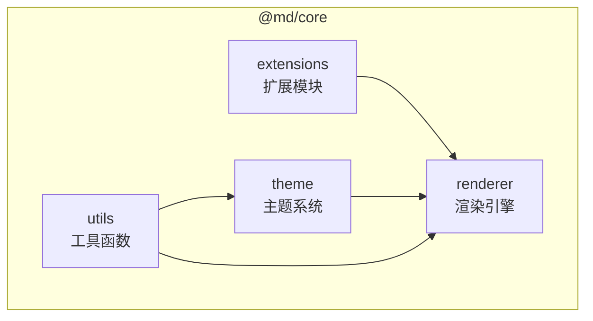
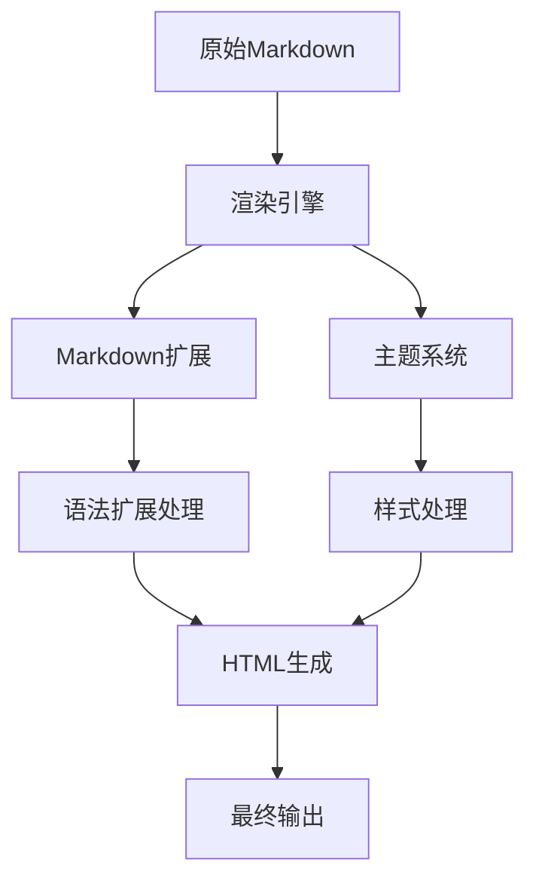
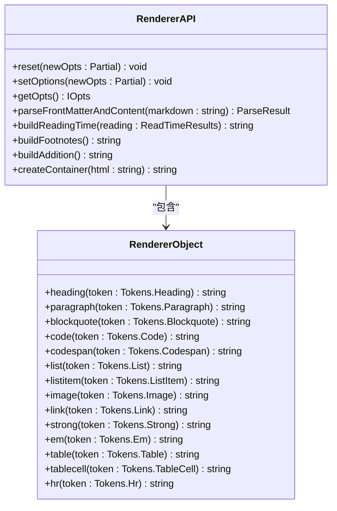
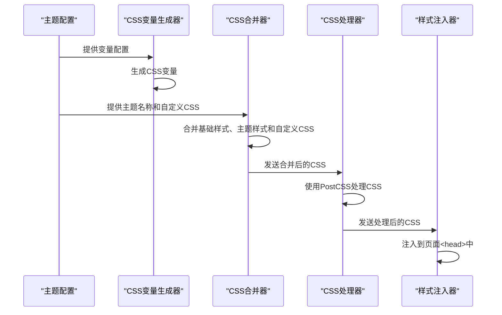
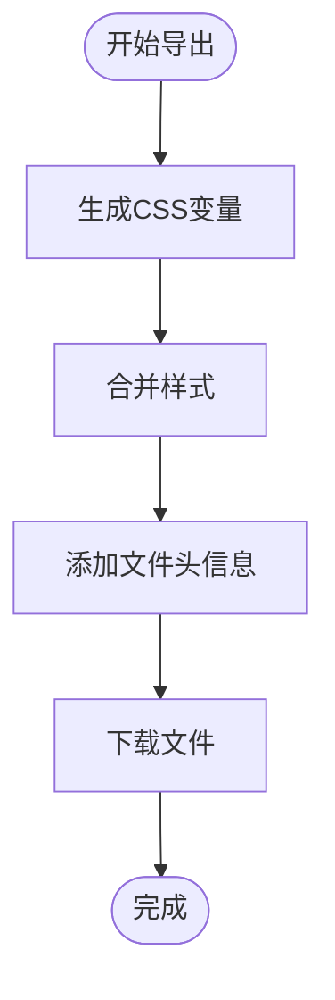
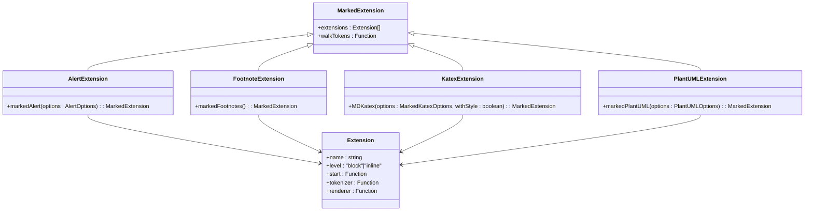
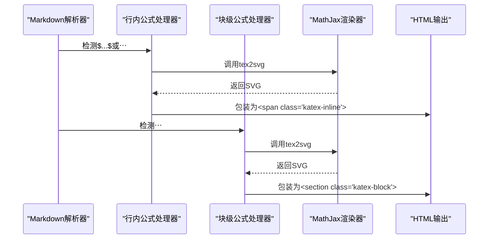
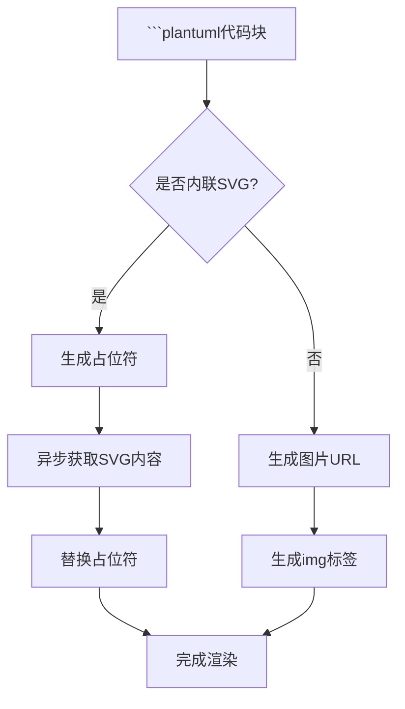

# @md/core包详解

<cite>
**本文档引用的文件**
- [index.ts](file://packages/core/src/index.ts)
- [renderer-impl.ts](file://packages/core/src/renderer/renderer-impl.ts)
- [themeApplicator.ts](file://packages/core/src/theme/themeApplicator.ts)
- [cssVariables.ts](file://packages/core/src/theme/cssVariables.ts)
- [themeInjector.ts](file://packages/core/src/theme/themeInjector.ts)
- [themeExporter.ts](file://packages/core/src/theme/themeExporter.ts)
- [alert.ts](file://packages/core/src/extensions/alert.ts)
- [footnotes.ts](file://packages/core/src/extensions/footnotes.ts)
- [katex.ts](file://packages/core/src/extensions/katex.ts)
- [plantuml.ts](file://packages/core/src/extensions/plantuml.ts)
- [languages.ts](file://packages/core/src/utils/languages.ts)
- [markdownHelpers.ts](file://packages/core/src/utils/markdownHelpers.ts)
- [renderer-types.ts](file://packages/shared/src/types/renderer-types.ts)
</cite>

## 目录
1. [介绍](#介绍)
2. [项目结构](#项目结构)
3. [核心组件](#核心组件)
4. [架构概述](#架构概述)
5. [详细组件分析](#详细组件分析)
6. [依赖分析](#依赖分析)
7. [性能考虑](#性能考虑)
8. [故障排除指南](#故障排除指南)
9. [结论](#结论)

## 介绍
@md/core包是一个功能强大的Markdown处理核心库，专为微信公众号等场景设计。该包提供了三大核心功能：基于marked的渲染引擎、灵活的主题系统以及丰富的Markdown扩展能力。本文档将深入解析其架构设计与实现细节，帮助开发者理解如何使用和扩展这个核心库。

## 项目结构
@md/core包采用模块化设计，主要分为四个目录：extensions（扩展）、renderer（渲染器）、theme（主题）和utils（工具）。这种清晰的结构使得各个功能模块职责分明，便于维护和扩展。



**图示来源**
- [index.ts](file://packages/core/src/index.ts#L1-L5)

## 核心组件
@md/core包的核心组件包括渲染引擎、主题系统和Markdown扩展三大模块。这些组件通过清晰的接口相互协作，实现了从原始Markdown输入到最终渲染输出的完整处理链路。

**组件来源**
- [index.ts](file://packages/core/src/index.ts#L1-L5)
- [renderer-impl.ts](file://packages/core/src/renderer/renderer-impl.ts#L1-L387)

## 架构概述
@md/core包采用分层架构设计，各模块之间通过明确定义的接口进行通信。渲染引擎作为核心，协调主题系统和扩展模块的工作，最终生成符合要求的HTML输出。



**图示来源**
- [renderer-impl.ts](file://packages/core/src/renderer/renderer-impl.ts#L112-L386)
- [themeApplicator.ts](file://packages/core/src/theme/themeApplicator.ts#L24-L60)

## 详细组件分析

### 渲染引擎分析
渲染引擎基于marked库进行扩展实现，通过自定义渲染器对象来控制HTML输出的格式和结构。它负责解析Markdown语法并生成相应的HTML标记。



**图示来源**
- [renderer-impl.ts](file://packages/core/src/renderer/renderer-impl.ts#L112-L386)
- [renderer-types.ts](file://packages/shared/src/types/renderer-types.ts#L4-L23)

### 主题系统分析
主题系统采用CSS变量和作用域包装技术，实现了灵活的主题管理和应用机制。它允许用户自定义主题样式，并将其安全地应用到预览区域。

#### 主题应用流程


**图示来源**
- [themeApplicator.ts](file://packages/core/src/theme/themeApplicator.ts#L24-L60)
- [cssVariables.ts](file://packages/core/src/theme/cssVariables.ts#L19-L34)
- [cssProcessor.ts](file://packages/core/src/theme/cssProcessor.ts#L19-L40)
- [themeInjector.ts](file://packages/core/src/theme/themeInjector.ts#L17-L24)

#### 主题导出机制


**图示来源**
- [themeExporter.ts](file://packages/core/src/theme/themeExporter.ts#L17-L44)

### Markdown扩展分析
Markdown扩展模块采用插件式架构，支持多种扩展功能，包括脚注、LaTeX数学公式、流程图等。每个扩展都是一个独立的marked扩展实现。

#### 扩展注册机制


**图示来源**
- [alert.ts](file://packages/core/src/extensions/alert.ts#L10-L179)
- [footnotes.ts](file://packages/core/src/extensions/footnotes.ts#L17-L89)
- [katex.ts](file://packages/core/src/extensions/katex.ts#L153-L162)
- [plantuml.ts](file://packages/core/src/extensions/plantuml.ts#L239-L289)

#### LaTeX数学公式处理流程


**图示来源**
- [katex.ts](file://packages/core/src/extensions/katex.ts#L46-L162)

#### PlantUML流程图处理流程


**图示来源**
- [plantuml.ts](file://packages/core/src/extensions/plantuml.ts#L151-L234)

## 依赖分析
@md/core包依赖多个第三方库来实现其功能，这些依赖关系构成了包的基础架构。

```mermaid
graph TD
A[@md/core] --> B[marked]
A --> C[highlight.js]
A --> D[reading-time]
A --> E[front-matter]
A --> F[postcss]
A --> G[postcss-calc]
A --> H[postcss-custom-properties]
A --> I[fflate]
A --> J[isomorphic-dompurify]
B --> K[语法解析]
C --> L[代码高亮]
D --> M[阅读时间计算]
E --> N[Front Matter解析]
F --> O[CSS处理]
I --> P[Deflate压缩]
J --> Q[XSS防护]
```

**图示来源**
- [renderer-impl.ts](file://packages/core/src/renderer/renderer-impl.ts#L1-L8)
- [cssProcessor.ts](file://packages/core/src/theme/cssProcessor.ts#L6-L8)
- [plantuml.ts](file://packages/core/src/extensions/plantuml.ts#L2)

## 性能考虑
在使用@md/core包时，需要注意以下性能优化建议：

1. **代码高亮优化**：对于未注册的语言，采用动态加载机制，避免一次性加载所有语言包
2. **CSS处理优化**：使用PostCSS在运行时处理CSS，减少不必要的样式计算
3. **异步渲染优化**：对于复杂的图表（如PlantUML），采用异步加载方式，避免阻塞主线程
4. **内存管理**：主题注入器采用单例模式，避免重复创建样式标签

## 故障排除指南
当使用@md/core包遇到问题时，可以参考以下常见问题的解决方案：

1. **数学公式不显示**：确保页面已正确加载MathJax库
2. **代码高亮失效**：检查是否已注册相应的语言，或尝试动态加载
3. **主题样式未生效**：确认样式是否已正确注入到页面<head>中
4. **流程图加载失败**：检查网络连接，或尝试更换PlantUML服务器地址

**组件来源**
- [languages.ts](file://packages/core/src/utils/languages.ts#L97-L238)
- [themeInjector.ts](file://packages/core/src/theme/themeInjector.ts#L9-L55)

## 结论
@md/core包通过精心设计的架构和模块化实现，提供了一个强大而灵活的Markdown处理解决方案。其三大核心模块——渲染引擎、主题系统和Markdown扩展——协同工作，满足了复杂场景下的Markdown处理需求。通过理解其内部机制，开发者可以更好地利用和扩展这个核心库，为用户提供更优质的Markdown编辑体验。