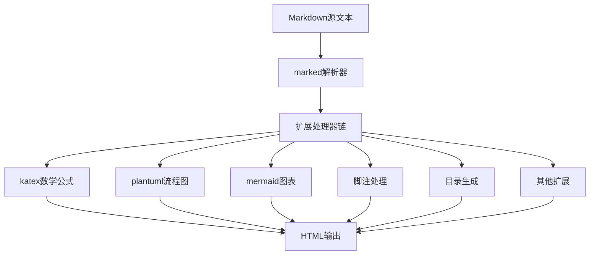
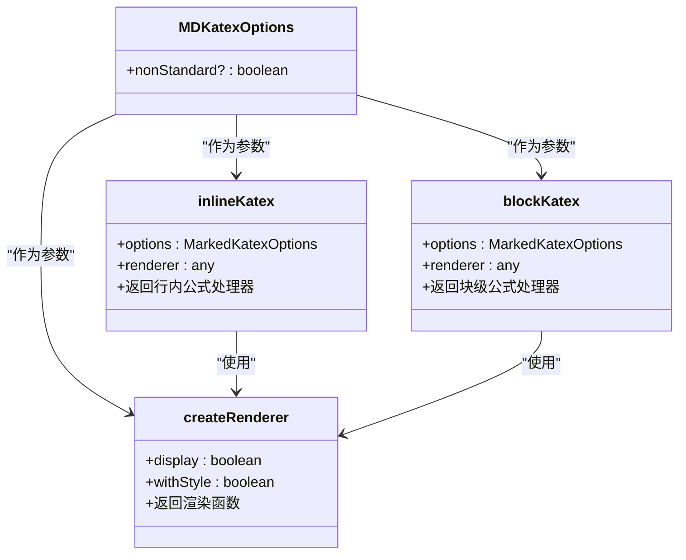
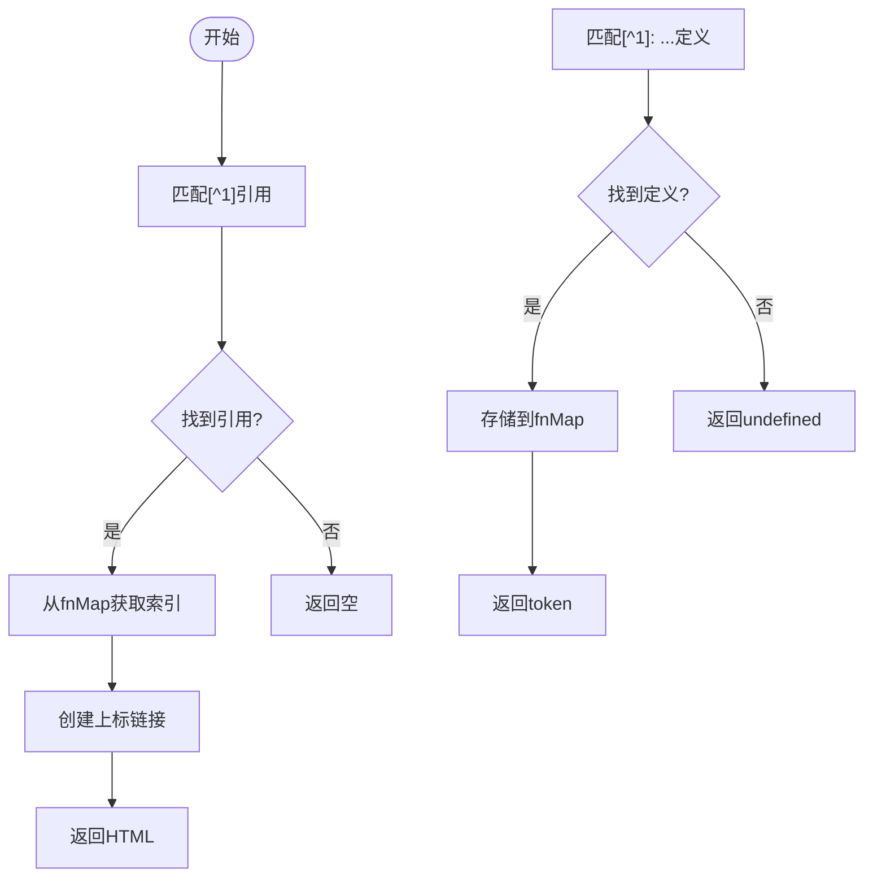
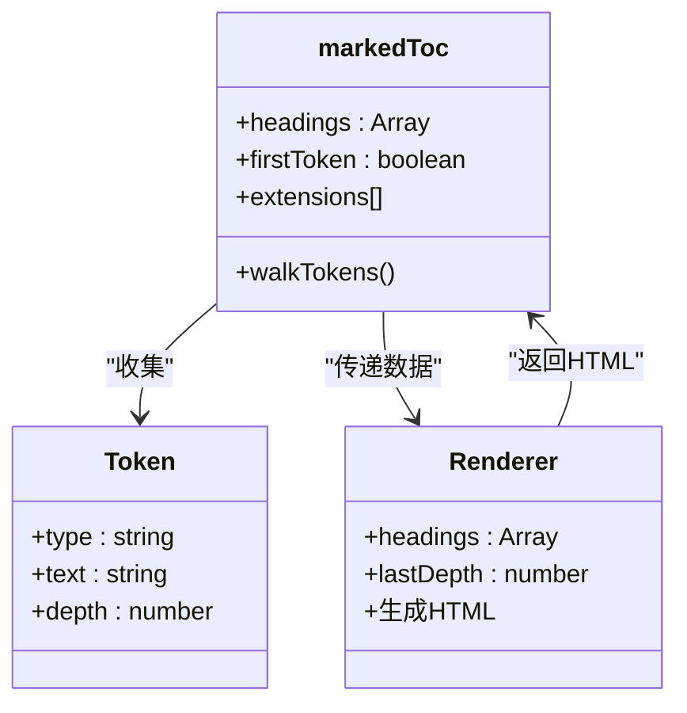
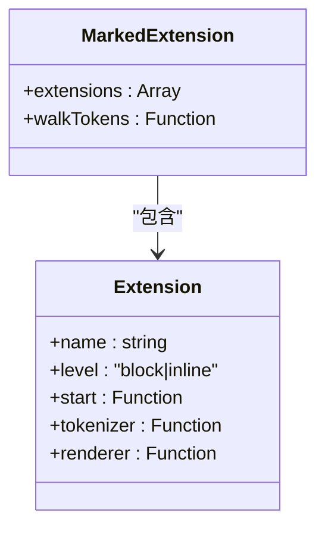

# Markdown扩展机制

<cite>
**本文档引用文件**  
- [katex.ts](file://packages/core/src/extensions/katex.ts)
- [plantuml.ts](file://packages/core/src/extensions/plantuml.ts)
- [initializeMermaid.ts](file://packages/core/src/utils/initializeMermaid.ts)
- [footnotes.ts](file://packages/core/src/extensions/footnotes.ts)
- [toc.ts](file://packages/core/src/extensions/toc.ts)
- [index.ts](file://packages/core/src/extensions/index.ts)
- [renderer-impl.ts](file://packages/core/src/renderer/renderer-impl.ts)
</cite>

## 目录
1. [引言](#引言)
2. [扩展体系架构](#扩展体系架构)
3. [核心扩展模块分析](#核心扩展模块分析)
4. [扩展加载流程](#扩展加载流程)
5. [自定义扩展开发](#自定义扩展开发)
6. [调试技巧](#调试技巧)
7. [结论](#结论)

## 引言
@md/core的Markdown扩展插件体系基于marked解析器构建，通过扩展机制实现了丰富的Markdown语法支持。该系统允许开发者通过注册扩展处理器来增强Markdown的解析能力，支持数学公式、流程图、脚注、目录等多种高级功能。本文档将深入分析extensions目录下各扩展模块的实现原理，重点说明关键扩展的集成方式和协同工作机制。

## 扩展体系架构
@md/core的扩展体系采用模块化设计，所有扩展模块位于`packages/core/src/extensions`目录下，通过`index.ts`文件进行聚合导出。系统通过marked解析器的扩展机制，在渲染管道中按特定顺序执行各扩展处理器。



**图表来源**  
- [renderer-impl.ts](file://packages/core/src/renderer/renderer-impl.ts#L20-L373)

**本节来源**  
- [index.ts](file://packages/core/src/extensions/index.ts#L1-L10)

## 核心扩展模块分析

### katex数学公式扩展
katex.ts模块实现了数学公式的渲染支持，通过MDKatex函数创建marked扩展。该扩展支持多种数学公式语法，包括行内公式`$...$`、块级公式`$$...$$`以及LaTeX风格的`\(...\)`和`\[...\]`。



**图表来源**  
- [katex.ts](file://packages/core/src/extensions/katex.ts#L3-L162)

**本节来源**  
- [katex.ts](file://packages/core/src/extensions/katex.ts#L1-L163)

### plantuml与mermaid图表扩展
plantuml.ts与initializeMermaid.ts协同实现了流程图和时序图的支持。plantuml.ts负责处理PlantUML语法，而initializeMermaid.ts初始化Mermaid.js环境。

```mermaid
sequenceDiagram
participant Markdown as "Markdown文本"
participant PlantUML as "plantuml.ts"
participant Mermaid as "initializeMermaid.ts"
participant Renderer as "渲染器"
Markdown->>PlantUML : 包含
```plantuml代码块
    PlantUML->>PlantUML: encodePlantUML编码
    PlantUML->>PlantUML: generatePlantUMLUrl生成URL
    PlantUML->>Renderer: 返回图表HTML
    Markdown->>Mermaid: 包含```mermaid
代码块
Mermaid->>Mermaid: initializeMermaid初始化
Mermaid->>Renderer: 调用mermaid.run()
Renderer->>Renderer: 完成图表渲染
```

**图表来源**  
- [plantuml.ts](file://packages/core/src/extensions/plantuml.ts#L1-L290)
- [initializeMermaid.ts](file://packages/core/src/utils/initializeMermaid.ts#L1-L13)

**本节来源**  
- [plantuml.ts](file://packages/core/src/extensions/plantuml.ts#L1-L290)
- [initializeMermaid.ts](file://packages/core/src/utils/initializeMermaid.ts#L1-L13)

### 脚注扩展
footnotes.ts模块处理脚注语法，支持`[^1]`引用和`[^1]: ...`定义的语法。该扩展通过维护一个全局的fnMap来存储脚注内容，并在渲染时生成相应的HTML。



**图表来源**  
- [footnotes.ts](file://packages/core/src/extensions/footnotes.ts#L1-L90)

**本节来源**  
- [footnotes.ts](file://packages/core/src/extensions/footnotes.ts#L1-L90)

### 目录生成扩展
toc.ts模块实现了`[TOC]`语法的目录生成功能。该扩展通过walkTokens遍历所有标题节点，收集标题信息，并在遇到`[TOC]`标记时生成嵌套的目录结构。



**图表来源**  
- [toc.ts](file://packages/core/src/extensions/toc.ts#L1-L75)

**本节来源**  
- [toc.ts](file://packages/core/src/extensions/toc.ts#L1-L75)

## 扩展加载流程
扩展加载流程遵循特定的执行顺序，确保各扩展能够正确处理Markdown内容。系统在renderer-impl.ts中通过marked.use()方法按顺序注册各扩展处理器。


**图表来源**  
- [renderer-impl.ts](file://packages/core/src/renderer/renderer-impl.ts#L17-L373)

**本节来源**  
- [renderer-impl.ts](file://packages/core/src/renderer/renderer-impl.ts#L17-L373)

## 自定义扩展开发
开发者可以通过创建新的扩展处理器来扩展Markdown功能。以下是一个自定义扩展的开发模板：



**图表来源**  
- [renderer-impl.ts](file://packages/core/src/renderer/renderer-impl.ts#L8-L373)

**本节来源**  
- [renderer-impl.ts](file://packages/core/src/renderer/renderer-impl.ts#L8-L373)

## 调试技巧
在开发和调试扩展时，可以使用以下技巧：

1. **日志输出**：在关键函数中添加console.log输出调试信息
2. **断点调试**：在浏览器开发者工具中设置断点
3. **单元测试**：为扩展编写单元测试验证功能
4. **逐步注册**：逐个注册扩展以定位问题

**本节来源**  
- [renderer-impl.ts](file://packages/core/src/renderer/renderer-impl.ts#L112-L387)

## 结论
@md/core的Markdown扩展体系通过模块化设计和marked解析器的扩展机制，实现了灵活而强大的Markdown功能扩展。各扩展模块通过清晰的接口和协同工作机制，共同构建了一个完整的Markdown渲染管道。开发者可以基于此体系轻松创建自定义扩展，满足特定的Markdown渲染需求。