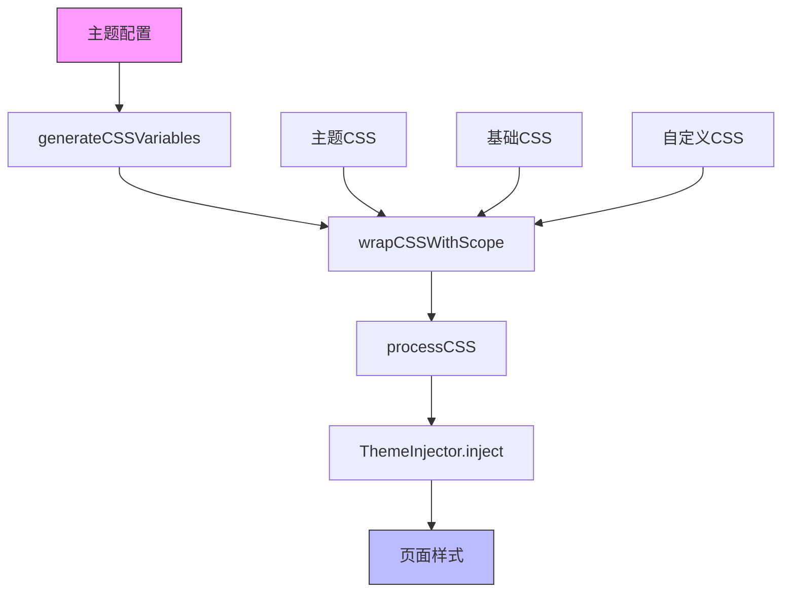
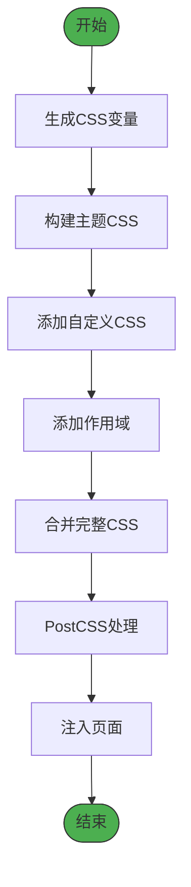
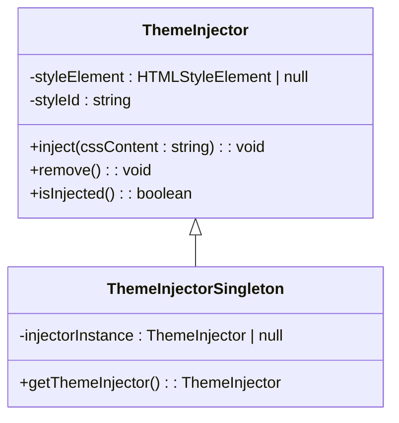
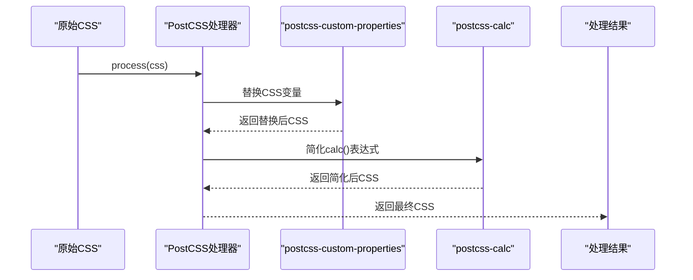
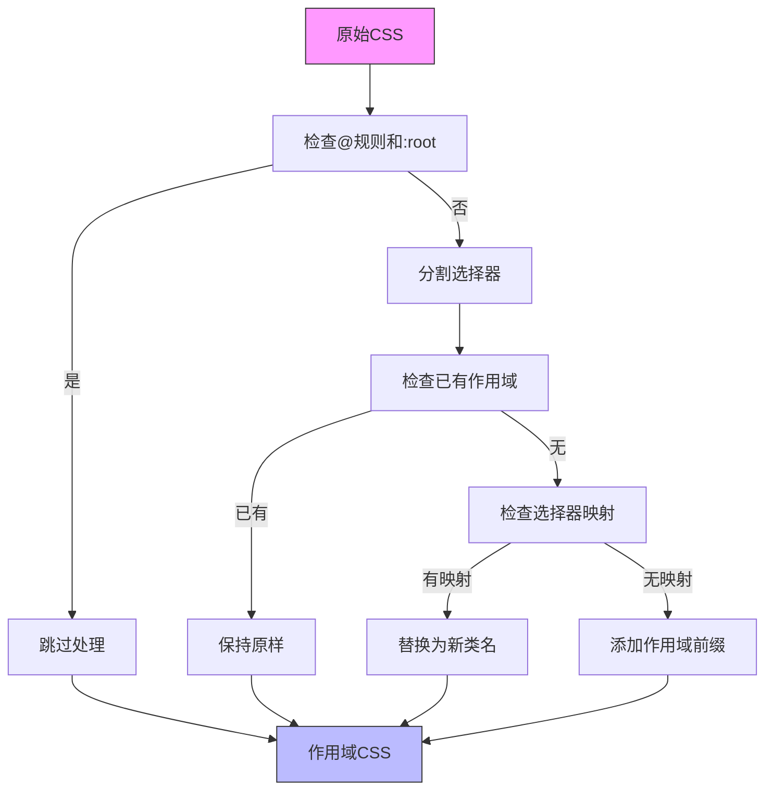
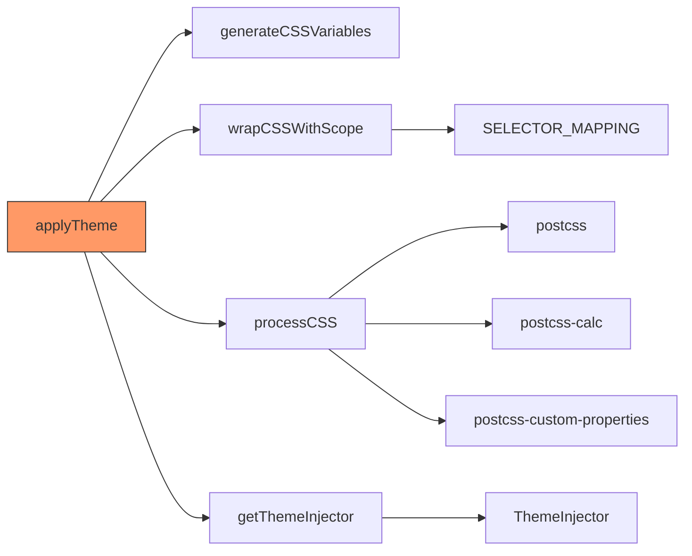

# 主题系统

<cite>
**本文档中引用的文件**   
- [themeApplicator.ts](file://packages/core/src/theme/themeApplicator.ts)
- [themeInjector.ts](file://packages/core/src/theme/themeInjector.ts)
- [cssProcessor.ts](file://packages/core/src/theme/cssProcessor.ts)
- [cssScopeWrapper.ts](file://packages/core/src/theme/cssScopeWrapper.ts)
- [cssVariables.ts](file://packages/core/src/theme/cssVariables.ts)
- [selectorMapping.ts](file://packages/core/src/theme/selectorMapping.ts)
- [theme.ts](file://apps/web/src/stores/theme.ts)
- [cssEditor.ts](file://apps/web/src/stores/cssEditor.ts)
- [theme-css/index.ts](file://packages/shared/src/configs/theme-css/index.ts)
- [default.css](file://packages/shared/src/configs/theme-css/default.css)
- [base.css](file://packages/shared/src/configs/theme-css/base.css)
- [default-custom-theme.txt](file://packages/shared/src/assets/default-custom-theme.txt)
</cite>

## 目录
1. [介绍](#介绍)
2. [项目结构](#项目结构)
3. [核心组件](#核心组件)
4. [架构概述](#架构概述)
5. [详细组件分析](#详细组件分析)
6. [依赖分析](#依赖分析)
7. [性能考虑](#性能考虑)
8. [故障排除指南](#故障排除指南)
9. [结论](#结论)

## 介绍
本文档全面解析@md/core的主题处理机制，涵盖CSS变量注入、作用域封装与动态主题应用。详细说明themeApplicator如何将主题配置转化为CSS变量并注入页面，themeInjector在运行时动态切换主题的实现原理，以及cssProcessor对用户自定义CSS的预处理逻辑。通过实际代码示例展示如何通过JavaScript API动态更改主题，以及如何利用cssScopeWrapper避免样式污染。文档包含主题系统架构图，阐明各模块协作关系，并提供主题开发最佳实践与性能调优建议。

## 项目结构
主题系统主要由@md/core包中的theme模块实现，该模块提供了一套完整的主题处理机制。系统分为核心处理组件和应用层配置两大部分。核心处理组件位于packages/core/src/theme目录下，包括主题应用、注入、CSS处理等核心功能。应用层配置则位于packages/shared/src/configs/theme-css目录，包含基础样式和多个主题的CSS定义。用户界面层通过stores/theme.ts和stores/cssEditor.ts管理主题状态和自定义CSS。

**Section sources**
- [themeApplicator.ts](file://packages/core/src/theme/themeApplicator.ts)
- [theme.ts](file://apps/web/src/stores/theme.ts)
- [theme-css/index.ts](file://packages/shared/src/configs/theme-css/index.ts)

## 核心组件
主题系统的核心组件包括themeApplicator、themeInjector、cssProcessor、cssScopeWrapper和cssVariables。这些组件协同工作，实现了从主题配置到最终CSS样式注入的完整流程。themeApplicator作为主要入口，负责协调整个主题应用过程；themeInjector负责将生成的CSS注入页面；cssProcessor在运行时处理CSS；cssScopeWrapper确保样式作用域隔离；cssVariables则负责将配置转化为CSS变量。

**Section sources**
- [themeApplicator.ts](file://packages/core/src/theme/themeApplicator.ts)
- [themeInjector.ts](file://packages/core/src/theme/themeInjector.ts)
- [cssProcessor.ts](file://packages/core/src/theme/cssProcessor.ts)
- [cssScopeWrapper.ts](file://packages/core/src/theme/cssScopeWrapper.ts)
- [cssVariables.ts](file://packages/core/src/theme/cssVariables.ts)

## 架构概述
主题系统的架构设计遵循单一职责原则，各组件分工明确，通过清晰的接口进行协作。系统采用链式处理模式，从主题配置开始，经过变量生成、样式合并、作用域封装、CSS预处理，最终由注入器将样式应用到页面。

**Diagram sources**
- [themeApplicator.ts](file://packages/core/src/theme/themeApplicator.ts#L24-L60)
- [cssVariables.ts](file://packages/core/src/theme/cssVariables.ts#L19-L34)
- [cssScopeWrapper.ts](file://packages/core/src/theme/cssScopeWrapper.ts#L14-L59)
- [cssProcessor.ts](file://packages/core/src/theme/cssProcessor.ts#L19-L39)
- [themeInjector.ts](file://packages/core/src/theme/themeInjector.ts#L17-L24)

## 详细组件分析

### themeApplicator 分析
themeApplicator是主题应用的核心协调者，负责将主题配置转化为最终的CSS样式并注入页面。它通过一系列有序的处理步骤，确保主题能够正确应用。

#### 处理流程

**Diagram sources**
- [themeApplicator.ts](file://packages/core/src/theme/themeApplicator.ts#L24-L60)

### themeInjector 分析
themeInjector负责管理动态注入的样式标签，实现运行时主题切换功能。

#### 类图

**Diagram sources**
- [themeInjector.ts](file://packages/core/src/theme/themeInjector.ts#L9-L55)

### cssProcessor 分析
cssProcessor使用PostCSS在运行时处理动态注入的CSS，确保CSS表达式被正确解析和优化。

#### 处理流程

**Diagram sources**
- [cssProcessor.ts](file://packages/core/src/theme/cssProcessor.ts#L19-L39)

### cssScopeWrapper 分析
cssScopeWrapper为CSS选择器添加作用域前缀，限制样式只在预览区域生效，避免样式污染。

#### 作用域包装逻辑

**Diagram sources**
- [cssScopeWrapper.ts](file://packages/core/src/theme/cssScopeWrapper.ts#L14-L59)

## 依赖分析
主题系统各组件之间存在明确的依赖关系，形成了一个清晰的调用链。核心组件之间的依赖关系确保了主题处理流程的有序执行。

**Diagram sources**
- [themeApplicator.ts](file://packages/core/src/theme/themeApplicator.ts#L6-L12)
- [cssProcessor.ts](file://packages/core/src/theme/cssProcessor.ts#L6-L9)
- [cssScopeWrapper.ts](file://packages/core/src/theme/cssScopeWrapper.ts#L6)

**Section sources**
- [themeApplicator.ts](file://packages/core/src/theme/themeApplicator.ts#L6-L12)
- [cssProcessor.ts](file://packages/core/src/theme/cssProcessor.ts#L6-L9)
- [cssScopeWrapper.ts](file://packages/core/src/theme/cssScopeWrapper.ts#L6)

## 性能考虑
主题系统在设计时充分考虑了性能因素。通过单例模式的ThemeInjector避免重复创建DOM元素，使用PostCSS在运行时高效处理CSS，以及通过作用域封装减少样式计算范围。建议在生产环境中预编译主题CSS以进一步提升性能。

## 故障排除指南
当主题应用出现问题时，可按以下步骤进行排查：首先检查控制台是否有CSS处理错误，然后验证主题配置是否正确传递，最后确认样式标签是否成功注入页面。使用浏览器开发者工具检查#output元素的计算样式，可以快速定位样式冲突或缺失问题。

**Section sources**
- [themeInjector.ts](file://packages/core/src/theme/themeInjector.ts#L39-L41)
- [cssProcessor.ts](file://packages/core/src/theme/cssProcessor.ts#L36-L38)

## 结论
@md/core的主题处理系统通过模块化设计实现了灵活、高效的主题管理机制。系统采用CSS变量、作用域封装和运行时处理等现代Web技术，提供了强大的主题定制能力。通过清晰的组件划分和职责分离，系统既保证了功能的完整性，又保持了良好的可维护性和扩展性。