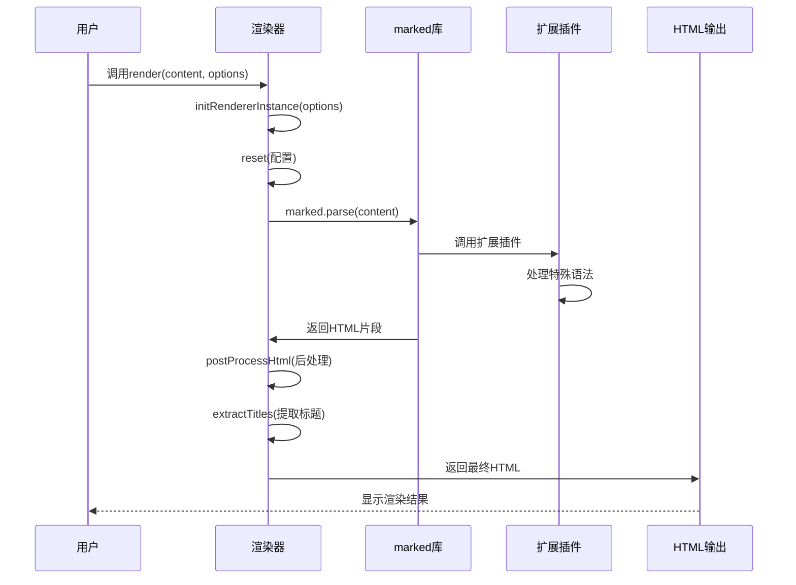
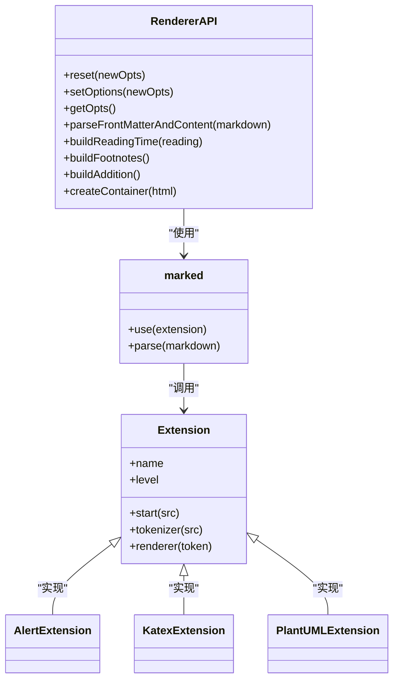
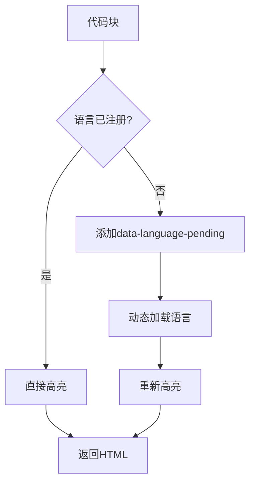
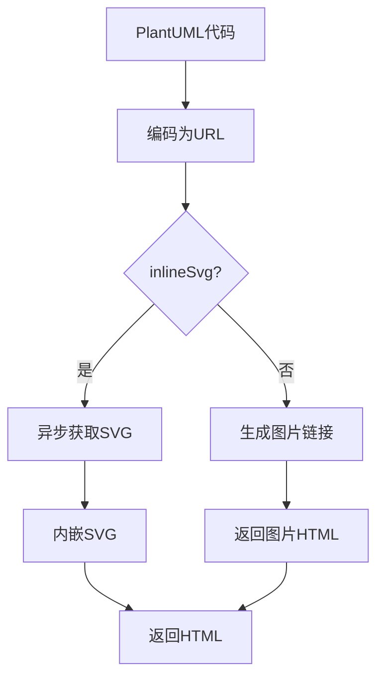
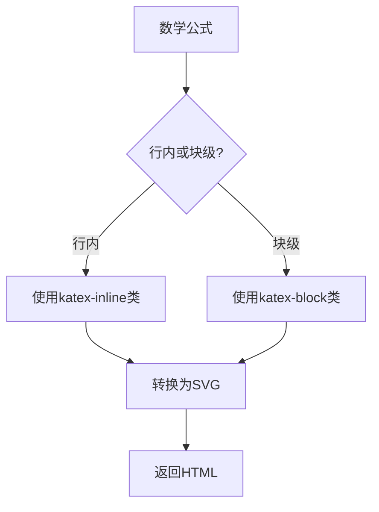
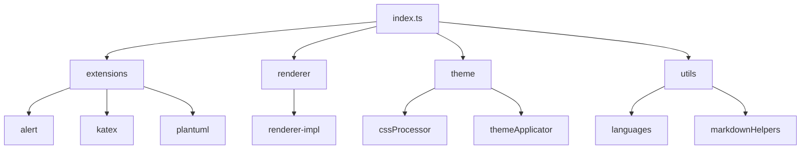
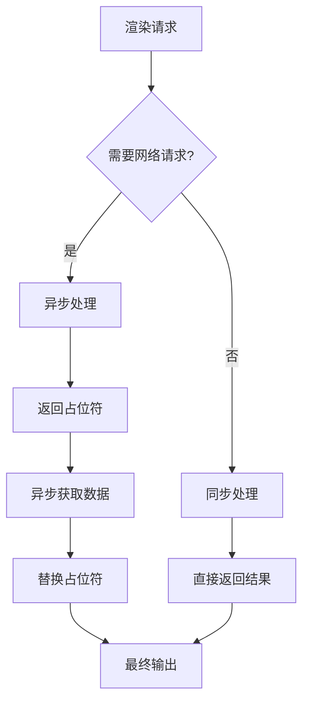

# 渲染引擎

<cite>
**本文档引用的文件**  
- [renderer-impl.ts](file://packages/core/src/renderer/renderer-impl.ts)
- [index.ts](file://packages/core/src/index.ts)
- [languages.ts](file://packages/core/src/utils/languages.ts)
- [katex.ts](file://packages/core/src/extensions/katex.ts)
- [plantuml.ts](file://packages/core/src/extensions/plantuml.ts)
- [common.ts](file://packages/shared/src/types/common.ts)
- [renderer-types.ts](file://packages/shared/src/types/renderer-types.ts)
- [render.ts](file://apps/web/src/stores/render.ts)
</cite>

## 目录
1. [项目结构](#项目结构)
2. [核心组件](#核心组件)
3. [渲染流程时序图](#渲染流程时序图)
4. [扩展机制分析](#扩展机制分析)
5. [特殊元素渲染逻辑](#特殊元素渲染逻辑)
6. [导出封装与Tree-shaking支持](#导出封装与tree-shaking支持)
7. [性能优化建议](#性能优化建议)

## 项目结构

项目采用模块化设计，`@md/core`包是渲染引擎的核心实现。渲染相关代码位于`packages/core/src/renderer`目录下，通过`renderer-impl.ts`实现基于marked库的扩展机制。

```mermaid
graph TD
A[@md/core] --> B[renderer]
A --> C[extensions]
A --> D[theme]
A --> E[utils]
B --> F[renderer-impl.ts]
B --> G[index.ts]
C --> H[alert.ts]
C --> I[katex.ts]
C --> J[plantuml.ts]
C --> K[index.ts]
E --> L[languages.ts]
```

**图示来源**  
- [renderer-impl.ts](file://packages/core/src/renderer/renderer-impl.ts)
- [index.ts](file://packages/core/src/index.ts)
- [languages.ts](file://packages/core/src/utils/languages.ts)

**本节来源**  
- [renderer-impl.ts](file://packages/core/src/renderer/renderer-impl.ts)
- [index.ts](file://packages/core/src/index.ts)

## 核心组件

渲染引擎的核心是`initRenderer`函数，它创建并返回一个`RendererAPI`对象，该对象提供了重置配置、设置选项、解析前端元数据等功能。渲染器基于marked库，通过自定义Renderer对象拦截和增强Markdown解析过程，实现微信风格的HTML输出。

**本节来源**  
- [renderer-impl.ts](file://packages/core/src/renderer/renderer-impl.ts#L112-L386)
- [renderer-types.ts](file://packages/shared/src/types/renderer-types.ts#L4-L23)

## 渲染流程时序图



**图示来源**  
- [renderer-impl.ts](file://packages/core/src/renderer/renderer-impl.ts)
- [render.ts](file://apps/web/src/stores/render.ts)

**本节来源**  
- [renderer-impl.ts](file://packages/core/src/renderer/renderer-impl.ts)
- [render.ts](file://apps/web/src/stores/render.ts)

## 扩展机制分析

渲染引擎通过marked库的扩展机制实现功能增强。在`renderer-impl.ts`中，通过`marked.use()`方法注册各种扩展插件，如`markedAlert`、`MDKatex`、`markedPlantUML`等。这些扩展插件可以拦截特定的Markdown语法，并将其转换为自定义的HTML输出。



**图示来源**  
- [renderer-impl.ts](file://packages/core/src/renderer/renderer-impl.ts)
- [common.ts](file://packages/shared/src/types/common.ts)

**本节来源**  
- [renderer-impl.ts](file://packages/core/src/renderer/renderer-impl.ts#L157-L369)
- [common.ts](file://packages/shared/src/types/common.ts#L8-L14)

## 特殊元素渲染逻辑

### 代码块高亮

代码块高亮通过highlight.js实现。在`renderer-impl.ts`的`code`方法中，首先检查语言是否已注册，然后调用`highlightAndFormatCode`函数进行高亮和格式化。对于未注册的语言，会添加`data-language-pending`属性，以便后续动态加载。



**图示来源**  
- [renderer-impl.ts](file://packages/core/src/renderer/renderer-impl.ts#L210-L243)
- [languages.ts](file://packages/core/src/utils/languages.ts#L159-L189)

### 流程图

流程图通过PlantUML实现。`markedPlantUML`扩展插件会将```plantuml代码块转换为PlantUML图表。支持SVG和PNG两种格式，并可选择是否内嵌SVG内容。



**图示来源**  
- [plantuml.ts](file://packages/core/src/extensions/plantuml.ts)
- [renderer-impl.ts](file://packages/core/src/renderer/renderer-impl.ts#L211-L224)

### 数学公式

数学公式通过KaTeX实现。`MDKatex`扩展插件支持`$...$`、`$$...$$`、`\(...\)`、`$...$`等多种语法。在`katex.ts`中，通过MathJax将LaTeX公式转换为SVG。



**图示来源**  
- [katex.ts](file://packages/core/src/extensions/katex.ts)
- [renderer-impl.ts](file://packages/core/src/renderer/renderer-impl.ts#L211-L224)

**本节来源**  
- [renderer-impl.ts](file://packages/core/src/renderer/renderer-impl.ts#L210-L243)
- [languages.ts](file://packages/core/src/utils/languages.ts#L159-L189)
- [katex.ts](file://packages/core/src/extensions/katex.ts)
- [plantuml.ts](file://packages/core/src/extensions/plantuml.ts)

## 导出封装与Tree-shaking支持

`@md/core`包通过`index.ts`文件提供统一的导出接口。采用`export * from`语法，将各个模块的功能集中导出，便于用户使用。这种封装模式支持Tree-shaking，只有被实际使用的模块才会被打包。



**图示来源**  
- [index.ts](file://packages/core/src/index.ts)
- [renderer/index.ts](file://packages/core/src/renderer/index.ts)

**本节来源**  
- [index.ts](file://packages/core/src/index.ts)
- [renderer/index.ts](file://packages/core/src/renderer/index.ts)

## 性能优化建议

### 缓存策略

1. **语言缓存**：在`languages.ts`中，使用`loadingLanguages` Map缓存正在加载的语言，避免重复加载。
2. **高亮缓存**：对于已高亮的代码块，可以通过`data-language-pending`属性标记，避免重复处理。

### 异步渲染模式

1. **动态加载**：对于未注册的语言，采用动态加载的方式，避免一次性加载所有语言包。
2. **异步处理**：对于流程图等需要网络请求的元素，采用异步方式处理，避免阻塞主线程。



**图示来源**  
- [languages.ts](file://packages/core/src/utils/languages.ts#L83-L126)
- [plantuml.ts](file://packages/core/src/extensions/plantuml.ts#L167-L172)

**本节来源**  
- [languages.ts](file://packages/core/src/utils/languages.ts)
- [plantuml.ts](file://packages/core/src/extensions/plantuml.ts)