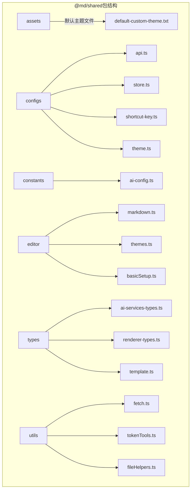
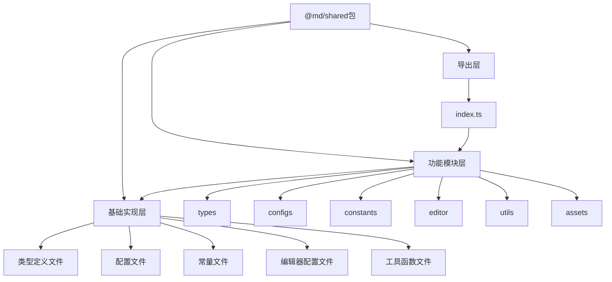
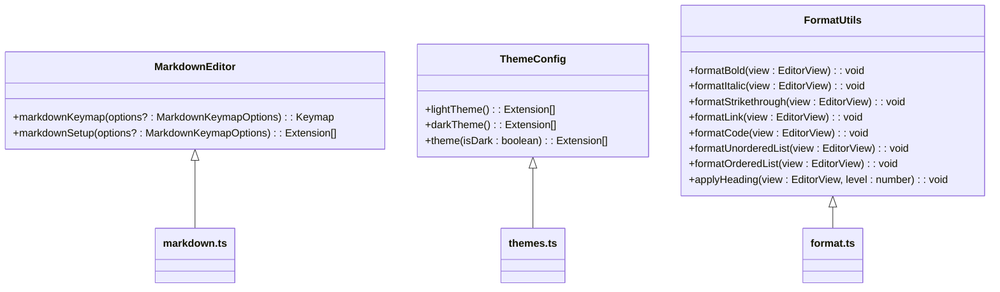
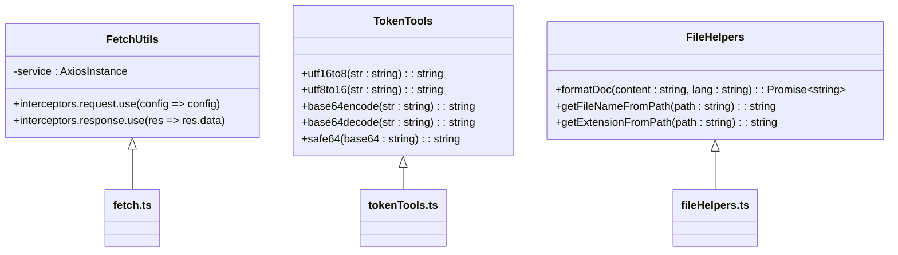

# @md/shared包详解

<cite>
**本文档引用文件**  
- [index.ts](file://packages/shared/src/index.ts)
- [types/index.ts](file://packages/shared/src/types/index.ts)
- [configs/index.ts](file://packages/shared/src/configs/index.ts)
- [constants/index.ts](file://packages/shared/src/constants/index.ts)
- [utils/index.ts](file://packages/shared/src/utils/index.ts)
- [editor/index.ts](file://packages/shared/src/editor/index.ts)
- [types/ai-services-types.ts](file://packages/shared/src/types/ai-services-types.ts)
- [types/renderer-types.ts](file://packages/shared/src/types/renderer-types.ts)
- [types/template.ts](file://packages/shared/src/types/template.ts)
- [configs/api.ts](file://packages/shared/src/configs/api.ts)
- [configs/store.ts](file://packages/shared/src/configs/store.ts)
- [configs/shortcut-key.ts](file://packages/shared/src/configs/shortcut-key.ts)
- [constants/ai-config.ts](file://packages/shared/src/constants/ai-config.ts)
- [utils/fetch.ts](file://packages/shared/src/utils/fetch.ts)
- [utils/tokenTools.ts](file://packages/shared/src/utils/tokenTools.ts)
- [editor/markdown.ts](file://packages/shared/src/editor/markdown.ts)
- [editor/themes.ts](file://packages/shared/src/editor/themes.ts)
- [types/common.ts](file://packages/shared/src/types/common.ts)
</cite>

## 目录
1. [简介](#简介)
2. [项目结构](#项目结构)
3. [核心组件](#核心组件)
4. [架构概览](#架构概览)
5. [详细组件分析](#详细组件分析)
6. [依赖分析](#依赖分析)
7. [性能考虑](#性能考虑)
8. [故障排除指南](#故障排除指南)
9. [结论](#结论)

## 简介
`@md/shared`包是多平台微信Markdown编辑器项目中的核心共享层，为web应用、VS Code插件和uTools插件等多个前端应用提供统一的类型定义、常量配置、编辑器配置和工具函数。该包的设计理念是通过集中管理跨模块的共享资源，确保整个项目的一致性、可维护性和类型安全。它作为项目的基础支撑层，实现了配置统一、类型共享和功能复用三大核心价值。

**Section sources**
- [index.ts](file://packages/shared/src/index.ts)

## 项目结构
`@md/shared`包采用模块化设计，将不同类型的共享资源组织在清晰的目录结构中。主要包含`assets`、`configs`、`constants`、`editor`、`types`和`utils`六个核心模块，每个模块负责特定类型的共享内容。这种结构化的组织方式使得开发者能够快速定位所需资源，同时也便于维护和扩展。



**Diagram sources**
- [index.ts](file://packages/shared/src/index.ts)

**Section sources**
- [index.ts](file://packages/shared/src/index.ts)

## 核心组件
`@md/shared`包的核心组件包括类型定义系统、配置管理中心、编辑器配置集和工具函数库。这些组件共同构成了跨模块开发的基础支撑体系。类型定义系统通过`types/`目录提供统一的接口和类型声明，确保整个项目类型安全；配置管理中心在`configs/`目录中集中管理API端点、快捷键和存储配置等全局设置；编辑器配置集为CodeMirror编辑器提供标准化的扩展配置；工具函数库则封装了常用的fetch请求、token处理和文件操作等实用功能。

**Section sources**
- [types/index.ts](file://packages/shared/src/types/index.ts)
- [configs/index.ts](file://packages/shared/src/configs/index.ts)
- [editor/index.ts](file://packages/shared/src/editor/index.ts)
- [utils/index.ts](file://packages/shared/src/utils/index.ts)

## 架构概览
`@md/shared`包采用分层架构设计，从上至下分为导出层、功能模块层和基础实现层。导出层由根目录的`index.ts`文件构成，通过统一的入口文件对外暴露所有共享资源；功能模块层包含`types`、`configs`、`constants`、`editor`、`utils`等模块，每个模块专注于特定领域的功能实现；基础实现层则包含具体的代码实现，如类型定义、配置常量和工具函数等。这种架构设计实现了关注点分离，提高了代码的可维护性和可扩展性。



**Diagram sources**
- [index.ts](file://packages/shared/src/index.ts)
- [types/index.ts](file://packages/shared/src/types/index.ts)
- [configs/index.ts](file://packages/shared/src/configs/index.ts)

## 详细组件分析

### 类型定义系统分析
`types/`模块是`@md/shared`包的类型安全基石，通过`index.ts`文件统一导出所有类型定义。该模块包含AI服务、渲染器、模板等关键接口，为整个项目提供一致的类型约束。`types/index.ts`文件采用聚合导出模式，将各个子类型文件的定义集中暴露，简化了导入路径。

```mermaid
graph TB
    subgraph "AI 服务类型"
        AIService["AIServiceTypes<br/>━━━━━━━━━━<br/>value: string<br/>label: string<br/>endpoint: string<br/>models: string[]"]
        ImageService["ImageServiceOption"]
    end
    
    subgraph "渲染器类型"
        Renderer["RendererTypes<br/>━━━━━━━━━━<br/>reset(newOpts)<br/>setOptions(newOpts)<br/>getOpts()<br/>parseFrontMatterAndContent()<br/>buildReadingTime()<br/>buildFootnotes()<br/>buildAddition()<br/>createContainer()"]
        RendererAPI["RendererAPI"]
    end
    
    subgraph "模板类型"
        Template["TemplateTypes<br/>━━━━━━━━━━<br/>id: string<br/>name: string<br/>content: string<br/>description?: string<br/>createdAt: number<br/>updatedAt: number<br/>tags?: string[]"]
        TemplateImpl["Template"]
        CreateParams["CreateTemplateParams"]
        UpdateParams["UpdateTemplateParams"]
    end
    
    subgraph "通用类型"
        Common["CommonTypes<br/>━━━━━━━━━━<br/>legend?: string<br/>citeStatus?: boolean<br/>countStatus?: boolean<br/>isMacCodeBlock?: boolean<br/>isShowLineNumber?: boolean"]
        IOpts["IOpts"]
        IConfig["IConfigOption"]
        Alert["AlertOptions"]
        PostAcc["PostAccount"]
        Post["Post"]
    end
    
    AIService -.->|"实现"| ImageService
    Renderer -.->|"实现"| RendererAPI
    Template -.->|"实现"| TemplateImpl
    Template -.->|"实现"| CreateParams
    Template -.->|"实现"| UpdateParams
    Common -.->|"实现"| IOpts
    Common -.->|"实现"| IConfig
    Common -.->|"实现"| Alert
    Common -.->|"实现"| PostAcc
    Common -.->|"实现"| Post
    
    style AIService fill:#e1f5ff,stroke:#0284c7,stroke-width:2px
    style ImageService fill:#dbeafe,stroke:#3b82f6,stroke-width:2px
    style Renderer fill:#dcfce7,stroke:#16a34a,stroke-width:2px
    style RendererAPI fill:#d1fae5,stroke:#10b981,stroke-width:2px
    style Template fill:#fef3c7,stroke:#f59e0b,stroke-width:2px
    style TemplateImpl fill:#fef9c3,stroke:#eab308,stroke-width:2px
    style CreateParams fill:#fef9c3,stroke:#eab308,stroke-width:2px
    style UpdateParams fill:#fef9c3,stroke:#eab308,stroke-width:2px
    style Common fill:#f3e8ff,stroke:#9333ea,stroke-width:2px
    style IOpts fill:#e9d5ff,stroke:#a855f7,stroke-width:2px
    style IConfig fill:#e9d5ff,stroke:#a855f7,stroke-width:2px
    style Alert fill:#e9d5ff,stroke:#a855f7,stroke-width:2px
    style PostAcc fill:#e9d5ff,stroke:#a855f7,stroke-width:2px
    style Post fill:#e9d5ff,stroke:#a855f7,stroke-width:2px
```



**Diagram sources**
- [types/index.ts](file://packages/shared/src/types/index.ts)
- [types/ai-services-types.ts](file://packages/shared/src/types/ai-services-types.ts)
- [types/renderer-types.ts](file://packages/shared/src/types/renderer-types.ts)
- [types/template.ts](file://packages/shared/src/types/template.ts)
- [types/common.ts](file://packages/shared/src/types/common.ts)

**Section sources**
- [types/index.ts](file://packages/shared/src/types/index.ts)

### 配置管理中心分析
`configs/`模块是`@md/shared`包的配置中枢，通过`index.ts`文件统一导出所有配置项。该模块集中管理API端点、快捷键、存储配置等全局设置，实现了配置的统一管理和维护。`configs/index.ts`文件采用模块化导出策略，将不同类型的配置分离到独立的文件中，既保持了配置的组织清晰性，又便于按需导入。

```mermaid
classDiagram
class APIConfig {
+githubConfig : {username, repoList, branch, accessTokenList}
+giteeConfig : {username, repoList, branch, accessTokenList}
}
class StoreConfig {
+storeLabels : Record~string, string~
}
class ShortcutKeyConfig {
+ctrlKey : string
+altKey : string
+shiftKey : string
+ctrlSign : string
+altSign : string
+shiftSign : string
}
class ThemeConfig {
+themeOptions : IConfigOption~string~[]
+fontFamilyOptions : IConfigOption~string~[]
+fontSizeOptions : IConfigOption~string~[]
+codeBlockThemeOptions : IConfigOption~string~[]
+legendOptions : IConfigOption~string~[]
}
APIConfig <|-- api.ts
StoreConfig <|-- store.ts
ShortcutKeyConfig <|-- shortcut-key.ts
ThemeConfig <|-- theme.ts
```

**Diagram sources**
- [configs/index.ts](file://packages/shared/src/configs/index.ts)
- [configs/api.ts](file://packages/shared/src/configs/api.ts)
- [configs/store.ts](file://packages/shared/src/configs/store.ts)
- [configs/shortcut-key.ts](file://packages/shared/src/configs/shortcut-key.ts)
- [configs/theme.ts](file://packages/shared/src/configs/theme.ts)

**Section sources**
- [configs/index.ts](file://packages/shared/src/configs/index.ts)

### 编辑器配置集分析
`editor/`模块为CodeMirror编辑器提供标准化的配置集，通过`index.ts`文件统一导出所有编辑器相关的配置。该模块包含markdown语法支持、快捷键映射、主题配置等核心功能，确保在不同应用中编辑器行为的一致性。`editor/index.ts`文件采用功能聚合模式，将不同方面的编辑器配置集中暴露，简化了编辑器的初始化过程。



**Diagram sources**
- [editor/index.ts](file://packages/shared/src/editor/index.ts)
- [editor/markdown.ts](file://packages/shared/src/editor/markdown.ts)
- [editor/themes.ts](file://packages/shared/src/editor/themes.ts)
- [editor/format.ts](file://packages/shared/src/editor/format.ts)

**Section sources**
- [editor/index.ts](file://packages/shared/src/editor/index.ts)

### 工具函数库分析
`utils/`模块封装了项目中常用的工具函数，通过`index.ts`文件统一导出。该模块包含fetch请求封装、token处理、文件操作等实用功能，为不同应用提供一致的工具支持。`utils/index.ts`文件采用功能分类导出策略，将不同类型的工具函数组织在独立的文件中，既保持了工具库的组织清晰性，又便于按需使用。



**Diagram sources**
- [utils/index.ts](file://packages/shared/src/utils/index.ts)
- [utils/fetch.ts](file://packages/shared/src/utils/fetch.ts)
- [utils/tokenTools.ts](file://packages/shared/src/utils/tokenTools.ts)
- [utils/fileHelpers.ts](file://packages/shared/src/utils/fileHelpers.ts)

**Section sources**
- [utils/index.ts](file://packages/shared/src/utils/index.ts)

## 依赖分析
`@md/shared`包的依赖关系清晰且合理，主要依赖于项目内部的其他模块和外部的通用库。该包作为共享层，被`apps/web`、`apps/vscode`和`apps/utools`等多个应用模块所依赖，实现了代码和配置的跨模块复用。同时，它依赖于`axios`等外部库来提供HTTP请求功能，并通过`@codemirror`系列包为编辑器提供支持。

```mermaid
graph TD
A["@md/shared"] --> B["apps/web"]
A --> C["apps/vscode"]
A --> D["apps/utools"]
A --> E["axios"]
A --> F["@codemirror/autocomplete"]
A --> G["@codemirror/commands"]
A --> H["@codemirror/lang-markdown"]
A --> I["@codemirror/language-data"]
A --> J["@codemirror/search"]
A --> K["@codemirror/state"]
A --> L["@codemirror/view"]
A --> M["@replit/codemirror-indentation-markers"]
A --> N["@fsegurai/codemirror-theme-vscode-dark"]
A --> O["@fsegurai/codemirror-theme-vscode-light"]
A --> P["marked"]
A --> Q["reading-time"]
B --> A
C --> A
D --> A
```



**Diagram sources**
- [package.json](file://packages/shared/package.json)
- [index.ts](file://packages/shared/src/index.ts)

**Section sources**
- [package.json](file://packages/shared/package.json)

## 性能考虑
`@md/shared`包在设计时充分考虑了性能因素。通过将类型定义、配置常量和工具函数集中管理，减少了重复代码和冗余配置，降低了应用的包体积。工具函数如`fetch.ts`中的axios实例配置了合理的超时时间，避免了长时间的网络请求阻塞。编辑器配置采用了CodeMirror的模块化扩展机制，按需加载功能，提高了编辑器的启动性能。此外，类型定义的集中管理也减少了TypeScript编译时的类型检查开销。

## 故障排除指南
当使用`@md/shared`包遇到问题时，可以参考以下常见问题的解决方案：如果类型定义不生效，请检查是否正确导入了`types/`模块中的类型；如果配置项未生效，请确认是否正确引用了`configs/`模块中的配置；如果编辑器功能异常，请检查`editor/`模块的配置是否正确应用；如果工具函数调用失败，请确保相关依赖已正确安装。对于复杂的类型错误，建议检查`types/index.ts`中的类型定义是否与实际使用场景匹配。

**Section sources**
- [types/index.ts](file://packages/shared/src/types/index.ts)
- [configs/index.ts](file://packages/shared/src/configs/index.ts)
- [editor/index.ts](file://packages/shared/src/editor/index.ts)
- [utils/index.ts](file://packages/shared/src/utils/index.ts)

## 结论
`@md/shared`包作为多平台微信Markdown编辑器项目的核心共享层，成功实现了跨模块的配置统一、类型共享和功能复用。通过清晰的模块化设计和合理的架构分层，该包为web应用、VS Code插件和uTools插件提供了稳定可靠的基础支撑。其设计理念强调集中管理、类型安全和可维护性，为大型多端项目的开发提供了优秀的实践范例。未来可以进一步扩展该包的功能，如增加更多通用工具函数、优化类型定义的粒度、增强配置的可扩展性等，以更好地支持项目的持续发展。