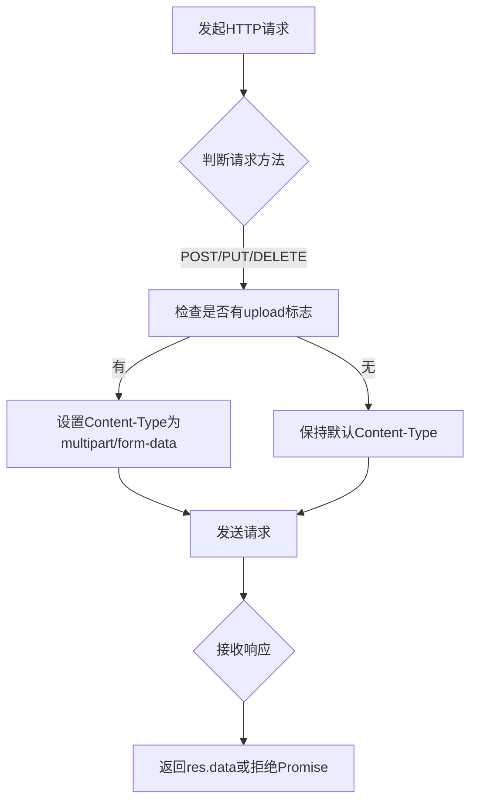
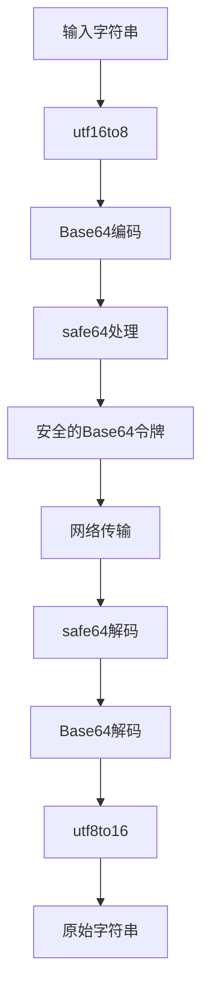
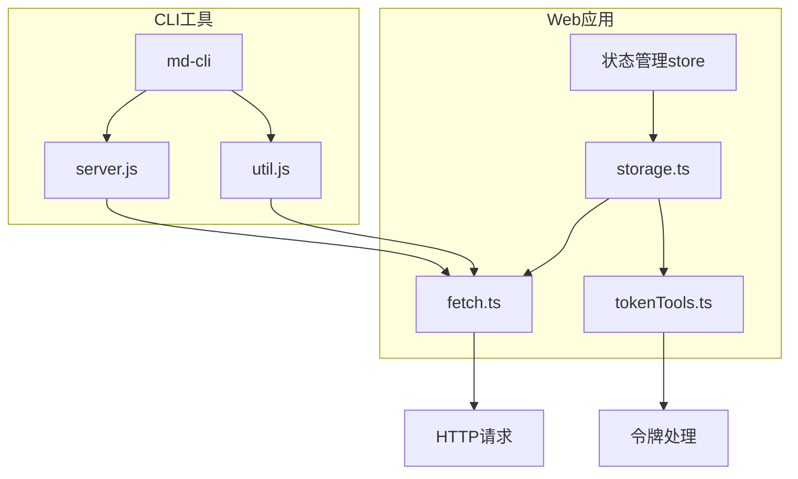
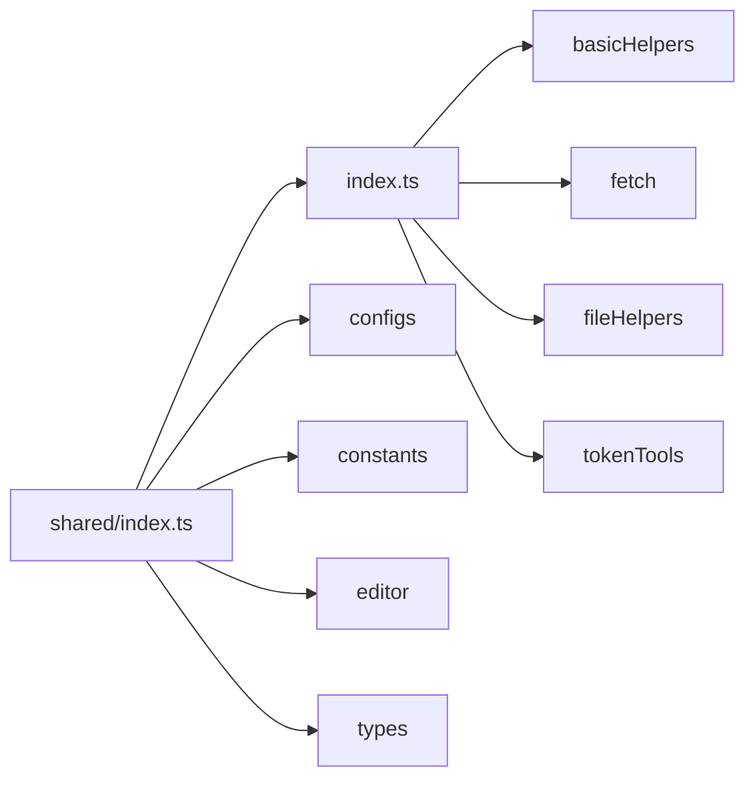

# 共享工具函数

<cite>
**本文档引用的文件**  
- [fetch.ts](file://packages/shared/src/utils/fetch.ts)
- [fileHelpers.ts](file://packages/shared/src/utils/fileHelpers.ts)
- [tokenTools.ts](file://packages/shared/src/utils/tokenTools.ts)
- [index.ts](file://packages/shared/src/utils/index.ts)
- [shared/index.ts](file://packages/shared/src/index.ts)
- [storage.ts](file://apps/web/src/utils/storage.ts)
- [file.ts](file://apps/web/src/utils/file.ts)
- [editor.ts](file://apps/web/src/stores/editor.ts)
- [util.js](file://packages/md-cli/util.js)
- [server.js](file://packages/md-cli/server.js)
</cite>

## 目录
1. [介绍](#介绍)
2. [HTTP请求工具](#http请求工具)
3. [文件处理辅助方法](#文件处理辅助方法)
4. [认证令牌操作函数](#认证令牌操作函数)
5. [跨环境调用方式](#跨环境调用方式)
6. [模块聚合与Tree-shaking优化](#模块聚合与tree-shaking优化)
7. [工具函数扩展规范](#工具函数扩展规范)
8. [总结](#总结)

## 介绍
`@md/shared`包提供了一套通用的工具函数库，旨在为Web应用和CLI工具提供跨环境的可复用功能。该工具库包含HTTP请求封装、文件处理辅助方法、认证令牌操作函数等核心功能，通过模块化设计实现了高内聚、低耦合的代码结构。这些工具函数被广泛应用于状态管理(store)和命令行工具中，支持无副作用原则和类型安全要求。

**Section sources**
- [shared/index.ts](file://packages/shared/src/index.ts#L1-L7)

## HTTP请求工具
`fetch.ts`文件封装了基于Axios的HTTP请求逻辑，创建了一个全局的axios实例并配置了请求和响应拦截器。该实例设置了30秒的请求超时时间，并在POST、PUT、DELETE请求中自动处理multipart/form-data类型的请求头。响应拦截器确保返回的数据格式统一，优先返回响应体中的data字段，否则返回拒绝的Promise。



**Diagram sources**
- [fetch.ts](file://packages/shared/src/utils/fetch.ts#L1-L30)

**Section sources**
- [fetch.ts](file://packages/shared/src/utils/fetch.ts#L1-L30)

## 文件处理辅助方法
`fileHelpers.ts`提供了多种文件处理的辅助方法，包括通用文件下载、文件转Base64、Markdown表格生成和文档格式化等功能。其中`downloadFile`函数支持在浏览器环境中下载文件，能够处理data URL、HTML内容和普通文本；`toBase64`函数将文件对象转换为Base64字符串；`createTable`根据数据生成Markdown表格；`formatDoc`使用Prettier对文档内容进行格式化。

```mermaid
classDiagram
class FileHelpers {
+downloadFile(content : string, filename : string, mimeType : string) : void
+toBase64(file : Blob) : Promise<string>
+createTable(options : {data : object, rows : number, cols : number}) : string
+formatDoc(content : string, type : 'markdown'|'css'|'javascript') : Promise<string>
}
```

**Diagram sources**
- [fileHelpers.ts](file://packages/shared/src/utils/fileHelpers.ts#L1-L118)

**Section sources**
- [fileHelpers.ts](file://packages/shared/src/utils/fileHelpers.ts#L1-L118)

## 认证令牌操作函数
`tokenTools.ts`包含了一系列与认证令牌相关的操作函数，实现了UTF-16与UTF-8编码的相互转换、Base64编码/解码以及安全的Base64编码。这些函数主要用于处理认证令牌的编码转换，确保在不同系统间传输时的兼容性。`utf16to8`和`utf8to16`函数处理字符编码转换，`base64encode`和`base64decode`实现Base64编解码，`safe64`函数将标准Base64编码中的+和/替换为-和_，以适应URL安全的需求。



**Diagram sources**
- [tokenTools.ts](file://packages/shared/src/utils/tokenTools.ts#L1-L291)

**Section sources**
- [tokenTools.ts](file://packages/shared/src/utils/tokenTools.ts#L1-L291)

## 跨环境调用方式
这些工具函数在Web应用的状态管理(store)和CLI工具中都有广泛应用。在Web应用中，`store`模块通过`storage.ts`实现了现代化的存储抽象层，支持本地存储和RESTful API存储，并利用`fetch`工具进行网络请求。在CLI工具中，`md-cli`包使用这些工具实现服务器创建、文件上传等功能。例如，在`server.js`中使用`fetch`进行代理请求，在`util.js`中使用各种工具函数处理命令行参数和颜色输出。



**Diagram sources**
- [storage.ts](file://apps/web/src/utils/storage.ts#L1-L362)
- [file.ts](file://apps/web/src/utils/file.ts#L1-L497)
- [util.js](file://packages/md-cli/util.js#L1-L82)
- [server.js](file://packages/md-cli/server.js#L1-L105)

**Section sources**
- [storage.ts](file://apps/web/src/utils/storage.ts#L1-L362)
- [file.ts](file://apps/web/src/utils/file.ts#L1-L497)
- [util.js](file://packages/md-cli/util.js#L1-L82)
- [server.js](file://packages/md-cli/server.js#L1-L105)

## 模块聚合与Tree-shaking优化
`index.ts`文件采用模块聚合模式，通过重新导出的方式将各个工具模块整合到一个统一的入口。这种设计不仅简化了导入路径，还支持Tree-shaking优化，确保只有被实际使用的函数才会被打包到最终的构建产物中。`package.json`中的exports字段定义了包的导出结构，支持按需导入特定模块，进一步优化了包的使用效率。



**Diagram sources**
- [index.ts](file://packages/shared/src/utils/index.ts#L1-L4)
- [shared/index.ts](file://packages/shared/src/index.ts#L1-L7)
- [package.json](file://packages/shared/package.json#L6-L18)

**Section sources**
- [index.ts](file://packages/shared/src/utils/index.ts#L1-L4)
- [shared/index.ts](file://packages/shared/src/index.ts#L1-L7)

## 工具函数扩展规范
在扩展工具函数时，必须遵循无副作用原则和类型安全要求。所有新添加的函数都应该是纯函数，不修改外部状态，只依赖输入参数产生输出。类型定义应放在`types`目录下，并在函数签名中明确指定参数和返回值类型。对于可能抛出异常的异步操作，应使用Promise进行错误处理。此外，新函数应通过`index.ts`正确导出，并在`package.json`的exports字段中声明，以确保Tree-shaking的正确性。

**Section sources**
- [index.ts](file://packages/shared/src/utils/index.ts#L1-L4)
- [shared/index.ts](file://packages/shared/src/index.ts#L1-L7)

## 总结
`@md/shared`包中的工具函数库通过精心设计的模块结构和严格的编码规范，为Web应用和CLI工具提供了可靠的跨环境支持。HTTP请求封装、文件处理辅助方法和认证令牌操作函数等核心功能，不仅满足了当前项目的需求，还具备良好的可扩展性和维护性。通过模块聚合模式和Tree-shaking优化，确保了代码的高效利用和包体积的最小化。未来扩展时，应继续遵循无副作用原则和类型安全要求，保持代码质量和一致性。