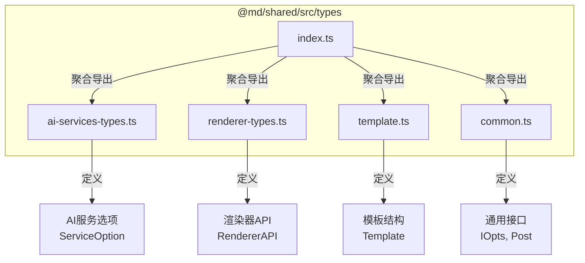
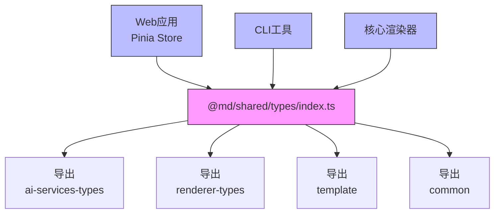
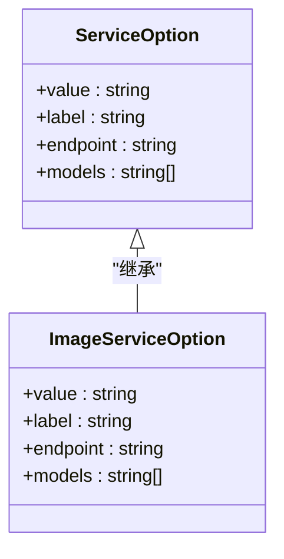
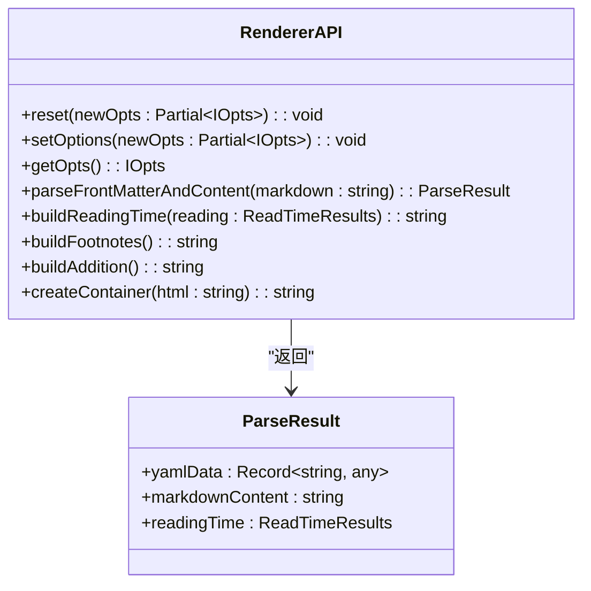
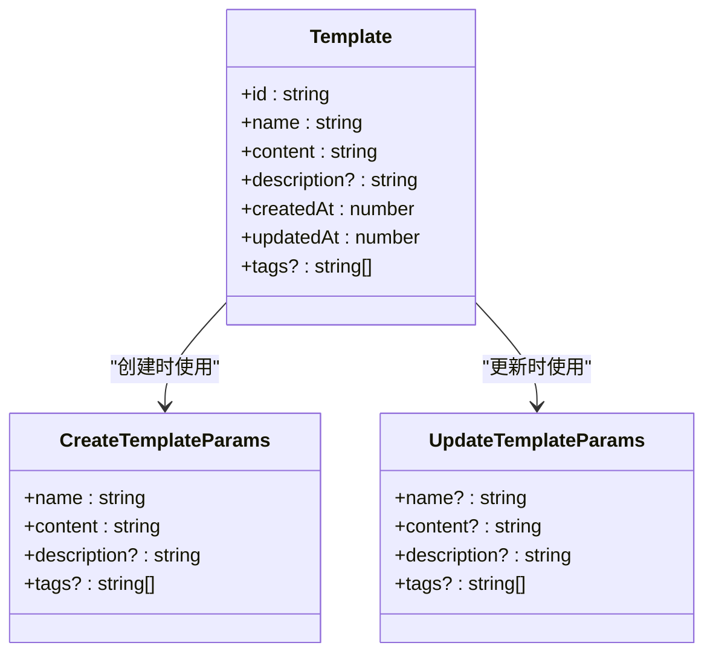
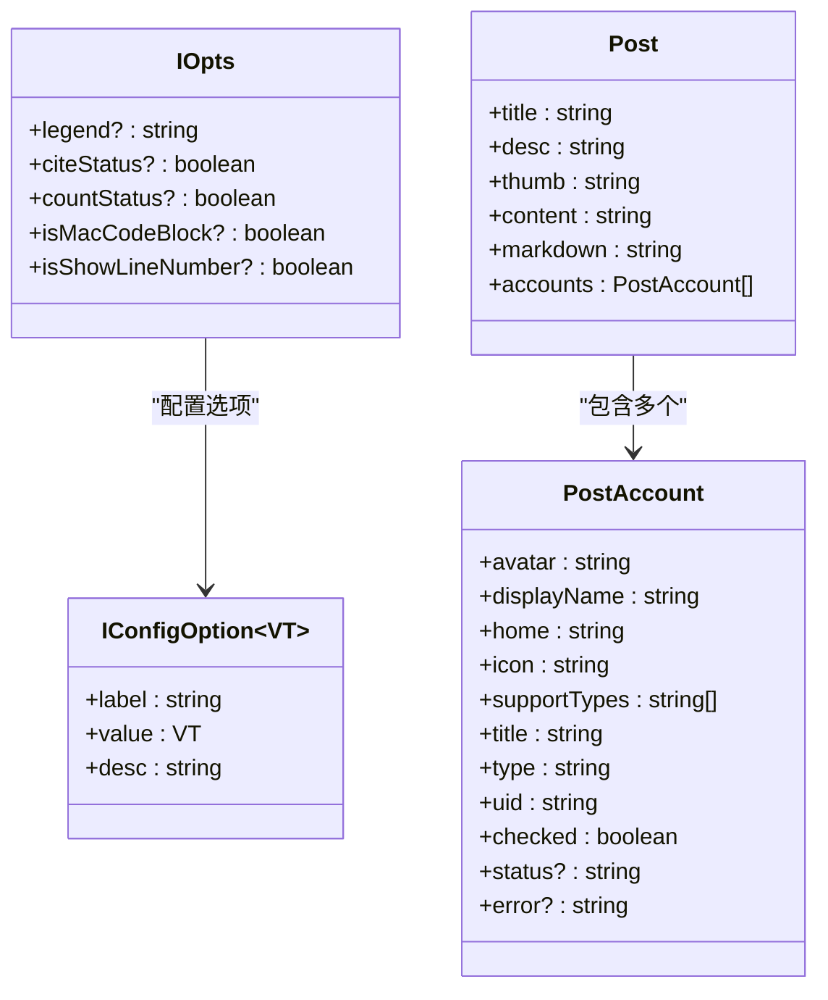
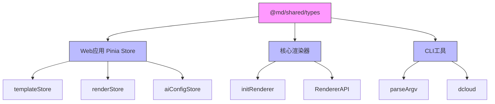

# 类型定义与接口

<cite>
**本文档引用的文件**
- [ai-services-types.ts](file://packages/shared/src/types/ai-services-types.ts)
- [renderer-types.ts](file://packages/shared/src/types/renderer-types.ts)
- [template.ts](file://packages/shared/src/types/template.ts)
- [common.ts](file://packages/shared/src/types/common.ts)
- [index.ts](file://packages/shared/src/types/index.ts)
- [template.ts](file://apps/web/src/stores/template.ts)
- [render.ts](file://apps/web/src/stores/render.ts)
- [aiConfig.ts](file://apps/web/src/stores/aiConfig.ts)
- [renderer-impl.ts](file://packages/core/src/renderer/renderer-impl.ts)
</cite>

## 目录
1. [简介](#简介)
2. [项目结构](#项目结构)
3. [核心类型模块](#核心类型模块)
4. [架构概览](#架构概览)
5. [详细组件分析](#详细组件分析)
6. [依赖关系分析](#依赖关系分析)
7. [性能考量](#性能考量)
8. [故障排除指南](#故障排除指南)
9. [结论](#结论)

## 简介
本文件全面解析`@md/shared`包中的类型系统设计，重点分析`types/`目录下各模块的职责。文档详细说明AI服务请求/响应接口、认证模型、渲染引擎所需数据结构、模板元数据与内容格式等核心类型定义。通过实际代码示例展示这些类型如何在Web应用的Pinia store和CLI工具中统一使用，确保跨平台类型安全。同时解释`index.ts`的导出聚合模式及其对项目整体类型一致性的保障作用，并提供类型扩展指南。

## 项目结构
`@md/shared`包作为项目的核心共享层，提供了配置、常量、类型和工具函数的集中管理。其`types/`目录采用模块化设计，将不同功能领域的类型定义分离到独立文件中，实现了关注点分离和高内聚低耦合的设计原则。

**Diagram sources**
- [ai-services-types.ts](file://packages/shared/src/types/ai-services-types.ts)
- [renderer-types.ts](file://packages/shared/src/types/renderer-types.ts)
- [template.ts](file://packages/shared/src/types/template.ts)
- [common.ts](file://packages/shared/src/types/common.ts)
- [index.ts](file://packages/shared/src/types/index.ts)

**Section sources**
- [ai-services-types.ts](file://packages/shared/src/types/ai-services-types.ts)
- [renderer-types.ts](file://packages/shared/src/types/renderer-types.ts)
- [template.ts](file://packages/shared/src/types/template.ts)
- [common.ts](file://packages/shared/src/types/common.ts)
- [index.ts](file://packages/shared/src/types/index.ts)

## 核心类型模块

`@md/shared`包的类型系统由多个专门化的模块组成，每个模块负责特定领域的类型定义，共同构建了项目的类型安全基础。

**Section sources**
- [ai-services-types.ts](file://packages/shared/src/types/ai-services-types.ts)
- [renderer-types.ts](file://packages/shared/src/types/renderer-types.ts)
- [template.ts](file://packages/shared/src/types/template.ts)
- [common.ts](file://packages/shared/src/types/common.ts)

## 架构概览

`@md/shared`包的类型系统采用了分层架构设计，通过`index.ts`文件作为统一的入口点，实现了类型定义的聚合与导出。这种设计模式确保了类型的一致性和可维护性，使得其他模块可以统一从`@md/shared/types`导入所需类型。

**Diagram sources**
- [index.ts](file://packages/shared/src/types/index.ts)
- [template.ts](file://apps/web/src/stores/template.ts)
- [render.ts](file://apps/web/src/stores/render.ts)
- [aiConfig.ts](file://apps/web/src/stores/aiConfig.ts)

## 详细组件分析

### AI服务类型分析

`ai-services-types.ts`模块定义了AI服务的核心配置接口，为不同AI服务提供商提供了统一的类型规范。

#### 类图

**Diagram sources**
- [ai-services-types.ts](file://packages/shared/src/types/ai-services-types.ts)

**Section sources**
- [ai-services-types.ts](file://packages/shared/src/types/ai-services-types.ts)
- [aiConfig.ts](file://apps/web/src/stores/aiConfig.ts)

### 渲染器类型分析

`renderer-types.ts`模块定义了渲染引擎的API接口，规范了Markdown到HTML的转换过程。

#### 类图

**Diagram sources**
- [renderer-types.ts](file://packages/shared/src/types/renderer-types.ts)
- [renderer-impl.ts](file://packages/core/src/renderer/renderer-impl.ts)

**Section sources**
- [renderer-types.ts](file://packages/shared/src/types/renderer-types.ts)
- [renderer-impl.ts](file://packages/core/src/renderer/renderer-impl.ts)
- [render.ts](file://apps/web/src/stores/render.ts)

### 模板类型分析

`template.ts`模块定义了模板管理系统的数据结构，包括模板的元数据和内容格式。

#### 类图

**Diagram sources**
- [template.ts](file://packages/shared/src/types/template.ts)

**Section sources**
- [template.ts](file://packages/shared/src/types/template.ts)
- [template.ts](file://apps/web/src/stores/template.ts)

### 通用类型分析

`common.ts`模块定义了项目中广泛使用的通用接口和类型。

#### 类图

**Diagram sources**
- [common.ts](file://packages/shared/src/types/common.ts)

**Section sources**
- [common.ts](file://packages/shared/src/types/common.ts)

## 依赖关系分析

`@md/shared`包的类型系统与其他模块之间存在明确的依赖关系，形成了清晰的依赖图谱。

**Diagram sources**
- [index.ts](file://packages/shared/src/types/index.ts)
- [template.ts](file://apps/web/src/stores/template.ts)
- [render.ts](file://apps/web/src/stores/render.ts)
- [aiConfig.ts](file://apps/web/src/stores/aiConfig.ts)
- [renderer-impl.ts](file://packages/core/src/renderer/renderer-impl.ts)

**Section sources**
- [index.ts](file://packages/shared/src/types/index.ts)
- [package.json](file://packages/shared/package.json)

## 性能考量

`@md/shared`包的类型系统设计充分考虑了性能因素，通过以下方式优化了类型检查和运行时性能：

1. **类型精简**：避免过度复杂的类型定义，减少类型检查的开销
2. **模块化设计**：按需导入类型，避免不必要的类型加载
3. **接口复用**：通过继承和组合复用现有类型，减少重复定义
4. **泛型优化**：合理使用泛型，提高类型灵活性的同时保持性能

## 故障排除指南

在使用`@md/shared`包的类型系统时，可能会遇到以下常见问题及解决方案：

**Section sources**
- [aiConfig.ts](file://apps/web/src/stores/aiConfig.ts)
- [render.ts](file://apps/web/src/stores/render.ts)
- [template.ts](file://apps/web/src/stores/template.ts)

### 类型导入错误
当出现类型导入错误时，请检查：
- 导入路径是否正确
- 是否已安装`@md/shared`包
- TypeScript配置是否正确

### 类型不匹配
当出现类型不匹配错误时，请检查：
- 接口定义是否最新
- 属性名称和类型是否一致
- 可选属性是否正确处理

### 运行时类型错误
虽然TypeScript提供了编译时类型检查，但在运行时仍可能出现类型错误。建议：
- 在关键位置添加运行时类型检查
- 使用严格的TypeScript配置
- 定期更新类型定义

## 结论

`@md/shared`包的类型系统设计体现了良好的软件工程实践，通过模块化、分层和聚合的设计模式，实现了类型的安全性、可维护性和可扩展性。该类型系统不仅为Web应用的Pinia store提供了类型支持，也为CLI工具和其他模块提供了统一的类型规范，确保了整个项目的一致性和可靠性。通过遵循本文档提供的类型扩展指南，开发人员可以安全地添加新类型而不破坏现有依赖，为项目的长期发展奠定了坚实的基础。