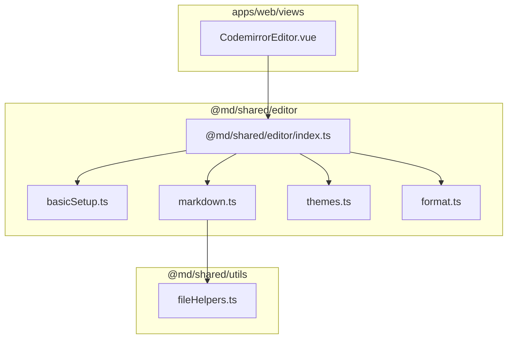
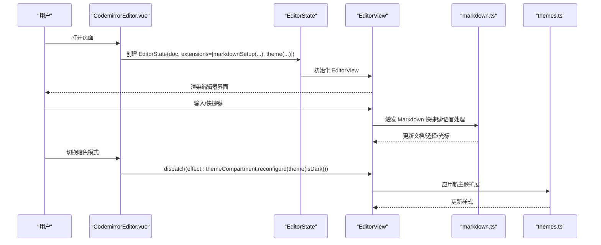
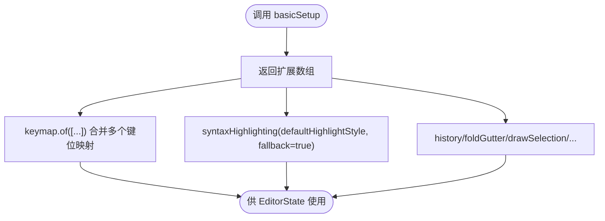
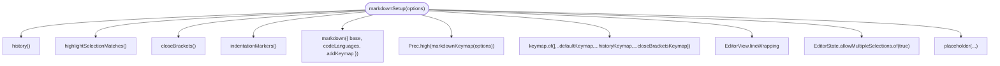
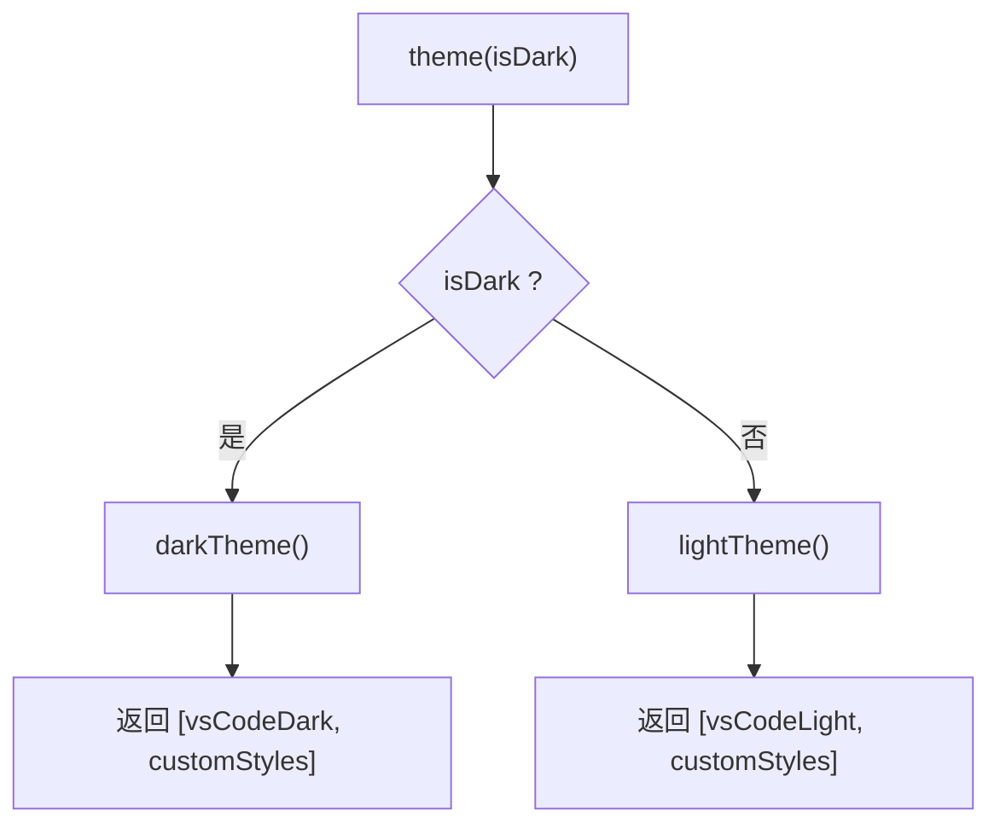
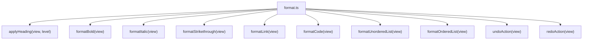
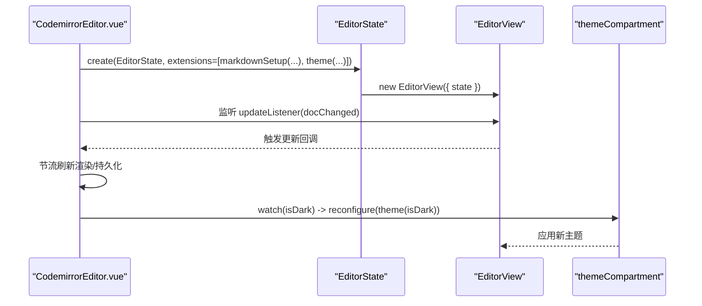
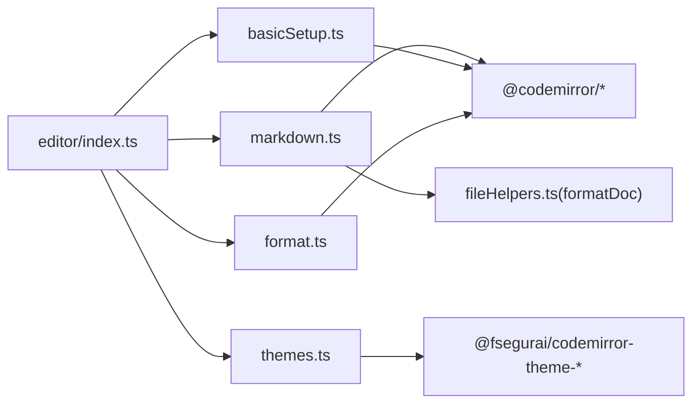

# 编辑器配置集

<cite>
**本文引用的文件**
- [basicSetup.ts](file://packages/shared/src/editor/basicSetup.ts)
- [markdown.ts](file://packages/shared/src/editor/markdown.ts)
- [themes.ts](file://packages/shared/src/editor/themes.ts)
- [format.ts](file://packages/shared/src/editor/format.ts)
- [index.ts](file://packages/shared/src/editor/index.ts)
- [fileHelpers.ts](file://packages/shared/src/utils/fileHelpers.ts)
- [CodemirrorEditor.vue](file://apps/web/src/views/CodemirrorEditor.vue)
- [markdown.md](file://apps/web/src/assets/example/markdown.md)
</cite>

## 目录
1. [简介](#简介)
2. [项目结构](#项目结构)
3. [核心组件](#核心组件)
4. [架构总览](#架构总览)
5. [详细组件分析](#详细组件分析)
6. [依赖关系分析](#依赖关系分析)
7. [性能考量](#性能考量)
8. [故障排查指南](#故障排查指南)
9. [结论](#结论)
10. [附录](#附录)

## 简介
本文件系统性阐述 @md/shared 包中 CodeMirror 编辑器的配置体系，重点说明：
- basicSetup.ts 提供的基础扩展集与最小可用集
- markdown.ts 中 Markdown 语法支持与快捷键映射
- themes.ts 中主题适配逻辑
- 以及这些配置如何在 web 应用的 CodemirrorEditor.vue 组件中被复用，形成一致的编辑体验
- 各配置模块的组合方式与对性能的影响
- 自定义扩展语法高亮与新增功能的实践指导

## 项目结构
围绕编辑器配置的关键文件分布如下：
- @md/shared/editor：集中存放编辑器配置与工具
  - basicSetup.ts：基础扩展集与最小可用集
  - markdown.ts：Markdown 语言支持、快捷键与编辑器行为
  - themes.ts：主题适配（浅色/深色）
  - format.ts：常用格式化动作（加粗、斜体、标题、列表等）
  - index.ts：统一导出入口
- @md/shared/utils：通用工具（如文档格式化）
- apps/web/views/CodemirrorEditor.vue：Web 应用中实际消费上述配置的组件

图表来源
- [basicSetup.ts](file://packages/shared/src/editor/basicSetup.ts#L1-L99)
- [markdown.ts](file://packages/shared/src/editor/markdown.ts#L1-L133)
- [themes.ts](file://packages/shared/src/editor/themes.ts#L1-L26)
- [format.ts](file://packages/shared/src/editor/format.ts#L1-L167)
- [index.ts](file://packages/shared/src/editor/index.ts#L1-L7)
- [fileHelpers.ts](file://packages/shared/src/utils/fileHelpers.ts#L1-L118)
- [CodemirrorEditor.vue](file://apps/web/src/views/CodemirrorEditor.vue#L496-L575)

章节来源
- [index.ts](file://packages/shared/src/editor/index.ts#L1-L7)
- [CodemirrorEditor.vue](file://apps/web/src/views/CodemirrorEditor.vue#L496-L575)

## 核心组件
- 基础扩展集 basicSetup：提供编辑器常用能力（历史、括号匹配、补全、选择高亮、活动行/行号高亮、缩进标记、键位映射等），并提供最小可用集 minimalSetup
- Markdown 语法支持 markdown：启用 markdown 语言包、代码语言识别、高优先级快捷键映射、默认键位回退、换行、占位符等
- 主题适配 themes：提供浅色/深色主题，并统一对外暴露 theme(isDark) 以按需切换
- 格式化工具 format：封装常见格式化动作（标题、加粗、斜体、删除线、链接、代码、无序/有序列表）与撤销/重做
- Web 组件 CodemirrorEditor.vue：在 mounted 生命周期中创建 EditorState/EditorView，注入 markdownSetup 与 theme，监听暗色模式变化并动态 reconfigure 主题

章节来源
- [basicSetup.ts](file://packages/shared/src/editor/basicSetup.ts#L14-L99)
- [markdown.ts](file://packages/shared/src/editor/markdown.ts#L90-L133)
- [themes.ts](file://packages/shared/src/editor/themes.ts#L1-L26)
- [format.ts](file://packages/shared/src/editor/format.ts#L1-L167)
- [CodemirrorEditor.vue](file://apps/web/src/views/CodemirrorEditor.vue#L496-L611)

## 架构总览
整体架构由“配置模块 + 组合装配 + 运行时消费”三层构成：
- 配置模块：basicSetup、markdown、themes、format
- 组合装配：通过 index.ts 统一导出；在 CodemirrorEditor.vue 中以 EditorState.extensions 注入
- 运行时消费：EditorView 渲染 DOM，用户交互触发 dispatch，驱动渲染与主题切换

图表来源
- [CodemirrorEditor.vue](file://apps/web/src/views/CodemirrorEditor.vue#L496-L611)
- [markdown.ts](file://packages/shared/src/editor/markdown.ts#L99-L133)
- [themes.ts](file://packages/shared/src/editor/themes.ts#L1-L26)

## 详细组件分析

### basicSetup.ts：基础扩展集与最小可用集
- 能力清单
  - 历史记录、特殊字符高亮、选择绘制、拖拽光标、多选、缩进输入、语法高亮回退、括号匹配、括号闭合、自动补全、矩形选择、十字光标、活动行/行号高亮、选择匹配高亮、缩进标记
  - 键位映射整合：closeBracketsKeymap、defaultKeymap、searchKeymap、historyKeymap、foldKeymap、completionKeymap、lintKeymap，并增加 Tab 行为（acceptCompletion + indentWithTab）
- 最小可用集 minimalSetup：仅包含默认键位、历史、特殊字符高亮、选择绘制、默认语法高亮
- 设计意图：提供“即插即用”的基础能力，便于二次拆解与定制

图表来源
- [basicSetup.ts](file://packages/shared/src/editor/basicSetup.ts#L44-L99)

章节来源
- [basicSetup.ts](file://packages/shared/src/editor/basicSetup.ts#L14-L99)

### markdown.ts：Markdown 语法支持与快捷键映射
- 语言支持
  - 启用 markdown 语言包，base 使用 markdownLanguage，codeLanguages 使用 languages，addKeymap 为 true
- 快捷键映射
  - 高优先级 Prec.high 的 markdownKeymap：Tab 插入空格缩进、撤销/重做、标题（Mod-1..6）、加粗/斜体/删除线/链接/代码、无序/有序列表、格式化（Shift-Alt-f）、阻止 Mod-g
  - 默认键位回退：defaultKeymap、historyKeymap、closeBracketsKeymap
- 编辑器行为
  - lineWrapping、allowMultipleSelections、placeholder

图表来源
- [markdown.ts](file://packages/shared/src/editor/markdown.ts#L99-L133)

章节来源
- [markdown.ts](file://packages/shared/src/editor/markdown.ts#L1-L133)

### themes.ts：主题适配逻辑
- 提供 lightTheme/darkTheme，均返回主题扩展数组，并叠加自定义样式（如行号垂直居中）
- theme(isDark) 根据布尔值返回对应主题数组，便于在运行时按需切换

图表来源
- [themes.ts](file://packages/shared/src/editor/themes.ts#L1-L26)

章节来源
- [themes.ts](file://packages/shared/src/editor/themes.ts#L1-L26)

### format.ts：格式化工具
- 标题应用：按行批量处理，去除已有 # 前缀并插入目标级别
- 常用格式：toggleFormat 封装加粗、斜体、删除线、行内代码、链接（带光标偏移）
- 列表：无序/有序列表切换
- 撤销/重做：包装 @codemirror/commands 的 undo/redo

图表来源
- [format.ts](file://packages/shared/src/editor/format.ts#L1-L167)

章节来源
- [format.ts](file://packages/shared/src/editor/format.ts#L1-L167)

### CodemirrorEditor.vue：配置复用与运行时消费
- 创建 EditorState 时注入：
  - markdownSetup({ onSearch, onReplace })：启用 Markdown 语言与快捷键
  - themeCompartment.of(theme(isDark))：主题隔离与动态切换
  - updateListener：监听文档变更，节流后刷新渲染与持久化
- 监听 isDark：通过 themeCompartment.reconfigure 切换主题
- 监听当前文章：内容不同则 dispatch 更新，避免重复渲染
- 与搜索面板联动：通过 onSearch/onReplace 将选中文本传递给 SearchTab

图表来源
- [CodemirrorEditor.vue](file://apps/web/src/views/CodemirrorEditor.vue#L496-L611)

章节来源
- [CodemirrorEditor.vue](file://apps/web/src/views/CodemirrorEditor.vue#L496-L611)

## 依赖关系分析
- @md/shared/editor/index.ts 统一导出 basicSetup、markdown、themes、format，便于外部按需引入
- CodemirrorEditor.vue 直接从 @md/shared/editor 导入 markdownSetup 与 theme，并通过 Compartment 实现主题热切换
- markdown.ts 依赖 @codemirror/lang-markdown、@codemirror/language-data、@codemirror/search、@codemirror/state、@codemirror/view、@replit/codemirror-indentation-markers
- basicSetup.ts 依赖 @codemirror/state、@codemirror/view、@codemirror/language、@codemirror/autocomplete、@codemirror/commands、@codemirror/search、@codemirror/lint
- themes.ts 依赖 @fsegurai/codemirror-theme-vscode-light/dark 与 @codemirror/view
- format.ts 依赖 @codemirror/commands 与 @codemirror/view
- fileHelpers.ts 依赖 prettier standalone 与若干 parser 插件，用于文档格式化（在 markdown.ts 的快捷键中被调用）

图表来源
- [index.ts](file://packages/shared/src/editor/index.ts#L1-L7)
- [markdown.ts](file://packages/shared/src/editor/markdown.ts#L1-L133)
- [basicSetup.ts](file://packages/shared/src/editor/basicSetup.ts#L1-L99)
- [themes.ts](file://packages/shared/src/editor/themes.ts#L1-L26)
- [format.ts](file://packages/shared/src/editor/format.ts#L1-L167)
- [fileHelpers.ts](file://packages/shared/src/utils/fileHelpers.ts#L1-L118)

章节来源
- [index.ts](file://packages/shared/src/editor/index.ts#L1-L7)
- [markdown.ts](file://packages/shared/src/editor/markdown.ts#L1-L133)
- [basicSetup.ts](file://packages/shared/src/editor/basicSetup.ts#L1-L99)
- [themes.ts](file://packages/shared/src/editor/themes.ts#L1-L26)
- [format.ts](file://packages/shared/src/editor/format.ts#L1-L167)
- [fileHelpers.ts](file://packages/shared/src/utils/fileHelpers.ts#L1-L118)

## 性能考量
- 组合策略
  - 将主题通过 Compartment 隔离，仅在 isDark 变化时 reconfigure，避免重建整个 EditorView，降低重绘成本
  - markdownSetup 中的高优先级键位映射 Prec.high，减少与默认键位冲突带来的额外匹配开销
  - minimalSetup 仅保留必要键位，适合对性能敏感的场景
- 渲染与更新
  - CodemirrorEditor.vue 使用 updateListener 并配合节流定时器，避免频繁刷新导致的重排重绘
  - 仅在内容变化时 dispatch 更新，减少不必要的状态变更
- 语法高亮与语言识别
  - basicSetup 的 fallback 语法高亮与 markdown 的 codeLanguages 识别，有助于在复杂代码块场景下保持稳定渲染
- 建议
  - 若编辑器内容较大，建议启用 lineWrapping 并限制一次性大范围 changes
  - 对频繁触发的快捷键（如格式化）尽量采用局部 dispatch，避免全局重绘

章节来源
- [CodemirrorEditor.vue](file://apps/web/src/views/CodemirrorEditor.vue#L496-L611)
- [markdown.ts](file://packages/shared/src/editor/markdown.ts#L99-L133)
- [basicSetup.ts](file://packages/shared/src/editor/basicSetup.ts#L44-L99)

## 故障排查指南
- 主题未生效
  - 检查是否通过 themeCompartment.of(theme(isDark)) 注入，并在 isDark 变化时调用 reconfigure
  - 确认 theme(isDark) 返回的主题数组顺序正确
- 快捷键冲突
  - 若自定义快捷键未生效，确认是否使用 Prec.high 包裹并在 keymap.of 中优先注册
  - 检查是否被默认键位覆盖（例如 Mod-g 被阻止）
- 搜索/替换不可用
  - 确认 onSearch/onReplace 回调已传入 markdownSetup，并在 SearchTab 中正确绑定 EditorView
- 格式化异常
  - 检查 formatDoc 是否正确传入类型（默认为 markdown），并确认 prettier 插件已加载
- 大文档卡顿
  - 启用 lineWrapping，减少一次性大范围 changes；对频繁更新使用节流策略

章节来源
- [CodemirrorEditor.vue](file://apps/web/src/views/CodemirrorEditor.vue#L496-L611)
- [markdown.ts](file://packages/shared/src/editor/markdown.ts#L99-L133)
- [fileHelpers.ts](file://packages/shared/src/utils/fileHelpers.ts#L90-L118)

## 结论
- @md/shared 的编辑器配置体系以模块化设计为核心，通过 basicSetup、markdown、themes、format 的清晰分工，实现了“即插即用 + 易扩展”的能力组合
- 在 Web 应用中，CodemirrorEditor.vue 通过 EditorState.extensions 将这些配置无缝装配，配合 Compartment 实现主题热切换与高效更新
- 该体系兼顾易用性与性能：通过最小可用集、高优先级键位与节流更新，满足大多数场景需求；同时为自定义扩展留足空间

## 附录

### 自定义扩展与最佳实践
- 扩展语法高亮
  - 在现有 markdownSetup 基础上，可追加语言扩展（如特定语言的语法包）与自定义高亮规则，注意与默认高亮的 fallback 关系
  - 参考路径：[markdown.ts](file://packages/shared/src/editor/markdown.ts#L110-L114)
- 新增功能
  - 通过 keymap.of 注册新快捷键，必要时使用 Prec.high 提升优先级
  - 参考路径：[markdown.ts](file://packages/shared/src/editor/markdown.ts#L116-L124)
- 主题扩展
  - 在 themes.ts 中新增主题函数，返回主题扩展数组，并通过 theme(isDark) 统一切换
  - 参考路径：[themes.ts](file://packages/shared/src/editor/themes.ts#L14-L25)
- 与运行时集成
  - 在 CodemirrorEditor.vue 中，将新扩展以数组形式加入 EditorState.extensions，并在需要时通过 Compartment 隔离
  - 参考路径：[CodemirrorEditor.vue](file://apps/web/src/views/CodemirrorEditor.vue#L496-L575)

### 示例参考
- 示例 Markdown 文档可用于验证编辑器渲染与格式化效果
  - [markdown.md](file://apps/web/src/assets/example/markdown.md#L1-L115)