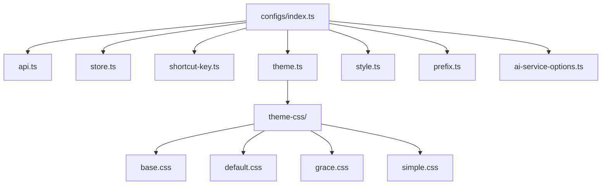
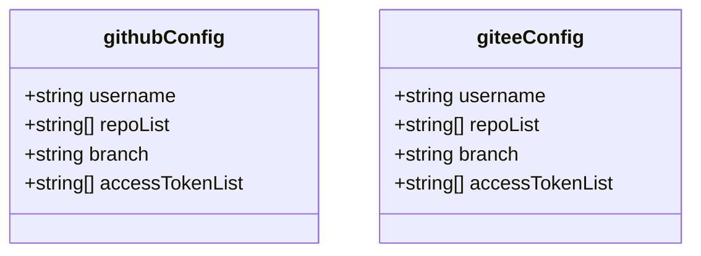
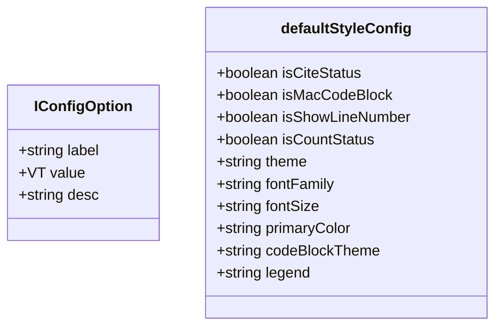
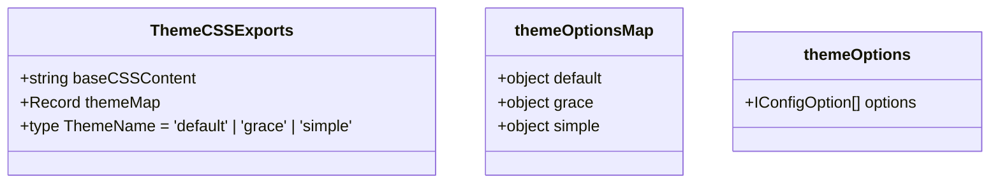

# 配置管理机制

<cite>
**本文档引用的文件**
- [index.ts](file://packages/shared/src/configs/index.ts)
- [api.ts](file://packages/shared/src/configs/api.ts)
- [store.ts](file://packages/shared/src/configs/store.ts)
- [shortcut-key.ts](file://packages/shared/src/configs/shortcut-key.ts)
- [theme.ts](file://packages/shared/src/configs/theme.ts)
- [style.ts](file://packages/shared/src/configs/style.ts)
- [theme-css/index.ts](file://packages/shared/src/configs/theme-css/index.ts)
- [theme-css/default.css](file://packages/shared/src/configs/theme-css/default.css)
- [theme-css/grace.css](file://packages/shared/src/configs/theme-css/grace.css)
- [main.ts](file://apps/web/src/main.ts)
</cite>

## 目录
1. [简介](#简介)
2. [配置体系架构](#配置体系架构)
3. [统一配置入口设计](#统一配置入口设计)
4. [核心配置模块分析](#核心配置模块分析)
5. [主题CSS预设机制](#主题css预设机制)
6. [配置分层与环境适配](#配置分层与环境适配)
7. [初始化与复用实践](#初始化与复用实践)
8. [结论](#结论)

## 简介
本项目通过@md/shared包构建了一套完整的配置管理体系，实现了API端点、存储键名、快捷键映射和主题样式的统一管理。该体系采用模块化设计，通过index.ts作为统一入口导出所有配置，支持在Web应用初始化和CLI参数解析中的复用。配置系统结合CSS预设模板和环境适配策略，提供了灵活的主题切换和样式定制能力。

## 配置体系架构

**图示来源**
- [index.ts](file://packages/shared/src/configs/index.ts)
- [api.ts](file://packages/shared/src/configs/api.ts)
- [store.ts](file://packages/shared/src/configs/store.ts)
- [shortcut-key.ts](file://packages/shared/src/configs/shortcut-key.ts)
- [theme.ts](file://packages/shared/src/configs/theme.ts)
- [style.ts](file://packages/shared/src/configs/style.ts)
- [theme-css/index.ts](file://packages/shared/src/configs/theme-css/index.ts)

## 统一配置入口设计
`@md/shared/src/configs/index.ts`文件作为配置系统的统一入口，采用ES6模块的重新导出语法，将各个独立的配置模块聚合在一起。这种设计模式实现了配置的集中管理和按需导入，开发者可以通过单一入口访问所有配置项，同时也支持细粒度的模块化导入。

该入口文件导出了API配置、存储键名、快捷键映射、前缀设置、样式选项和主题配置等核心模块，形成了一个完整的配置生态系统。通过这种设计，项目实现了配置的解耦和复用，不同模块可以独立维护各自的配置，同时又能通过统一的接口对外提供服务。

**本节来源**
- [index.ts](file://packages/shared/src/configs/index.ts)

## 核心配置模块分析

### API端点配置
API配置模块定义了GitHub和Gitee平台的访问参数，包括用户名、仓库列表、分支名称和访问令牌列表。这些配置采用了硬编码的方式存储多个访问令牌，实现了请求的轮询机制，有效避免了单个令牌的速率限制问题。配置结构清晰，便于扩展和维护。

**图示来源**
- [api.ts](file://packages/shared/src/configs/api.ts)

### 存储键名配置
存储键名配置模块通过`storeLabels`对象定义了应用状态的中文标签映射，涵盖了深色模式、编辑布局、代码块样式、主题设置等核心功能的状态标识。这种设计不仅提高了代码的可读性，还为国际化支持奠定了基础。每个键值对都提供了清晰的中文描述，便于开发者理解和维护。

**本节来源**
- [store.ts](file://packages/shared/src/configs/store.ts)

### 快捷键映射配置
快捷键配置模块根据用户代理字符串判断操作系统类型，动态设置控制键、选项键和移位键的符号表示。通过`ctrlKey`、`altKey`、`shiftKey`常量定义功能键，使用`ctrlSign`、`altSign`、`shiftSign`提供视觉符号，实现了跨平台的快捷键一致性体验。这种设计确保了在Mac和Windows系统上都能显示正确的快捷键符号。

**本节来源**
- [shortcut-key.ts](file://packages/shared/src/configs/shortcut-key.ts)

### 样式选项配置
样式配置模块定义了字体、字号、主题色、代码块主题和图注格式等多种UI选项。每个选项都包含标签、值和描述三个属性，形成了标准化的配置选项结构。通过`IConfigOption`泛型接口，确保了配置项结构的一致性。模块还提供了默认样式配置对象，包含了初始状态的所有样式设置。

**图示来源**
- [style.ts](file://packages/shared/src/configs/style.ts)
- [common.ts](file://packages/shared/src/types/common.ts)

## 主题CSS预设机制

### 主题预设文件结构
主题CSS预设位于`theme-css`目录下，包含基础样式文件`base.css`和多个主题样式文件（`default.css`、`grace.css`、`simple.css`）。每个CSS文件都定义了完整的Markdown渲染样式，使用CSS自定义属性（如`--md-primary-color`）实现主题色的动态替换。这种设计使得主题切换只需更改CSS变量值，无需修改具体样式规则。

**本节来源**
- [theme-css/index.ts](file://packages/shared/src/configs/theme-css/index.ts)
- [theme-css/default.css](file://packages/shared/src/configs/theme-css/default.css)
- [theme-css/grace.css](file://packages/shared/src/configs/theme-css/grace.css)

### 主题映射与注入
主题配置通过`themeMap`常量对象建立主题名称与CSS内容的映射关系，使用Vite的`?raw`导入插件将CSS文件作为字符串导入。`baseCSSContent`导出基础样式，`themeMap`导出主题样式映射，`ThemeName`类型定义了可用的主题名称联合类型。这种设计实现了CSS资源的JavaScript化，便于在运行时动态注入和切换主题。

**图示来源**
- [theme.ts](file://packages/shared/src/configs/theme.ts)
- [theme-css/index.ts](file://packages/shared/src/configs/theme-css/index.ts)

## 配置分层与环境适配
配置系统采用了分层设计策略，将基础配置与环境特定配置分离。通过`@md/shared`包提供的统一接口，不同环境（Web、CLI、uTools插件）可以共享核心配置，同时根据具体需求进行适配。环境适配通过条件判断和动态导入实现，确保了配置的一致性和灵活性。

在Web环境中，配置通过Pinia状态管理集成，在CLI环境中可通过命令行参数覆盖默认配置。这种分层策略既保证了配置的统一性，又提供了足够的灵活性来满足不同场景的需求。配置的环境适配还考虑了操作系统差异，如快捷键符号的自动识别和显示。

**本节来源**
- [main.ts](file://apps/web/src/main.ts)
- [index.ts](file://packages/shared/src/index.ts)

## 初始化与复用实践
在Web应用初始化过程中，配置系统通过`main.ts`文件被引入，与Vue应用实例和Pinia状态管理集成。主题样式通过动态CSS注入机制应用，确保了样式的及时更新和热重载支持。配置的复用不仅体现在Web应用中，还可通过相同的接口在CLI工具中使用，实现了跨平台的一致性体验。

配置的复用机制基于模块化设计，通过npm包的形式发布`@md/shared`，其他项目可以轻松引入并使用这些配置。这种设计降低了重复配置的成本，提高了开发效率。同时，配置的类型定义确保了类型安全，减少了配置错误的可能性。

**本节来源**
- [main.ts](file://apps/web/src/main.ts)
- [index.ts](file://packages/shared/src/index.ts)

## 结论
@md/shared包的配置管理体系通过模块化设计和统一入口模式，成功实现了配置的集中管理与灵活复用。系统采用分层架构，将API端点、存储键名、快捷键映射和主题样式等不同类型的配置有机整合，同时保持了各模块的独立性。主题CSS预设机制通过`?raw`导入和动态注入，实现了高效的主题切换和样式定制。该配置体系不仅满足了当前项目的需求，还具备良好的扩展性和复用性，为未来功能的演进提供了坚实的基础。