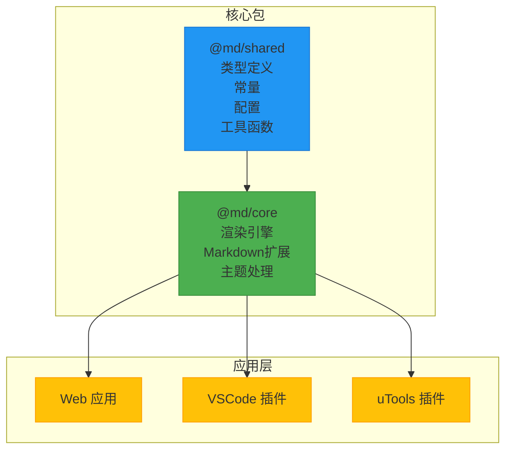
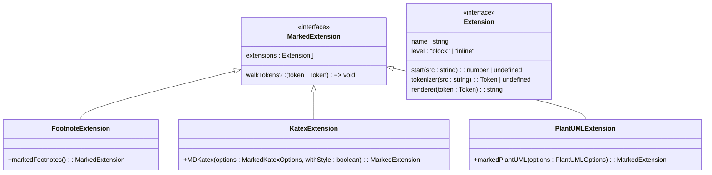
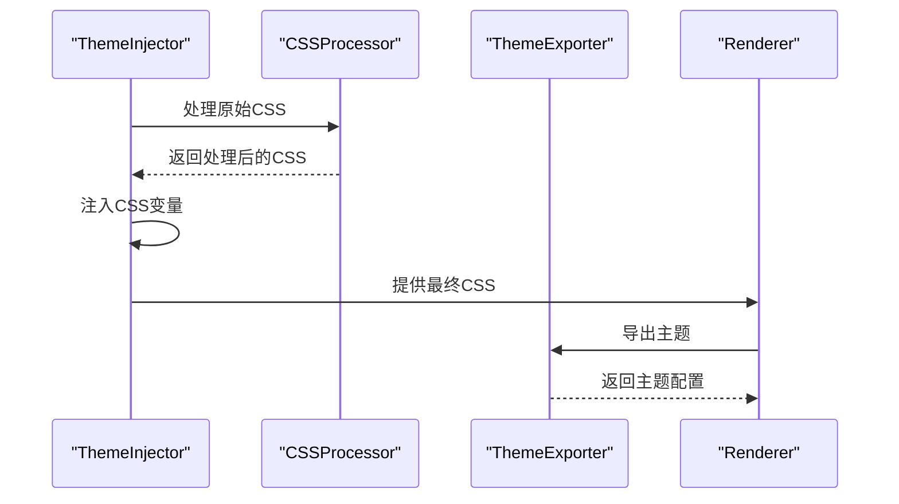
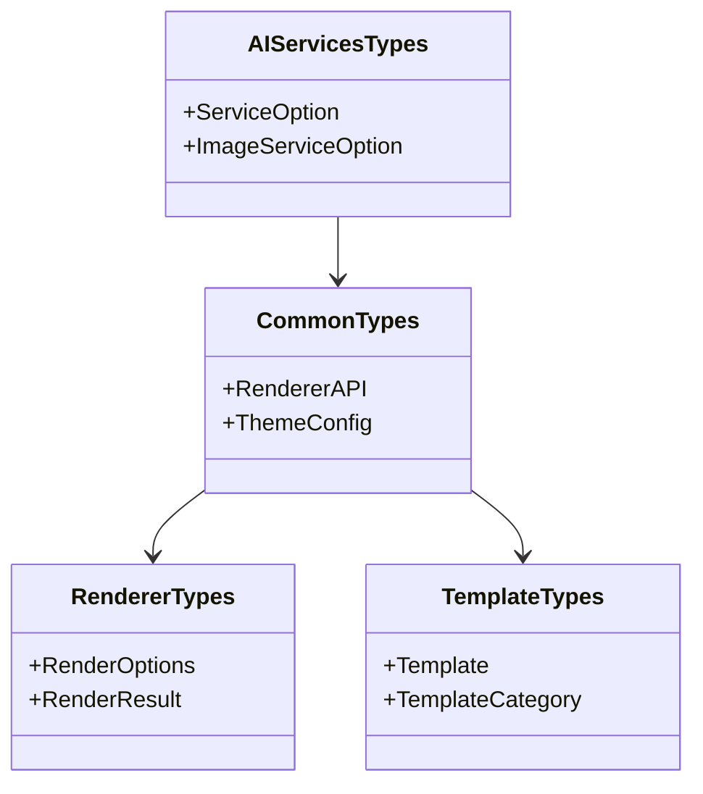
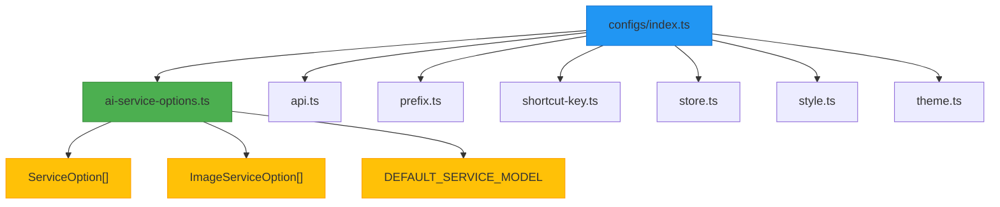
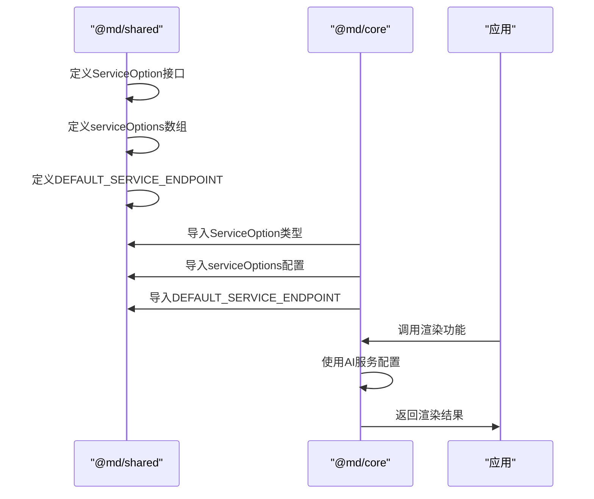
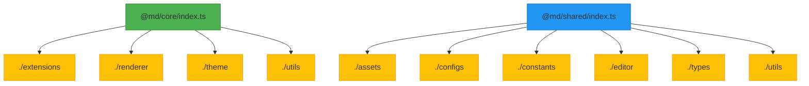
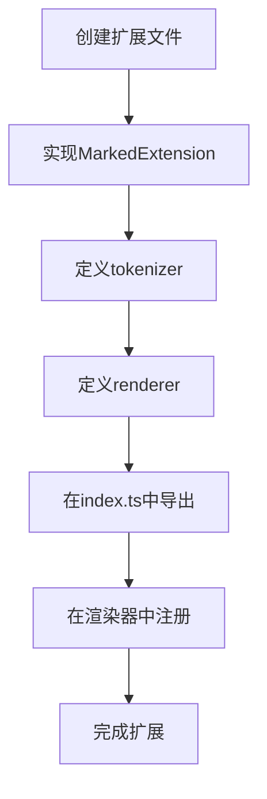

# 核心包解析

<cite>
**本文档中引用的文件**  
- [index.ts](file://packages/core/src/index.ts)
- [package.json](file://packages/core/package.json)
- [tsconfig.json](file://packages/core/tsconfig.json)
- [footnotes.ts](file://packages/core/src/extensions/footnotes.ts)
- [katex.ts](file://packages/core/src/extensions/katex.ts)
- [plantuml.ts](file://packages/core/src/extensions/plantuml.ts)
- [renderer-impl.ts](file://packages/core/src/renderer/renderer-impl.ts)
- [themeInjector.ts](file://packages/core/src/theme/themeInjector.ts)
- [cssVariables.ts](file://packages/core/src/theme/cssVariables.ts)
- [shared/index.ts](file://packages/shared/src/index.ts)
- [shared/package.json](file://packages/shared/package.json)
- [shared/tsconfig.json](file://packages/shared/tsconfig.json)
- [shared/configs/ai-service-options.ts](file://packages/shared/src/configs/ai-service-options.ts)
- [shared/types/ai-services-types.ts](file://packages/shared/src/types/ai-services-types.ts)
- [shared/constants/ai-config.ts](file://packages/shared/src/constants/ai-config.ts)
</cite>

## 目录
1. [项目结构](#项目结构)
2. [@md/core 包职责分析](#mdcore-包职责分析)
3. [@md/shared 包共享内容解析](#mdshared-包共享内容解析)
4. [核心协作模式](#核心协作模式)
5. [包导出结构与类型安全](#包导出结构与类型安全)
6. [扩展核心功能指导](#扩展核心功能指导)

## 项目结构

该项目采用多包（monorepo）架构，核心功能由 `@md/core` 和 `@md/shared` 两个包构成。`@md/core` 负责 Markdown 渲染、扩展功能和主题处理，而 `@md/shared` 提供跨包共享的类型、配置和工具函数。这种分离设计实现了功能解耦和代码复用。



**Diagram sources**
- [packages/core/package.json](file://packages/core/package.json)
- [packages/shared/package.json](file://packages/shared/package.json)

**Section sources**
- [packages/core/package.json](file://packages/core/package.json)
- [packages/shared/package.json](file://packages/shared/package.json)

## @md/core 包职责分析

`@md/core` 是项目的核心渲染引擎，主要职责包括实现 Markdown 扩展、主题处理和渲染流程。

### Markdown 扩展实现

`@md/core` 通过 `marked` 库的扩展机制，实现了多种 Markdown 语法扩展。这些扩展位于 `src/extensions` 目录下，通过 `index.ts` 统一导出。



**Diagram sources**
- [packages/core/src/extensions/footnotes.ts](file://packages/core/src/extensions/footnotes.ts)
- [packages/core/src/extensions/katex.ts](file://packages/core/src/extensions/katex.ts)
- [packages/core/src/extensions/plantuml.ts](file://packages/core/src/extensions/plantuml.ts)

**Section sources**
- [packages/core/src/extensions/index.ts](file://packages/core/src/extensions/index.ts)
- [packages/core/src/extensions/footnotes.ts](file://packages/core/src/extensions/footnotes.ts)
- [packages/core/src/extensions/katex.ts](file://packages/core/src/extensions/katex.ts)
- [packages/core/src/extensions/plantuml.ts](file://packages/core/src/extensions/plantuml.ts)

#### 脚注扩展
脚注扩展实现了 `[^1]` 和 `[^1]: ...` 语法，通过自定义 tokenizer 和 renderer 将 Markdown 脚注转换为 HTML。它使用一个 Map 来存储脚注定义，并在渲染时生成对应的上标链接和脚注内容。

#### LaTeX 数学公式扩展
LaTeX 扩展支持 `$...$`、`$$...$$`、`\(...\)` 和 `\[...\]` 四种数学公式语法。它通过 `MathJax` 库将 LaTeX 代码渲染为 SVG，并添加了 `katex-inline` 和 `katex-block` CSS 类以便样式定制。

#### 流程图扩展
流程图扩展支持 ```plantuml 代码块，通过 PlantUML 服务器将文本描述转换为 SVG 或 PNG 图像。它实现了完整的编码流程：UTF-8 编码 → Deflate 压缩 → PlantUML Base64 编码，并支持内嵌 SVG 内容以适应微信公众号等环境。

### 主题处理系统

`@md/core` 的主题系统位于 `src/theme` 目录，提供 CSS 变量注入、主题导出和应用功能。



**Diagram sources**
- [packages/core/src/theme/themeInjector.ts](file://packages/core/src/theme/themeInjector.ts)
- [packages/core/src/theme/cssProcessor.ts](file://packages/core/src/theme/cssProcessor.ts)
- [packages/core/src/theme/themeExporter.ts](file://packages/core/src/theme/themeExporter.ts)

**Section sources**
- [packages/core/src/theme/index.ts](file://packages/core/src/theme/index.ts)
- [packages/core/src/theme/cssVariables.ts](file://packages/core/src/theme/cssVariables.ts)
- [packages/core/src/theme/themeInjector.ts](file://packages/core/src/theme/themeInjector.ts)

主题系统通过 `cssVariables.ts` 定义主题变量，`themeInjector.ts` 负责将变量注入到 CSS 中，`themeExporter.ts` 提供主题导出功能。系统支持动态主题切换和自定义主题配置。

### 渲染引擎实现

渲染引擎基于 `marked` 库构建，位于 `src/renderer` 目录。`renderer-impl.ts` 实现了核心渲染逻辑，整合了所有扩展和主题处理。

**Section sources**
- [packages/core/src/renderer/index.ts](file://packages/core/src/renderer/index.ts)
- [packages/core/src/renderer/renderer-impl.ts](file://packages/core/src/renderer/renderer-impl.ts)

## @md/shared 包共享内容解析

`@md/shared` 包提供跨模块共享的基础内容，包括类型定义、常量、配置和工具函数。

### 类型定义

`src/types` 目录包含项目中使用的共享类型，通过 `index.ts` 统一导出。



**Diagram sources**
- [packages/shared/src/types/index.ts](file://packages/shared/src/types/index.ts)
- [packages/shared/src/types/ai-services-types.ts](file://packages/shared/src/types/ai-services-types.ts)

**Section sources**
- [packages/shared/src/types/index.ts](file://packages/shared/src/types/index.ts)
- [packages/shared/src/types/ai-services-types.ts](file://packages/shared/src/types/ai-services-types.ts)

### 常量定义

`src/constants` 目录定义了项目中的全局常量，如 AI 服务的默认配置。

**Section sources**
- [packages/shared/src/constants/index.ts](file://packages/shared/src/constants/index.ts)
- [packages/shared/src/constants/ai-config.ts](file://packages/shared/src/constants/ai-config.ts)

### 编辑器配置

`src/editor` 目录包含 CodeMirror 编辑器的配置，如基本设置、CSS 支持、Markdown 支持等。

**Section sources**
- [packages/shared/src/editor/index.ts](file://packages/shared/src/editor/index.ts)

### 工具函数

`src/utils` 目录提供通用工具函数，如基本帮助函数、文件操作帮助函数和 token 工具。

**Section sources**
- [packages/shared/src/utils/index.ts](file://packages/shared/src/utils/index.ts)

### 配置选项

`src/configs` 目录包含各种配置选项，是 `@md/shared` 包的核心内容之一。



**Diagram sources**
- [packages/shared/src/configs/index.ts](file://packages/shared/src/configs/index.ts)
- [packages/shared/src/configs/ai-service-options.ts](file://packages/shared/src/configs/ai-service-options.ts)

**Section sources**
- [packages/shared/src/configs/index.ts](file://packages/shared/src/configs/index.ts)
- [packages/shared/src/configs/ai-service-options.ts](file://packages/shared/src/configs/ai-service-options.ts)

## 核心协作模式

`@md/core` 和 `@md/shared` 通过明确的依赖关系和接口定义进行协作。`@md/core` 依赖 `@md/shared` 提供的类型、配置和常量，实现功能扩展。

### AI 服务配置协作

`@md/shared` 提供 AI 服务配置选项，`@md/core` 在需要时使用这些配置。



**Diagram sources**
- [packages/shared/src/types/ai-services-types.ts](file://packages/shared/src/types/ai-services-types.ts)
- [packages/shared/src/configs/ai-service-options.ts](file://packages/shared/src/configs/ai-service-options.ts)
- [packages/shared/src/constants/ai-config.ts](file://packages/shared/src/constants/ai-config.ts)

**Section sources**
- [packages/shared/src/configs/ai-service-options.ts](file://packages/shared/src/configs/ai-service-options.ts)
- [packages/shared/src/types/ai-services-types.ts](file://packages/shared/src/types/ai-services-types.ts)
- [packages/shared/src/constants/ai-config.ts](file://packages/shared/src/constants/ai-config.ts)

`@md/shared` 在 `ai-services-types.ts` 中定义了 `ServiceOption` 和 `ImageServiceOption` 接口，在 `ai-service-options.ts` 中提供了具体的 AI 服务配置数组，包括内置服务、DeepSeek、OpenAI、通义千问等多种服务选项。`@md/core` 通过导入这些配置，在渲染过程中使用相应的 AI 服务。

## 包导出结构与类型安全

两个包都采用了精心设计的导出结构和类型安全机制。

### 导出结构（index.ts 聚合模式）

两个包都使用 `index.ts` 文件作为主要导出入口，采用聚合模式组织导出。



**Diagram sources**
- [packages/core/src/index.ts](file://packages/core/src/index.ts)
- [packages/shared/src/index.ts](file://packages/shared/src/index.ts)

**Section sources**
- [packages/core/src/index.ts](file://packages/core/src/index.ts)
- [packages/shared/src/index.ts](file://packages/shared/src/index.ts)

这种聚合模式使得使用者可以通过单一入口导入所需功能，提高了 API 的可用性。

### 类型安全保证（tsconfig.json 配置）

两个包都通过 `tsconfig.json` 配置确保类型安全。

**Section sources**
- [packages/core/tsconfig.json](file://packages/core/tsconfig.json)
- [packages/shared/tsconfig.json](file://packages/shared/tsconfig.json)

`@md/core` 的 `tsconfig.json` 配置了路径映射 `"@/*": ["./src/*"]`，允许使用绝对路径导入。两个包都继承了 `@md/config/tsconfig.base.json` 基础配置，确保了类型检查的一致性。`@md/shared` 作为类型提供者，其类型定义被 `@md/core` 和其他应用模块广泛引用，形成了类型安全的开发环境。

## 扩展核心功能指导

要扩展 `@md/core` 的功能，可以遵循以下步骤添加新的 Markdown 扩展处理器。

### 添加新的 Markdown 扩展处理器

1. 在 `packages/core/src/extensions/` 目录下创建新的扩展文件，如 `my-extension.ts`
2. 实现 `MarkedExtension` 接口，定义 tokenizer 和 renderer
3. 在 `extensions/index.ts` 中导出新扩展
4. 在渲染器中注册新扩展



**Diagram sources**
- [packages/core/src/extensions/index.ts](file://packages/core/src/extensions/index.ts)

**Section sources**
- [packages/core/src/extensions/index.ts](file://packages/core/src/extensions/index.ts)

具体实现时，需要参考现有扩展（如 `footnotes.ts`）的模式，确保新的扩展处理器符合 `marked` 库的扩展规范。通过这种方式，可以轻松地为编辑器添加自定义的 Markdown 语法支持。