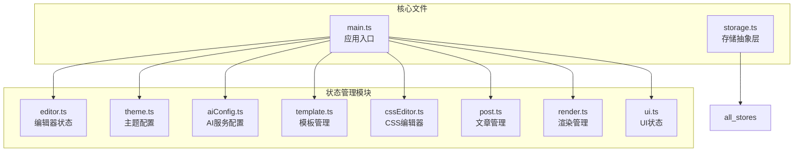
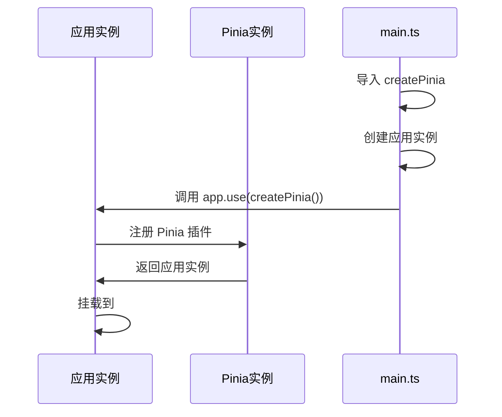
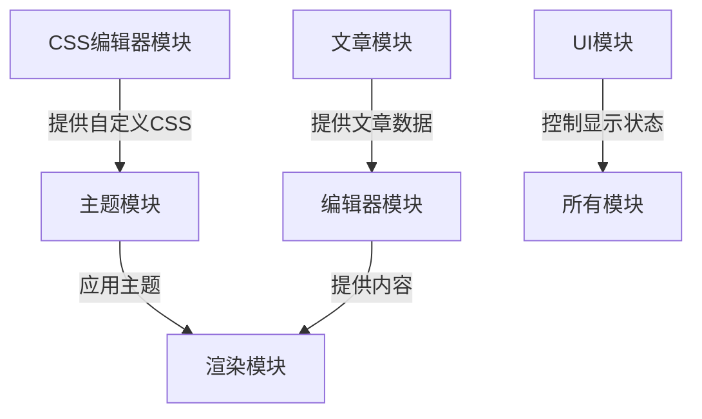
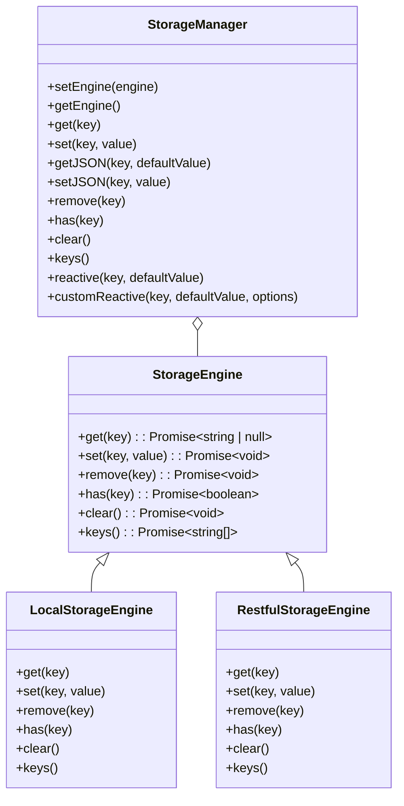

# 状态管理机制

<cite>
**本文档引用的文件**  
- [main.ts](file://apps/web/src/main.ts)
- [editor.ts](file://apps/web/src/stores/editor.ts)
- [theme.ts](file://apps/web/src/stores/theme.ts)
- [aiConfig.ts](file://apps/web/src/stores/aiConfig.ts)
- [template.ts](file://apps/web/src/stores/template.ts)
- [cssEditor.ts](file://apps/web/src/stores/cssEditor.ts)
- [post.ts](file://apps/web/src/stores/post.ts)
- [render.ts](file://apps/web/src/stores/render.ts)
- [ui.ts](file://apps/web/src/stores/ui.ts)
- [storage.ts](file://apps/web/src/utils/storage.ts)
- [CodemirrorEditor.vue](file://apps/web/src/views/CodemirrorEditor.vue)
- [AIAssistantPanel.vue](file://apps/web/src/components/ai/chat-box/AIAssistantPanel.vue)
- [ToolBoxPopover.vue](file://apps/web/src/components/ai/tool-box/ToolBoxPopover.vue)
- [EditorStateDialog.vue](file://apps/web/src/components/editor/EditorStateDialog.vue)
</cite>

## 目录
1. [项目结构](#项目结构)
2. [核心状态模块分析](#核心状态模块分析)
3. [状态管理注册与初始化](#状态管理注册与初始化)
4. [状态模块使用模式](#状态模块使用模式)
5. [跨模块调用实践](#跨模块调用实践)
6. [持久化与状态重置](#持久化与状态重置)
7. [性能优化建议](#性能优化建议)
8. [调试与工具集成](#调试与工具集成)

## 项目结构

根据项目结构分析，状态管理相关的文件主要位于 `apps/web/src/stores` 目录下，采用模块化设计，每个功能模块都有独立的 store 文件。



**图源**  
- [main.ts](file://apps/web/src/main.ts)
- [stores目录](file://apps/web/src/stores/)

## 核心状态模块分析

### 编辑器状态模块 (editor store)

`editor` store 负责管理 CodeMirror 编辑器实例和基础操作，是核心编辑功能的状态中心。

**职责**:
- 管理编辑器实例引用
- 提供内容操作方法（格式化、导入、清空）
- 获取和设置编辑器内容
- 处理文本选择和插入操作

**数据结构**:
- `editor`: EditorView | null - 编辑器实例引用
- `formatContent()`: 格式化文档内容
- `importContent(content)`: 导入文档内容
- `clearContent()`: 清空内容
- `getContent()`: 获取当前内容
- `getSelection()`: 获取选中文本
- `replaceSelection(text)`: 替换选中文本
- `insertAtCursor(text)`: 在光标处插入文本

**模块特点**:
- 专注于编辑器实例的生命周期管理
- 提供原子化的编辑操作
- 不直接管理内容数据，而是通过编辑器实例操作

**本节来源**  
- [editor.ts](file://apps/web/src/stores/editor.ts)

### 主题状态模块 (theme store)

`theme` store 负责管理所有与主题、字体、颜色相关的配置，实现主题的动态切换和样式应用。

**职责**:
- 管理文本主题、字体、大小等样式配置
- 处理代码块主题切换
- 管理段落格式选项（首行缩进、两端对齐）
- 应用主题到渲染系统
- 更新代码高亮主题

**数据结构**:
- `theme`: 当前文本主题
- `fontFamily`: 文本字体
- `fontSize`: 文本大小
- `primaryColor`: 主色
- `codeBlockTheme`: 代码块主题
- `legend`: 图注格式
- `isMacCodeBlock`: 是否开启 Mac 代码块样式
- `isShowLineNumber`: 是否显示代码行号
- `isCiteStatus`: 是否开启外链引用
- `isCountStatus`: 是否统计字数和阅读时间
- `isUseIndent`: 是否开启首行缩进
- `isUseJustify`: 是否开启两端对齐
- `previewWidth`: 预览宽度

**核心方法**:
- `resetStyle()`: 重置所有样式到默认值
- `updateCodeTheme()`: 更新代码高亮主题
- `applyCurrentTheme()`: 应用当前主题配置（通过CSS注入）

**模块特点**:
- 使用响应式存储实现配置持久化
- 提供 toggle 方法简化布尔值状态切换
- 通过动态导入避免循环依赖
- 使用 CSS 注入而非内联样式实现主题应用

**本节来源**  
- [theme.ts](file://apps/web/src/stores/theme.ts)

### AI配置模块 (aiConfig store)

`aiConfig` store 负责管理 AI 服务的配置，包括服务类型、模型、温度等参数。

**职责**:
- 管理 AI 服务类型和端点
- 配置模型参数（温度、最大token数）
- 管理 API Key
- 处理服务类型切换时的配置同步

**数据结构**:
- `type`: 服务类型
- `temperature`: 温度参数（控制随机性）
- `maxToken`: 最大 token 数
- `endpoint`: 服务端点
- `model`: 模型名称
- `apiKey`: API Key（按服务类型分别持久化）

**核心方法**:
- `reset()`: 重置所有配置到默认值

**模块特点**:
- 使用 `customRef` 实现异步初始化的响应式 API Key
- 通过 `watch` 监听服务类型变化，自动同步端点和模型
- 实现服务相关数据的按类型持久化存储
- 提供重置功能清理所有服务相关的持久化数据

**本节来源**  
- [aiConfig.ts](file://apps/web/src/stores/aiConfig.ts)

### 模板管理模块 (template store)

`template` store 负责管理 Markdown 模板的增删改查操作。

**职责**:
- 管理模板列表的持久化存储
- 提供模板的创建、更新、删除功能
- 支持模板搜索和批量操作
- 实现模板的导入导出功能

**数据结构**:
- `templates`: 模板列表（持久化到 localStorage）
- `sortedTemplates`: 按创建时间倒序排列的模板列表（计算属性）
- `templateCount`: 模板总数（计算属性）

**核心方法**:
- `createTemplate(params)`: 创建新模板
- `getTemplateById(id)`: 根据 ID 获取模板
- `updateTemplate(id, params)`: 更新模板
- `deleteTemplate(id)`: 删除模板
- `searchTemplates(keyword)`: 搜索模板
- `deleteTemplates(ids)`: 批量删除模板
- `clearAllTemplates()`: 清空所有模板
- `exportTemplates()`: 导出所有模板为 JSON
- `importTemplates(jsonData)`: 从 JSON 导入模板

**模块特点**:
- 使用 UUID 作为模板唯一标识
- 实现模板数据的自动持久化
- 提供完整的 CRUD 操作接口
- 支持模板的导入导出和批量操作
- 在导入时处理 ID 冲突（生成新 ID）

**本节来源**  
- [template.ts](file://apps/web/src/stores/template.ts)

## 状态管理注册与初始化

### 全局挂载流程

状态管理通过 Pinia 实现，初始化流程在 `main.ts` 中完成，遵循 Vue 3 的插件注册模式。



**关键代码**:
```typescript
// apps/web/src/main.ts
const app = createApp(App)
app.use(createPinia()) // 全局挂载 Pinia
app.mount(`#app`)
```

**初始化特点**:
- 在应用创建后立即注册 Pinia 插件
- 使用 `createPinia()` 创建 Pinia 实例
- 通过 `app.use()` 方法全局挂载
- 挂载顺序在其他插件之后，确保状态管理可用

**本节来源**  
- [main.ts](file://apps/web/src/main.ts)

### 模块注册机制

各 store 模块通过 `defineStore` 函数定义，采用组合式 API 风格，返回包含 state、getters 和 actions 的对象。

**注册模式**:
- 每个 store 文件导出一个 `useXxxStore` 函数
- 使用字符串 ID 作为 store 标识符
- 返回包含响应式状态和操作方法的对象
- 支持 TypeScript 类型推断

**模块间依赖**:
- 通过动态导入（`await import`）避免循环依赖
- 在需要时按需加载其他 store
- 保持模块间的松耦合

**本节来源**  
- [main.ts](file://apps/web/src/main.ts)
- [stores目录](file://apps/web/src/stores/)

## 状态模块使用模式

### State 定义

状态定义采用响应式引用（ref）和响应式对象（reactive），结合持久化存储。

**基本模式**:
```typescript
// 响应式引用
const editor = ref<EditorView | null>(null)

// 响应式对象（持久化）
const theme = store.reactive<ThemeName>(addPrefix(`theme`), defaultStyleConfig.theme)
```

**持久化策略**:
- 使用自定义的 `store.reactive` 方法实现自动持久化
- 通过键前缀避免命名冲突
- 支持默认值初始化
- 异步加载初始值，确保数据一致性

**本节来源**  
- [theme.ts](file://apps/web/src/stores/theme.ts)
- [post.ts](file://apps/web/src/stores/post.ts)
- [storage.ts](file://apps/web/src/utils/storage.ts)

### Getters 定义

计算属性（getters）用于派生状态，基于现有状态计算新值。

**基本模式**:
```typescript
// 计算属性
const fontSizeNumber = computed(() => Number(fontSize.value.replace(`px`, ``)))

// 派生列表
const sortedTemplates = computed(() => {
  return [...templates.value].sort((a, b) => b.createdAt - a.createdAt)
})
```

**使用场景**:
- 格式化数据（如单位转换）
- 排序和过滤列表
- 组合多个状态值
- 性能优化（缓存计算结果）

**本节来源**  
- [theme.ts](file://apps/web/src/stores/theme.ts)
- [template.ts](file://apps/web/src/stores/template.ts)

### Actions 定义

Actions 是状态变更的唯一途径，封装了业务逻辑和副作用。

**基本模式**:
```typescript
// 同步操作
function createTemplate(params: CreateTemplateParams): Template {
  const newTemplate: Template = { /* ... */ }
  templates.value.push(newTemplate)
  return newTemplate
}

// 异步操作
async function reset() {
  type.value = DEFAULT_SERVICE_TYPE
  temperature.value = DEFAULT_SERVICE_TEMPERATURE
  // ...
}
```

**最佳实践**:
- 命名清晰，反映操作意图
- 返回有意义的值（如操作结果）
- 处理错误和边界情况
- 保持单一职责
- 适当使用事务性操作

**本节来源**  
- [template.ts](file://apps/web/src/stores/template.ts)
- [aiConfig.ts](file://apps/web/src/stores/aiConfig.ts)

## 跨模块调用实践

### 模块间协作模式

不同 store 模块之间通过明确的依赖关系和调用模式进行协作。

**典型协作场景**:



**具体示例**:

1. **主题应用流程**:
   - `theme` store 调用 `cssEditor` store 获取当前 CSS 内容
   - 结合主题变量调用核心模块的 `applyTheme` 方法
   - 触发渲染更新

2. **渲染流程**:
   - `render` store 从 `theme` store 获取样式配置
   - 从 `editor` store 获取内容
   - 执行渲染并更新输出

**本节来源**  
- [theme.ts](file://apps/web/src/stores/theme.ts)
- [render.ts](file://apps/web/src/stores/render.ts)
- [CodemirrorEditor.vue](file://apps/web/src/views/CodemirrorEditor.vue)

### 跨模块调用示例

#### 主题与CSS编辑器协作

```typescript
// theme.ts
const applyCurrentTheme = async () => {
  try {
    const { useCssEditorStore } = await import('@/stores/cssEditor')
    const cssEditorStore = useCssEditorStore()
    const customCSS = cssEditorStore.getCurrentTabContent()
    
    await applyTheme({
      themeName: theme.value,
      customCSS,
      variables: { /* ... */ }
    })
  }
  catch (error) {
    console.error(`[applyCurrentTheme] 主题应用失败:`, error)
  }
}
```

**特点**:
- 使用动态导入避免循环依赖
- 明确的职责划分（theme 负责应用，cssEditor 负责提供）
- 错误处理和日志记录

#### UI状态与其他模块协作

```typescript
// CodemirrorEditor.vue
function resetStyle() {
  themeStore.resetStyle()
  cssEditorStore.resetCssConfig()
  themeStore.applyCurrentTheme()
  editorRefresh()
  toast.success(`样式已重置`)
}
```

**特点**:
- UI 模块协调多个状态模块的重置操作
- 保持操作的原子性和一致性
- 提供用户反馈

**本节来源**  
- [theme.ts](file://apps/web/src/stores/theme.ts)
- [CodemirrorEditor.vue](file://apps/web/src/views/CodemirrorEditor.vue)

## 持久化与状态重置

### 持久化策略

项目实现了基于 localStorage 的持久化策略，通过自定义的存储抽象层提供统一接口。

**存储抽象层设计**:



**持久化特点**:
- 完全异步化设计，避免阻塞主线程
- 支持本地存储和 RESTful API 存储
- 提供 `reactive` 方法实现自动持久化的响应式引用
- 错误处理和降级策略
- 类型安全的 JSON 序列化/反序列化

**本节来源**  
- [storage.ts](file://apps/web/src/utils/storage.ts)

### 状态重置机制

各模块提供了状态重置功能，用于恢复到默认配置。

**重置模式**:
- **完全重置**: 恢复所有配置到默认值
- **部分重置**: 重置特定类型的配置
- **数据清理**: 清理持久化存储中的相关数据

**具体实现**:

1. **主题模块重置**:
   ```typescript
   const resetStyle = () => {
     isCiteStatus.value = defaultStyleConfig.isCiteStatus
     isMacCodeBlock.value = defaultStyleConfig.isMacCodeBlock
     // ... 其他配置重置
     theme.value = defaultStyleConfig.theme
     // ... 重置所有状态
   }
   ```

2. **AI配置模块重置**:
   ```typescript
   const reset = async () => {
     type.value = DEFAULT_SERVICE_TYPE
     temperature.value = DEFAULT_SERVICE_TEMPERATURE
     maxToken.value = DEFAULT_SERVICE_MAX_TOKEN
     
     // 清理所有服务相关的持久化数据
     await Promise.all(
       serviceOptions.map(async ({ value }) => {
         await store.remove(`openai_key_${value}`)
         await store.remove(`openai_model_${value}`)
       }),
     )
   }
   ```

3. **模板模块重置**:
   ```typescript
   function clearAllTemplates(): void {
     const count = templates.value.length
     templates.value = []
     toast.success(`已清空所有模板（共 ${count} 个）`)
   }
   ```

**重置最佳实践**:
- 提供明确的用户反馈
- 处理相关联的状态（如主题重置同时重置CSS配置）
- 清理持久化数据避免残留
- 保持操作的原子性

**本节来源**  
- [theme.ts](file://apps/web/src/stores/theme.ts)
- [aiConfig.ts](file://apps/web/src/stores/aiConfig.ts)
- [template.ts](file://apps/web/src/stores/template.ts)

## 性能优化建议

### 模块懒加载

通过动态导入实现模块的按需加载，减少初始包大小。

**实现方式**:
```typescript
// 动态导入避免循环依赖和初始加载
const { useCssEditorStore } = await import('@/stores/cssEditor')
```

**优化效果**:
- 减少初始加载时间
- 避免不必要的内存占用
- 支持更灵活的模块依赖管理

**本节来源**  
- [theme.ts](file://apps/web/src/stores/theme.ts)

### 状态快照

通过 `EditorStateDialog` 组件实现状态快照功能，用于调试和恢复。

**实现机制**:
```typescript
// 获取所有 store 的状态
function getAllStoreStates() {
  return {
    // UI store 的状态
    isDark: uiStore.isDark,
    isEditOnLeft: uiStore.isEditOnLeft,
    // ... 其他状态
  }
}

// 恢复状态
function restoreStates(data: Record<string, any>) {
  for (const [key, value] of Object.entries(data)) {
    if (key === `isDark`)
      uiStore.isDark = value
    else if (key === `theme`)
      themeStore.theme = value
    // ... 其他状态恢复
  }
}
```

**优势**:
- 便于调试和问题复现
- 支持状态的导入导出
- 提供可靠的恢复机制

**本节来源**  
- [EditorStateDialog.vue](file://apps/web/src/components/editor/EditorStateDialog.vue)

### 构建优化

通过 Vite 配置实现代码分割和性能分析。

**构建配置**:
```typescript
// vite.config.ts
manualChunks(id) {
  if (id.includes(`node_modules`)) {
    if (id.includes(`katex`))
      return `katex`
    if (id.includes(`highlight.js`))
      return `hljs`
    if (id.includes(`codemirror`))
      return `codemirror`
    if (id.includes(`prettier`))
      return `prettier`
    // ... 其他依赖分割
  }
}
```

**优化策略**:
- 将大型依赖拆分为独立 chunk
- 按功能模块分割代码
- 支持性能分析（ANALYZE=true 时生成 stats.html）

**本节来源**  
- [vite.config.ts](file://apps/web/vite.config.ts)

## 调试与工具集成

### Vue DevTools 集成

项目集成了 Vue DevTools，提供强大的调试能力。

**配置**:
```typescript
// vite.config.ts
vueDevTools({
  launchEditor: env.VITE_LAUNCH_EDITOR ?? `code`,
}),
```

**功能**:
- 组件树可视化
- 状态检查和修改
- 事件跟踪
- 性能分析
- 直接在编辑器中打开组件

**优势**:
- 提高开发效率
- 便于状态调试
- 支持热重载

**本节来源**  
- [vite.config.ts](file://apps/web/vite.config.ts)

### 状态调试工具

通过 `EditorStateDialog` 组件提供状态调试功能。

**功能特点**:
- 显示所有 store 的当前状态
- 支持状态的序列化和反序列化
- 提供状态恢复功能
- 便于问题复现和调试

**使用场景**:
- 调试复杂的状态交互
- 复现用户报告的问题
- 验证状态变更的正确性

**本节来源**  
- [EditorStateDialog.vue](file://apps/web/src/components/editor/EditorStateDialog.vue)