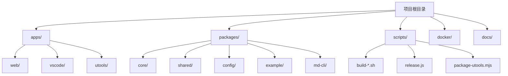
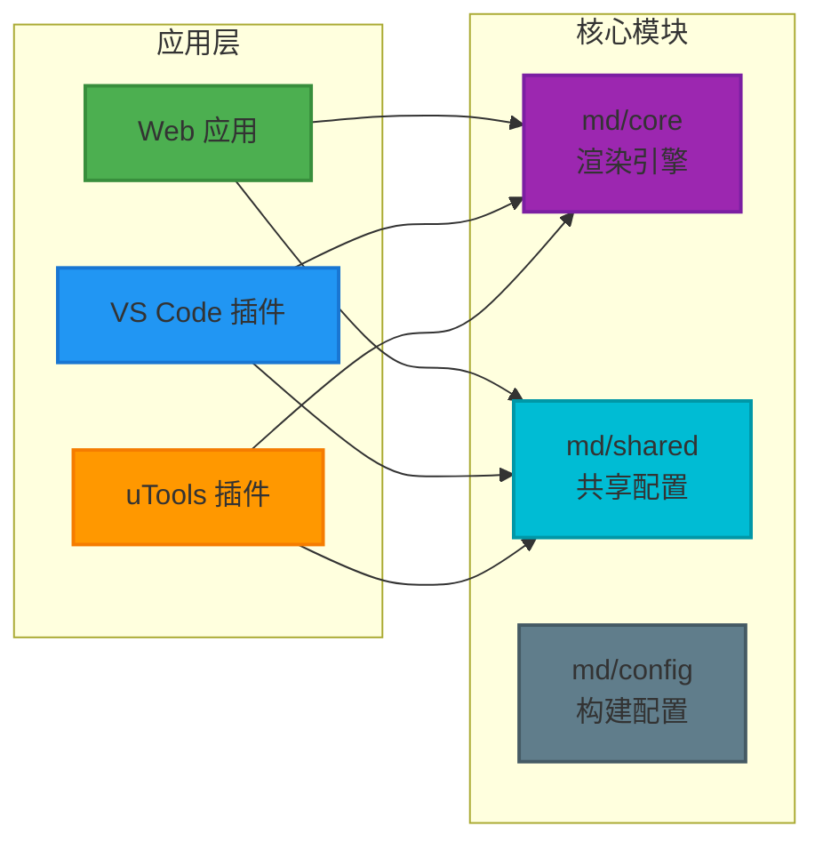
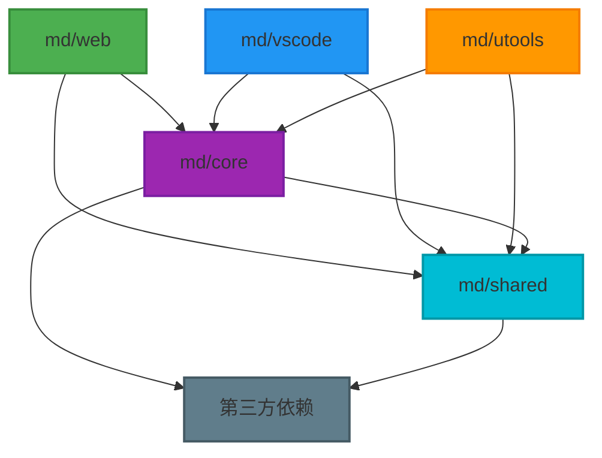
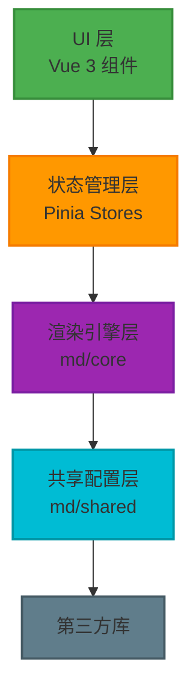
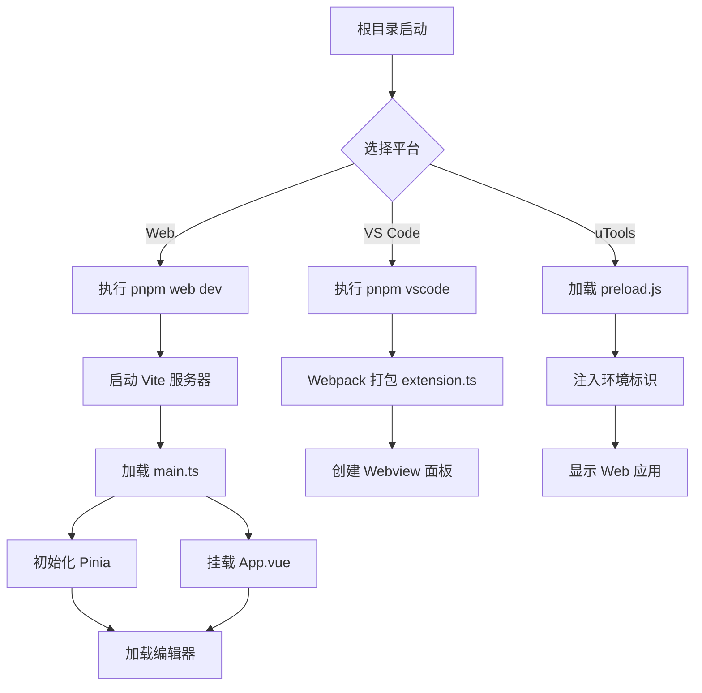
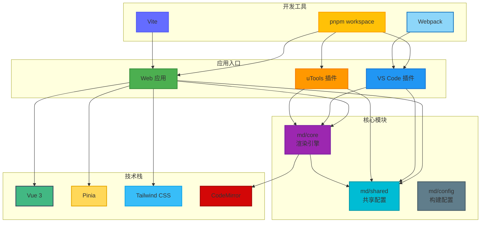

# 项目架构概述

<cite>
**本文档中引用的文件**  
- [package.json](file://package.json)
- [pnpm-workspace.yaml](file://pnpm-workspace.yaml)
- [apps/web/package.json](file://apps/web/package.json)
- [apps/vscode/package.json](file://apps/vscode/package.json)
- [apps/utools/package.json](file://apps/utools/package.json)
- [packages/core/package.json](file://packages/core/package.json)
- [packages/shared/package.json](file://packages/shared/package.json)
- [apps/web/src/main.ts](file://apps/web/src/main.ts)
- [apps/web/src/App.vue](file://apps/web/src/App.vue)
- [packages/core/src/index.ts](file://packages/core/src/index.ts)
- [packages/shared/src/index.ts](file://packages/shared/src/index.ts)
- [apps/vscode/src/extension.ts](file://apps/vscode/src/extension.ts)
- [apps/utools/preload.js](file://apps/utools/preload.js)
- [packages/core/src/renderer/index.ts](file://packages/core/src/renderer/index.ts)
- [packages/core/src/theme/index.ts](file://packages/core/src/theme/index.ts)
- [packages/shared/src/configs/theme.ts](file://packages/shared/src/configs/theme.ts)
- [apps/web/vite.config.ts](file://apps/web/vite.config.ts)
- [apps/vscode/webpack.config.mjs](file://apps/vscode/webpack.config.mjs)
</cite>

## 目录

1. [简介](#简介)
2. [项目结构](#项目结构)
3. [Monorepo 架构设计](#monorepo-架构设计)
4. [核心模块职责划分](#核心模块职责划分)
5. [模块依赖与版本管理](#模块依赖与版本管理)
6. [系统分层结构](#系统分层结构)
7. [启动流程分析](#启动流程分析)
8. [架构图](#架构图)
9. [解耦设计优势](#解耦设计优势)

## 简介

本项目是一个基于 pnpm workspace 的 Monorepo 架构的微信 Markdown 编辑器，支持多平台应用（Web、VS Code、uTools）的统一开发与维护。通过合理的架构设计，实现了核心功能的复用与各平台应用的独立部署，提升了项目的可维护性与扩展性。

**Section sources**
- [package.json](file://package.json)
- [README.md](file://README.md)

## 项目结构

项目采用 Monorepo 结构，主要分为 `apps/` 和 `packages/` 两个核心目录：

- `apps/`：存放各平台应用入口，包括 Web、VS Code 和 uTools 版本
- `packages/`：管理可复用的核心模块，如 `@md/core` 和 `@md/shared`
- 根目录配置 pnpm workspace，统一管理依赖和脚本



**Diagram sources**
- [package.json](file://package.json)
- [pnpm-workspace.yaml](file://pnpm-workspace.yaml)

**Section sources**
- [project_structure](file://project_structure)

## Monorepo 架构设计

本项目采用 pnpm workspace 实现 Monorepo 架构，通过 `pnpm-workspace.yaml` 文件定义工作区范围：

```yaml
packages:
  - apps/*
  - packages/*
```

该配置将 `apps/` 和 `packages/` 下的所有项目纳入统一管理，实现：

- 统一的依赖管理
- 跨包的本地引用
- 共享的构建脚本
- 一致的开发环境

**Section sources**
- [pnpm-workspace.yaml](file://pnpm-workspace.yaml)
- [package.json](file://package.json)

## 核心模块职责划分

### apps/ 目录

`apps/` 目录存放各平台应用的入口，每个子应用独立配置但共享核心逻辑：

- `web/`：Web 版本，基于 Vite + Vue 3 构建
- `vscode/`：VS Code 插件版本，使用 Webpack 打包
- `utools/`：uTools 插件版本，通过 preload.js 注入环境标识

### packages/ 目录

`packages/` 目录管理可复用的核心模块：

- `@md/core`：核心渲染引擎，提供 Markdown 渲染、主题处理等功能
- `@md/shared`：共享配置与工具，包含类型定义、常量、编辑器配置等
- `@md/config`：构建配置共享
- `@doocs/md-cli`：命令行工具包



**Diagram sources**
- [apps/web/package.json](file://apps/web/package.json)
- [apps/vscode/package.json](file://apps/vscode/package.json)
- [apps/utools/package.json](file://apps/utools/package.json)
- [packages/core/package.json](file://packages/core/package.json)
- [packages/shared/package.json](file://packages/shared/package.json)

**Section sources**
- [apps/web/package.json](file://apps/web/package.json)
- [apps/vscode/package.json](file://apps/vscode/package.json)
- [apps/utools/package.json](file://apps/utools/package.json)
- [packages/core/package.json](file://packages/core/package.json)
- [packages/shared/package.json](file://packages/shared/package.json)

## 模块依赖与版本管理

### 本地包引用

通过 `workspace:*` 协议实现本地包的实时引用：

```json
{
  "dependencies": {
    "@md/core": "workspace:*",
    "@md/shared": "workspace:*"
  }
}
```

这种引用方式允许在开发过程中实时同步修改，无需发布到 npm 仓库。

### 依赖关系图



**Diagram sources**
- [apps/web/package.json](file://apps/web/package.json)
- [packages/core/package.json](file://packages/core/package.json)
- [packages/shared/package.json](file://packages/shared/package.json)

**Section sources**
- [apps/web/package.json](file://apps/web/package.json)
- [packages/core/package.json](file://packages/core/package.json)
- [packages/shared/package.json](file://packages/shared/package.json)

## 系统分层结构

项目采用清晰的分层架构设计：

### UI 层（Vue 3 组件）

位于 `apps/web/src/components/`，基于 Vue 3 + Pinia 构建用户界面，使用 Tailwind CSS 进行样式管理。

### 状态管理层（Pinia stores）

位于 `apps/web/src/stores/`，使用 Pinia 管理应用状态，包括编辑器状态、主题配置、AI 设置等。

### 渲染引擎层（@md/core）

核心渲染模块，提供：
- Markdown 渲染 (`renderer-impl.ts`)
- 主题处理 (`themeApplicator.ts`, `cssVariables.ts`)
- 扩展支持 (`extensions/`)
- 工具函数 (`utils/`)

### 共享配置层（@md/shared）

提供跨模块共享的资源：
- 类型定义 (`types/`)
- 常量 (`constants/`)
- 配置选项 (`configs/`)
- 工具函数 (`utils/`)
- 编辑器配置 (`editor/`)



**Diagram sources**
- [apps/web/src/main.ts](file://apps/web/src/main.ts)
- [apps/web/src/App.vue](file://apps/web/src/App.vue)
- [packages/core/src/index.ts](file://packages/core/src/index.ts)
- [packages/shared/src/index.ts](file://packages/shared/src/index.ts)

**Section sources**
- [apps/web/src/main.ts](file://apps/web/src/main.ts)
- [apps/web/src/App.vue](file://apps/web/src/App.vue)
- [packages/core/src/index.ts](file://packages/core/src/index.ts)
- [packages/shared/src/index.ts](file://packages/shared/src/index.ts)

## 启动流程分析

### 项目根目录启动

通过根目录 `package.json` 的 scripts 启动：

```json
{
  "scripts": {
    "start": "pnpm web dev",
    "web": "pnpm --filter @md/web",
    "vscode": "pnpm --prefix ./apps/vscode"
  }
}
```

### Web 应用启动流程

1. 执行 `pnpm web dev`
2. 进入 `apps/web` 目录
3. 执行 `vite --host`
4. 加载 `main.ts` 初始化应用
5. 创建 Vue 应用实例并挂载

### VS Code 插件启动流程

1. 执行 `pnpm vscode`
2. 进入 `apps/vscode` 目录
3. 执行 `webpack` 打包
4. VS Code 加载 `extension.js`
5. 注册命令和视图

### uTools 插件启动流程

1. uTools 加载 `preload.js`
2. 设置环境标识 `__MD_UTOOLS__`
3. 注册插件生命周期回调
4. 加载 Web 应用



**Diagram sources**
- [package.json](file://package.json)
- [apps/web/package.json](file://apps/web/package.json)
- [apps/vscode/package.json](file://apps/vscode/package.json)
- [apps/utools/preload.js](file://apps/utools/preload.js)
- [apps/web/src/main.ts](file://apps/web/src/main.ts)
- [apps/vscode/src/extension.ts](file://apps/vscode/src/extension.ts)

**Section sources**
- [package.json](file://package.json)
- [apps/web/package.json](file://apps/web/package.json)
- [apps/vscode/package.json](file://apps/vscode/package.json)
- [apps/utools/preload.js](file://apps/utools/preload.js)
- [apps/web/src/main.ts](file://apps/web/src/main.ts)
- [apps/vscode/src/extension.ts](file://apps/vscode/src/extension.ts)

## 架构图



**Diagram sources**
- [package.json](file://package.json)
- [pnpm-workspace.yaml](file://pnpm-workspace.yaml)
- [apps/web/package.json](file://apps/web/package.json)
- [apps/vscode/package.json](file://apps/vscode/package.json)
- [packages/core/package.json](file://packages/core/package.json)
- [packages/shared/package.json](file://packages/shared/package.json)

## 解耦设计优势

### 可维护性

- 核心逻辑集中管理，修改一处即可影响所有平台
- 各平台应用独立配置，互不影响
- 类型系统统一，减少类型错误

### 扩展性

- 新增平台只需创建新的 `apps/` 子目录
- 核心功能通过模块化设计易于扩展
- 支持通过插件机制添加新功能

### 开发效率

- 本地包引用实现实时同步
- 共享构建配置减少重复工作
- 统一的代码风格和工具链

### 部署灵活性

- 各平台可独立打包部署
- CLI 工具支持离线使用
- 支持多种部署方式（Netlify、Cloudflare、Docker）

**Section sources**
- [package.json](file://package.json)
- [pnpm-workspace.yaml](file://pnpm-workspace.yaml)
- [apps/web/package.json](file://apps/web/package.json)
- [packages/core/package.json](file://packages/core/package.json)
- [packages/shared/package.json](file://packages/shared/package.json)