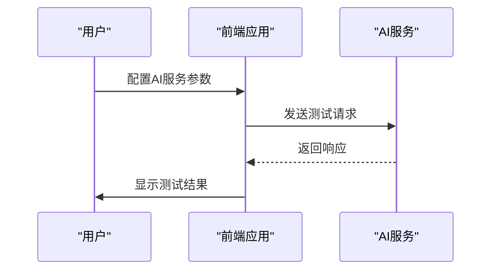
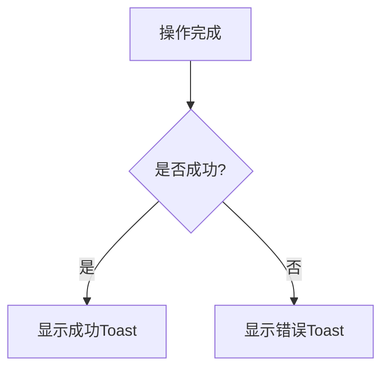

# 故障排除

<cite>
**本文档中引用的文件**  
- [custom-upload.md](file://docs/custom-upload.md)
- [mp-card.md](file://docs/mp-card.md)
- [telegram-usage.md](file://docs/telegram-usage.md)
- [AIConfig.vue](file://apps/web/src/components/ai/chat-box/AIConfig.vue)
- [ToolBoxPopover.vue](file://apps/web/src/components/ai/tool-box/ToolBoxPopover.vue)
- [CustomUploadForm.vue](file://apps/web/src/components/editor/CustomUploadForm.vue)
- [InsertMpCardDialog.vue](file://apps/web/src/components/editor/InsertMpCardDialog.vue)
- [ui.ts](file://apps/web/src/stores/ui.ts)
- [toast/index.ts](file://apps/web/src/utils/toast/index.ts)
- [extension.ts](file://apps/web/src/utils/extension.ts)
- [storage.ts](file://apps/web/src/utils/storage.ts)
</cite>

## 目录
1. [常见问题分类](#常见问题分类)
2. [图片上传失败](#图片上传失败)
3. [微信卡片语法不渲染](#微信卡片语法不渲染)
4. [AI服务连接超时](#ai服务连接超时)
5. [扩展无法加载](#扩展无法加载)
6. [系统错误提示机制](#系统错误提示机制)
7. [已知问题与临时解决方案](#已知问题与临时解决方案)
8. [提交有效的Bug报告](#提交有效的bug报告)
9. [性能问题分析方法](#性能问题分析方法)

## 常见问题分类

本节将常见问题分为几大类，包括图片上传、微信卡片渲染、AI服务连接和扩展加载等。每个问题都提供了详细的诊断步骤和解决方案。

## 图片上传失败

当用户在使用自定义图床功能时遇到图片上传失败的问题，可以按照以下步骤进行排查：

1. **检查自定义上传代码**：确保上传代码正确无误，特别是`okCb`和`errCb`回调函数的使用。
2. **查看浏览器控制台日志**：打开开发者工具，检查是否有JavaScript错误或网络请求失败。
3. **验证配置项正确性**：确认API端点、认证信息等配置项是否正确。
4. **测试网络请求**：使用Postman或其他工具直接测试上传接口，确保服务端正常工作。

**Section sources**
- [custom-upload.md](file://docs/custom-upload.md)
- [CustomUploadForm.vue](file://apps/web/src/components/editor/CustomUploadForm.vue)

## 微信卡片语法不渲染

如果微信公众号名片语法没有正确渲染，可以参考以下步骤：

1. **检查HTML片段**：确保生成的HTML片段符合微信公众号的要求。
2. **验证公众号ID**：确认输入的公众号ID（fakeid）是正确的。
3. **查看网络请求**：通过浏览器开发者工具检查插入名片时的网络请求，确保能够成功获取到公众号信息。
4. **查阅文档**：参考[mp-card.md](file://docs/mp-card.md)中的说明，了解如何正确获取和使用公众号ID。

**Section sources**
- [mp-card.md](file://docs/mp-card.md)
- [InsertMpCardDialog.vue](file://apps/web/src/components/editor/InsertMpCardDialog.vue)

## AI服务连接超时

当AI服务连接超时时，可以采取以下措施进行诊断：

1. **检查API端点**：确保API端点URL正确，并且以`/chat/completions`结尾。
2. **验证认证信息**：确认API密钥和授权头设置正确。
3. **查看网络请求**：使用浏览器开发者工具检查网络请求，查看响应状态码和错误信息。
4. **测试连接**：在AI配置界面点击“测试连接”按钮，根据返回结果判断问题所在。

**Diagram sources**
- [AIConfig.vue](file://apps/web/src/components/ai/chat-box/AIConfig.vue)

**Section sources**
- [AIConfig.vue](file://apps/web/src/components/ai/chat-box/AIConfig.vue)
- [ToolBoxPopover.vue](file://apps/web/src/components/ai/tool-box/ToolBoxPopover.vue)

## 扩展无法加载

当扩展无法加载时，可以尝试以下步骤：

1. **检查依赖项**：确保所有必要的依赖项都已正确安装。
2. **查看控制台日志**：检查浏览器控制台是否有错误信息。
3. **验证配置文件**：确认`plugin.json`等配置文件内容正确。
4. **重新安装扩展**：尝试卸载并重新安装扩展。

**Section sources**
- [extension.ts](file://apps/web/src/utils/extension.ts)

## 系统错误提示机制

系统内置了多种错误提示机制，帮助用户及时发现和解决问题。

### Toast通知

Toast通知用于显示简短的操作反馈信息。触发条件包括：
- 保存配置成功
- 插入内容成功
- 清空内容成功

**Diagram sources**
- [toast/index.ts](file://apps/web/src/utils/toast/index.ts)

### UI Store中的错误状态管理

UI Store负责管理全局UI状态，包括错误状态。通过`useUIStore`可以访问和更新这些状态。

**Section sources**
- [ui.ts](file://apps/web/src/stores/ui.ts)
- [toast/index.ts](file://apps/web/src/utils/toast/index.ts)

## 已知问题与临时解决方案

以下是一些已知问题及其临时解决方案：

1. **本地存储限制**：某些浏览器对localStorage有大小限制，可能导致数据丢失。建议定期导出重要数据。
2. **跨域问题**：在某些情况下，跨域请求可能被阻止。可以通过配置CORS或使用代理服务器解决。
3. **性能瓶颈**：处理大量Markdown内容时可能出现性能问题。建议分批处理或优化代码。

**Section sources**
- [storage.ts](file://apps/web/src/utils/storage.ts)

## 提交有效的Bug报告

为了帮助开发团队更快地定位和解决问题，请在提交Bug报告时提供以下信息：

1. **环境信息**：操作系统、浏览器版本、Node.js版本等。
2. **复现步骤**：详细描述如何重现问题。
3. **日志输出**：提供浏览器控制台日志和网络请求记录。
4. **期望行为与实际行为**：明确指出期望的结果和实际发生的情况。

**Section sources**
- [CONTRIBUTING.md](file://CONTRIBUTING.md)

## 性能问题分析方法

当遇到性能问题时，可以使用以下方法进行分析：

1. **使用Chrome DevTools**：利用Performance面板进行性能剖析，识别耗时操作。
2. **代码优化**：检查是否存在不必要的计算或重复渲染。
3. **资源加载**：优化图片和其他资源的加载方式，减少页面加载时间。
4. **异步处理**：将耗时操作改为异步执行，避免阻塞主线程。

**Section sources**
- [vite.config.ts](file://apps/web/vite.config.ts)