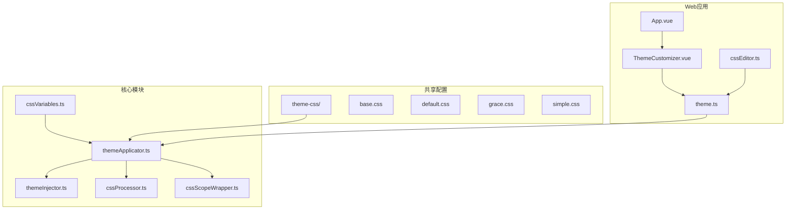
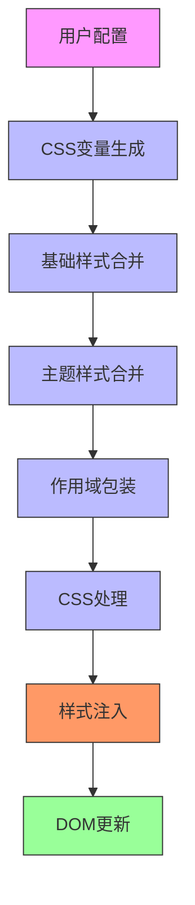
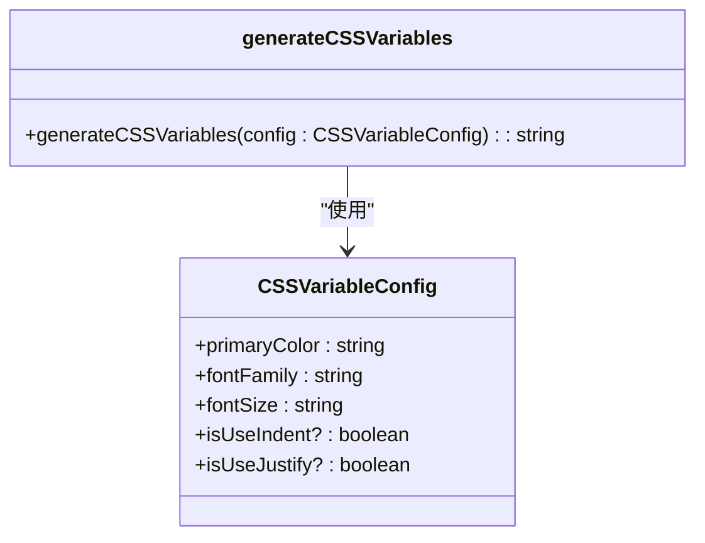
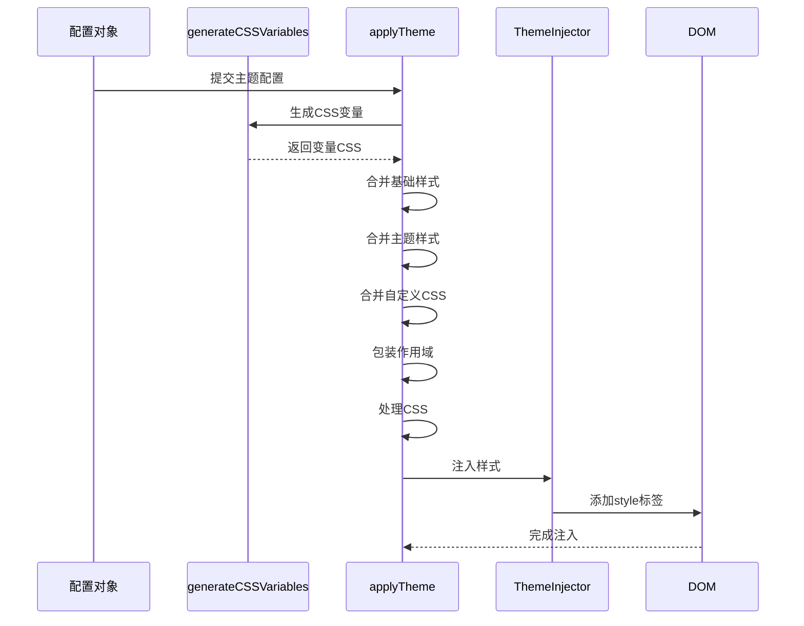
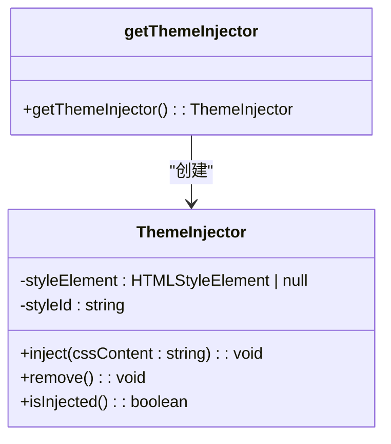
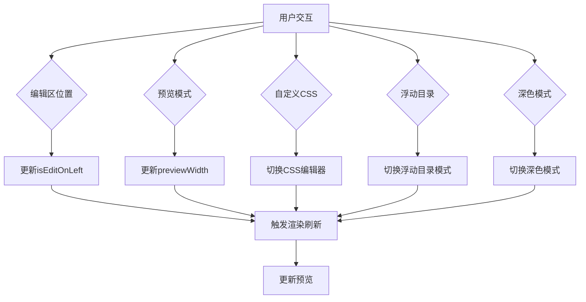
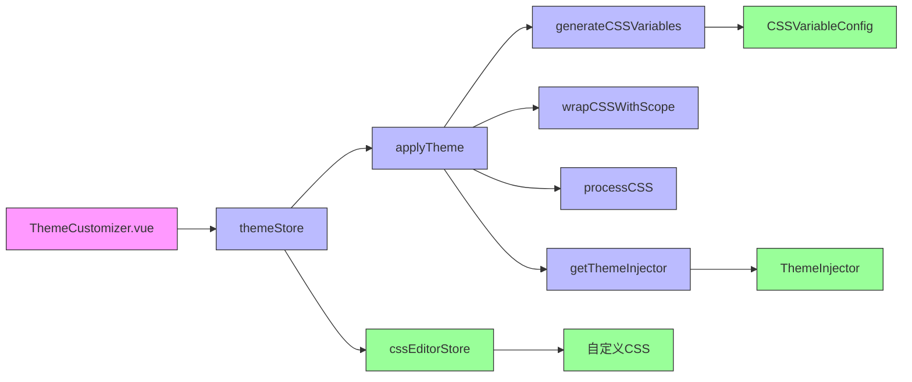

# CSS变量系统

<cite>
**本文档引用文件**  
- [cssVariables.ts](file://packages/core/src/theme/cssVariables.ts)
- [ThemeCustomizer.vue](file://apps/web/src/components/editor/ThemeCustomizer.vue)
- [theme.less](file://apps/web/src/assets/less/theme.less)
- [theme.ts](file://apps/web/src/stores/theme.ts)
- [themeApplicator.ts](file://packages/core/src/theme/themeApplicator.ts)
- [themeInjector.ts](file://packages/core/src/theme/themeInjector.ts)
- [base.css](file://packages/shared/src/configs/theme-css/base.css)
- [default.css](file://packages/shared/src/configs/theme-css/default.css)
- [grace.css](file://packages/shared/src/configs/theme-css/grace.css)
- [simple.css](file://packages/shared/src/configs/theme-css/simple.css)
- [cssEditor.ts](file://apps/web/src/stores/cssEditor.ts)
</cite>

## 目录
1. [简介](#简介)
2. [项目结构](#项目结构)
3. [核心组件](#核心组件)
4. [架构概述](#架构概述)
5. [详细组件分析](#详细组件分析)
6. [依赖分析](#依赖分析)
7. [性能考虑](#性能考虑)
8. [故障排除指南](#故障排除指南)
9. [结论](#结论)

## 简介
本文档深入解析了CSS变量系统的实现原理，重点阐述了`generateCSSVariables`函数如何将JavaScript对象转换为CSS变量声明，以及这些变量如何通过全局作用域注入以实现主题的动态调整。结合`ThemeCustomizer.vue`组件，说明了用户界面如何绑定变量配置并实时预览样式变化。同时解释了变量系统与预设主题的协同工作方式：变量控制基础视觉属性，主题CSS负责具体样式规则。最后提供了自定义变量的扩展方法和最佳实践。

## 项目结构
本项目采用模块化架构，CSS变量系统主要分布在`packages/core/src/theme`目录下，由多个核心文件协同工作。用户界面部分位于`apps/web/src`目录，通过Vuex store进行状态管理。

**图示来源**  
- [cssVariables.ts](file://packages/core/src/theme/cssVariables.ts)
- [themeApplicator.ts](file://packages/core/src/theme/themeApplicator.ts)
- [themeInjector.ts](file://packages/core/src/theme/themeInjector.ts)
- [ThemeCustomizer.vue](file://apps/web/src/components/editor/ThemeCustomizer.vue)
- [theme.ts](file://apps/web/src/stores/theme.ts)

## 核心组件
CSS变量系统的核心组件包括`generateCSSVariables`函数、`ThemeInjector`类和`applyTheme`函数。这些组件共同实现了从JavaScript配置到CSS样式的动态转换和注入。

**组件来源**  
- [cssVariables.ts](file://packages/core/src/theme/cssVariables.ts#L6-L34)
- [themeInjector.ts](file://packages/core/src/theme/themeInjector.ts#L9-L56)
- [themeApplicator.ts](file://packages/core/src/theme/themeApplicator.ts#L24-L61)

## 架构概述
CSS变量系统采用分层架构设计，分为配置层、生成层、处理层和注入层。配置层收集用户设置，生成层将配置转换为CSS变量，处理层对CSS进行作用域包装和优化，注入层将最终样式注入DOM。

**图示来源**  
- [cssVariables.ts](file://packages/core/src/theme/cssVariables.ts)
- [themeApplicator.ts](file://packages/core/src/theme/themeApplicator.ts)
- [themeInjector.ts](file://packages/core/src/theme/themeInjector.ts)

## 详细组件分析

### CSS变量生成器分析
`generateCSSVariables`函数是CSS变量系统的核心，负责将JavaScript对象转换为CSS变量声明。该函数接收一个配置对象，包含主色、字体、字号等视觉属性，并生成相应的CSS变量。

**图示来源**  
- [cssVariables.ts](file://packages/core/src/theme/cssVariables.ts#L6-L34)

### 主题应用器分析
`applyTheme`函数负责整合所有样式资源，包括CSS变量、基础样式、主题样式和用户自定义CSS，并将它们注入到页面中。

**图示来源**  
- [themeApplicator.ts](file://packages/core/src/theme/themeApplicator.ts#L24-L61)
- [themeInjector.ts](file://packages/core/src/theme/themeInjector.ts#L17-L24)

### 主题注入器分析
`ThemeInjector`类负责管理动态注入的`<style>`标签，确保样式能够正确地添加、更新和移除。

**图示来源**  
- [themeInjector.ts](file://packages/core/src/theme/themeInjector.ts#L9-L56)

### 主题自定义器分析
`ThemeCustomizer.vue`组件提供了用户界面，允许用户调整各种主题设置并实时预览效果。

**图示来源**  
- [ThemeCustomizer.vue](file://apps/web/src/components/editor/ThemeCustomizer.vue#L1-L147)

## 依赖分析
CSS变量系统涉及多个文件和模块之间的复杂依赖关系，形成了一个完整的主题管理生态系统。

**图示来源**  
- [ThemeCustomizer.vue](file://apps/web/src/components/editor/ThemeCustomizer.vue)
- [theme.ts](file://apps/web/src/stores/theme.ts)
- [themeApplicator.ts](file://packages/core/src/theme/themeApplicator.ts)
- [cssVariables.ts](file://packages/core/src/theme/cssVariables.ts)
- [cssScopeWrapper.ts](file://packages/core/src/theme/cssScopeWrapper.ts)
- [cssProcessor.ts](file://packages/core/src/theme/cssProcessor.ts)
- [themeInjector.ts](file://packages/core/src/theme/themeInjector.ts)
- [cssEditor.ts](file://apps/web/src/stores/cssEditor.ts)

## 性能考虑
CSS变量系统的性能优化主要体现在以下几个方面：
1. **单例模式**：`ThemeInjector`使用单例模式，避免重复创建和销毁DOM元素
2. **增量更新**：只在配置变化时重新生成和注入样式
3. **作用域隔离**：通过`wrapCSSWithScope`限制样式作用范围，减少全局影响
4. **异步处理**：使用`processCSS`异步处理CSS，避免阻塞主线程

## 故障排除指南
当CSS变量系统出现问题时，可以按照以下步骤进行排查：

**组件来源**  
- [theme.ts](file://apps/web/src/stores/theme.ts#L102-L125)
- [themeInjector.ts](file://packages/core/src/theme/themeInjector.ts#L17-L34)

1. **检查样式未生效**：确认`ThemeInjector`是否成功注入`<style>`标签
2. **变量未更新**：检查`generateCSSVariables`的输入配置是否正确
3. **主题切换失败**：验证`themeMap`中是否存在对应的主题CSS
4. **自定义CSS不显示**：确认`cssEditorStore`中的内容是否正确传递
5. **性能问题**：监控样式注入频率，避免不必要的重复注入

## 结论
CSS变量系统通过`generateCSSVariables`函数将JavaScript配置对象转换为CSS变量声明，实现了主题的动态调整。系统采用分层架构，各组件职责分明，通过`ThemeInjector`单例模式高效管理样式注入。`ThemeCustomizer.vue`组件提供了直观的用户界面，使用户能够实时预览和调整主题设置。变量系统与预设主题协同工作，变量控制基础视觉属性，主题CSS负责具体样式规则，这种分离设计提高了系统的灵活性和可维护性。