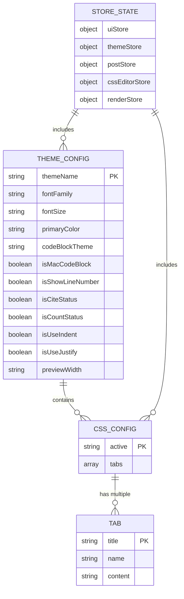
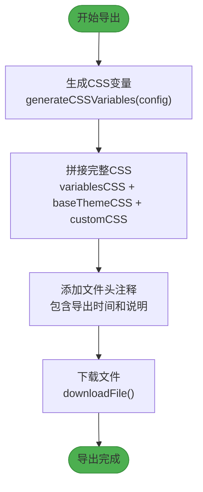
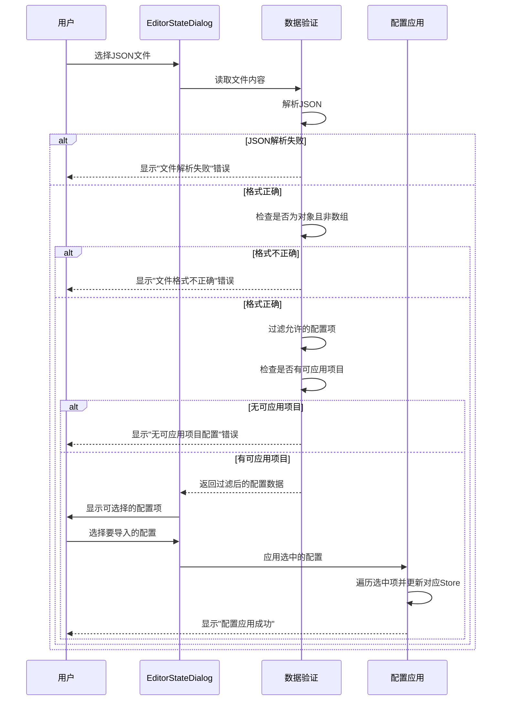
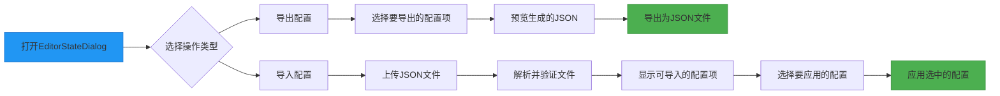
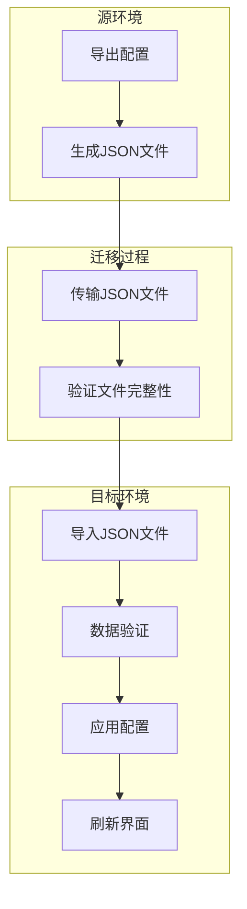

# 主题导出与导入

<cite>
**本文档中引用的文件**   
- [themeExporter.ts](file://packages/core/src/theme/themeExporter.ts)
- [cssVariables.ts](file://packages/core/src/theme/cssVariables.ts)
- [themeApplicator.ts](file://packages/core/src/theme/themeApplicator.ts)
- [themeInjector.ts](file://packages/core/src/theme/themeInjector.ts)
- [cssScopeWrapper.ts](file://packages/core/src/theme/cssScopeWrapper.ts)
- [cssProcessor.ts](file://packages/core/src/theme/cssProcessor.ts)
- [theme.ts](file://apps/web/src/stores/theme.ts)
- [cssEditor.ts](file://apps/web/src/stores/cssEditor.ts)
- [EditorStateDialog.vue](file://apps/web/src/components/editor/EditorStateDialog.vue)
- [theme-css/index.ts](file://packages/shared/src/configs/theme-css/index.ts)
- [theme.ts](file://packages/shared/src/configs/theme.ts)
</cite>

## 目录
1. [简介](#简介)
2. [主题数据模型结构设计](#主题数据模型结构设计)
3. [主题导出功能详解](#主题导出功能详解)
4. [主题导入与数据验证流程](#主题导入与数据验证流程)
5. [用户工作流：通过EditorStateDialog进行主题备份和恢复](#用户工作流通过editorstatedialog进行主题备份和恢复)
6. [主题分享最佳实践](#主题分享最佳实践)
7. [不同环境间迁移自定义主题](#不同环境间迁移自定义主题)
8. [结论](#结论)

## 简介
本项目提供了一套完整的主题导出与导入功能，允许用户将自定义的主题配置进行备份、分享和迁移。系统通过序列化接口将主题配置（包括主题名称、CSS变量、自定义CSS）转换为JSON格式，并在导入时执行严格的数据验证以确保配置的完整性和安全性。核心功能由`themeExporter.ts`中的序列化接口实现，结合`EditorStateDialog`组件提供用户友好的界面操作。该系统支持版本控制和向后兼容性设计，确保在不同环境间迁移主题时的一致性。

## 主题数据模型结构设计
主题数据模型采用分层设计，包含基础配置、动态变量和自定义样式三个核心部分。模型设计考虑了版本控制和向后兼容性，确保未来扩展时旧配置仍可正常工作。



**Diagram sources**
- [theme.ts](file://apps/web/src/stores/theme.ts#L7-L156)
- [cssEditor.ts](file://apps/web/src/stores/cssEditor.ts#L13-L218)

**Section sources**
- [theme.ts](file://apps/web/src/stores/theme.ts#L7-L156)
- [cssEditor.ts](file://apps/web/src/stores/cssEditor.ts#L13-L218)

## 主题导出功能详解
主题导出功能通过`exportMergedTheme`函数实现，该函数将自定义CSS、基础主题CSS和配置项合并生成完整的主题CSS文件。导出过程包含三个主要步骤：生成CSS变量、拼接完整CSS和下载文件。



**Diagram sources**
- [themeExporter.ts](file://packages/core/src/theme/themeExporter.ts#L17-L44)

**Section sources**
- [themeExporter.ts](file://packages/core/src/theme/themeExporter.ts#L17-L44)

## 主题导入与数据验证流程
主题导入过程包含严格的验证机制，确保导入配置的安全性和完整性。系统首先检查JSON格式的有效性，然后过滤只接受允许的配置项，最后通过选择性应用机制让用户控制哪些配置被导入。



**Diagram sources**
- [EditorStateDialog.vue](file://apps/web/src/components/editor/EditorStateDialog.vue#L185-L326)

**Section sources**
- [EditorStateDialog.vue](file://apps/web/src/components/editor/EditorStateDialog.vue#L185-L326)

## 用户工作流通过editorstatedialog进行主题备份和恢复
用户通过`EditorStateDialog`组件完成主题的备份和恢复操作。该组件提供直观的界面，支持选择性导出和导入配置，确保用户能够精确控制哪些设置被保存或恢复。



**Diagram sources**
- [EditorStateDialog.vue](file://apps/web/src/components/editor/EditorStateDialog.vue#L1-L506)

**Section sources**
- [EditorStateDialog.vue](file://apps/web/src/components/editor/EditorStateDialog.vue#L1-L506)

## 主题分享最佳实践
为了确保主题分享的安全性和可用性，建议遵循以下最佳实践：使用标准JSON格式、包含必要的元数据、验证导出文件的完整性，并提供清晰的文档说明。

### 推荐的主题分享包结构
```json
{
  "metadata": {
    "version": "1.0",
    "author": "作者名称",
    "description": "主题描述",
    "createdAt": "2023-12-01T00:00:00Z"
  },
  "config": {
    "theme": "default",
    "fontFamily": "Microsoft YaHei",
    "fontSize": "16px",
    "primaryColor": "#007acc"
  },
  "customCSS": ".custom-class { color: red; }"
}
```

**Section sources**
- [themeExporter.ts](file://packages/core/src/theme/themeExporter.ts#L17-L44)
- [EditorStateDialog.vue](file://apps/web/src/components/editor/EditorStateDialog.vue#L155-L165)

## 不同环境间迁移自定义主题
在不同环境间迁移自定义主题时，需要考虑存储机制的差异和版本兼容性。系统通过响应式存储抽象层支持本地存储和RESTful API存储，确保配置可以在不同环境中无缝迁移。



**Diagram sources**
- [storage.ts](file://apps/web/src/utils/storage.ts#L6-L363)
- [EditorStateDialog.vue](file://apps/web/src/components/editor/EditorStateDialog.vue#L185-L326)

**Section sources**
- [storage.ts](file://apps/web/src/utils/storage.ts#L6-L363)

## 结论
本主题导出与导入系统提供了一套完整、安全且用户友好的解决方案，支持主题配置的备份、分享和迁移。通过精心设计的数据模型和严格的验证流程，确保了配置的完整性和安全性。系统采用模块化架构，各组件职责清晰，便于维护和扩展。建议用户在分享主题时遵循最佳实践，确保主题的可用性和兼容性。未来可考虑增加版本控制和冲突解决机制，进一步提升用户体验。