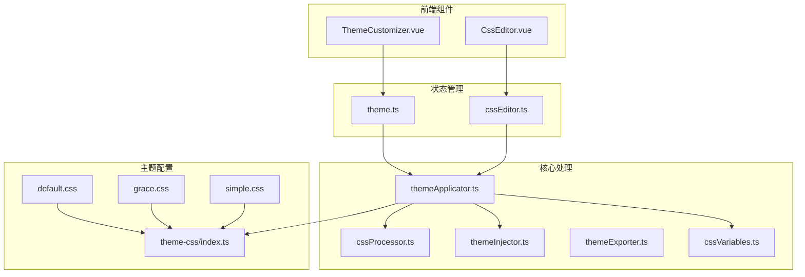
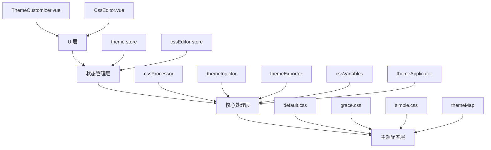
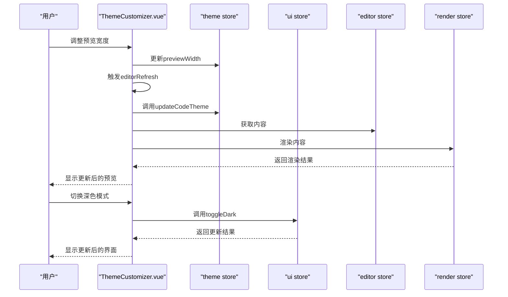
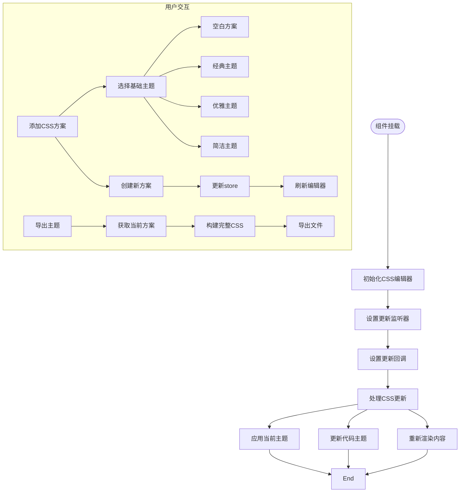
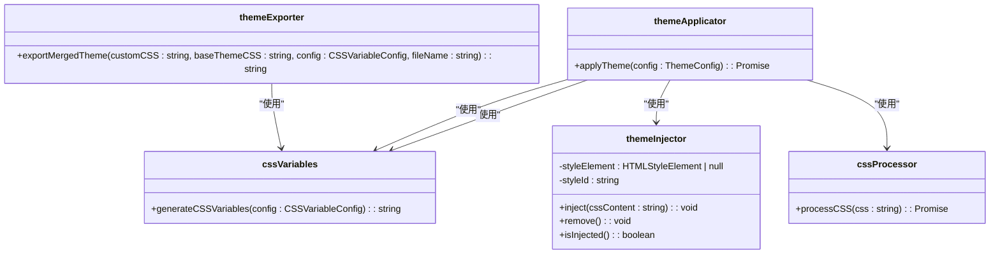
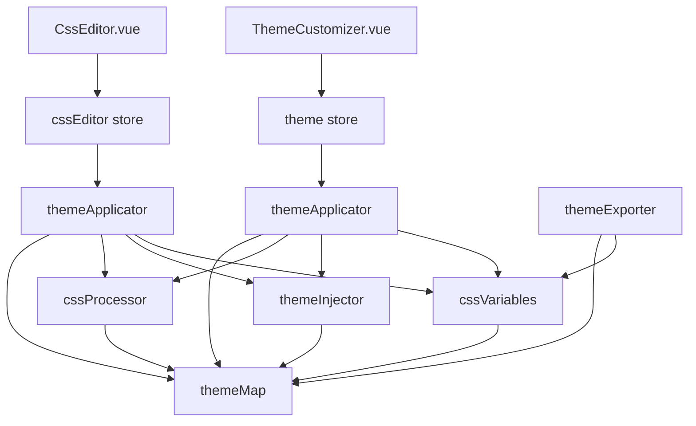

# 样式与主题系统

<cite>
**本文档引用的文件**
- [ThemeCustomizer.vue](file://apps/web/src/components/editor/ThemeCustomizer.vue)
- [CssEditor.vue](file://apps/web/src/components/editor/CssEditor.vue)
- [theme.ts](file://apps/web/src/stores/theme.ts)
- [cssEditor.ts](file://apps/web/src/stores/cssEditor.ts)
- [theme.less](file://apps/web/src/assets/less/theme.less)
- [cssProcessor.ts](file://packages/core/src/theme/cssProcessor.ts)
- [themeInjector.ts](file://packages/core/src/theme/themeInjector.ts)
- [themeExporter.ts](file://packages/core/src/theme/themeExporter.ts)
- [cssVariables.ts](file://packages/core/src/theme/cssVariables.ts)
- [themeApplicator.ts](file://packages/core/src/theme/themeApplicator.ts)
- [theme-css/index.ts](file://packages/shared/src/configs/theme-css/index.ts)
- [theme.ts](file://packages/shared/src/configs/theme.ts)
- [default.css](file://packages/shared/src/configs/theme-css/default.css)
- [grace.css](file://packages/shared/src/configs/theme-css/grace.css)
- [simple.css](file://packages/shared/src/configs/theme-css/simple.css)
</cite>

## 目录
1. [简介](#简介)
2. [项目结构](#项目结构)
3. [核心组件](#核心组件)
4. [架构概述](#架构概述)
5. [详细组件分析](#详细组件分析)
6. [依赖分析](#依赖分析)
7. [性能考虑](#性能考虑)
8. [故障排除指南](#故障排除指南)
9. [结论](#结论)

## 简介
本系统为微信风格的排版渲染提供了完整的样式与主题解决方案。系统通过CSS变量和动态注入技术实现主题的实时切换，支持预设主题（如grace、simple）的加载与应用。用户可通过ThemeCustomizer.vue组件提供的UI交互界面调整主色、字体、间距等视觉属性。主题配置状态由theme store统一管理，并通过CSS变量动态注入实现样式切换。系统还支持自定义CSS功能，允许用户在编辑器中编写并应用自己的样式规则。主题导出与分享功能通过JSON序列化格式和导入验证逻辑实现，方便用户分享和复用主题配置。

## 项目结构
本项目采用模块化结构，将样式与主题系统的核心功能分散在多个包和组件中。核心主题处理逻辑位于`packages/core/src/theme`目录下，包括cssProcessor、themeInjector、themeExporter等关键类。预设主题文件存储在`packages/shared/src/configs/theme-css`目录中，包括default.css、grace.css和simple.css。前端UI组件位于`apps/web/src/components/editor`目录下，其中ThemeCustomizer.vue和CssEditor.vue是主要的用户交互组件。状态管理使用Pinia store，相关store文件位于`apps/web/src/stores`目录下。

**Diagram sources**
- [ThemeCustomizer.vue](file://apps/web/src/components/editor/ThemeCustomizer.vue)
- [CssEditor.vue](file://apps/web/src/components/editor/CssEditor.vue)
- [theme.ts](file://apps/web/src/stores/theme.ts)
- [cssEditor.ts](file://apps/web/src/stores/cssEditor.ts)
- [cssProcessor.ts](file://packages/core/src/theme/cssProcessor.ts)
- [themeInjector.ts](file://packages/core/src/theme/themeInjector.ts)
- [themeExporter.ts](file://packages/core/src/theme/themeExporter.ts)
- [cssVariables.ts](file://packages/core/src/theme/cssVariables.ts)
- [themeApplicator.ts](file://packages/core/src/theme/themeApplicator.ts)
- [theme-css/index.ts](file://packages/shared/src/configs/theme-css/index.ts)
- [default.css](file://packages/shared/src/configs/theme-css/default.css)
- [grace.css](file://packages/shared/src/configs/theme-css/grace.css)
- [simple.css](file://packages/shared/src/configs/theme-css/simple.css)

**Section sources**
- [ThemeCustomizer.vue](file://apps/web/src/components/editor/ThemeCustomizer.vue)
- [CssEditor.vue](file://apps/web/src/components/editor/CssEditor.vue)
- [theme.ts](file://apps/web/src/stores/theme.ts)
- [cssEditor.ts](file://apps/web/src/stores/cssEditor.ts)
- [cssProcessor.ts](file://packages/core/src/theme/cssProcessor.ts)
- [themeInjector.ts](file://packages/core/src/theme/themeInjector.ts)
- [themeExporter.ts](file://packages/core/src/theme/themeExporter.ts)
- [cssVariables.ts](file://packages/core/src/theme/cssVariables.ts)
- [themeApplicator.ts](file://packages/core/src/theme/themeApplicator.ts)
- [theme-css/index.ts](file://packages/shared/src/configs/theme-css/index.ts)
- [default.css](file://packages/shared/src/configs/theme-css/default.css)
- [grace.css](file://packages/shared/src/configs/theme-css/grace.css)
- [simple.css](file://packages/shared/src/configs/theme-css/simple.css)

## 核心组件
系统的核心组件包括ThemeCustomizer.vue、CssEditor.vue、theme store和cssEditor store。ThemeCustomizer.vue组件提供了一个简洁的UI界面，允许用户调整编辑区位置、预览模式、自定义CSS面板、浮动目录和显示模式等。CssEditor.vue组件则提供了一个功能完整的CSS编辑器，支持多方案管理、方案重命名、方案删除和主题导出等功能。theme store负责管理所有与主题、字体、颜色相关的配置，包括主题名称、字体、字号、主色、代码块主题等。cssEditor store则负责管理自定义CSS编辑器的状态和配置，包括当前激活的方案、方案列表等。

**Section sources**
- [ThemeCustomizer.vue](file://apps/web/src/components/editor/ThemeCustomizer.vue)
- [CssEditor.vue](file://apps/web/src/components/editor/CssEditor.vue)
- [theme.ts](file://apps/web/src/stores/theme.ts)
- [cssEditor.ts](file://apps/web/src/stores/cssEditor.ts)

## 架构概述
系统采用分层架构设计，将UI交互、状态管理、核心处理和主题配置分离。UI层由ThemeCustomizer.vue和CssEditor.vue组件构成，负责用户交互和界面展示。状态管理层由theme store和cssEditor store构成，负责管理应用状态和配置。核心处理层由cssProcessor、themeInjector、themeExporter、cssVariables和themeApplicator等类构成，负责主题的处理、注入、导出和应用。主题配置层由预设主题文件和主题映射表构成，提供基础的主题样式和配置。

**Diagram sources**
- [ThemeCustomizer.vue](file://apps/web/src/components/editor/ThemeCustomizer.vue)
- [CssEditor.vue](file://apps/web/src/components/editor/CssEditor.vue)
- [theme.ts](file://apps/web/src/stores/theme.ts)
- [cssEditor.ts](file://apps/web/src/stores/cssEditor.ts)
- [cssProcessor.ts](file://packages/core/src/theme/cssProcessor.ts)
- [themeInjector.ts](file://packages/core/src/theme/themeInjector.ts)
- [themeExporter.ts](file://packages/core/src/theme/themeExporter.ts)
- [cssVariables.ts](file://packages/core/src/theme/cssVariables.ts)
- [themeApplicator.ts](file://packages/core/src/theme/themeApplicator.ts)
- [theme-css/index.ts](file://packages/shared/src/configs/theme-css/index.ts)
- [default.css](file://packages/shared/src/configs/theme-css/default.css)
- [grace.css](file://packages/shared/src/configs/theme-css/grace.css)
- [simple.css](file://packages/shared/src/configs/theme-css/simple.css)

## 详细组件分析

### ThemeCustomizer.vue 组件分析
ThemeCustomizer.vue组件提供了一个简洁的UI界面，允许用户调整编辑区位置、预览模式、自定义CSS面板、浮动目录和显示模式等。组件通过引用多个store来获取和更新应用状态，包括theme store、ui store、editor store和render store。当用户调整预览宽度时，会触发previewWidthChanged函数，更新theme store中的previewWidth值并刷新编辑器。当用户切换深色模式时，会调用ui store的toggleDark函数。

**Diagram sources**
- [ThemeCustomizer.vue](file://apps/web/src/components/editor/ThemeCustomizer.vue)
- [theme.ts](file://apps/web/src/stores/theme.ts)
- [ui.ts](file://apps/web/src/stores/ui.ts)
- [editor.ts](file://apps/web/src/stores/editor.ts)
- [render.ts](file://apps/web/src/stores/render.ts)

**Section sources**
- [ThemeCustomizer.vue](file://apps/web/src/components/editor/ThemeCustomizer.vue)

### CssEditor.vue 组件分析
CssEditor.vue组件提供了一个功能完整的CSS编辑器，支持多方案管理、方案重命名、方案删除和主题导出等功能。组件通过引用cssEditor store来管理自定义CSS的状态和配置。当用户创建新方案时，可以选择基于空白、经典、优雅或简洁主题作为起点。组件还提供了查看内置主题、复制主题CSS和基于内置主题创建新方案的功能。

**Diagram sources**
- [CssEditor.vue](file://apps/web/src/components/editor/CssEditor.vue)
- [cssEditor.ts](file://apps/web/src/stores/cssEditor.ts)
- [theme.ts](file://apps/web/src/stores/theme.ts)
- [editor.ts](file://apps/web/src/stores/editor.ts)
- [render.ts](file://apps/web/src/stores/render.ts)

**Section sources**
- [CssEditor.vue](file://apps/web/src/components/editor/CssEditor.vue)

### 主题处理核心类分析
主题处理核心类包括cssProcessor、themeInjector、themeExporter、cssVariables和themeApplicator。这些类共同构成了主题处理的核心逻辑。cssProcessor使用PostCSS在运行时处理动态注入的CSS，包括替换CSS变量和简化calc()表达式。themeInjector负责管理动态注入的<style>标签，实现样式的注入和移除。themeExporter负责导出合并后的主题CSS，方便用户分享和复用。cssVariables根据配置动态生成CSS变量样式。themeApplicator则是主题应用的入口，协调其他类完成主题的完整应用流程。

**Diagram sources**
- [cssProcessor.ts](file://packages/core/src/theme/cssProcessor.ts)
- [themeInjector.ts](file://packages/core/src/theme/themeInjector.ts)
- [themeExporter.ts](file://packages/core/src/theme/themeExporter.ts)
- [cssVariables.ts](file://packages/core/src/theme/cssVariables.ts)
- [themeApplicator.ts](file://packages/core/src/theme/themeApplicator.ts)

**Section sources**
- [cssProcessor.ts](file://packages/core/src/theme/cssProcessor.ts)
- [themeInjector.ts](file://packages/core/src/theme/themeInjector.ts)
- [themeExporter.ts](file://packages/core/src/theme/themeExporter.ts)
- [cssVariables.ts](file://packages/core/src/theme/cssVariables.ts)
- [themeApplicator.ts](file://packages/core/src/theme/themeApplicator.ts)

## 依赖分析
系统各组件之间的依赖关系清晰，形成了一个完整的主题处理链条。UI组件依赖于状态管理store，store依赖于核心处理类，核心处理类又依赖于主题配置。这种分层依赖结构确保了系统的可维护性和可扩展性。当用户通过UI组件调整主题配置时，会触发store中的相应方法，store再调用核心处理类完成主题的处理和应用。核心处理类通过主题配置获取预设主题样式，并结合用户配置生成最终的CSS样式。

**Diagram sources**
- [ThemeCustomizer.vue](file://apps/web/src/components/editor/ThemeCustomizer.vue)
- [CssEditor.vue](file://apps/web/src/components/editor/CssEditor.vue)
- [theme.ts](file://apps/web/src/stores/theme.ts)
- [cssEditor.ts](file://apps/web/src/stores/cssEditor.ts)
- [cssProcessor.ts](file://packages/core/src/theme/cssProcessor.ts)
- [themeInjector.ts](file://packages/core/src/theme/themeInjector.ts)
- [themeExporter.ts](file://packages/core/src/theme/themeExporter.ts)
- [cssVariables.ts](file://packages/core/src/theme/cssVariables.ts)
- [themeApplicator.ts](file://packages/core/src/theme/themeApplicator.ts)
- [theme-css/index.ts](file://packages/shared/src/configs/theme-css/index.ts)

**Section sources**
- [ThemeCustomizer.vue](file://apps/web/src/components/editor/ThemeCustomizer.vue)
- [CssEditor.vue](file://apps/web/src/components/editor/CssEditor.vue)
- [theme.ts](file://apps/web/src/stores/theme.ts)
- [cssEditor.ts](file://apps/web/src/stores/cssEditor.ts)
- [cssProcessor.ts](file://packages/core/src/theme/cssProcessor.ts)
- [themeInjector.ts](file://packages/core/src/theme/themeInjector.ts)
- [themeExporter.ts](file://packages/core/src/theme/themeExporter.ts)
- [cssVariables.ts](file://packages/core/src/theme/cssVariables.ts)
- [themeApplicator.ts](file://packages/core/src/theme/themeApplicator.ts)
- [theme-css/index.ts](file://packages/shared/src/configs/theme-css/index.ts)

## 性能考虑
系统在性能方面做了多项优化。首先，使用单例模式的ThemeInjector类避免了重复创建和注入<style>标签，减少了DOM操作。其次，使用PostCSS在运行时处理CSS，可以提前简化calc()表达式等复杂计算，减轻浏览器的渲染负担。再者，通过作用域包装器将主题样式限制在#output预览区域，避免了全局样式的污染和不必要的重排重绘。最后，使用CSS变量实现主题色的动态切换，避免了频繁的样式重写和DOM操作。

## 故障排除指南
当遇到主题应用问题时，可以按照以下步骤进行排查：
1. 检查theme store中的配置是否正确
2. 检查cssEditor store中的自定义CSS是否正确
3. 检查themeApplicator是否成功调用
4. 检查themeInjector是否成功注入<style>标签
5. 检查浏览器控制台是否有错误信息
6. 检查预设主题文件是否正确加载

当遇到CSS处理问题时，可以检查cssProcessor的处理结果，确保PostCSS能够正确处理CSS变量和calc()表达式。当遇到主题导出问题时，可以检查themeExporter的参数是否正确，确保能够正确拼接和导出合并后的主题CSS。

**Section sources**
- [theme.ts](file://apps/web/src/stores/theme.ts)
- [cssEditor.ts](file://apps/web/src/stores/cssEditor.ts)
- [themeApplicator.ts](file://packages/core/src/theme/themeApplicator.ts)
- [themeInjector.ts](file://packages/core/src/theme/themeInjector.ts)
- [cssProcessor.ts](file://packages/core/src/theme/cssProcessor.ts)
- [themeExporter.ts](file://packages/core/src/theme/themeExporter.ts)

## 结论
本样式与主题系统通过模块化设计和分层架构，实现了微信风格排版渲染的完整解决方案。系统支持预设主题的加载与应用，提供丰富的UI交互界面，允许用户调整各种视觉属性。通过CSS变量和动态注入技术，实现了主题的实时切换和高效管理。系统还支持自定义CSS功能，允许用户编写和应用自己的样式规则。主题导出与分享功能方便用户分享和复用主题配置。整体设计清晰，性能优化到位，为用户提供了一个强大而灵活的主题管理解决方案。