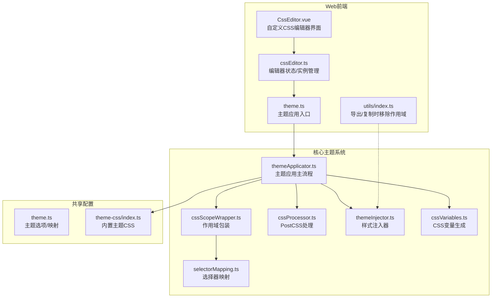
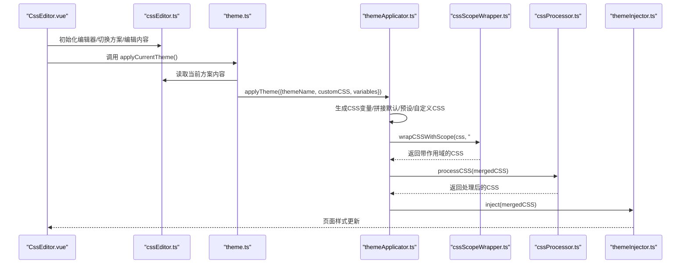
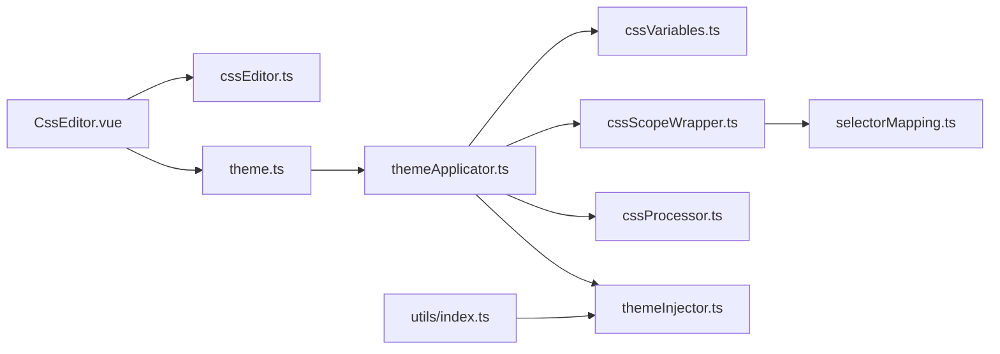

# 自定义CSS编辑

<cite>
**本文引用的文件列表**
- [apps/web/src/components/editor/CssEditor.vue](file://apps/web/src/components/editor/CssEditor.vue)
- [apps/web/src/stores/cssEditor.ts](file://apps/web/src/stores/cssEditor.ts)
- [apps/web/src/stores/theme.ts](file://apps/web/src/stores/theme.ts)
- [packages/core/src/theme/themeApplicator.ts](file://packages/core/src/theme/themeApplicator.ts)
- [packages/core/src/theme/cssScopeWrapper.ts](file://packages/core/src/theme/cssScopeWrapper.ts)
- [packages/core/src/theme/cssProcessor.ts](file://packages/core/src/theme/cssProcessor.ts)
- [packages/core/src/theme/themeInjector.ts](file://packages/core/src/theme/themeInjector.ts)
- [packages/core/src/theme/cssVariables.ts](file://packages/core/src/theme/cssVariables.ts)
- [packages/shared/src/configs/theme.ts](file://packages/shared/src/configs/theme.ts)
- [packages/shared/src/configs/theme-css/index.ts](file://packages/shared/src/configs/theme-css/index.ts)
- [packages/core/src/theme/selectorMapping.ts](file://packages/core/src/theme/selectorMapping.ts)
- [apps/web/src/utils/index.ts](file://apps/web/src/utils/index.ts)
</cite>

## 目录
1. [简介](#简介)
2. [项目结构](#项目结构)
3. [核心组件](#核心组件)
4. [架构总览](#架构总览)
5. [详细组件分析](#详细组件分析)
6. [依赖关系分析](#依赖关系分析)
7. [性能考量](#性能考量)
8. [故障排查指南](#故障排查指南)
9. [结论](#结论)
10. [附录](#附录)

## 简介
本文件系统性阐述“自定义CSS功能”的实现机制，重点覆盖：
- CssEditor.vue 如何提供代码编辑界面，支持用户编写个性化样式规则；
- 自定义CSS如何在主题系统中存储与应用；
- applyTheme 流程中如何提取并处理自定义CSS；
- 自定义CSS与预设主题样式的合并策略；
- 通过 wrapCSSWithScope 函数实现作用域隔离，确保样式仅作用于预览区域（#output）；
- 提供实用的自定义CSS编写示例与调试方法。

## 项目结构
围绕自定义CSS功能的关键模块分布如下：
- Web前端编辑器侧：
  - CssEditor.vue：自定义CSS编辑器界面与方案管理；
  - cssEditor.ts：自定义CSS编辑器的状态与编辑器实例管理；
  - theme.ts：主题应用入口，负责收集当前自定义CSS并调用核心主题应用器；
- 核心主题系统（packages/core）：
  - themeApplicator.ts：主题应用主流程，合并默认/预设主题与自定义CSS，注入页面；
  - cssScopeWrapper.ts：作用域包装器，给选择器添加 #output 前缀；
  - cssProcessor.ts：PostCSS运行时处理，替换CSS变量、简化calc表达式；
  - themeInjector.ts：动态注入/更新主题样式到<head>；
  - cssVariables.ts：生成CSS变量（如字体、字号、主色），以及段落缩进/对齐；
  - selectorMapping.ts：选择器映射，兼容旧版选择器到新类名；
- 共享配置（packages/shared）：
  - theme.ts：主题选项与主题映射；
  - theme-css/index.ts：内置主题CSS字符串映射；
- 工具（apps/web/src/utils/index.ts）：导出HTML/PDF时移除作用域前缀，保证复制/导出可用。

图表来源
- [apps/web/src/components/editor/CssEditor.vue](file://apps/web/src/components/editor/CssEditor.vue#L1-L240)
- [apps/web/src/stores/cssEditor.ts](file://apps/web/src/stores/cssEditor.ts#L147-L182)
- [apps/web/src/stores/theme.ts](file://apps/web/src/stores/theme.ts#L102-L125)
- [packages/core/src/theme/themeApplicator.ts](file://packages/core/src/theme/themeApplicator.ts#L24-L60)
- [packages/core/src/theme/cssScopeWrapper.ts](file://packages/core/src/theme/cssScopeWrapper.ts#L14-L60)
- [packages/core/src/theme/cssProcessor.ts](file://packages/core/src/theme/cssProcessor.ts#L19-L40)
- [packages/core/src/theme/themeInjector.ts](file://packages/core/src/theme/themeInjector.ts#L17-L35)
- [packages/core/src/theme/cssVariables.ts](file://packages/core/src/theme/cssVariables.ts#L19-L34)
- [packages/core/src/theme/selectorMapping.ts](file://packages/core/src/theme/selectorMapping.ts#L11-L51)
- [packages/shared/src/configs/theme.ts](file://packages/shared/src/configs/theme.ts#L1-L42)
- [packages/shared/src/configs/theme-css/index.ts](file://packages/shared/src/configs/theme-css/index.ts#L1-L26)
- [apps/web/src/utils/index.ts](file://apps/web/src/utils/index.ts#L230-L248)

章节来源
- [apps/web/src/components/editor/CssEditor.vue](file://apps/web/src/components/editor/CssEditor.vue#L1-L240)
- [apps/web/src/stores/cssEditor.ts](file://apps/web/src/stores/cssEditor.ts#L147-L182)
- [apps/web/src/stores/theme.ts](file://apps/web/src/stores/theme.ts#L102-L125)
- [packages/core/src/theme/themeApplicator.ts](file://packages/core/src/theme/themeApplicator.ts#L24-L60)
- [packages/shared/src/configs/theme.ts](file://packages/shared/src/configs/theme.ts#L1-L42)

## 核心组件
- CssEditor.vue：提供多方案标签页、内置主题查看与复制、新建/重命名/删除方案、导出合并主题等功能；初始化时创建CodeMirror编辑器实例，监听内容变更并触发主题应用与渲染刷新。
- cssEditor.ts：维护自定义CSS内容配置（tabs/active）、编辑器实例（CodeMirror）、主题切换（Compartment）；提供初始化、切换、重命名、新增、校验、重置等能力。
- theme.ts：主题应用入口，从cssEditor.ts读取当前方案内容，结合主题变量（primaryColor/fontFamily/fontSize/isUseIndent/isUseJustify）调用applyTheme。
- themeApplicator.ts：主题应用主流程，生成CSS变量、拼接默认/预设主题与自定义CSS，作用域包装，PostCSS处理，注入页面。
- cssScopeWrapper.ts：按规则给选择器添加 #output 前缀，跳过@规则与:root，兼容旧选择器映射。
- cssProcessor.ts：PostCSS流水线，替换CSS变量、简化calc表达式，异常回退。
- themeInjector.ts：单例注入器，管理动态<style id="md-theme">。
- cssVariables.ts：生成 :root 变量与段落缩进/对齐规则。
- selectorMapping.ts：旧选择器到新类名映射，保障向后兼容。
- utils/index.ts：导出HTML/PDF时移除作用域前缀，保证复制/导出可用。

章节来源
- [apps/web/src/components/editor/CssEditor.vue](file://apps/web/src/components/editor/CssEditor.vue#L1-L240)
- [apps/web/src/stores/cssEditor.ts](file://apps/web/src/stores/cssEditor.ts#L147-L182)
- [apps/web/src/stores/theme.ts](file://apps/web/src/stores/theme.ts#L102-L125)
- [packages/core/src/theme/themeApplicator.ts](file://packages/core/src/theme/themeApplicator.ts#L24-L60)
- [packages/core/src/theme/cssScopeWrapper.ts](file://packages/core/src/theme/cssScopeWrapper.ts#L14-L60)
- [packages/core/src/theme/cssProcessor.ts](file://packages/core/src/theme/cssProcessor.ts#L19-L40)
- [packages/core/src/theme/themeInjector.ts](file://packages/core/src/theme/themeInjector.ts#L17-L35)
- [packages/core/src/theme/cssVariables.ts](file://packages/core/src/theme/cssVariables.ts#L19-L34)
- [packages/core/src/theme/selectorMapping.ts](file://packages/core/src/theme/selectorMapping.ts#L11-L51)
- [apps/web/src/utils/index.ts](file://apps/web/src/utils/index.ts#L230-L248)

## 架构总览
下图展示自定义CSS从编辑到应用的完整链路，包括作用域隔离与PostCSS处理。

图表来源
- [apps/web/src/components/editor/CssEditor.vue](file://apps/web/src/components/editor/CssEditor.vue#L185-L213)
- [apps/web/src/stores/theme.ts](file://apps/web/src/stores/theme.ts#L102-L125)
- [packages/core/src/theme/themeApplicator.ts](file://packages/core/src/theme/themeApplicator.ts#L24-L60)
- [packages/core/src/theme/cssScopeWrapper.ts](file://packages/core/src/theme/cssScopeWrapper.ts#L14-L60)
- [packages/core/src/theme/cssProcessor.ts](file://packages/core/src/theme/cssProcessor.ts#L19-L40)
- [packages/core/src/theme/themeInjector.ts](file://packages/core/src/theme/themeInjector.ts#L17-L35)

## 详细组件分析

### CssEditor.vue：自定义CSS编辑界面与方案管理
- 多方案标签页：支持新建、重命名、删除、滚动定位；切换时更新编辑器内容并触发主题应用与渲染刷新。
- 内置主题查看与复制：支持查看默认/优雅/简洁主题的CSS并复制，或基于某主题新建方案。
- 导出合并主题：将当前方案的自定义CSS与默认主题叠加，连同变量配置导出为合并主题。
- 初始化流程：挂载时注册编辑器更新回调，调用主题应用与渲染刷新；移动端支持滑入动画与遮罩层。

章节来源
- [apps/web/src/components/editor/CssEditor.vue](file://apps/web/src/components/editor/CssEditor.vue#L1-L240)
- [apps/web/src/components/editor/CssEditor.vue](file://apps/web/src/components/editor/CssEditor.vue#L215-L243)

### cssEditor.ts：编辑器状态与实例管理
- 状态模型：cssContentConfig（tabs/active/content），getCurrentTab/getCurrentTabContent。
- 编辑器实例：使用CodeMirror创建编辑器，监听docChanged更新当前方案内容；支持深色模式主题切换（Compartment）。
- 生命周期：initCssEditor创建编辑器容器与状态，setOnTabChangedCallback注册切换回调；resetCssConfig重置为默认内容。

章节来源
- [apps/web/src/stores/cssEditor.ts](file://apps/web/src/stores/cssEditor.ts#L147-L182)
- [apps/web/src/stores/cssEditor.ts](file://apps/web/src/stores/cssEditor.ts#L185-L191)

### theme.ts：主题应用入口
- 读取当前方案内容（来自cssEditor.ts），组合主题变量（primaryColor/fontFamily/fontSize/isUseIndent/isUseJustify），调用applyTheme。
- 错误兜底：捕获applyTheme异常并输出日志。

章节来源
- [apps/web/src/stores/theme.ts](file://apps/web/src/stores/theme.ts#L102-L125)

### themeApplicator.ts：主题应用主流程
- 生成CSS变量（:root）；
- 拼接默认主题与选定主题（非default时叠加）；
- 追加用户自定义CSS；
- 作用域包装（wrapCSSWithScope），限制样式仅影响#output；
- PostCSS处理（变量替换、calc简化）；
- 注入到页面（themeInjector）。

章节来源
- [packages/core/src/theme/themeApplicator.ts](file://packages/core/src/theme/themeApplicator.ts#L24-L60)

### cssScopeWrapper.ts：作用域包装与选择器映射
- 匹配每条规则的选择器与属性体；
- 跳过@规则与:root；
- 对每个基础选择器执行：
  - 若已有作用域前缀则保留；
  - 使用selectorMapping将旧选择器映射到新类名；
  - 添加#output前缀；
- 返回带作用域的新规则集合。

章节来源
- [packages/core/src/theme/cssScopeWrapper.ts](file://packages/core/src/theme/cssScopeWrapper.ts#L14-L60)
- [packages/core/src/theme/selectorMapping.ts](file://packages/core/src/theme/selectorMapping.ts#L11-L51)

### cssProcessor.ts：PostCSS运行时处理
- 使用postcss-custom-properties替换CSS变量为实际值；
- 使用postcss-calc简化calc表达式；
- 异常时回退为原始CSS。

章节来源
- [packages/core/src/theme/cssProcessor.ts](file://packages/core/src/theme/cssProcessor.ts#L19-L40)

### themeInjector.ts：动态样式注入器
- 单例管理动态<style id="md-theme">；
- 注入或更新样式内容；
- 提供移除与检查注入状态的方法。

章节来源
- [packages/core/src/theme/themeInjector.ts](file://packages/core/src/theme/themeInjector.ts#L17-L35)

### cssVariables.ts：CSS变量与段落控制
- 生成 :root 变量（主色、字体、字号）；
- 生成段落缩进与对齐规则（#output p）。

章节来源
- [packages/core/src/theme/cssVariables.ts](file://packages/core/src/theme/cssVariables.ts#L19-L34)

### 共享配置：主题映射与选项
- theme.ts：主题选项与主题映射；
- theme-css/index.ts：内置主题CSS字符串映射（default/grace/simple/base）。

章节来源
- [packages/shared/src/configs/theme.ts](file://packages/shared/src/configs/theme.ts#L1-L42)
- [packages/shared/src/configs/theme-css/index.ts](file://packages/shared/src/configs/theme-css/index.ts#L1-L26)

### 导出与复制：移除作用域前缀
- 导出HTML/PDF时，从#md-theme样式中移除#output前缀，确保复制/导出的HTML在独立容器中仍可正确渲染。

章节来源
- [apps/web/src/utils/index.ts](file://apps/web/src/utils/index.ts#L230-L248)

## 依赖关系分析
- CssEditor.vue 依赖 cssEditor.ts（编辑器实例与配置）、theme.ts（主题应用）、renderStore/editorStore（渲染刷新）；
- theme.ts 依赖 cssEditor.ts（读取当前方案内容）与 @md/core 的 applyTheme；
- themeApplicator.ts 依赖 cssVariables.ts、themeInjector.ts、cssScopeWrapper.ts、cssProcessor.ts、共享主题映射；
- cssScopeWrapper.ts 依赖 selectorMapping.ts；
- utils/index.ts 依赖 themeInjector 注入的样式进行导出/复制。

图表来源
- [apps/web/src/components/editor/CssEditor.vue](file://apps/web/src/components/editor/CssEditor.vue#L185-L213)
- [apps/web/src/stores/theme.ts](file://apps/web/src/stores/theme.ts#L102-L125)
- [packages/core/src/theme/themeApplicator.ts](file://packages/core/src/theme/themeApplicator.ts#L24-L60)
- [packages/core/src/theme/cssScopeWrapper.ts](file://packages/core/src/theme/cssScopeWrapper.ts#L14-L60)
- [packages/core/src/theme/cssProcessor.ts](file://packages/core/src/theme/cssProcessor.ts#L19-L40)
- [packages/core/src/theme/themeInjector.ts](file://packages/core/src/theme/themeInjector.ts#L17-L35)
- [packages/core/src/theme/cssVariables.ts](file://packages/core/src/theme/cssVariables.ts#L19-L34)
- [packages/core/src/theme/selectorMapping.ts](file://packages/core/src/theme/selectorMapping.ts#L11-L51)
- [apps/web/src/utils/index.ts](file://apps/web/src/utils/index.ts#L230-L248)

## 性能考量
- 编辑器更新：CodeMirror监听docChanged，仅在内容变更时触发主题应用与渲染刷新，避免重复渲染。
- 作用域包装：按规则匹配与替换，复杂度与CSS规则数量线性相关；建议减少无关规则与冗余选择器。
- PostCSS处理：在运行时进行变量替换与calc简化，异常回退保证稳定性；对大量CSS时可考虑预处理或缓存结果。
- 注入策略：使用单例注入器复用同一<style>标签，减少DOM操作与样式重排。

[本节为通用性能讨论，无需列出具体文件来源]

## 故障排查指南
- 自定义CSS未生效
  - 检查是否在CssEditor.vue中保存并触发了主题应用；
  - 确认theme.ts的applyCurrentTheme是否被调用；
  - 查看themeInjector是否成功注入#md-theme样式。
- 样式污染到编辑区
  - 确认cssScopeWrapper是否正确包裹选择器，且未遗漏#output前缀；
  - 检查是否存在直接作用于全局的选择器（应避免）。
- 旧选择器无效
  - 确认selectorMapping是否包含对应旧选择器映射；
  - 使用新类名（kebab-case）进行自定义CSS编写。
- 导出HTML/PDF样式异常
  - 导出时需移除#output前缀，确认utils/index.ts中getThemeStyles与替换逻辑正常。
- PostCSS处理报错
  - cssProcessor.ts在异常时回退为原始CSS，检查CSS语法与变量使用是否合法。

章节来源
- [apps/web/src/stores/theme.ts](file://apps/web/src/stores/theme.ts#L102-L125)
- [packages/core/src/theme/themeApplicator.ts](file://packages/core/src/theme/themeApplicator.ts#L24-L60)
- [packages/core/src/theme/cssScopeWrapper.ts](file://packages/core/src/theme/cssScopeWrapper.ts#L14-L60)
- [packages/core/src/theme/cssProcessor.ts](file://packages/core/src/theme/cssProcessor.ts#L19-L40)
- [apps/web/src/utils/index.ts](file://apps/web/src/utils/index.ts#L230-L248)

## 结论
自定义CSS功能通过“编辑器—主题应用—作用域包装—PostCSS处理—动态注入”的闭环实现，既允许用户灵活定制样式，又通过#output作用域隔离确保样式仅影响预览区域。配合内置主题映射与选择器映射，兼顾了向后兼容与易用性。导出与复制流程进一步保证了样式在不同环境下的可用性。

[本节为总结性内容，无需列出具体文件来源]

## 附录

### 自定义CSS编写示例（路径指引）
以下示例均基于选择器映射与#output作用域，请参考对应文件路径进行编写与验证：
- 修改段落间距
  - 参考路径：[packages/core/src/theme/cssVariables.ts](file://packages/core/src/theme/cssVariables.ts#L19-L34)
  - 说明：可通过CSS变量控制段落缩进与对齐；若需更细粒度控制，可在自定义CSS中针对#output p编写规则。
- 调整引用样式
  - 参考路径：[packages/core/src/theme/selectorMapping.ts](file://packages/core/src/theme/selectorMapping.ts#L11-L51)
  - 说明：旧选择器如blockquote_note等已映射到markdown-alert-*系列类名；自定义CSS中请使用新类名（例如 .markdown-alert-note）。
- 限制作用域
  - 参考路径：[packages/core/src/theme/cssScopeWrapper.ts](file://packages/core/src/theme/cssScopeWrapper.ts#L14-L60)
  - 说明：无需手动添加#output前缀，wrapCSSWithScope会自动处理；若出现选择器冲突，检查是否已有作用域前缀或是否命中映射规则。

### 调试自定义样式
- 在CssEditor.vue中编辑并保存，观察右侧预览区域（#output）是否生效；
- 打开浏览器开发者工具，检查#md-theme样式是否包含预期规则；
- 导出HTML/PDF时，确认样式未受#output前缀影响（utils/index.ts会移除作用域前缀）；
- 若PostCSS处理失败，查看控制台警告并修正CSS语法或变量使用。

章节来源
- [apps/web/src/components/editor/CssEditor.vue](file://apps/web/src/components/editor/CssEditor.vue#L185-L213)
- [apps/web/src/utils/index.ts](file://apps/web/src/utils/index.ts#L230-L248)
- [packages/core/src/theme/cssScopeWrapper.ts](file://packages/core/src/theme/cssScopeWrapper.ts#L14-L60)
- [packages/core/src/theme/cssProcessor.ts](file://packages/core/src/theme/cssProcessor.ts#L19-L40)